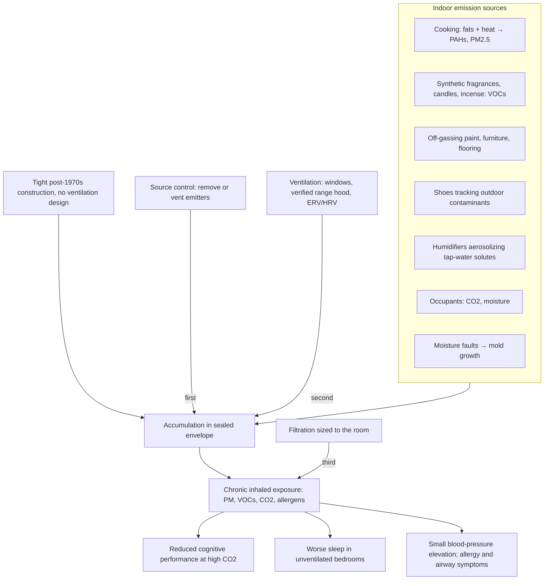

# Indoor air quality

Indoor air quality is the pollutant composition of the air inside buildings — particulate matter, volatile organic compounds (VOCs), combustion by-products, carbon dioxide, biological material such as mold spores and allergens, and humidity — considered as a health exposure. It deserves separate treatment from outdoor pollution ([[environmental-pollution-and-health]]) because the exposure logic inverts: outdoors, pollutants disperse by wind, rain, and ultraviolet light; indoors, a sealed envelope traps whatever is emitted, and modern buildings are deliberately sealed. Building codes tightened for energy efficiency beginning with the 1970s energy crisis without compensating ventilation requirements, so emissions from cooking, furnishings, cleaning products, and occupants accumulate rather than dilute. Because most people in industrialized climates spend the large majority of their time indoors — and respiratory intake is continuous and involuntary, on the order of tens of thousands of liters of air per day — a modest indoor concentration can dominate cumulative dose even when outdoor air is worse per unit volume. The frequently repeated claim that indoor air is 5 to 10 times dirtier than outdoor air originates from EPA-associated comparisons of specific pollutants and is repeated in this source; it is a rough category-dependent generalization, not a universal measurement. (@maxlugavere (Max Lugavere) — "The Hidden Home Toxin Driving High Blood Pressure, Allergies, and Brain Fog", 2026-06-17, [link](https://www.youtube.com/watch?v=Fyzle08sAxI))

**Source and conflict note.** The interviewee, Michael Feldstein, is the founder of Jaspr, an air-purifier company, and the episode is a sponsored promotion including discount codes. His background is mold remediation and disaster restoration, not research. Every product-linked claim on this page (snoring, sleep, CPAP discontinuation) is company-generated and unverified; the page keeps them only as labeled commercial claims. The mechanistic and regulatory background (ventilation, source control, CO2) and the independent trials cited are what carry evidential weight.

## Sources: what actually pollutes a home

Cooking is described as the largest routine indoor emitter: heating fats generates polycyclic aromatic hydrocarbons and fine particulate regardless of how healthy the food is, and the emissions adsorb into carpets, bedding, and other porous materials when not vented. Range hoods frequently fail silently — venting into a cabinet, wall cavity, or unvented attic rather than outdoors, especially in cheap construction — so the functional test (does the running hood hold a tissue against its intake, and where does the duct terminate?) matters more than the appliance's presence. (@maxlugavere (Max Lugavere) — "The Hidden Home Toxin Driving High Blood Pressure, Allergies, and Brain Fog", 2026-06-17, [link](https://www.youtube.com/watch?v=Fyzle08sAxI))

Synthetic fragrances (plug-ins, sprays, scented candles, incense) are aerosolized chemical mixtures — the single labeled word "fragrance" can cover thousands of constituent chemicals — that mask odors by competitive binding in the olfactory epithelium rather than removing their source. Feldstein's framing that synthetic fragrances are the new secondhand smoke is his advocacy position, not an established equivalence; measured fragrance VOC exposures and tobacco smoke differ enormously in evidence of harm. His narrower points are better supported: burning and extinguishing candles and incense emits genuine particulate, and deliberately adding aerosols to a sealed space is the opposite of source control. He also claims a US air-fragrance market roughly twice the size of the air-filtration market — people paying more to pollute indoor air than to clean it — a striking framing the transcript does not source. Other named sources: outdoor shoes worn indoors (fecal bacteria detected on most tested shoes, plus tracked pesticides), off-gassing new furniture, paint, and cribs (relevant to nurseries, where infant respiratory rates are several times adult rates), diaper pails held indoors, and humidifiers running on tap water, which aerosolize dissolved minerals, chlorine, and contaminants — the reason nebulizers require distilled water applies to humidifiers as well. (@maxlugavere (Max Lugavere) — "The Hidden Home Toxin Driving High Blood Pressure, Allergies, and Brain Fog", 2026-06-17, [link](https://www.youtube.com/watch?v=Fyzle08sAxI))

## Carbon dioxide, cognition, and sleep

CO2 is the one indoor pollutant occupants generate continuously. Outdoor baseline is roughly 400–450 ppm; typical indoor levels run 550–800 ppm; poorly ventilated occupied rooms exceed 1,000–3,000 ppm, and unventilated dry saunas can pass 5,000 ppm. The subjective correlate is stuffiness. Episode-cited findings that chess-move quality and standardized test scores improve as CO2 falls correspond to a real experimental literature on ventilation and cognitive performance (office and school CO2/ventilation studies), though effect sizes vary and some replications are weaker — the direction (very high CO2 impairs complex decision-making; ventilation helps) is reasonably supported, while precise thresholds are not. The sleep claim follows the same pattern: bedroom ventilation trials have measurably improved sleep quality, which motivates treating the bedroom as the highest-priority room. Feldstein's stronger personal claims — that he can estimate room CO2 within about 50 ppm by feel, or detect harmful mold by bodily sensation after years of inspection work — are anecdotal calibration claims with no validation. (@maxlugavere (Max Lugavere) — "The Hidden Home Toxin Driving High Blood Pressure, Allergies, and Brain Fog", 2026-06-17, [link](https://www.youtube.com/watch?v=Fyzle08sAxI))

## What intervention evidence exists

The strongest single result discussed is a sham-controlled randomized trial (published in a major cardiology journal, per the host's description) in which HEPA filtration in the two most-occupied rooms lowered systolic blood pressure by about 3 mmHg in people with mildly elevated blood pressure, against a sham air-blower control. A 3 mmHg systolic reduction is small per person but meaningful at population scale, and the sham control makes it one of the few causal data points in this space. A Finnish school study is described as cutting absentee rates by roughly 30% when purifiers were added to classrooms; this is plausible but the transcript gives no citation detail, so it stands as a described finding. Against these sit the commercial claims: company-run before/after "community-led experiments" in which about a third of snorers reportedly stopped snoring and some customers discontinued CPAP. Feldstein himself flags these as not clinical studies; abandoning CPAP for [[obstructive-sleep-apnea]] on the basis of an air purifier would be genuinely dangerous, since untreated OSA carries cardiovascular and cognitive risk regardless of allergen load. (@maxlugavere (Max Lugavere) — "The Hidden Home Toxin Driving High Blood Pressure, Allergies, and Brain Fog", 2026-06-17, [link](https://www.youtube.com/watch?v=Fyzle08sAxI))

Two structural points survive the salesmanship. First, consumer air purifiers vary enormously in delivered clean-air rate, and an underpowered unit produces the false negative of "we tried a purifier and air wasn't the problem." Effectiveness is a function of air changes per hour in the actual room, not the device category. Second, mold spot-testing is highly variable — the same house sampled morning, afternoon, and next day yields different counts — so single-timepoint mold reports should be interpreted like any noisy biomarker, and remediation decisions should rest on inspection for moisture faults (condensing HVAC closets, unventilated attics) rather than one lab number. ([[blood-marker-variability-and-reference-change]] develops the same logic for blood tests.) (@maxlugavere (Max Lugavere) — "The Hidden Home Toxin Driving High Blood Pressure, Allergies, and Brain Fog", 2026-06-17, [link](https://www.youtube.com/watch?v=Fyzle08sAxI))

## Practical implications

Ordered by the source-control-before-hardware hierarchy this wiki already applies to environmental exposures:

- **Remove standing emission sources: no synthetic air fresheners, plug-ins, or indoor incense; extinguish candles outdoors or snuff them; keep outdoor shoes off indoor floors; take diaper pails and odor sources out of bedrooms — weak direct outcome evidence, strong source-control logic at near-zero cost.** (@maxlugavere (Max Lugavere) — "The Hidden Home Toxin Driving High Blood Pressure, Allergies, and Brain Fog", 2026-06-17, [link](https://www.youtube.com/watch?v=Fyzle08sAxI))
- **When cooking, run a range hood verified to vent outdoors (tissue test the intake; trace the duct) or open windows — moderate; cooking particulate emission is well established even though clinical endpoints are not.** (@maxlugavere (Max Lugavere) — "The Hidden Home Toxin Driving High Blood Pressure, Allergies, and Brain Fog", 2026-06-17, [link](https://www.youtube.com/watch?v=Fyzle08sAxI))
- **Ventilate the bedroom nightly (open window, door ajar, or mechanical ventilation) — moderate for sleep-quality improvement from ventilation trials; this is the highest-time-exposure room.** (@maxlugavere (Max Lugavere) — "The Hidden Home Toxin Driving High Blood Pressure, Allergies, and Brain Fog", 2026-06-17, [link](https://www.youtube.com/watch?v=Fyzle08sAxI))
- **If adding filtration, prioritize bedroom and main living area and size the unit to the room's air-change requirement — moderate for small blood-pressure reduction (one sham-controlled RCT) and symptom relief in allergy; unproven for snoring, apnea, or long-term outcomes. Never discontinue CPAP or other prescribed therapy on this basis.** (@maxlugavere (Max Lugavere) — "The Hidden Home Toxin Driving High Blood Pressure, Allergies, and Brain Fog", 2026-06-17, [link](https://www.youtube.com/watch?v=Fyzle08sAxI))
- **Run humidifiers on distilled water only; off-gas new furniture, paint, and nursery fittings weeks before occupancy, or buy second-hand for nurseries — mechanistic rationale, no outcome trials.** (@maxlugavere (Max Lugavere) — "The Hidden Home Toxin Driving High Blood Pressure, Allergies, and Brain Fog", 2026-06-17, [link](https://www.youtube.com/watch?v=Fyzle08sAxI))
- **Annually: steam-clean carpets, clean ducts, and deep-clean under and behind furniture; in new construction or renovation, specify ventilation (ERV/HRV) at design time — investigational practice; low risk, unquantified benefit.** (@maxlugavere (Max Lugavere) — "The Hidden Home Toxin Driving High Blood Pressure, Allergies, and Brain Fog", 2026-06-17, [link](https://www.youtube.com/watch?v=Fyzle08sAxI))

## Gaps & open questions

- What are dose-response relationships for chronic residential VOC and fragrance exposure, and which constituents drive any harm?
- Do home filtration interventions change clinical endpoints (cardiovascular events, dementia incidence, asthma exacerbations) rather than only blood pressure, symptoms, and environmental counts?
- At what CO2 concentration does cognitive impairment become practically meaningful, and do effects persist or adapt with chronic exposure?
- Can indoor mold assessment be standardized against the day-to-day sampling variability inspectors report?
- Do purifier-attributed snoring and sleep improvements replicate under independent, sham-controlled conditions?
- How much of the indoor-versus-outdoor pollution ratio generalizes across housing stock, climate, and season?

## Related

[[environmental-pollution-and-health]] · [[microplastics-exposure-and-measurement]] · [[sleep-quality-and-circadian-alignment]] · [[obstructive-sleep-apnea]] · [[cognitive-reserve-and-brain-health]] · [[blood-marker-variability-and-reference-change]] · [[blood-pressure-targets-and-frailty]] · [[aging-model]] · [[practice-playbook]]
