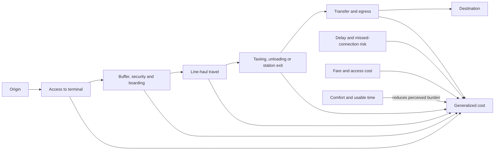

# Intercity travel and generalized cost

Intercity mode choice depends on the whole trip, not the cruising speed of its fastest vehicle. Generalized cost is the combined burden of access, waiting, security or boarding, line-haul travel, transfers, delay risk, money, comfort, and the opportunity cost of unusable time. A mode with a slower scheduled ride can therefore compete with a faster vehicle when its terminals are central, its predeparture burden is low, and most of the journey can be used productively. (@CityNerd (Ray Delahanty | CityNerd) — "Train Travel vs. Plane Travel: A (Mostly) Sober Analysis", 2026-07-29, [link](https://www.youtube.com/watch?v=o1G1Fn1RFEI))

## From vehicle time to door-to-door time

The Portland–Seattle case illustrates the accounting. Downtown-to-downtown travel took 4 hours 38 minutes by air and, after a 21-minute rail delay, about 4 hours 49 minutes by Amtrak Cascades plus local transit: only an 11-minute advantage for flying despite a 27-minute airborne segment. The comparison is a single observed round trip with chosen buffers and endpoints, so it establishes neither an average nor a universal threshold; it does demonstrate how airport access, predeparture buffer, taxiing, disembarkation, and airport-to-center travel can consume the apparent speed advantage. (@CityNerd (Ray Delahanty | CityNerd) — "Train Travel vs. Plane Travel: A (Mostly) Sober Analysis", 2026-07-29, [link](https://www.youtube.com/watch?v=o1G1Fn1RFEI))

Time also differs in quality. Boarding, taxiing, and disembarking constrained useful activity on the observed flight, whereas the longer rail segment offered space to work, walk, and obtain refreshments. This does not make rail time universally productive—crowding, connectivity, motion sensitivity, noise, accessibility, and trip purpose matter—but it means equal minutes need not impose equal cost. (@CityNerd (Ray Delahanty | CityNerd) — "Train Travel vs. Plane Travel: A (Mostly) Sober Analysis", 2026-07-29, [link](https://www.youtube.com/watch?v=o1G1Fn1RFEI))

## Reliability, capacity, and network design

Reliability affects both realized delay and the buffer travelers add before departure. In the case journey, the flight left roughly 20 minutes late because of air traffic, while the train arrived 21 minutes late after meeting an opposing train on a single-track section. Rail delay can also arise where passenger trains share tracks with slower freight service and do not receive priority. Dedicated passenger alignments, additional track, suitable geometry, and dispatch priority act on these bottlenecks; central stations and frequent connecting transit reduce access and egress burdens. (@CityNerd (Ray Delahanty | CityNerd) — "Train Travel vs. Plane Travel: A (Mostly) Sober Analysis", 2026-07-29, [link](https://www.youtube.com/watch?v=o1G1Fn1RFEI))

Capacity constrains choice before travel begins. Trains were sold out during a World Cup match while flights remained available, showing that a preferred mode is not an option when event demand exceeds offered seats. Major events create synchronized surges that expose chokepoints in terminals, corridors, junctions, and local connections. Historical traffic patterns, origin–destination data, corridor monitoring, junction analysis, signal retiming, and transit priority can be used to diagnose and manage those surges, although the source presents these tools conceptually rather than evaluating their effects in this event. (@CityNerd (Ray Delahanty | CityNerd) — "Train Travel vs. Plane Travel: A (Mostly) Sober Analysis", 2026-07-29, [link](https://www.youtube.com/watch?v=o1G1Fn1RFEI)) [[transit-capacity-and-service-design]]

## Evidence and interpretation

The numerical comparison has high credibility as a timestamped account of one itinerary but low external validity: another airport, station pair, fare, security line, schedule, destination, or disruption could reverse the result. The stronger transferable finding is methodological—compare door-to-door chains and value different kinds of time—rather than the claim that rail is always superior below a particular distance. The source’s preference for conventional rail is an attributed judgment by Ray Delahanty grounded in comfort and useful time, not a controlled estimate of traveler welfare. (@CityNerd (Ray Delahanty | CityNerd) — "Train Travel vs. Plane Travel: A (Mostly) Sober Analysis", 2026-07-29, [link](https://www.youtube.com/watch?v=o1G1Fn1RFEI))

## Practical implications

- **For each intercity trip: compare door-to-door itineraries, including a realistic reliability buffer, terminal access, transfers, and egress — strong as a decision framework; route-specific evidence required.** Do not compare only scheduled flight time with scheduled train time. (@CityNerd (Ray Delahanty | CityNerd) — "Train Travel vs. Plane Travel: A (Mostly) Sober Analysis", 2026-07-29, [link](https://www.youtube.com/watch?v=o1G1Fn1RFEI))
- **For work travel: estimate usable as well as elapsed time on each segment — moderate, preference-dependent.** Count time that can reliably support the intended work differently from constrained waiting, boarding, and vehicle-processing time. (@CityNerd (Ray Delahanty | CityNerd) — "Train Travel vs. Plane Travel: A (Mostly) Sober Analysis", 2026-07-29, [link](https://www.youtube.com/watch?v=o1G1Fn1RFEI))
- **Before major events: reserve capacity early and check the entire local-connection chain — moderate from direct case observation.** Agencies and event planners should examine demand surges, junctions, access corridors, and transit priority rather than treating the venue as an isolated destination. (@CityNerd (Ray Delahanty | CityNerd) — "Train Travel vs. Plane Travel: A (Mostly) Sober Analysis", 2026-07-29, [link](https://www.youtube.com/watch?v=o1G1Fn1RFEI))
- **For corridor investment: repeatedly measure delay causes and target infrastructure at recurring bottlenecks — moderate mechanism, benefits corridor-specific.** Candidate interventions include added or dedicated passenger track, dispatch priority, better geometry, central terminals, and frequent local connections. (@CityNerd (Ray Delahanty | CityNerd) — "Train Travel vs. Plane Travel: A (Mostly) Sober Analysis", 2026-07-29, [link](https://www.youtube.com/watch?v=o1G1Fn1RFEI))

## Gaps & open questions

- What are the distributions—not single examples—of door-to-door time, delay, fare, and usable time for each Portland–Seattle mode?
- How do travelers value productive time, comfort, emissions, missed-connection risk, accessibility, and schedule flexibility?
- Which rail bottleneck investments would deliver the greatest reliability and capacity gains per dollar on the Cascades corridor?
- How much additional event capacity is economical when peak demand is rare and highly concentrated?
- At what distances and terminal-access conditions does each mode minimize generalized cost for different traveler types?

## Related

[[transit-capacity-and-service-design]] · [[safe-streets-and-pedestrian-risk]]
