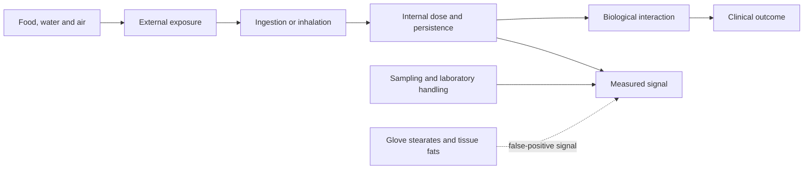
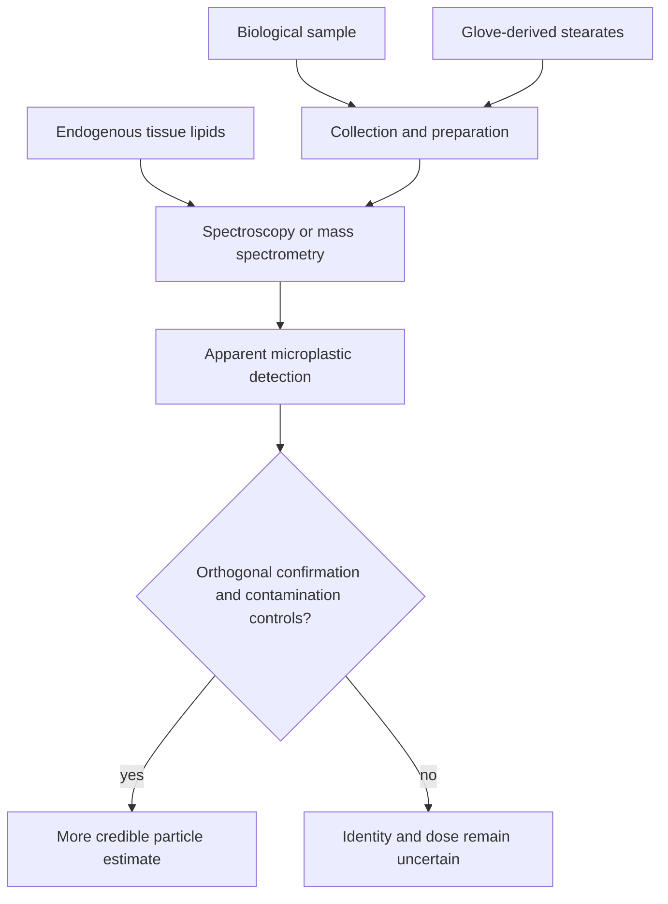

# Microplastics exposure and measurement

Microplastics are small plastic particles present in food, water, air, and the wider environment. Their presence creates three separate scientific questions: how much people encounter, how much enters and persists in the body, and whether the resulting dose causes disease. Detection alone answers none of the latter two, and hazard at a high experimental dose is not the same as risk at ordinary human exposure. (@NutritionMadeSimple (Nutrition Made Simple!) — "The Internet has Lied to You About Microplastics (Doctor Reveals)", 2026-06-27, [link](https://www.youtube.com/watch?v=kDZlU0s-A2U))

## Estimating exposure

The popular claim that a person consumes a credit card's mass of plastic each week came from the upper end of a modeled range—0.1 to 5 g per week—rather than direct measurement in people. A 50-fold range already signals substantial uncertainty, and selecting its maximum converts a boundary estimate into a typical value. Subsequent analyses described even the lower bound as an overestimate; another model put intake near 4 micrograms, roughly six orders of magnitude below 5 g. These competing models do not establish the true dose, but they do show that the credit-card analogy is not a reliable exposure estimate. (@NutritionMadeSimple (Nutrition Made Simple!) — "The Internet has Lied to You About Microplastics (Doctor Reveals)", 2026-06-27, [link](https://www.youtube.com/watch?v=kDZlU0s-A2U))

## Analytical contamination and misclassification

Microplastic measurement is unusually vulnerable to confusing the target with material introduced during collection or analysis. A University of Michigan investigation described in the source found that laboratory gloves shed stearate particles whose spectroscopic signatures can be classified as microplastics; most tested glove types reportedly produced this problem, with thousands of apparent particles per square millimeter of sample on average. Mass-spectrometric methods can also mistake some lipids for plastic, creating special concern for reports from lipid-rich tissue such as brain. These findings challenge the specificity of some measurements; they do not prove that every prior detection is false or that plastic cannot reach tissue. (@NutritionMadeSimple (Nutrition Made Simple!) — "The Internet has Lied to You About Microplastics (Doctor Reveals)", 2026-06-27, [link](https://www.youtube.com/watch?v=kDZlU0s-A2U))

## Hazard, dose, and human evidence

Cell and animal experiments often find adverse effects when microplastics are administered at high concentrations. This establishes potential hazard under those conditions, not the dose-response curve or disease burden from everyday human exposure. The current evidence summarized here supports environmental presence and plausible entry through eating and drinking, while leaving ordinary-dose human causality unresolved. The corrective perspective is therefore methodological rather than dismissive: improve contamination control and chemical identification before translating a measured signal into a disease claim. (@NutritionMadeSimple (Nutrition Made Simple!) — "The Internet has Lied to You About Microplastics (Doctor Reveals)", 2026-06-27, [link](https://www.youtube.com/watch?v=kDZlU0s-A2U)) [[environmental-pollution-and-health]]

## Practical implications

- **For hot food: transfer it from plastic to glass or ceramic before heating, and use glass or metal for repeated warm-food storage when convenient — low direct clinical evidence, low burden and mechanistically precautionary.** This reduces a plausible shedding or leaching opportunity without claiming a measured disease benefit. (@NutritionMadeSimple (Nutrition Made Simple!) — "The Internet has Lied to You About Microplastics (Doctor Reveals)", 2026-06-27, [link](https://www.youtube.com/watch?v=kDZlU0s-A2U))
- **For daily drinking and repeated storage: avoid repeatedly reusing soft single-use plastic bottles when a durable glass or metal alternative is practical — low direct clinical evidence.** Do not treat occasional plastic contact as an emergency. (@NutritionMadeSimple (Nutrition Made Simple!) — "The Internet has Lied to You About Microplastics (Doctor Reveals)", 2026-06-27, [link](https://www.youtube.com/watch?v=kDZlU0s-A2U))
- **At every diet review: prioritize food quality, smoking avoidance, activity, sleep, blood pressure, and other established risks above elaborate plastic-elimination routines — strong evidence for the foundations; uncertain evidence for the relative microplastic benefit.** Precaution should remain proportionate to uncertainty and opportunity cost. (@NutritionMadeSimple (Nutrition Made Simple!) — "The Internet has Lied to You About Microplastics (Doctor Reveals)", 2026-06-27, [link](https://www.youtube.com/watch?v=kDZlU0s-A2U))

## Gaps & open questions

- What are typical external and internal doses when sampling contamination and chemical misclassification are rigorously controlled?
- Which particle sizes and polymers cross the gut or lung, persist in specific tissues, and at what rates are they cleared?
- What dose-response relationships connect realistic chronic exposure to human clinical outcomes?
- How many published tissue detections survive orthogonal chemical confirmation and laboratory blank controls?
- Do household substitutions measurably reduce internal dose, and does that reduction improve health outcomes?

## Related

[[environmental-pollution-and-health]] · [[nutrition-evidence-and-personalization]] · [[aging-model]] · [[practice-playbook]]
