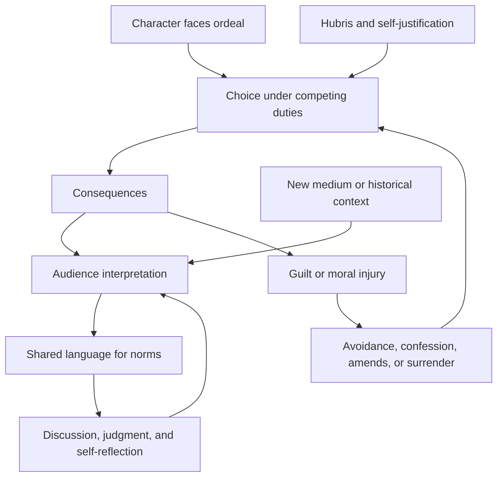
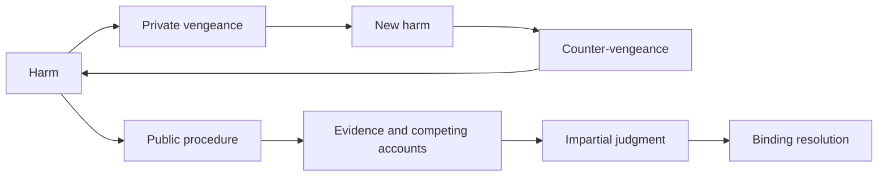

# Myth, moral injury, and homecoming

Myth is a durable narrative structure through which a community can rehearse questions about character, obligation, power, suffering, and social order. Its educational value does not require treating every event as history or accepting one authoritative interpretation. The Odyssey endures partly because Odysseus is neither a simple hero nor villain: ingenuity, ambition, loyalty, ego, violence, endurance, and avoidance coexist, allowing different generations to examine the same tensions through their own conditions. This is an interpretive humanities claim, not an experimentally established psychological intervention. (@richroll (Rich Roll) — "Ryan Holiday on the Odyssey: The True Wisdom Most People Missed", 2026-08-03, [link](https://www.youtube.com/watch?v=Rx33fD9o1Co))

## Narrative as a moral simulation

Stories make abstract norms concrete by showing agents choose and then live with consequences. Hospitality, loyalty, restraint, duty, justice, and hubris become memorable because they are embedded in conflict rather than stated as rules. Reinterpretation is part of the mechanism: oral performance, translation, theater, and film select different details and therefore make different moral features salient. Ryan Holiday’s position is that debates over representation or historical trivia miss the work when they replace engagement with the story’s philosophical problems; that is a normative and partly contrarian view, not a neutral account of what all criticism should prioritize. (@richroll (Rich Roll) — "Ryan Holiday on the Odyssey: The True Wisdom Most People Missed", 2026-08-03, [link](https://www.youtube.com/watch?v=Rx33fD9o1Co))

Narrators also organize memory to protect identity. The interview reads omissions and altered events in Christopher Nolan’s adaptation as possible signs of unreliable recollection: a leader may present himself as the victim while suppressing his provocation or guilt. This interpretation highlights a general mechanism in moral injury, where a person’s self-concept conflicts with acts committed, ordered, witnessed, or failed to prevent. Shame and avoidance can preserve the conflict; honest accounting, acceptance of limits, repair, and changed conduct can begin integration. The film reading is suggestive and should not be mistaken for a clinical model validated by the transcript. (@richroll (Rich Roll) — "Ryan Holiday on the Odyssey: The True Wisdom Most People Missed", 2026-08-03, [link](https://www.youtube.com/watch?v=Rx33fD9o1Co)) [[self-schema-updating-after-achievement]]

## Persistence, surrender, and return

Persistence applies effort to an obstacle; perseverance can include enduring humiliation, grief, responsibility, and mortality when greater force cannot solve the problem. Odysseus’s cunning enables survival but also produces consequences when joined to the demand for recognition. Rich Roll and Holiday read the homeward journey as a transition from conquest and control toward surrender, moral inventory, amends, and acceptance that cleverness cannot restore an unchanged past. Their proposed recovery parallel is especially explicit in the Calypso episode: numbing postpones painful self-recognition, while leaving requires accepting uncertainty and facing harm. This is a contemporary interpretation of the adaptation, not a claim that Homer encoded twelve-step recovery. (@richroll (Rich Roll) — "Ryan Holiday on the Odyssey: The True Wisdom Most People Missed", 2026-08-03, [link](https://www.youtube.com/watch?v=Rx33fD9o1Co)) [[addiction-recovery-and-emotional-sobriety]]

Homecoming is therefore not reversal. A returning person, family, and polity have changed; restoration requires recognition, disclosure, boundaries, and sometimes living amends where direct repair is impossible. That framing connects moral repair to [[durable-well-being-and-hedonic-adaptation]]: achievement and return do not automatically resolve the identity or relational problems carried through the journey. (@richroll (Rich Roll) — "Ryan Holiday on the Odyssey: The True Wisdom Most People Missed", 2026-08-03, [link](https://www.youtube.com/watch?v=Rx33fD9o1Co))

## From vengeance to institutions

Myths can also dramatize why institutions exist. Holiday uses Aeschylus’s Oresteia—adjacent to the Homeric tradition—to describe a sequence in which retaliatory killing reproduces retaliation until adjudication by a jury interrupts private vengeance. The teaching is structural: impartial procedures can transfer punishment from kinship cycles to public judgment. This is an interpretive genealogy rather than evidence that the historical jury system literally arose from the play. (@richroll (Rich Roll) — "Ryan Holiday on the Odyssey: The True Wisdom Most People Missed", 2026-08-03, [link](https://www.youtube.com/watch?v=Rx33fD9o1Co))

Shared stories may furnish a common vocabulary for recognizing violations before formal rules are invoked. Holiday contends that the erosion of shared myths contributes to contemporary political and cultural disorder because people lose a language for the origin and cost of norms. The transcript does not measure this causal claim, and plural societies may require overlapping stories rather than a single canon. (@richroll (Rich Roll) — "Ryan Holiday on the Odyssey: The True Wisdom Most People Missed", 2026-08-03, [link](https://www.youtube.com/watch?v=Rx33fD9o1Co))

## Practical implications

- **When reading or viewing a myth: identify the choice, competing duties, consequence, and trait that is both strength and liability — moderate as a learning method, untested for behavior change here.** Compare adaptations to reveal assumptions rather than searching only for fidelity errors. (@richroll (Rich Roll) — "Ryan Holiday on the Odyssey: The True Wisdom Most People Missed", 2026-08-03, [link](https://www.youtube.com/watch?v=Rx33fD9o1Co))
- **After consequential failure: distinguish factual accounting, responsibility, repair, and future conduct from global self-condemnation — clinically plausible, not a substitute for treatment.** Moral injury, trauma symptoms, or substance use warrant qualified support. (@richroll (Rich Roll) — "Ryan Holiday on the Odyssey: The True Wisdom Most People Missed", 2026-08-03, [link](https://www.youtube.com/watch?v=Rx33fD9o1Co))
- **Monthly or after a shared work: discuss one disagreement about motive or obligation with family, students, or peers — limited.** The aim is reasoned interpretation and shared language, not compulsory agreement. (@richroll (Rich Roll) — "Ryan Holiday on the Odyssey: The True Wisdom Most People Missed", 2026-08-03, [link](https://www.youtube.com/watch?v=Rx33fD9o1Co))
- **In conflict: prefer transparent procedure and third-party adjudication when reciprocal retaliation is escalating — strong institutional principle, context-dependent implementation.** The myth explains the logic but does not determine a legal remedy. (@richroll (Rich Roll) — "Ryan Holiday on the Odyssey: The True Wisdom Most People Missed", 2026-08-03, [link](https://www.youtube.com/watch?v=Rx33fD9o1Co))

## Gaps & open questions

- Does sustained engagement with shared narratives measurably improve moral reasoning, empathy, civic trust, or conflict resolution?
- When does a common canon support cohesion, and when does it exclude people or suppress competing traditions?
- Which practices help moral-injury sufferers integrate responsibility without collapsing into shame or evading accountability?
- How do medium, translation, and narrator reliability change what audiences remember and apply?
- Can contemporary adaptations preserve productive ambiguity while remaining accessible to audiences unfamiliar with the source?

## Related

[[addiction-recovery-and-emotional-sobriety]] · [[self-schema-updating-after-achievement]] · [[durable-well-being-and-hedonic-adaptation]] · [[mental-strength-and-behavioral-skills]] · [[social-evaluative-threat-and-criticism]]
