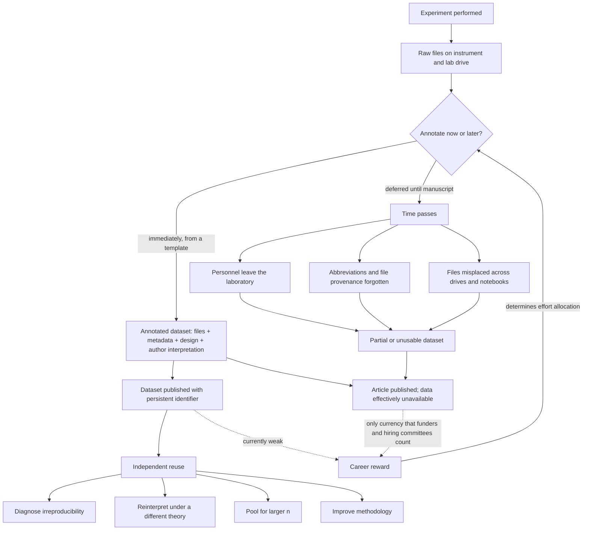

# Open data and research infrastructure

A scientific article is not the evidence; it is an argument about the evidence. Between the instrument that produced a measurement and the figure a reader eventually sees lies a chain of choices — which experiments to combine into a single narrative, which comparisons to foreground, which statistical model to fit, which images are representative — and only the endpoint of that chain is published. On this account the article is an interpretation of data generated by the authors, and the data themselves are a separate object that usually never leaves the laboratory. (@TheSheekeyScienceShow (The Sheekey Science Show) — "The Hidden Crisis Slowing Longevity Research - Tim Glinin (First Approval)", 2025-08-16, [link](https://www.youtube.com/watch?v=lB5aqym8V98)) Open data is the practice of publishing that separate object, annotated well enough that someone who was not present can use it. This page treats it as research infrastructure: a shared substrate that determines what questions the literature can answer, in the same way that reagent standardization or animal husbandry protocols do.

Four distinct capabilities follow from independent access to underlying data, and they are worth separating because they are often collapsed into a single vague appeal to transparency. The first is diagnosis: when a result fails to reproduce, the data are the first place to look for why, and without them the failure is uninterpretable ([[replication-and-research-incentives]]). The second is reinterpretation under a different theoretical frame — a set of micrographs collected to quantify one protein carries information about membrane architecture that the original authors had no reason to extract, and a reader with a different question can extract it. The third is pooling: independently collected datasets on the same system can be merged to obtain an n that no single laboratory could afford. The fourth is methodological improvement, since aggregating data across groups exposes which handling steps and analysis choices actually drive results. (@TheSheekeyScienceShow (The Sheekey Science Show) — "The Hidden Crisis Slowing Longevity Research - Tim Glinin (First Approval)", 2025-08-16, [link](https://www.youtube.com/watch?v=lB5aqym8V98))

The diagram's load-bearing feature is the feedback arrow at the bottom. The annotate-now decision is not primarily a question of diligence; it is downstream of what the reward system counts, and the reward system counts articles.

## What a dataset actually is

A dataset is the output of a scientific experiment, whatever its size. The lower bound is a single photograph of a gel; the upper bound is terabytes of transcriptomic, single-cell, or genomic sequence. Both matter: a single raw western blot image can be the thing that resolves a question many laboratories have been unable to interpret, so scale is not a proxy for value. (@TheSheekeyScienceShow (The Sheekey Science Show) — "The Hidden Crisis Slowing Longevity Research - Tim Glinin (First Approval)", 2025-08-16, [link](https://www.youtube.com/watch?v=lB5aqym8V98))

Cutting across size is the raw–processed distinction. Raw data are the primary files as the instrument wrote them. Processed data are anything the researcher has acted on: exported from a proprietary microscope format, filtered, sorted, or subjected to preliminary analysis. A published dataset may contain only raw files, only processed files, or both. Both together is the most informative combination, because the transformation from one to the other is itself methodological evidence — it shows what the authors did, not merely what they concluded. Where a full deposit is not feasible, the ordering to hold onto is that raw data with good annotation is far better than nothing, and any dataset is better than none. (@TheSheekeyScienceShow (The Sheekey Science Show) — "The Hidden Crisis Slowing Longevity Research - Tim Glinin (First Approval)", 2025-08-16, [link](https://www.youtube.com/watch?v=lB5aqym8V98))

The annotation attached to a dataset is not one thing either; it operates at three levels, and conflating them is a common source of deposits that are technically open and practically unusable.

- **File-level metadata** describes each artifact: acquisition date, instrument, magnification, laser intensity, channel settings, file format. This is what is usually meant by metadata, and it is the level most amenable to automation.
- **Experimental-design annotation** describes the study: the groups and their allocation, the organism or cell source, how treatments were administered, and what the experiment was originally intended to test. Without this level, files are uninterpretable no matter how well each one is individually labeled.
- **Author interpretation** records what the people who ran the experiment knew that the files cannot show — including annotated negative results, where the authors state that the data do not support the original hypothesis and give their reading of why, having satisfied themselves that the methodology was sound. It also covers deviations flagged in advance, such as one sample processed faster than the rest.

The interpretation layer is the one whose value is least obvious and possibly highest. A flagged deviation is a warning to the original authors but a signal to a reuser, who may find that the faster processing time produced something informative rather than something wrong. (@TheSheekeyScienceShow (The Sheekey Science Show) — "The Hidden Crisis Slowing Longevity Research - Tim Glinin (First Approval)", 2025-08-16, [link](https://www.youtube.com/watch?v=lB5aqym8V98)) Annotated negative results are similarly asymmetric: they are near-worthless as article material and disproportionately valuable as a check on what has already been tried.

## Why aging biology is an unusually strong case

The general argument for open data applies everywhere. Aging biology has an additional and specific reason, which is the absence of a unifying paradigm. The field carries many simultaneous candidate mechanisms without an established ordering of which drivers matter most, so researchers commit to particular concepts and read the literature through them ([[hallmarks-of-aging]]). A scientist working on epigenetic aging designs, analyzes, and interprets an experiment through that frame; someone working on extracellular matrix aging, given the same files, may extract a different result from them entirely. Where a single theory dominates, reinterpretation yields less because everyone would ask roughly the same question of the data. Where no theory dominates, the same dataset has many buyers, and withholding it costs the field more. (@TheSheekeyScienceShow (The Sheekey Science Show) — "The Hidden Crisis Slowing Longevity Research - Tim Glinin (First Approval)", 2025-08-16, [link](https://www.youtube.com/watch?v=lB5aqym8V98)) [[epigenetic-alterations-and-reprogramming]] [[extracellular-matrix-aging]]

This is an argument about expected information value, not about virtue, and it has a corollary worth stating: as a field converges on a paradigm, the marginal return to open data falls. Aging biology is nowhere near that point.

## The cost problem: annotation decays with time

Annotation is work, and it falls on the person least compensated for it. The magnification, laser settings, reagent lots, and concentrations that make a dataset reusable are recorded by hand by the researcher who ran the experiment, on top of the experimental and intellectual work itself. That effort is the principal stated reason scientists do not share data. (@TheSheekeyScienceShow (The Sheekey Science Show) — "The Hidden Crisis Slowing Longevity Research - Tim Glinin (First Approval)", 2025-08-16, [link](https://www.youtube.com/watch?v=lB5aqym8V98))

The cost is not constant, and this is the key structural fact. It rises sharply with elapsed time since the experiment, because the information required for annotation lives in perishable places: in the memory of the person at the bench, in undocumented abbreviations, and in files scattered across drives and notebooks. Returning to an experiment half a year later to write it up reliably surfaces details that are half-remembered, notebook entries whose location is uncertain, and abbreviations whose meaning is gone; the people who ran the experiment may have left the laboratory entirely. A data request arriving after publication is therefore a burden on both sides — the requester and the original authors. (@TheSheekeyScienceShow (The Sheekey Science Show) — "The Hidden Crisis Slowing Longevity Research - Tim Glinin (First Approval)", 2025-08-16, [link](https://www.youtube.com/watch?v=lB5aqym8V98))

Because the cost curve is steep, the highest-leverage interventions act on timing rather than on willingness.

- **Annotate immediately, and template it.** Some report is written in any case for internal records and eventual publication, so annotating at the time captures work already being done. The first full annotation of an experiment type becomes a template; subsequent similar experiments require documenting only the differences from that design, which both lowers cost and standardizes the laboratory's own records. (@TheSheekeyScienceShow (The Sheekey Science Show) — "The Hidden Crisis Slowing Longevity Research - Tim Glinin (First Approval)", 2025-08-16, [link](https://www.youtube.com/watch?v=lB5aqym8V98))
- **Community annotation standards.** Rather than each laboratory deciding what to record, standards efforts specify the required fields per experiment type in advance, turning an open-ended writing task into a checklist. The CEDAR initiative at Stanford is cited as an effort of this kind, building metadata standards across laboratory experiment types. (@TheSheekeyScienceShow (The Sheekey Science Show) — "The Hidden Crisis Slowing Longevity Research - Tim Glinin (First Approval)", 2025-08-16, [link](https://www.youtube.com/watch?v=lB5aqym8V98))
- **Electronic lab notebooks.** Continuous structured capture of what happens at the bench means annotation is a by-product of recording rather than a separate retrospective task. (@TheSheekeyScienceShow (The Sheekey Science Show) — "The Hidden Crisis Slowing Longevity Research - Tim Glinin (First Approval)", 2025-08-16, [link](https://www.youtube.com/watch?v=lB5aqym8V98))
- **Machine assistance in identifying required fields.** Because experimental types are largely standardized, a language model can be used to propose which details a given experiment needs recorded for reproducibility. This addresses knowing what to write, not the writing itself, and it is a proposal rather than a demonstrated result. (@TheSheekeyScienceShow (The Sheekey Science Show) — "The Hidden Crisis Slowing Longevity Research - Tim Glinin (First Approval)", 2025-08-16, [link](https://www.youtube.com/watch?v=lB5aqym8V98))

Journals provide the deposit channel for the article-linked case: data can be uploaded to a repository ahead of the article, and reputable journals carry a data availability section that points to it. Publishers have some interest in this, since data-backed articles tend to attract more attention and citation. (@TheSheekeyScienceShow (The Sheekey Science Show) — "The Hidden Crisis Slowing Longevity Research - Tim Glinin (First Approval)", 2025-08-16, [link](https://www.youtube.com/watch?v=lB5aqym8V98)) That channel does nothing for data never attached to an article, which is the larger pool.

## The incentive problem, and reward-side rather than mandate-side fixes

Behind the cost problem is a harder one. The journal article is effectively the sole currency of academic science: funding decisions, hiring, laboratory positions, and recognition all key off publications, and experiments not folded into an article are largely uncounted. A single dominant metric shapes behavior accordingly — effort spent on anything the metric does not measure is unrewarded effort, so data annotation loses every allocation contest it enters. (@TheSheekeyScienceShow (The Sheekey Science Show) — "The Hidden Crisis Slowing Longevity Research - Tim Glinin (First Approval)", 2025-08-16, [link](https://www.youtube.com/watch?v=lB5aqym8V98)) This is the same structural diagnosis reached from a different direction in [[replication-and-research-incentives]], where novelty preference and negative-result publication bias suppress replication.

The design conclusion drawn from this is that mandating effort is the wrong lever and raising rewards is the right one: scientists cannot be compelled to spend large amounts of time on annotation, but if the activity converted into grants, recognition, and career position, the effort would follow. (@TheSheekeyScienceShow (The Sheekey Science Show) — "The Hidden Crisis Slowing Longevity Research - Tim Glinin (First Approval)", 2025-08-16, [link](https://www.youtube.com/watch?v=lB5aqym8V98)) Four reward mechanisms are proposed, and it is useful to read them as a menu of designs with different strengths.

- **Citable data publications.** Issuing a dataset a persistent identifier and a citable record converts it into an object that existing academic accounting can already count. This is the cheapest mechanism because it changes the unit of credit without asking anyone to value a new one.
- **Download visibility.** Showing authors who has downloaded their data addresses a stated reason for withholding: researchers want to know what becomes of their data, who is using it, and whether the reuse analysis is correct, and they delay release until they are confident about that. Visibility converts an unknown into a monitorable one. (@TheSheekeyScienceShow (The Sheekey Science Show) — "The Hidden Crisis Slowing Longevity Research - Tim Glinin (First Approval)", 2025-08-16, [link](https://www.youtube.com/watch?v=lB5aqym8V98))
- **Authorship-and-collaboration-gated reuse.** A stronger form makes reuse conditional on the data author guiding the reuse, checking the analysis, and appearing as an author on resulting work. This pays in the currency that already exists, and it has a second payoff the source emphasizes: a dataset attracts collaborators the author could not have identified in advance, whether promising early-career scientists or established groups with adjacent interests. (@TheSheekeyScienceShow (The Sheekey Science Show) — "The Hidden Crisis Slowing Longevity Research - Tim Glinin (First Approval)", 2025-08-16, [link](https://www.youtube.com/watch?v=lB5aqym8V98)) The tension to note is that gating reuse on the originator's participation reintroduces originator control over reinterpretation — the very independence that made reuse valuable for diagnosing irreproducibility. Consent-gated reuse and adversarial reanalysis are not the same product.
- **Prizes and competitions targeted at a specific audience.** A worked example: a student dataset competition in which submissions receive a citable data publication after editorial check, monetary awards are distributed across undergraduate, graduate, and doctoral tracks, and separate special prizes are reserved for negative datasets and for replication datasets, with entrants declaring which category applies. Judging is on experimental design and stated hypothesis, annotation quality and reusability, file organization and its correspondence to the annotation, and estimated reuse potential — explicitly not on what the experiment found. (@TheSheekeyScienceShow (The Sheekey Science Show) — "The Hidden Crisis Slowing Longevity Research - Tim Glinin (First Approval)", 2025-08-16, [link](https://www.youtube.com/watch?v=lB5aqym8V98))

That last design is the most interesting one on incentive grounds, for two reasons. Scoring on annotation quality rather than on findings decouples reward from result, which is exactly the property missing from the article system and which makes negative and replication data submittable at all. And targeting students aims the mechanism at the population with the weakest publication record and the strongest marginal incentive to acquire one, which is where a new credit currency is cheapest to establish. Whether such schemes change behavior at scale, or merely attract data that would have been shared regardless, is untested.

## Datasets and articles as complements

A frequent misreading of open-data advocacy is that it proposes replacing the article. The position here is that the two are complementary and that the data layer is additive: an article can point to its dataset, and a future article can synthesize many groups' datasets alongside its own, with narrative interpretation remaining the article's job. (@TheSheekeyScienceShow (The Sheekey Science Show) — "The Hidden Crisis Slowing Longevity Research - Tim Glinin (First Approval)", 2025-08-16, [link](https://www.youtube.com/watch?v=lB5aqym8V98)) Read structurally, the proposal is to add a second, cheaper-to-produce unit of credit next to an existing expensive one, so that work currently invisible to the accounting system becomes visible. Whether a second currency dilutes the first, or whether dataset counts become gameable in the way publication counts already are, are open questions rather than answered ones.

## Practical implications

**For readers evaluating research:**

- **Check the data availability statement and treat it as evidence about the claim, not a formality — moderate.** An article backed by a deposited, annotated dataset is a claim that can be checked; one whose data are available on request from a laboratory that has since dispersed is, in practice, one that cannot.
- **When a result fails to replicate and the underlying data are unavailable, withhold the verdict — strong as a reasoning discipline.** The diagnostic step that would distinguish a false original claim from a statistical, strain, reagent, or artifact difference is unavailable, so neither the original nor the failed replication should be treated as settled ([[replication-and-research-incentives]]).
- **Discount claims about the absence of an effect more heavily than claims about its presence — moderate.** Negative results are systematically absent from the published record, so what you can see is a biased sample of what has been tried.

**For researchers producing data:**

- **Annotate at the time of the experiment, not at manuscript stage — strong on the mechanism, untested as to effect size.** The cost curve rises steeply with elapsed time and the loss is often irreversible; this is the single change with the largest ratio of benefit to effort.
- **Build templates for recurring experiment types and record only the deltas — moderate.** This converts annotation from an open-ended writing task into a bounded one and standardizes the laboratory's internal records as a side effect.
- **Adopt an existing community standard rather than inventing a field list — moderate.** Standards such as the CEDAR effort specify required fields per experiment type, which removes the hardest part of the task, namely knowing what to record.
- **Deposit raw and processed data together where feasible; deposit something rather than nothing where not — moderate.** The transformation between the two is itself methodological information, but an annotated raw deposit is far more valuable than a withheld complete one.
- **Annotate negative and equivocal results explicitly, including your own reading of why — moderate.** This is the material least likely to appear anywhere else and most likely to save another group an experiment.
- **No personal health action follows from this page.** Research infrastructure determines the rate at which the field produces reliable knowledge; it says nothing about any individual intervention. See [[practice-playbook]].

## Gaps & open questions

- Does dataset availability measurably increase the reproducibility rate of the findings it accompanies, or only the diagnosability of failures?
- What fraction of deposited datasets are ever reused, and does annotation quality predict reuse?
- Do reward mechanisms — persistent identifiers, download visibility, prizes — change data-sharing behavior at scale, or select for researchers already inclined to share?
- Does authorship-gated reuse increase deposition enough to outweigh the loss of genuinely independent reanalysis?
- How large is the pool of data attached to no article at all, and is any channel reaching it?
- Can machine assistance produce annotation that is adequate for reuse, or only adequate-looking?
- Does the value of open data in aging biology in fact exceed its value in paradigm-converged fields, as the no-unifying-theory argument predicts?
- Would a second credit currency for datasets become gameable in the way publication counts have?

## Related

[[replication-and-research-incentives]] · [[public-trust-in-longevity-science]] · [[cultural-legitimacy-versus-research-bottleneck]] · [[hallmarks-of-aging]] · [[epigenetic-alterations-and-reprogramming]] · [[extracellular-matrix-aging]] · [[biological-age-biomarkers]] · [[longevity-intervention-prioritization]] · [[human-centered-ai-and-learning]] · [[aging-model]] · [[practice-playbook]]
