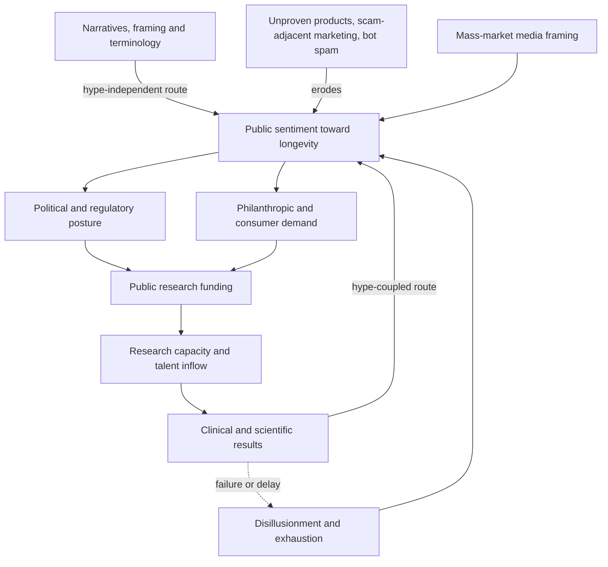

# Public trust in longevity science

Public trust is the degree to which a population believes that a field of research is competent, honest, and working toward something it wants. For a research programme it is not decoration on top of the science: it is an input that determines how much money, talent, political backing, and regulatory permission the programme receives, and therefore how fast the science itself can move. This makes trust a measurable quantity with causal consequences rather than a matter of public-relations taste, and it can be studied with the same instruments used to study any other diffuse social variable — search behavior, discourse, media production, and survey response. The claim that this constitutes a distinct and neglected bottleneck for aging research, on a par with the biological problems, is the organizing position of the Public Longevity Group, which describes its object as this bottleneck that we call public trust. (@TheSheekeyScienceShow (The Sheekey Science Show) — "Does Longevity Have a Culture Problem? Mapping Public Trust in Life Extension Science", 2025-10-13, [link](https://www.youtube.com/watch?v=bnUPDSe-YXI))

The diagram contains the field's strategic problem in one loop. If sentiment is driven mainly by the hype-coupled route, then a decade without a convincing result feeds disillusionment back into funding, and the field's social standing becomes hostage to the risk profile of its own experiments. The proposal to build the hype-independent route — cultural embedding that does not depend on the next trial reading out well — is what distinguishes this programme from ordinary science communication. The comparison offered is the climate movement, whose public support does not rise and fall with the annual tonnage of carbon removed. (@TheSheekeyScienceShow (The Sheekey Science Show) — "Does Longevity Have a Culture Problem? Mapping Public Trust in Life Extension Science", 2025-10-13, [link](https://www.youtube.com/watch?v=bnUPDSe-YXI))

## Instrumenting a diffuse variable

Culture has no single sensor, so measurement proceeds by triangulating sources whose biases differ. Four families are in use. Search interest reveals what people privately want to know rather than what they will say publicly, and can be resolved geographically. Forum discourse — Reddit, X, LinkedIn, 4chan — supplies volume, sentiment, and the adjacent interests that co-occur with a topic, which locates a subject in the wider map of what its audience also cares about. Mass-market media production measures the framing most people actually encounter; in the United Kingdom the *Daily Mail* is reported as the largest single producer of longevity articles, above the *Economist* and the *Guardian*, which matters because reach and sensationalism, not editorial prestige, determine the modal public exposure. Surveys and psychometric data (Big Five personality, happiness measures) address demographics and disposition that behavioral traces cannot. (@TheSheekeyScienceShow (The Sheekey Science Show) — "Does Longevity Have a Culture Problem? Mapping Public Trust in Life Extension Science", 2025-10-13, [link](https://www.youtube.com/watch?v=bnUPDSe-YXI))

Two methodological choices distinguish this from opinion polling. The first is longitudinal repetition: a single snapshot cannot tell a community whether its communication is working, so the intended product is a continuously updated series in which sentiment can be read week by week as a feedback signal. The second is the use of a comparison population: longevity-specific subreddits are contrasted against general-purpose subreddits that people join regardless of political leaning, age, or interest, so that enthusiasm inside the community can be separated from sentiment in the population the community is trying to reach. The reported gap between the two is large — enthusiasm inside, skepticism outside. (@TheSheekeyScienceShow (The Sheekey Science Show) — "Does Longevity Have a Culture Problem? Mapping Public Trust in Life Extension Science", 2025-10-13, [link](https://www.youtube.com/watch?v=bnUPDSe-YXI))

## What the first United States map shows

Search interest was measured at state level across a vocabulary wider than the word *longevity* — healthspan, senescence, and the names of prominent figures and books — then cross-referenced against census data. Interest clusters on the west coast and in parts of the northeast, with California, Massachusetts, Oregon, Colorado, Utah, and Arizona reported as the strongest states and large gaps through the midwest and south. The demographic correlates run together: older, more educated, happier, wealthier, and better-insured populations show more interest, with wealth described as the single best indicator, and more politically liberal regions showing more than conservative ones. (@TheSheekeyScienceShow (The Sheekey Science Show) — "Does Longevity Have a Culture Problem? Mapping Public Trust in Life Extension Science", 2025-10-13, [link](https://www.youtube.com/watch?v=bnUPDSe-YXI))

Two interpretive cautions belong with that finding, and neither is resolved by the data as described. This is an ecological correlation: state-level search volume matched to state-level census aggregates cannot establish that the individuals searching are the wealthy, educated, or older ones, and inferring individual attributes from area averages is the classic ecological fallacy. And correlated demographics cannot be separated from one another at this resolution — wealth, education, age, insurance status, and political lean travel together across US states, so naming wealth the best indicator reflects the strength of one collinear proxy rather than an isolated causal driver.

The finding's practical force does not depend on resolving either caution. Whatever the mechanism, the audience currently reached is a small, homogeneous, and comparatively privileged slice of the population — the same slice that fills academic conferences on the subject — while the argument the field makes about itself is a public-good argument that applies to everyone. That mismatch between claimed scope and actual reach is the gap the measurement is designed to expose. (@TheSheekeyScienceShow (The Sheekey Science Show) — "Does Longevity Have a Culture Problem? Mapping Public Trust in Life Extension Science", 2025-10-13, [link](https://www.youtube.com/watch?v=bnUPDSe-YXI))

## Narrative archetypes and message testing

Rather than assuming a single public conversation about longevity, the analysis derives archetypes empirically from the vocabulary and volume of search behavior, yielding five recurring ways people approach the subject. Three were named on air: the **mind healer**, the **body hacker**, and the **medical strategist** — the last being the institutional register of national research agencies, named academic gerontologists, and formal trials, the one people meet when they read a scientific article. Each archetype implies a different entry point, a different vocabulary, and a different plausibility standard, which is why a message optimized for one can fail with another. (@TheSheekeyScienceShow (The Sheekey Science Show) — "Does Longevity Have a Culture Problem? Mapping Public Trust in Life Extension Science", 2025-10-13, [link](https://www.youtube.com/watch?v=bnUPDSe-YXI))

The intended method for choosing between framings is A/B testing borrowed from marketing: put variants in front of segmented audiences at volume and measure response, rather than settling framing questions by intuition or internal consensus. The stated ambition is to turn communication into a science in a sense. The immediate test case is terminology — whether *longevity*, *healthspan*, or *lifespan extension* performs better, and in which context — a question the field has argued internally for years and which message testing could in principle answer empirically. The harder programme is generating framings that do not yet exist for the unreached populations, such as an explicitly patriotic or explicitly youth-oriented narrative. (@TheSheekeyScienceShow (The Sheekey Science Show) — "Does Longevity Have a Culture Problem? Mapping Public Trust in Life Extension Science", 2025-10-13, [link](https://www.youtube.com/watch?v=bnUPDSe-YXI))

Message testing of this kind carries an ethical boundary that the source does not draw. Optimizing which true framing of a result resonates with an audience is legitimate persuasion; optimizing how confident a claim can be made to sound is the mechanism by which fields lose trust rather than gain it. Because the same toolkit produces both, the discipline has to come from the evidentiary standards on the claims themselves — see [[supplement-evidence-and-safety]] and [[longevity-clinics-and-evidence]] — not from the testing apparatus.

## Data validity, bots, and spam as signal

Any inference from internet text now has to survive contamination by automated and machine-generated accounts, and the longevity discourse is a hard case: crypto-adjacent and decentralized-funding activity in the field brings promotional bot traffic with it, and X is described as crawling with bots. Large language models have made filtering this traffic easier than it was, which is the reason such measurement is more tractable now than a few years ago — though a filter built on the same technology that generates the contamination has no guaranteed long-run advantage. (@TheSheekeyScienceShow (The Sheekey Science Show) — "Does Longevity Have a Culture Problem? Mapping Public Trust in Life Extension Science", 2025-10-13, [link](https://www.youtube.com/watch?v=bnUPDSe-YXI))

The analytically interesting move is to treat contamination as data rather than only as noise: we often treat it as a feature not a bug. Spam is itself an exposure the public experiences, and the reaction to it is part of the trust measurement. If a field's most visible public surface is advertising for a pill claimed to make the buyer decades younger, the reasonable public response is the one surveys already record — suspicion — and the resemblance to previous manias is precisely what people are responding to. On this account, unproven commercial products are not merely a consumer-protection problem, they are a direct input to the trust variable that the whole field's funding depends on. (@TheSheekeyScienceShow (The Sheekey Science Show) — "Does Longevity Have a Culture Problem? Mapping Public Trust in Life Extension Science", 2025-10-13, [link](https://www.youtube.com/watch?v=bnUPDSe-YXI)) [[longevity-clinics-and-evidence]]

## High-profile moments as natural experiments

Sentiment does not move at a constant rate; it jumps around discrete events. A remark by Xi Jinping about organ transplantation and living to 150 generated coordinated coverage across major outlets, expert commentary, and forum reaction within days, and events of this kind are treated as natural experiments: a large exogenous shock to attention whose effect on sentiment can be measured before and after. The reason to instrument them is that they propagate — political perception of a field shapes research funding and regulation, and a high-salience moment can move that perception faster than any deliberate campaign. What such an analysis can establish is the direction and duration of an attention shock; what it cannot establish, without a comparison condition, is what sentiment would have done anyway. (@TheSheekeyScienceShow (The Sheekey Science Show) — "Does Longevity Have a Culture Problem? Mapping Public Trust in Life Extension Science", 2025-10-13, [link](https://www.youtube.com/watch?v=bnUPDSe-YXI))

## Where this sits in the larger system

Public trust does not appear in the causal map of aging biology in [[aging-model]], because it is not a mechanism of aging. It sits one level up, as a determinant of which mechanisms get studied at all: it gates funding and regulatory tolerance, and therefore gates the rate at which the interventions catalogued in [[longevity-intervention-prioritization]] can be tested. It is also downstream of the field's own conduct — every overstated biomarker claim, every clinic selling an unproven procedure, and every product whose evidence base is a mechanism rather than an outcome deposits into the same reservoir that the field later needs to draw on. The disagreement about whether this constraint currently binds harder than the scientific one is developed in [[cultural-legitimacy-versus-research-bottleneck]].

## Practical implications

- **For researchers and communicators, state the outcome class and the evidence tier in the message itself — strong as a reasoning discipline, untested as a trust intervention.** The distinctions maintained in [[biological-age-reversal]] and [[healthspan-versus-maximum-lifespan]] are exactly the ones that, when blurred, produce the hype cycle whose collapse damages trust.
- **Treat message testing as a measurement of resonance, not of truth — strong.** An A/B test can tell you which true framing lands; it cannot license a framing the evidence does not support.
- **For readers assessing the field, use the clustering finding as a check on your own information diet — moderate.** If interest concentrates among wealthy, educated, older, well-insured populations, then the enthusiasm visible in any longevity forum is not a sample of informed opinion but a sample of an unrepresentative and self-selected community.
- **No personal health action follows from this page.** Public sentiment about longevity is unrelated to whether any specific intervention works; see [[practice-playbook]] for what is actually evidence-supported.

## Gaps & open questions

- Does measured public sentiment actually predict downstream funding, regulatory decisions, or trial recruitment, or is the causal chain assumed rather than demonstrated?
- Is the demographic clustering an individual-level pattern at all, or an artifact of ecological aggregation and collinear state-level covariates?
- Which of the five narrative archetypes are stable constructs and which are artifacts of the search vocabulary chosen to derive them?
- Can a narrative be built for currently unengaged populations that raises trust without raising expectations the evidence cannot meet?
- How much of measured discourse is now machine-generated, and does LLM-based filtering degrade as generation improves?
- Does exposure to unproven longevity products measurably lower trust in legitimate aging research, or do audiences separate the two?
- Do attention shocks from high-profile political or celebrity moments produce durable sentiment change or only transient spikes?
- Is the trust variable in fact independent of research results over the long run, as the decoupling strategy assumes?

## Related

[[cultural-legitimacy-versus-research-bottleneck]] · [[replication-and-research-incentives]] · [[open-data-and-research-infrastructure]] · [[longevity-clinics-and-evidence]] · [[supplement-evidence-and-safety]] · [[biological-age-reversal]] · [[healthspan-versus-maximum-lifespan]] · [[longevity-intervention-prioritization]] · [[human-centered-ai-and-learning]] · [[aging-model]] · [[practice-playbook]]
