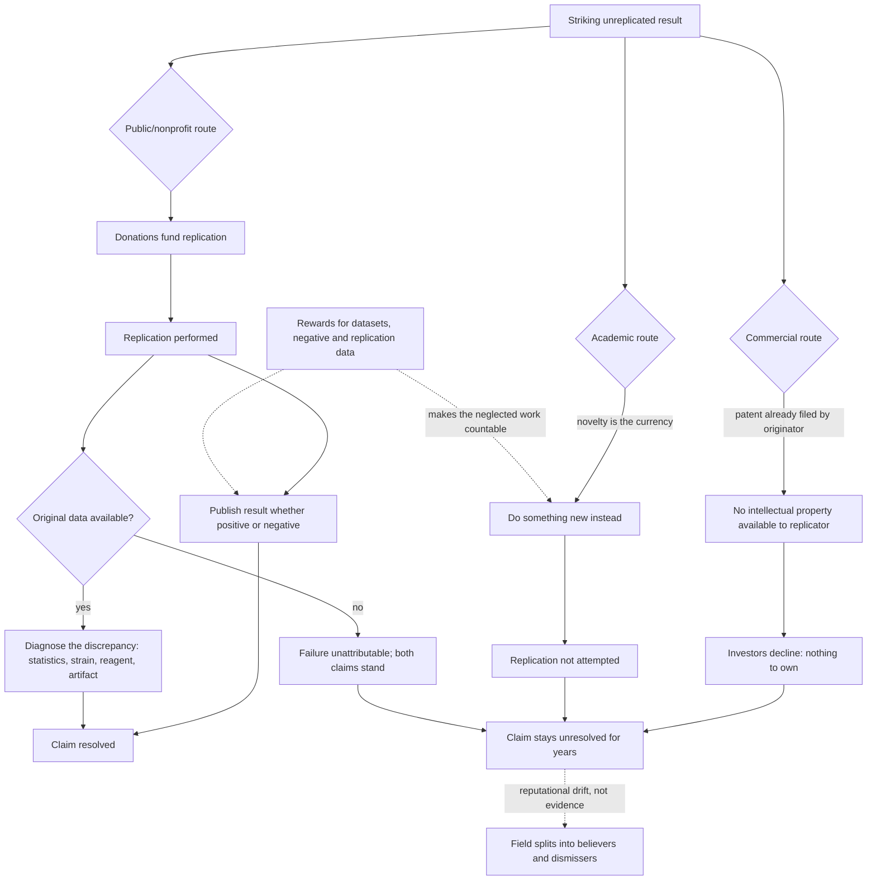

# Replication and research incentives

A finding becomes knowledge when independent groups reproduce it. That is the textbook account, and it describes what science requires rather than what its institutions reward. Replication is largely unfunded, unpublishable in high-prestige venues, and career-neutral at best, while the three engines that pay for research — commercial investment, academic advancement, and public funding — each independently discount it. The consequence is a systematic gap: the more striking and consequential a result, the more important its replication and, frequently, the less likely anyone is to perform it. Understanding the specific incentive structure matters practically, because it tells a reader which unreplicated results are unreplicated for want of interest and which are unreplicated for structural reasons that have nothing to do with their plausibility. (@TheSheekeyScienceShow (The Sheekey Science Show) — "Reproducing Rejuvenation: Inside the Pig Plasma Longevity Experiments", 2025-08-22, [link](https://www.youtube.com/watch?v=Q-lS1UMHG1o))

## Three routes and why each declines

**The commercial route is closed by the intellectual property it created.** When the originator of a result has already filed a patent, a group that reproduces the work cannot obtain protection over it. Investors therefore have little to fund: replication produces knowledge that is valuable to everyone and ownable by no one. This is the mechanism's sharpest edge — the same patent that makes the original work commercially fundable makes its verification commercially unfundable, so the more valuable a claim appears, the more thoroughly the first mover's protection insulates it from being checked. (@TheSheekeyScienceShow (The Sheekey Science Show) — "Reproducing Rejuvenation: Inside the Pig Plasma Longevity Experiments", 2025-08-22, [link](https://www.youtube.com/watch?v=Q-lS1UMHG1o))

**The academic route is closed by the preference for originality.** Careers advance on novel findings; scientists are trained and rewarded to change something rather than to repeat something. A direct, deliberately unmodified repetition of someone else's experiment is the least publishable design available, even where it is the most informative. The counter-argument is that effect size should override the convention: a result large enough to matter is precisely the one that should be repeated exactly rather than varied. (@TheSheekeyScienceShow (The Sheekey Science Show) — "Reproducing Rejuvenation: Inside the Pig Plasma Longevity Experiments", 2025-08-22, [link](https://www.youtube.com/watch?v=Q-lS1UMHG1o))

**The publication route is closed at the other end by negative results.** A replication that finds nothing is the hardest kind of paper to place, so even a completed replication may never enter the record. The structural response adopted by the Rejuvenation Science Institute is to commit in advance to publishing regardless of outcome and to distribute results through channels it controls — a newsletter and website — rather than depending on journal acceptance: "But we also want to to publish even if the results are bad." Pre-commitment of this kind is a partial substitute for preregistration; it removes the option of quietly declining to report. (@TheSheekeyScienceShow (The Sheekey Science Show) — "Reproducing Rejuvenation: Inside the Pig Plasma Longevity Experiments", 2025-08-22, [link](https://www.youtube.com/watch?v=Q-lS1UMHG1o))

**A fourth constraint sits underneath all three: the data needed to adjudicate are often gone.** Reproducibility in biology is reported at somewhere between 30% and 50% of published articles — figures described in the source as harmful rather than merely disappointing, because subsequent work builds on results whose status was never clear. (@TheSheekeyScienceShow (The Sheekey Science Show) — "The Hidden Crisis Slowing Longevity Research - Tim Glinin (First Approval)", 2025-08-16, [link](https://www.youtube.com/watch?v=lB5aqym8V98)) The causes are heterogeneous and, importantly, individually diagnosable given access to the underlying data: choice of an inappropriate statistical method or misinterpretation of the analysis, which can occur on either the original or the replicating side; differences in mouse strain; differences in reagents; and methodological artifacts, where inspection of the data can indicate whether the artifact originated with the original team or the replicating one. The estimate offered is that data access is crucial across the majority of non-reproduced cases. (@TheSheekeyScienceShow (The Sheekey Science Show) — "The Hidden Crisis Slowing Longevity Research - Tim Glinin (First Approval)", 2025-08-16, [link](https://www.youtube.com/watch?v=lB5aqym8V98)) The mechanism is worth stating precisely: data availability is rarely itself the reason an experiment fails to reproduce, but without it the reason cannot be identified, so a failed replication resolves into an unattributable disagreement rather than a diagnosis. This converts the conditional reading of failed replications argued below from a counsel of caution into an operational procedure — and it fails whenever the data are unavailable, which the decay dynamics described in [[open-data-and-research-infrastructure]] make the common case.

## The nonprofit remainder, and its economic logic

What remains when all three routes decline is donation-funded nonprofit work, and the argument for why it fits this niche is more principled than mere necessity. The output of a replication is information, and information can be given away in full — methods, materials, and detailed results — so a funding model that does not require exclusivity is the natural match. A service, by contrast, requires capital, exclusivity, and a return, and is a different economic object with a different appropriate funding structure. The organizational conclusion is that the funding model should follow from what is being produced, not from ideological preference for markets or for state funding. (@TheSheekeyScienceShow (The Sheekey Science Show) — "Reproducing Rejuvenation: Inside the Pig Plasma Longevity Experiments", 2025-08-22, [link](https://www.youtube.com/watch?v=Q-lS1UMHG1o))

A related and genuinely contrarian claim concerns where discoveries come from. Nicolás of the Rejuvenation Science Institute argues that basic science is poorly suited to capital-intensive organization because the probability of choosing the wrong line of inquiry is high, and money cannot buy the judgment required to choose correctly — a wealthy founder must hire scientists, and hiring well presupposes the expertise being purchased. Google's Calico is offered as the cautionary case: very large expenditure that, on this account, may have backed the wrong lines. Historical examples of discoveries made without large capital — the Curies on radioactivity, early aviation, early vaccination — are used to argue that capital and state power typically enter after a discovery, to perfect and distribute it. (@TheSheekeyScienceShow (The Sheekey Science Show) — "Reproducing Rejuvenation: Inside the Pig Plasma Longevity Experiments", 2025-08-22, [link](https://www.youtube.com/watch?v=Q-lS1UMHG1o))

That argument is worth stating carefully because it is half right in a way that is easy to over-read. The valid core is that expected value in basic science is dominated by the choice of question, that money does not resolve that choice, and that a small group with a well-chosen question can be extraordinarily efficient — which is exactly the case for funding replication cheaply. The invalid extension would be that scale does not help: the historical examples are drawn from an era of much lower experimental capital requirements, and are subject to survivorship bias, since the uncounted denominator is the many small efforts that produced nothing. Contemporary structural biology, genomics, and large trials are not obtainable at garage scale. The defensible synthesis is that scale and judgment are complements rather than substitutes, and that the specific activity of checking an existing claim is unusually cheap relative to its information value.

## Raising rewards rather than mandating effort

The three routes above describe why replication is not funded and not published. A separate design question is what would change that, and the answer that follows from the diagnosis is not exhortation. Because the journal article is the sole currency in which funding, hiring, and recognition are denominated, any activity outside it — replication, negative results, and the annotation and publication of data — is unrewarded effort, and the response of adding obligations without adding rewards asks scientists to spend time the accounting system will not count. The alternative is to raise the reward for the neglected activities until they compete on their merits. (@TheSheekeyScienceShow (The Sheekey Science Show) — "The Hidden Crisis Slowing Longevity Research - Tim Glinin (First Approval)", 2025-08-16, [link](https://www.youtube.com/watch?v=lB5aqym8V98))

This agrees with the diagnosis already given here — that novelty is the currency and that negative results and direct replications are the least publishable designs available — and it adds a mechanism that pre-commitment to publish does not supply. Pre-commitment removes the option of suppressing a negative result; it does not make producing one worth anyone's time. The proposed additions do: persistent identifiers that turn a deposited dataset into a citable object countable by existing academic accounting, visibility into who downloads a dataset, reuse conditioned on collaboration and authorship, and prizes that judge datasets on design and annotation quality rather than on findings — including award categories reserved specifically for negative datasets and for replication datasets. (@TheSheekeyScienceShow (The Sheekey Science Show) — "The Hidden Crisis Slowing Longevity Research - Tim Glinin (First Approval)", 2025-08-16, [link](https://www.youtube.com/watch?v=lB5aqym8V98)) The structural feature that makes those categories work is decoupling reward from result: as long as the prize is for the quality of the work rather than the direction of the finding, a null result and a confirmation are equally submittable. Whether such schemes change behavior at scale, or attract only researchers already inclined to share, has not been tested. The full treatment of data infrastructure is in [[open-data-and-research-infrastructure]].

A related datum on where the field itself locates the constraint: a bottleneck survey of longevity researchers conducted by the Longevity Biotech Fellowship is reported to have found that respondents ranked the unavailability of public datasets above both regulatory change and increased funding. (@TheSheekeyScienceShow (The Sheekey Science Show) — "The Hidden Crisis Slowing Longevity Research - Tim Glinin (First Approval)", 2025-08-16, [link](https://www.youtube.com/watch?v=lB5aqym8V98)) This wiki has not reviewed the survey instrument, sample, or response rate, so it is recorded as a reported finding about researcher priorities rather than as an established fact about the field's binding constraint; its bearing on that larger question is developed in [[cultural-legitimacy-versus-research-bottleneck]]. The argument attached to the finding is one of tractability rather than magnitude — sharing existing data with better annotation is a cheaper lever than raising the funding level or launching new large experimental programmes. (@TheSheekeyScienceShow (The Sheekey Science Show) — "The Hidden Crisis Slowing Longevity Research - Tim Glinin (First Approval)", 2025-08-16, [link](https://www.youtube.com/watch?v=lB5aqym8V98))

## Replication is not a binary verdict

A distinction that is easy to lose: reproducing an experiment tests a protocol under a particular set of conditions, and a null result confounds a false original claim with an unmatched condition. The concrete illustration is standard rodent chow — lard-based in the United States, plant-oil-based in Brazil — so two colonies matched on macronutrients can still differ in a way that plausibly affects outcome. The implications run in both directions: a failed replication is weaker evidence against a claim than it appears, and a successful one under different husbandry is stronger evidence for it. The practical corollary is that replications should report husbandry, source, and environment as carefully as protocol, and that "we could not reproduce it" should always be read as "we could not reproduce it under these conditions." (@TheSheekeyScienceShow (The Sheekey Science Show) — "Reproducing Rejuvenation: Inside the Pig Plasma Longevity Experiments", 2025-08-22, [link](https://www.youtube.com/watch?v=Q-lS1UMHG1o))

## Consequences for a field's knowledge base

When replication does not happen, claims do not stay neutral — they drift. In the absence of new evidence, opinion consolidates around reputation and disposition, and a field splits into people who believe a result and people who refuse to discuss it, with the split tracking priors rather than data. [[pig-plasma-fraction-rejuvenation]] is a worked example of exactly this dynamic and of the third position that resists it. The costs compound: unresolved claims cannot be built on, cannot be ruled out, and consume attention indefinitely, while a public watching a field argue from authority rather than evidence has good reason to discount it — the trust mechanism described in [[public-trust-in-longevity-science]]. Aging research is particularly exposed because its headline results are often single-laboratory, small-n, animal, and biomarker-based, which is the precise profile of results most in need of independent checking ([[biological-age-biomarkers]]).

## Practical implications

- **When you meet a striking unreplicated result, ask why it is unreplicated — strong as a reasoning discipline.** Patent protection, novelty preference, and negative-result publication bias explain a great deal of non-replication that is otherwise read, wrongly, as tacit refutation or tacit acceptance.
- **Weight independent replication far above repetition by the originating group — strong.** A second result from the same laboratory with a different method, as in the pig-plasma case, is not independent confirmation.
- **Treat pre-commitment to publish negative results as a quality signal — moderate.** It is cheap to state and costly to break, and it removes the most common route by which a disconfirming result disappears.
- **Read a failed replication as conditional, not final — strong.** Ask what differed in diet, substrain, environment, and reagent source before concluding the original claim is dead.
- **Ask whether the underlying data of both the original and the replication are available before treating a discrepancy as resolved — moderate.** Statistical choice, strain, reagent, and artifact explanations are separable given the data and unresolvable without it, so an inaccessible dataset converts a diagnosable disagreement into a permanent one ([[open-data-and-research-infrastructure]]).
- **For funders and institutions, add rewards for the neglected work rather than obligations — moderate, untested at scale.** Citable data publications and prize categories for negative and replication datasets make the work countable in the currency careers are already denominated in; mandates without rewards ask for unpaid effort and are correspondingly weakly complied with.
- **For funders and donors, replication of high-consequence claims is unusually cheap information — moderate.** The forty-animal reproduction described in [[plasma-derived-extracellular-particles]] was budgeted at $75,000, against which the claim it tests would, if true, be among the most important results in the field.

## Gaps & open questions

- How much of the unreplicated literature in aging biology is unreplicated for structural rather than scientific reasons, and can that share be estimated?
- Do patent filings measurably reduce the replication rate of the findings they cover?
- Does donation-funded replication scale beyond a small number of high-profile claims, or is attention the binding constraint?
- What fraction of attempted replications in this field are completed but never reported, and can registries recover them?
- Which husbandry and environmental variables actually account for cross-laboratory discrepancies in rodent aging experiments?
- Does the absence of replication measurably affect public and funder trust, as the trust model predicts?
- Is the reported 30–50% reproducibility range in biology stable across subfields, or does it conceal wide variation between, say, biochemistry and animal longevity work?
- In what share of failed replications does access to the original data actually resolve the discrepancy, as against the majority-of-cases estimate offered?
- Do reward-side mechanisms — citable datasets, prizes for negative and replication data — increase the supply of replications, or only the supply of deposited data?
- Does the surveyed ranking of data access above funding and regulation reflect the true binding constraint, or the constraint researchers find most tractable to name?

## Related

[[pig-plasma-fraction-rejuvenation]] · [[plasma-derived-extracellular-particles]] · [[open-data-and-research-infrastructure]] · [[public-trust-in-longevity-science]] · [[cultural-legitimacy-versus-research-bottleneck]] · [[biological-age-biomarkers]] · [[biological-age-reversal]] · [[longevity-clinics-and-evidence]] · [[longevity-intervention-prioritization]] · [[supplement-evidence-and-safety]] · [[aging-model]]
