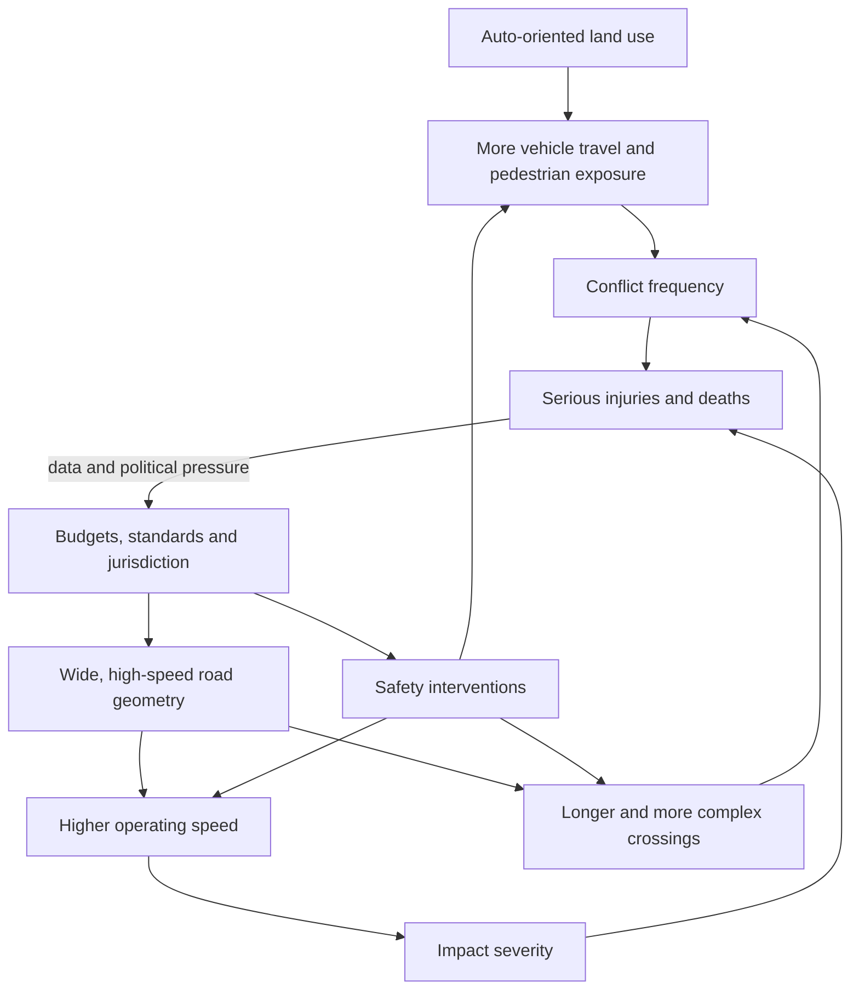

# Safe streets and pedestrian risk

Road deaths arise from a transport system, not only from isolated mistakes by road users. Street geometry, operating speed, crossing distance, exposure, land use, vehicle dependence, enforcement, and institutional priorities shape how often conflicts occur and how severe their consequences become. The safe-streets principle is therefore to design predictable human error into a system that limits lethal outcomes rather than treating every death as an unforeseeable behavioral exception. (@CityNerd (Ray Delahanty | CityNerd) — "When Safety Is a Distant Afterthought", 2026-07-08, [link](https://www.youtube.com/watch?v=u629D488WrQ))

## The causal system

Speed and pedestrian comfort are design trade-offs, especially where a street is engineered for motor-vehicle capacity and access. The 2026 *Dangerous by Design* report’s thesis, as presented in the source, is that US streets commonly prioritize vehicle speed and convenience over the safety of everyone using them. This is a system-level explanation, not a claim that behavior is irrelevant: alcohol, distraction, and risky choices occur in peer countries too, while their systems produce fewer deaths. (@CityNerd (Ray Delahanty | CityNerd) — "When Safety Is a Distant Afterthought", 2026-07-08, [link](https://www.youtube.com/watch?v=u629D488WrQ))

Between 2009 and 2024, US pedestrian fatalities reportedly increased 72%, faster than both population and vehicle-miles traveled. The report uses per-capita rates to represent the total social burden, whereas per-vehicle-mile rates answer the narrower question of risk per unit of driving. Both denominators can be useful, but per-mile normalization can obscure the contribution of a system that induces unusually large amounts of driving. (@CityNerd (Ray Delahanty | CityNerd) — "When Safety Is a Distant Afterthought", 2026-07-08, [link](https://www.youtube.com/watch?v=u629D488WrQ))

## Urban form, jurisdiction, and unequal risk

The report’s 20 highest-rate metropolitan areas were all in the Sunbelt, including inland California metros. Ray Delahanty proposes that much of this pattern reflects development timing: metropolitan growth after mass automobile adoption embedded high-speed roads, dispersed destinations, and weaker legacy transit and pedestrian networks. This is a plausible and explicitly attributed interpretation of a geographic pattern, not a controlled causal analysis; climate, income, road law, vehicle fleet, state policy, and demographic differences may also contribute. (@CityNerd (Ray Delahanty | CityNerd) — "When Safety Is a Distant Afterthought", 2026-07-08, [link](https://www.youtube.com/watch?v=u629D488WrQ))

Road ownership matters because standards and budgets differ by jurisdiction. In 2024, 57% of all US roadway fatalities reportedly occurred on state-owned facilities, which the source connects to state design standards that are often less forgiving to people outside vehicles. The source also reports unequal pedestrian mortality by race and ethnicity, and that adults over 65 accounted for 23% of pedestrian deaths while comprising 18% of the population. These descriptive disparities identify where investigation and investment are needed; they do not by themselves isolate exposure, infrastructure quality, age-related vulnerability, neighborhood disinvestment, or other causal contributions. (@CityNerd (Ray Delahanty | CityNerd) — "When Safety Is a Distant Afterthought", 2026-07-08, [link](https://www.youtube.com/watch?v=u629D488WrQ))

## Interventions and comparative evidence

Street design is modifiable even in auto-era cities. Albuquerque’s Central Avenue was redesigned with a bus rapid transit project that reassessed the balance among traffic flow, pedestrian safety, and transit access; the source reports a subsequent 60% reduction in serious injuries and fatalities. The before–after association is encouraging and intervention-specific, but the transcript does not give dates, comparison corridors, traffic changes, regression-to-the-mean analysis, or uncertainty, so the causal strength cannot be fully assessed here. (@CityNerd (Ray Delahanty | CityNerd) — "When Safety Is a Distant Afterthought", 2026-07-08, [link](https://www.youtube.com/watch?v=u629D488WrQ))

International comparison strengthens the system argument. Across 34 peer nations, the United States is reported to have much worse fatality trends; Canada’s roadway fatality rate is less than half the US rate despite geographic, cultural, and development similarities. Cell phones, alcohol, bad behavior, weather, and pandemic disruption are not uniquely American exposures, so they cannot alone explain the outlier. Cross-national comparisons remain observational, but the breadth of the difference makes national policy, street design, vehicle dependence, regulation, and enforcement credible explanatory targets. (@CityNerd (Ray Delahanty | CityNerd) — "When Safety Is a Distant Afterthought", 2026-07-08, [link](https://www.youtube.com/watch?v=u629D488WrQ))

The United States has previously reduced risk through politically difficult system changes, including required seat belts in new vehicles beginning in 1968, lower speed limits, and a higher drinking age. The source’s policy position is that street-safety treatments should likewise be treated as core design obligations, not optional add-ons siloed in small safety programs. That is a normative prioritization of life over some vehicle-speed, capacity, cost, and convenience objectives; the evidence cited supports the existence of preventable risk but does not specify the optimal treatment for every street. (@CityNerd (Ray Delahanty | CityNerd) — "When Safety Is a Distant Afterthought", 2026-07-08, [link](https://www.youtube.com/watch?v=u629D488WrQ))

## Practical implications

- **Continuously in design and resurfacing: set safety as a primary constraint, then select geometry and operating speeds for the most vulnerable expected users — strong system rationale; treatment-specific evidence varies.** Do not rely on posted rules while retaining a road shape that rewards dangerous speed. (@CityNerd (Ray Delahanty | CityNerd) — "When Safety Is a Distant Afterthought", 2026-07-08, [link](https://www.youtube.com/watch?v=u629D488WrQ))
- **Annually and in every capital plan: map deaths and serious injuries by facility owner, age, race or ethnicity, neighborhood, road type, and exposure where available — strong descriptive practice.** Audit whether safety investment reaches the corridors and populations bearing the greatest burden. (@CityNerd (Ray Delahanty | CityNerd) — "When Safety Is a Distant Afterthought", 2026-07-08, [link](https://www.youtube.com/watch?v=u629D488WrQ))
- **After each redesign: evaluate serious injuries and deaths with multiple pre- and post-intervention years and suitable comparisons — moderate-to-strong evaluation principle.** Also track speeds, crossings, walking, transit use, and traffic diversion so a favorable outcome can be interpreted. (@CityNerd (Ray Delahanty | CityNerd) — "When Safety Is a Distant Afterthought", 2026-07-08, [link](https://www.youtube.com/watch?v=u629D488WrQ))
- **At state and federal budget cycles: compare safety funding with the scale of harm and make responsibility explicit across jurisdictions — moderate policy implication.** Small isolated programs cannot compensate if routine standards and larger capacity budgets reproduce high-risk roads. (@CityNerd (Ray Delahanty | CityNerd) — "When Safety Is a Distant Afterthought", 2026-07-08, [link](https://www.youtube.com/watch?v=u629D488WrQ))

## Gaps & open questions

- How much of the Sunbelt pattern is explained by road geometry, vehicle travel, land use, speed, poverty, climate, fleet mix, and state policy?
- Which design changes produced the reported Central Avenue reduction, and how robust is the estimate to traffic and temporal confounding?
- How do fatality disparities change after exposure, trip distance, walking frequency, age, disability, and roadway type are measured?
- Which state-owned facility types account for the greatest preventable risk, and which standards should change first?
- What combination of street design, vehicle regulation, enforcement, transit, and land-use reform explains the gap between the United States and Canada?
- How should agencies value small travel-time increases against reductions in death and serious injury?

## Related

[[intercity-travel-generalized-cost]] · [[transit-capacity-and-service-design]]
