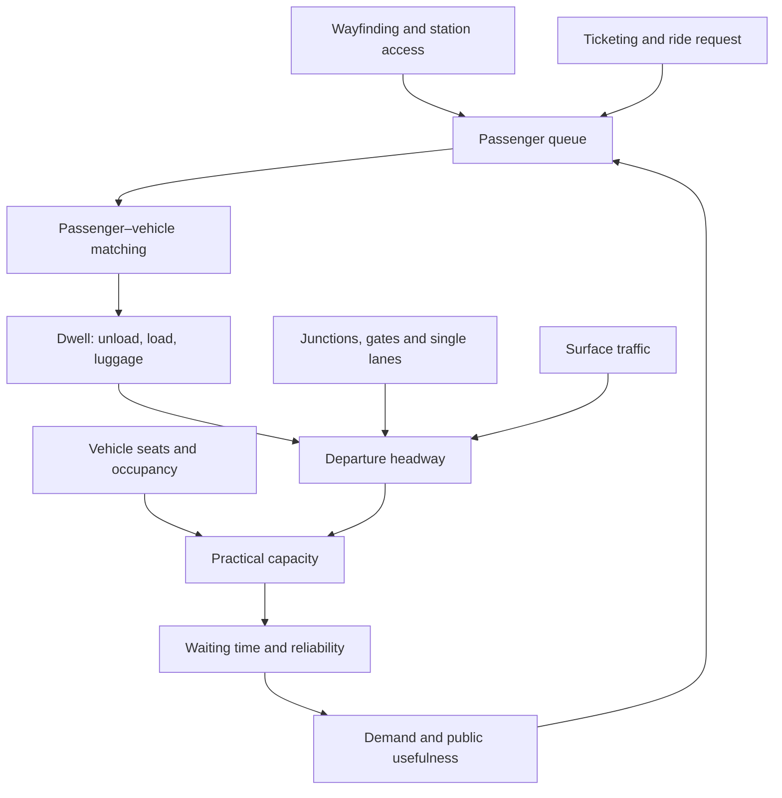

# Transit capacity and service design

A passenger-transport system is not defined by its vehicle or guideway alone. Its useful performance emerges from the interaction of station visibility, ticketing, passenger–vehicle assignment, boarding and unloading, vehicle occupancy, headway, junction control, right-of-way separation, reliability, accessibility, and network coverage. Novel hardware cannot compensate for an operating process whose dwell times and passenger decisions do not scale. (@CityNerd (Ray Delahanty | CityNerd) — "The Newest Vegas Loop Stations Will Blow Your Mind", 2026-07-15, [link](https://www.youtube.com/watch?v=e7vFCP3PtuA))

## The capacity chain

Practical throughput is bounded by the slowest recurring operation. Small vehicles require many departures to move large volumes; long or variable dwell times, ambiguous queues, luggage handling, empty repositioning, and conflicts at single-lane sections reduce achievable departures. In observations at the Vegas Loop’s Fontainebleau and Resorts World stops, passengers struggled to identify who had priority for arriving cars, a driver left the vehicle to explain ticketing, one vehicle remained with its hatch open for about four minutes, and another unloaded without collecting waiting riders. These are anecdotal observations rather than a capacity study, but each identifies a real term that a defensible throughput model must measure. (@CityNerd (Ray Delahanty | CityNerd) — "The Newest Vegas Loop Stations Will Blow Your Mind", 2026-07-15, [link](https://www.youtube.com/watch?v=e7vFCP3PtuA))

The system’s stated future ambition of 90,000 passengers per hour is not validated by the observed operation. Capacity claims require declared assumptions for passengers per vehicle, sustained headway, dwell-time distribution, junction conflicts, vehicle circulation, failures, and station demand imbalance. A peak theoretical product of seats and departures is not equivalent to sustained network throughput. (@CityNerd (Ray Delahanty | CityNerd) — "The Newest Vegas Loop Stations Will Blow Your Mind", 2026-07-15, [link](https://www.youtube.com/watch?v=e7vFCP3PtuA))

## Legibility is part of service

Wayfinding changes effective access time and determines whether a prospective rider can use the system at all. The Fontainebleau station was absent from interior signs until an escalator near the destination, while the airport pickup was an unmarked curb that the observer found only through web search and confirmation from security. The app reported limited availability, and the arriving driver had to cross a service road to locate the passenger. These observations show a broken information chain: the physical service existed, but the interface did not reliably connect traveler, stop, ticket, and vehicle. (@CityNerd (Ray Delahanty | CityNerd) — "The Newest Vegas Loop Stations Will Blow Your Mind", 2026-07-15, [link](https://www.youtube.com/watch?v=e7vFCP3PtuA))

Accessibility and maintenance are also operating capacity, not cosmetic extras. Nonoperating escalators can lengthen or prevent station access for some users. Likewise, a connection described as a station may merely be a loading zone: the Fontainebleau vehicles used a parking garage and public streets to reach a tunnel portal, and the observed airport trip used surface roads for most of its route before entering a single-lane tunnel section controlled by crossing gates. Surface mixing reintroduces congestion and travel-time variability that a separated guideway is meant to avoid. (@CityNerd (Ray Delahanty | CityNerd) — "The Newest Vegas Loop Stations Will Blow Your Mind", 2026-07-15, [link](https://www.youtube.com/watch?v=e7vFCP3PtuA)) [[intercity-travel-generalized-cost]]

## Promised service, delivered service, and accountability

The observed airport-to-Resorts World trip took 16 minutes in light traffic, not the advertised five-minute airport-to-convention-center tunnel ride; the fare observed was $12 rather than the $10 offer the source had seen. Because the endpoints differ slightly and this is one trip, it does not quantify normal performance, but it does establish that the service then sold included substantial conventional street travel. (@CityNerd (Ray Delahanty | CityNerd) — "The Newest Vegas Loop Stations Will Blow Your Mind", 2026-07-15, [link](https://www.youtube.com/watch?v=e7vFCP3PtuA))

Ray Delahanty’s distinctive critique is that private branding can weaken scrutiny even when public-interest institutions and revenues are involved. He reports that the Las Vegas Convention and Visitors Authority, funded largely by hotel-room taxes, paid about $47 million for the original three-station system and about $5 million for operations and maintenance; later resort stations and tunnels were described as privately financed by resorts and The Boring Company respectively. These figures are the presenter’s documentary reading, not an audited cost allocation, but they make “privately funded” an inadequate substitute for examining who pays, who bears risk, what was promised, and what service is delivered. (@CityNerd (Ray Delahanty | CityNerd) — "The Newest Vegas Loop Stations Will Blow Your Mind", 2026-07-15, [link](https://www.youtube.com/watch?v=e7vFCP3PtuA))

## Evidence and interpretation

The source supplies unusually concrete field observations of passenger interaction, dwell, wayfinding, and one airport trip, but no systematic sample, operating log, audited financial record, safety assessment, or peak-demand test. It strongly supports identifying failure modes and testing advertised claims; it weakly supports estimates of average reliability or maximum capacity. The projected 68-mile, 104-station network and a rough extrapolation to a 2076 completion date are useful markers of the gap between ambition and observed build-out, but a linear extrapolation from eight stations over four years is rhetorical rather than a construction forecast. (@CityNerd (Ray Delahanty | CityNerd) — "The Newest Vegas Loop Stations Will Blow Your Mind", 2026-07-15, [link](https://www.youtube.com/watch?v=e7vFCP3PtuA))

## Practical implications

- **Before opening and quarterly thereafter: test the complete passenger journey with unfamiliar users, including wayfinding, payment, queue order, luggage, accessibility, and disrupted service — moderate from observed failure modes.** Record task completion, assistance requests, dwell times, and abandonment. (@CityNerd (Ray Delahanty | CityNerd) — "The Newest Vegas Loop Stations Will Blow Your Mind", 2026-07-15, [link](https://www.youtube.com/watch?v=e7vFCP3PtuA))
- **For every capacity claim: publish assumptions and sustained results at station and network level — strong engineering-accounting principle.** Measure occupancy, headway and dwell distributions, empty movements, junction delay, failures, and peak demand rather than citing an unsupported headline throughput. (@CityNerd (Ray Delahanty | CityNerd) — "The Newest Vegas Loop Stations Will Blow Your Mind", 2026-07-15, [link](https://www.youtube.com/watch?v=e7vFCP3PtuA))
- **Monthly during phased service: report how much of each advertised route uses exclusive guideway versus public streets — strong transparency principle, direct case support.** Compare actual travel-time distributions with advertised times and disclose temporary routing. (@CityNerd (Ray Delahanty | CityNerd) — "The Newest Vegas Loop Stations Will Blow Your Mind", 2026-07-15, [link](https://www.youtube.com/watch?v=e7vFCP3PtuA))
- **At procurement and annual review: evaluate public exposure and delivered outcomes regardless of operator ownership — moderate.** Include tax-funded capital or operations, subsidy per trip, safety, accessibility, maintenance, construction progress, and opportunity cost. (@CityNerd (Ray Delahanty | CityNerd) — "The Newest Vegas Loop Stations Will Blow Your Mind", 2026-07-15, [link](https://www.youtube.com/watch?v=e7vFCP3PtuA))

## Gaps & open questions

- What sustained passenger throughput can the current stations and junctions achieve under event demand?
- What are the distributions of dwell time, wait time, occupancy, empty vehicle movement, and surface-road delay?
- Which parts of the planned network are funded, permitted, under construction, tunneled, or operating, and against what baseline schedule?
- How much public money, land, regulatory support, and operating risk is involved across all entities?
- Can automated operation resolve matching and labor constraints without creating new safety, exception-handling, or accessibility problems?
- How will emergency evacuation, fire response, ventilation, and single-lane failures perform at proposed scale?

## Related

[[intercity-travel-generalized-cost]] · [[safe-streets-and-pedestrian-risk]] · [[automation-employment-and-population]]
