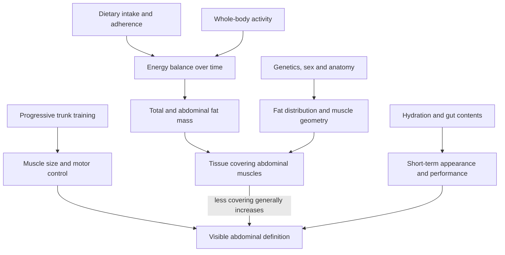

# Abdominal definition and training

Visible abdominal definition is the joint result of abdominal muscle size, the thickness and distribution of tissue covering the muscles, anatomy, and presentation. Training can enlarge and control the trunk musculature, but it does not selectively remove the overlying fat; sustained nutrition and activity patterns act on whole-body energy balance, while genetics and sex influence where fat is stored and how the tendinous intersections of the rectus abdominis appear. The practical consequence is that an abdominal program and a fat-loss diet solve different parts of the problem. (@athleanx (ATHLEAN-X™) — "I'm 51. Here's How I Still Have Visible Abs (WORKS AT ANY AGE)", 2026-08-04, [link](https://www.youtube.com/watch?v=ZOMKA0qCQ_w)) [[energy-balance-and-calorie-counting]]

## Training the abdominal wall

The rectus abdominis flexes the trunk by reducing the distance between the rib cage and pelvis. In a top-down curl, useful motion therefore comes from lifting the shoulder blades and flexing the trunk rather than merely nodding the neck. In a bottom-up curl, posterior pelvic motion and spinal flexion distinguish an abdominal repetition from simply moving the legs at the hip. Slow, controlled repetitions can make the intended motion easier to verify, but counting contractions instead of repetitions is a coaching cue rather than evidence that repetition targets are unimportant. (@athleanx (ATHLEAN-X™) — "I'm 51. Here's How I Still Have Visible Abs (WORKS AT ANY AGE)", 2026-08-04, [link](https://www.youtube.com/watch?v=ZOMKA0qCQ_w)) [[trunk-training]]

Bottom-up variations generally impose a larger limb lever than simple top-down curls. Placing the more demanding movement first, then combined upper-and-lower movements, and finally simpler top-down work is one fatigue-management strategy. It is not a universal anatomical requirement: exercise order should follow the session priority, technical difficulty, and the person’s ability to maintain the intended trunk motion. (@athleanx (ATHLEAN-X™) — "I'm 51. Here's How I Still Have Visible Abs (WORKS AT ANY AGE)", 2026-08-04, [link](https://www.youtube.com/watch?v=ZOMKA0qCQ_w))

The obliques contribute rotation and lateral control, the serratus anterior moves and stabilizes the scapula, and the transversus abdominis contributes to abdominal-wall tension. Exhaling while narrowing the abdominal wall can cue trunk control, while exercises combining rotation with scapular protraction can train the obliques and serratus. Claims that this breathing cue prevents a bloated-looking abdomen or that squeezing the adductors selectively recruits lower abdominal fibers are plausible coaching hypotheses in the source, not demonstrated comparative findings. (@athleanx (ATHLEAN-X™) — "I'm 51. Here's How I Still Have Visible Abs (WORKS AT ANY AGE)", 2026-08-04, [link](https://www.youtube.com/watch?v=ZOMKA0qCQ_w))

The abdominal wall is trainable tissue, so appearance can change through hypertrophy as well as fat loss. The limited direct imaging literature summarized by Galpin reports roughly 10–20% increases in abdominal muscle thickness across heterogeneous 6–12-week interventions, including electrical stimulation, Pilates, and other training models; that range supports trainability but does not establish an optimal exercise. Applying general hypertrophy principles, he proposes roughly 10–20 hard weekly sets per target muscle, divided over two to four sessions, typically ending around one to two repetitions in reserve. This dose is an extrapolation from broader hypertrophy evidence, not an abdominal-specific comparative trial. (@drandygalpin (Andy Galpin) — "How to Train for More Defined & Visible Abs | Dr. Andy Galpin", 2026-07-21, [link](https://www.youtube.com/watch?v=AnanhBxerfc))

Exercise selection should cover both visible and deep functions. Rectus-focused flexion can increase the most visually prominent tissue; oblique loading develops lateral and rotational capacity; and transversus-abdominis control may change abdominal-wall positioning without being directly visible. Compound movements permit high whole-body loading, whereas isolation movements can bring a trunk muscle near failure without a limb muscle ending the set first. Galpin's aesthetic template is an approximately even split between compound and isolation work and between movement-producing and anti-movement tasks, but this is an attributed rationale rather than a tested optimum. Posture and rib–pelvis position can also change appearance immediately without changing fat or muscle; claims that hip-flexor tightness or an underdeveloped diaphragm is the cause require individual assessment rather than visual diagnosis. (@drandygalpin (Andy Galpin) — "How to Train for More Defined & Visible Abs | Dr. Andy Galpin", 2026-07-21, [link](https://www.youtube.com/watch?v=AnanhBxerfc))

## Nutrition, hydration, and adherence

A simple plate heuristic can allocate the largest share to fibrous vegetables, a substantial share to protein, and a smaller share to starchy carbohydrate, with fats used deliberately. It may reduce decision burden and energy density without calorie counting, but its effectiveness still depends on portion size, food choices, energy needs, and adherence; starch and fruit do not need to be eliminated to reveal abdominal definition. (@athleanx (ATHLEAN-X™) — "I'm 51. Here's How I Still Have Visible Abs (WORKS AT ANY AGE)", 2026-08-04, [link](https://www.youtube.com/watch?v=ZOMKA0qCQ_w)) [[satiety-oriented-diet-design]]

Enjoyment is part of adherence. A planned, portioned food that satisfies a preference may make a sustainable pattern easier to maintain than rigid avoidance, whereas extreme rules aimed at ordinary fruit or vegetables distract from larger energy sources and habitual patterns. Drinking water on waking can help a person establish a hydration routine, but a fixed 16–20-ounce morning dose is a habit prescription rather than a demonstrated requirement for fat loss. (@athleanx (ATHLEAN-X™) — "I'm 51. Here's How I Still Have Visible Abs (WORKS AT ANY AGE)", 2026-08-04, [link](https://www.youtube.com/watch?v=ZOMKA0qCQ_w)) [[performance-nutrition-and-hydration]]

Green-tea extract, red-pepper flakes, cinnamon, and ginger are presented as small additions that might affect appetite, metabolism, insulin response, or soreness. The transcript supplies no trial details, effect sizes, doses, or safety assessment, and it states that ginger decreases insulin sensitivity even though that direction would ordinarily be metabolically undesirable. These ingredients should therefore not be treated as established fat-loss tools, and concentrated extracts belong under the same product-quality and interaction scrutiny as other supplements. (@athleanx (ATHLEAN-X™) — "I'm 51. Here's How I Still Have Visible Abs (WORKS AT ANY AGE)", 2026-08-04, [link](https://www.youtube.com/watch?v=ZOMKA0qCQ_w)) [[supplement-evidence-and-safety]]

## Practical implications

- **At two or three weekly trunk sessions: train multiple functions and use controlled spinal or pelvic motion when flexion is the goal — moderate biomechanical rationale, limited comparative evidence for the specific sequence.** Put the highest-priority or hardest technically stable movement first, stop a set when limb momentum replaces trunk motion, and progress range, load, or repetitions over time. (@athleanx (ATHLEAN-X™) — "I'm 51. Here's How I Still Have Visible Abs (WORKS AT ANY AGE)", 2026-08-04, [link](https://www.youtube.com/watch?v=ZOMKA0qCQ_w))
- **At most meals during an intentional fat-loss phase: use a repeatable plate structure emphasizing vegetables and protein while retaining portions of preferred carbohydrate and fat — moderate as an adherence and energy-density strategy, not a guarantee of a deficit.** Review the multiweek weight and waist trend and adjust portions if the intended change is not occurring. (@athleanx (ATHLEAN-X™) — "I'm 51. Here's How I Still Have Visible Abs (WORKS AT ANY AGE)", 2026-08-04, [link](https://www.youtube.com/watch?v=ZOMKA0qCQ_w))
- **Daily: hydrate to thirst, environment, and training demand; a morning glass is optional — strong that hydration supports performance, weak for the fixed morning ritual.** Do not use dehydration or acute fasting to judge durable abdominal definition. (@athleanx (ATHLEAN-X™) — "I'm 51. Here's How I Still Have Visible Abs (WORKS AT ANY AGE)", 2026-08-04, [link](https://www.youtube.com/watch?v=ZOMKA0qCQ_w))
- **Do not rely on culinary spices or concentrated extracts as the main fat-loss intervention — strong caution, weak efficacy evidence in this source.** Treat any effect as marginal until a product, dose, outcome, and safety profile are established. (@athleanx (ATHLEAN-X™) — "I'm 51. Here's How I Still Have Visible Abs (WORKS AT ANY AGE)", 2026-08-04, [link](https://www.youtube.com/watch?v=ZOMKA0qCQ_w))
- **For abdominal hypertrophy: distribute progressive, near-failure work across two to four weekly sessions rather than defaulting to easy daily repetitions — moderate extrapolation, limited direct abdominal evidence.** Combine loaded flexion, oblique work, deep-wall control, and anti-movement tasks; use roughly 10–20 weekly sets only as a starting range that must be adjusted to recovery. (@drandygalpin (Andy Galpin) — "How to Train for More Defined & Visible Abs | Dr. Andy Galpin", 2026-07-21, [link](https://www.youtube.com/watch?v=AnanhBxerfc))

## Gaps & open questions

- Which exercise order best improves abdominal hypertrophy when weekly volume, effort, and progression are matched?
- Do adductor co-contraction or abdominal-wall narrowing cues change regional rectus activation, hypertrophy, appearance, or only task execution?
- How much do sustainable plate heuristics improve long-term adherence compared with calorie tracking or other dietary structures?
- What proportion of short-term waist and appearance change reflects fat, muscle, hydration, gut contents, posture, or lighting?
- Do any of the named spices or extracts produce clinically meaningful fat loss at tolerable, well-characterized doses?
- Which abdominal exercises, weekly volumes, frequencies, and compound-to-isolation ratios maximize hypertrophy when effort is matched?
- Does transversus-abdominis training produce durable changes in resting abdominal contour, particularly postpartum, independent of posture and fat mass?

## Related

[[trunk-training]] · [[exercise-program-design]] · [[satiety-oriented-diet-design]] · [[energy-balance-and-calorie-counting]] · [[performance-nutrition-and-hydration]] · [[supplement-evidence-and-safety]] · [[practice-playbook]] · [[aging-model]]
