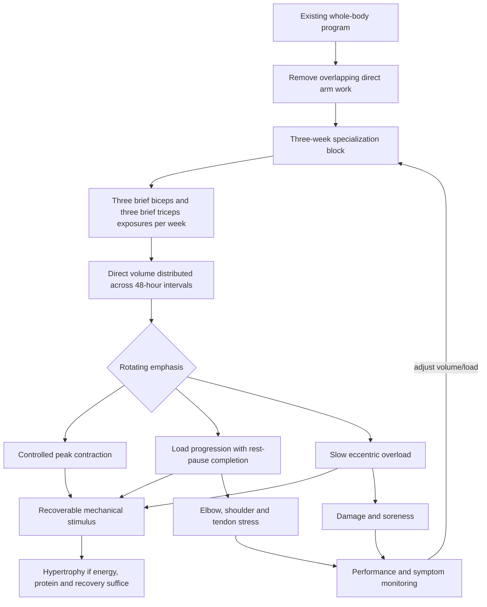

# Arm hypertrophy specialization

Arm hypertrophy specialization temporarily reallocates training volume and recovery toward the elbow flexors and extensors. The biceps brachii flexes the elbow and supinates the forearm; the brachialis is a strong elbow flexor regardless of forearm rotation; and the three triceps heads extend the elbow, with the long head also crossing the shoulder. Exercise selection can bias joint position and loading, but all-or-none claims about isolating one head exceed what technique alone can establish. (@athleanx (ATHLEAN-X™) — "How to Get 'Bigger Arms' Fast (22 DAYS | NO B.S)", 2026-07-19, [link](https://www.youtube.com/watch?v=CTblai7olJo))

## The 22-day protocol

The source proposes baseline measurement on day 1, alternating one-exercise biceps and triceps sessions on six consecutive days, one rest day, and repeating this pattern for three weeks before remeasurement on day 22. Each muscle receives three direct sessions per week, generally separated by about 48 hours. When added to an existing program, direct arm work is removed but compound pulling and pressing remain, and the specialization work is placed after the main session. This controls some duplicate volume, but compound work still contributes meaningful elbow-flexor and extensor fatigue. (@athleanx (ATHLEAN-X™) — "How to Get 'Bigger Arms' Fast (22 DAYS | NO B.S)", 2026-07-19, [link](https://www.youtube.com/watch?v=CTblai7olJo)) [[training-frequency-and-hypertrophy]]

The first weekly exposure emphasizes a controlled shortened-position contraction using an incline waiter curl for biceps and a bench dip for triceps, four sets to technical failure. In weeks two and three, three and then six short pulses are added to each repetition. These partials increase work in a shortened position, but the transcript provides no comparison showing that escalating pulses improves hypertrophy or mind–muscle connection beyond ordinary full-range training. The proposed outward-turned hand position in the bench dip is intended to reduce shoulder internal rotation; it does not establish that bench dips are safe or suitable for every shoulder. (@athleanx (ATHLEAN-X™) — "How to Get 'Bigger Arms' Fast (22 DAYS | NO B.S)", 2026-07-19, [link](https://www.youtube.com/watch?v=CTblai7olJo))

The second exposure targets arm width with cross-body hammer curls and either triceps pushdowns or a close, thumbs-up dumbbell press, four sets of 12. The load rises by five pounds in week two and ten pounds above baseline in week three; brief 10–15-second rest-pause intervals are used until the prescribed repetitions are completed. A neutral rather than supinated curl grip plausibly shifts relative demand toward the brachialis, while controlled elbow extension ensures completion of the triceps’ primary joint action. Fixed five-pound jumps, however, represent very different proportional increases for different trainees and can turn progression into fatigue accumulation. (@athleanx (ATHLEAN-X™) — "How to Get 'Bigger Arms' Fast (22 DAYS | NO B.S)", 2026-07-19, [link](https://www.youtube.com/watch?v=CTblai7olJo))

The third exposure uses eccentric overload immediately before the weekly rest day: a momentum-assisted curl with a controlled three-second lowering and a PJR pullover in which other muscles help return the dumbbell before the triceps control the descent. Lowering duration rises to four seconds in week two and begins at five seconds before descending to four and three seconds in week three. Assisted concentric phases can expose a muscle to a heavier eccentric load, but training to loss of eccentric control increases fatigue and soreness and is not required for hypertrophy. (@athleanx (ATHLEAN-X™) — "How to Get 'Bigger Arms' Fast (22 DAYS | NO B.S)", 2026-07-19, [link](https://www.youtube.com/watch?v=CTblai7olJo)) [[tendon-adaptation-and-rehabilitation]]

## What the protocol can and cannot establish

The program combines higher frequency, distributed direct volume, proximity to failure, rest-pause work, partial repetitions, load progression, and eccentric overload. Any change cannot be attributed to one mechanism. The transcript presents no participant data or controlled trial, so the guarantee of noticeably larger arms in 22 days is promotional rather than evidentiary. Short-term tape measurements also respond to landmark placement, muscle pump, inflammation, glycogen, and hydration; measuring after comparable rest and under standardized conditions reduces but does not remove this uncertainty. (@athleanx (ATHLEAN-X™) — "How to Get 'Bigger Arms' Fast (22 DAYS | NO B.S)", 2026-07-19, [link](https://www.youtube.com/watch?v=CTblai7olJo))

## Practical implications

- **For an optional three-week specialization block: redistribute existing direct arm volume across up to three weekly sessions per muscle instead of simply adding six sessions — moderate for volume distribution, very low for this exact protocol.** Keep compound training in the recovery calculation and return to ordinary programming after the block. (@athleanx (ATHLEAN-X™) — "How to Get 'Bigger Arms' Fast (22 DAYS | NO B.S)", 2026-07-19, [link](https://www.youtube.com/watch?v=CTblai7olJo))
- **Each session: use one clear progression variable and retain technically controlled repetitions — moderate general hypertrophy evidence, weak for fixed pulses and five-pound weekly jumps.** Scale load changes proportionally and stop rest-pause work if joint position or range deteriorates. (@athleanx (ATHLEAN-X™) — "How to Get 'Bigger Arms' Fast (22 DAYS | NO B.S)", 2026-07-19, [link](https://www.youtube.com/watch?v=CTblai7olJo))
- **Place unusually demanding eccentric work before at least one recovery day and use it sparingly — moderate fatigue-management rationale, limited evidence that slow lowering is superior when volume is matched.** Reduce or omit it when soreness impairs subsequent training or elbow and shoulder symptoms rise. (@athleanx (ATHLEAN-X™) — "How to Get 'Bigger Arms' Fast (22 DAYS | NO B.S)", 2026-07-19, [link](https://www.youtube.com/watch?v=CTblai7olJo))
- **Measure before and after only under matched conditions — strong measurement principle.** Use the same arm, landmark, tape tension, hydration state, time of day, and distance from the last session, and interpret 22-day change cautiously. (@athleanx (ATHLEAN-X™) — "How to Get 'Bigger Arms' Fast (22 DAYS | NO B.S)", 2026-07-19, [link](https://www.youtube.com/watch?v=CTblai7olJo))

## Gaps & open questions

- Does this six-day alternating schedule outperform the same weekly sets delivered in fewer sessions?
- Do shortened-position pulses, mind–muscle cues, or deliberately slow eccentrics add hypertrophy after effort, range, and volume are matched?
- What direct volume remains recoverable when compound pressing and pulling are retained?
- How much apparent arm growth after 22 days reflects contractile tissue rather than fluid, glycogen, inflammation, or measurement error?
- Which shoulder and elbow histories make bench dips, cheat curls, or heavy pullovers poor choices?

## Related

[[training-frequency-and-hypertrophy]] · [[tendon-adaptation-and-rehabilitation]] · [[performance-nutrition-and-hydration]] · [[strength-transfer-and-exercise-specificity]] · [[practice-playbook]] · [[aging-model]]
