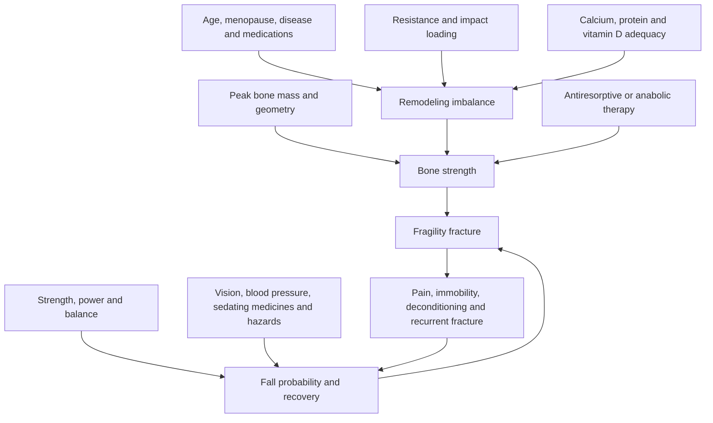

# Bone health, osteoporosis, and fracture prevention

Osteoporosis is a disorder of reduced bone strength caused by low bone mass, disrupted microarchitecture, or both. Its clinically important outcome is fragility fracture—not a low scan number by itself. Fracture risk emerges from three interacting systems: the strength of the skeleton, the probability and direction of a fall or other load, and the body's capacity to absorb or arrest that event. Bone mineral density (BMD), muscle strength, balance, vision, medications, prior fractures, and the home environment therefore belong in one model.[^leboff-2022]

[[bone-remodeling-and-mechanical-loading]] explains how osteocytes sense strain and coordinate osteoblast and osteoclast activity. This chapter adds the clinical layer: identifying high risk, preventing falls, selecting outcome-proven treatment, and avoiding unsafe interruption.

## Bone density is a risk measure, not the whole disease

Dual-energy x-ray absorptiometry (DXA) estimates areal BMD. In postmenopausal women and men aged 50 or older, a T-score at or below −2.5 at the femoral neck, total hip, or lumbar spine meets the densitometric definition of osteoporosis; −1.0 to −2.5 is called low bone mass or osteopenia. However, most fractures occur above −2.5 because many people occupy that range and because falls, frailty, prior fracture, and bone quality add risk. A hip or vertebral fragility fracture can establish a treatment indication regardless of T-score.[^leboff-2022]

FRAX and similar tools combine clinical risk factors with or without femoral-neck BMD to estimate 10-year hip and major osteoporotic fracture probability. They support decisions but do not measure bone microarchitecture, fall exposure, or every secondary cause. In the United States, BHOF uses thresholds of at least 3% 10-year hip-fracture risk or at least 20% major osteoporotic-fracture risk as one treatment route for adults 50 or older with osteopenia; these thresholds are policy and context dependent, not biological cliffs.[^leboff-2022]

## Who should be screened

The 2025 USPSTF recommends osteoporosis screening for all women aged 65 years or older and for postmenopausal women younger than 65 who are at increased risk on clinical assessment. It found insufficient evidence to determine the benefit–harm balance of population screening in men; that is an evidence gap, not a recommendation against evaluation. The recommendation applies to people without a prior fragility fracture or a condition or medicine already placing them at secondary-osteoporosis risk.[^uspstf-screening-2025]

Risk-triggered evaluation is appropriate earlier or outside this population when there is a low-trauma fracture, substantial height loss or suspected vertebral fracture, prolonged systemic glucocorticoid exposure, low body weight, hypogonadism or early menopause, malabsorption, rheumatoid arthritis, hyperparathyroidism, chronic kidney or liver disease, eating disorder or low energy availability, or another bone-active disease or medication. A workup asks why bone is weak; it is not just a scan order.

Repeat DXA intervals depend on baseline risk, measurement precision, age, and whether treatment has started. USPSTF found insufficient evidence for one universal screening interval, while BHOF suggests reassessing BMD about 1–2 years after initiating or changing osteoporosis medication and then individualizing.[^uspstf-screening-2025][^leboff-2022]

## Prevention before and after a diagnosis

### Mechanical loading and physical reserve

Bone adapts locally to unusual strain, so progressive resistance and impact loading produce site-specific, generally modest BMD changes. A 2023 meta-analysis of 80 controlled trials involving 5,581 postmenopausal women found small favorable standardized effects at the lumbar spine, femoral neck, and total hip, with substantial variation among protocols; BMD was the outcome, not fracture.[^kemmler-2023] Exercise also builds strength, power, gait, and balance, which can prevent the fall that converts low bone strength into injury.

For community-dwelling adults aged 65 or older at increased fall risk, the 2024 USPSTF recommends exercise interventions. Its evidence review estimated 107 fewer falls, 22 fewer people experiencing a fall, and 27 fewer injurious falls per 1,000 participants; fracture-specific reductions were not established. Programs most often combined gait, balance, functional, and resistance training.[^uspstf-falls-2024] Known osteoporosis, vertebral fracture, joint disease, or poor balance changes exercise selection: unsupervised jumping or loaded spinal flexion is not a universal prescription.

### Nutrition and exposures

Calcium, vitamin D, protein, and energy are necessary substrates, but more substrate does not substitute for loading or antifracture therapy. BHOF advises total calcium intake of 1,000 mg/day for men aged 50–70 and 1,200 mg/day for women 51 or older and men 71 or older, using supplements only when diet is insufficient.[^leboff-2022] This is an intake-adequacy recommendation for at-risk adults, not proof that routine supplements prevent fractures in calcium-replete community populations. USPSTF found no net benefit from low-dose calcium plus vitamin D for primary fracture prevention in community-dwelling postmenopausal women and noted more kidney stones; evidence for higher doses and other groups was insufficient.[^uspstf-supplements-2018]

Correct documented vitamin D deficiency, malnutrition, malabsorption, or low energy availability for their own indications. Avoid tobacco and heavy alcohol. Review medications that increase falls or bone loss, including sedatives and systemic glucocorticoids, without stopping necessary treatment unilaterally.

## Pharmacotherapy prevents fractures in selected high-risk people

Lifestyle measures remain important after diagnosis, but they do not replace medication when absolute fracture risk is high. ACP recommends bisphosphonates as initial pharmacologic treatment for postmenopausal women with primary osteoporosis (strong, high-certainty) and suggests them for men (conditional, low-certainty). Denosumab is a second-line option when bisphosphonates are contraindicated or not tolerated; anabolic or sclerostin therapy followed by a bisphosphonate is reserved for women at very high risk.[^qaseem-2023]

Absolute benefit depends on baseline risk. In the Fracture Intervention Trial, 2,027 women aged 55–81 with low femoral-neck BMD and an existing vertebral fracture were randomized for three years. Alendronate reduced new morphometric vertebral fractures from 15.0% to 8.0% and any clinical fracture from 18.2% to 13.6%; the absolute reductions were 7.0 and 4.6 percentage points, respectively.[^black-1996] In HORIZON, 2,127 adults treated within 90 days after surgical repair of a hip fracture had new clinical fractures in 13.9% with placebo versus 8.6% with yearly zoledronic acid over a median 1.9 years, an absolute reduction of 5.3 points; mortality was also lower, although the mortality mechanism was uncertain.[^lyles-2007]

These trial populations were high risk; their absolute benefits should not be transferred to a younger person with mild osteopenia. Conversely, a recent hip or vertebral fracture creates high near-term risk and should trigger prompt secondary-fracture evaluation rather than waiting for another DXA threshold.

## Drug classes, sequencing, and safety boundaries

- **Bisphosphonates** bind bone mineral and suppress osteoclast-mediated resorption. Oral agents require administration precautions; renal function, hypocalcemia, gastrointestinal tolerance, and rare atypical femoral fracture or jaw osteonecrosis risks influence selection and duration. Because they persist in bone, a monitored holiday may be considered after several years in people no longer at high risk; it is not automatic.[^leboff-2022]
- **Denosumab** inhibits RANKL and reduces vertebral, nonvertebral, and hip fractures, but its effect dissipates rapidly. Stopping or delaying it without follow-on antiresorptive therapy can cause rebound bone turnover and multiple vertebral fractures. FDA added a boxed warning for severe hypocalcemia in advanced chronic kidney disease, especially dialysis and CKD–mineral and bone disorder.[^leboff-2022][^fda-denosumab-2024]
- **Teriparatide and abaloparatide** stimulate bone formation when given intermittently; **romosozumab** increases formation and decreases resorption through sclerostin inhibition. They are time-limited options for very high risk and require subsequent antiresorptive therapy to preserve gains. Romosozumab selection includes cardiovascular-risk review.[^qaseem-2023]
- **Menopausal hormone therapy and selective estrogen-receptor modulators** can reduce certain fractures in selected postmenopausal women, but their non-skeletal risks, symptom indications, age, and time since menopause matter. MHT is not first-line osteoporosis treatment for everyone and should not be initiated solely from a low scan without individualized review ([[menopause-hormone-therapy]]).

Jaw osteonecrosis and atypical femoral fracture are real but rare at osteoporosis doses. They should prompt dental care, symptom counseling, and risk-stratified duration—not avoidance of treatment when ordinary fracture risk is much larger. New thigh or groin pain during long-term antiresorptive therapy warrants assessment.

## Secondary fracture prevention is a care pathway

A low-trauma hip, vertebral, wrist, proximal humerus, or pelvic fracture in later life is not merely an isolated accident. It should trigger evaluation for osteoporosis and secondary causes, fall-risk review, rehabilitation, adequate nutrition, and timely treatment when indicated. Fracture-liaison services coordinate this transition because many patients otherwise leave acute care without bone-directed follow-up.[^leboff-2022]

The loop matters: pain and immobility after fracture reduce muscle and confidence, which increases fall risk and the chance of another fracture. Rehabilitation, progressive loading, vision and footwear review, medication reconciliation, and home-hazard correction therefore complement bone-directed drugs rather than compete with them ([[muscle-strength-and-mortality]], [[daily-movement-mobility-and-pain]]).

## Evidence conflicts and limitations

Exercise reliably improves physical function and produces small, site-specific BMD effects, but trials are generally underpowered for fractures. Drug trials demonstrate fracture reduction, yet their participants often have lower BMD, older age, or prior fractures; absolute benefit is smaller at low baseline risk. FRAX thresholds and treatment sequences vary across countries and guidelines.

Screening evidence is strongest in postmenopausal women. The USPSTF evidence gap in men, limited trial representation of the very old, frail, kidney-impaired, or multimorbid, and uncertain optimal screening intervals constrain generalization.[^uspstf-screening-2025] DXA changes near the machine's least significant change may be measurement noise, and a stable BMD does not guarantee low fracture risk.

## Practical implications

- **Women aged 65 or older, and younger postmenopausal women with increased clinical risk, should receive guideline-based osteoporosis screening—strong.** Men and people with secondary causes need individualized evaluation because population-screening evidence is insufficient, not because risk is absent.[^uspstf-screening-2025]
- **Treat a fragility fracture as a sentinel event—strong.** Hip or vertebral fracture can justify osteoporosis treatment regardless of T-score; arrange secondary-cause, fall-risk, rehabilitation, and medication review promptly.[^leboff-2022]
- **Use progressive resistance, balance, gait, and appropriately scaled impact training—strong for function and fall reduction; moderate for BMD; uncertain for fracture reduction from bone loading alone.** People with established osteoporosis or fracture need individualized exercise selection.[^kemmler-2023][^uspstf-falls-2024]
- **Meet calcium, vitamin D, protein, and energy needs, preferably through food; correct deficiencies—strong for adequacy, not for megadosing.** Routine calcium/vitamin D supplementation has not shown primary fracture-prevention benefit in replete community-dwelling adults and can cause harm.[^leboff-2022][^uspstf-supplements-2018]
- **When fracture risk is high, discuss outcome-proven pharmacotherapy rather than relying on supplements or exercise alone—strong.** Bisphosphonates are usual first-line therapy; very-high-risk disease may justify anabolic-first sequencing.[^qaseem-2023][^black-1996][^lyles-2007]
- **Never stop denosumab or finish an anabolic/romosozumab course without a planned transition—strong safety boundary.** Advanced CKD requires specialist assessment because denosumab can cause severe hypocalcemia.[^leboff-2022][^fda-denosumab-2024]

## Gaps & open questions

- What screening strategy and interval best prevent fractures in men and in younger adults with competing secondary risks?
- Which exercise programs reduce fractures rather than only falls, strength deficits, or BMD loss?
- How should treatment be sequenced in very old, frail, kidney-impaired, or multimorbid adults excluded from pivotal trials?
- Which patients can safely take a bisphosphonate holiday, and what monitoring detects loss of protection early enough?
- How can fracture-liaison services and adherence support close the large post-fracture treatment gap?

## References

[^leboff-2022]: LeBoff MS, Greenspan SL, Insogna KL, et al. “The Clinician’s Guide to Prevention and Treatment of Osteoporosis.” *Osteoporosis International*, 2022. [professional-society clinical guideline]. [doi:10.1007/s00198-021-05900-y](https://doi.org/10.1007/s00198-021-05900-y)
[^uspstf-screening-2025]: US Preventive Services Task Force; Nicholson WK, Silverstein M, Wong JB, et al. “Screening for Osteoporosis to Prevent Fractures: US Preventive Services Task Force Recommendation Statement.” *JAMA*, 2025. [clinical guideline]. [USPSTF recommendation](https://www.uspreventiveservicestaskforce.org/uspstf/document/RecommendationStatementFinal/osteoporosis-screening)
[^kemmler-2023]: Kemmler W, Shojaa M, Kohl M, von Stengel S. “Exercise Training and Bone Mineral Density in Postmenopausal Women: An Updated Systematic Review and Meta-Analysis of Intervention Studies With Emphasis on Potential Moderators.” *Osteoporosis International*, 2023. [systematic review and meta-analysis of controlled trials]. [PubMed PMID: 36749350](https://pubmed.ncbi.nlm.nih.gov/36749350/)
[^uspstf-falls-2024]: US Preventive Services Task Force; Nicholson WK, Silverstein M, Wong JB, et al. “Interventions to Prevent Falls in Community-Dwelling Older Adults: US Preventive Services Task Force Recommendation Statement.” *JAMA*, 2024. [clinical guideline based on systematic review]. [USPSTF recommendation](https://www.uspreventiveservicestaskforce.org/uspstf/recommendation/falls-prevention-community-dwelling-older-adults-interventions)
[^uspstf-supplements-2018]: US Preventive Services Task Force; Grossman DC, Curry SJ, Owens DK, et al. “Vitamin D, Calcium, or Combined Supplementation for the Primary Prevention of Fractures in Community-Dwelling Adults.” *JAMA*, 2018. [clinical guideline based on systematic review]. [USPSTF recommendation](https://www.uspreventiveservicestaskforce.org/uspstf/document/RecommendationStatementFinal/vitamin-d-calcium-or-combined-supplementation-for-the-primary-prevention-of-fractures-in-adults-preventive-medication)
[^qaseem-2023]: Qaseem A, Hicks LA, Etxeandia-Ikobaltzeta I, et al.; Clinical Guidelines Committee of the American College of Physicians. “Pharmacologic Treatment of Primary Osteoporosis or Low Bone Mass to Prevent Fractures in Adults: A Living Clinical Guideline From the American College of Physicians.” *Annals of Internal Medicine*, 2023. [clinical guideline]. [PubMed PMID: 36592456](https://pubmed.ncbi.nlm.nih.gov/36592456/)
[^black-1996]: Black DM, Cummings SR, Karpf DB, et al.; Fracture Intervention Trial Research Group. “Randomised Trial of Effect of Alendronate on Risk of Fracture in Women With Existing Vertebral Fractures.” *The Lancet*, 1996. [RCT]. [PubMed PMID: 8950879](https://pubmed.ncbi.nlm.nih.gov/8950879/)
[^lyles-2007]: Lyles KW, Colón-Emeric CS, Magaziner JS, et al.; HORIZON Recurrent Fracture Trial. “Zoledronic Acid and Clinical Fractures and Mortality After Hip Fracture.” *New England Journal of Medicine*, 2007. [RCT]. [PubMed PMID: 17878149](https://pubmed.ncbi.nlm.nih.gov/17878149/)
[^fda-denosumab-2024]: US Food and Drug Administration. “FDA Adds Boxed Warning for Increased Risk of Severe Hypocalcemia in Patients With Advanced Chronic Kidney Disease Taking Prolia (Denosumab).” 2024. [regulatory safety communication]. [FDA safety communication](https://www.fda.gov/drugs/fda-drug-safety-podcasts/fda-adds-boxed-warning-increased-risk-severe-hypocalcemia-patients-advanced-chronic-kidney-disease)

## Related

[[bone-remodeling-and-mechanical-loading]] · [[resistance-training]] · [[womens-exercise-across-the-lifespan]] · [[low-energy-availability-and-menstrual-function]] · [[menopause-hormone-therapy]] · [[muscle-strength-and-mortality]] · [[daily-movement-mobility-and-pain]] · [[supplement-evidence-and-safety]] · [[aging-model]] · [[practice-playbook]]
