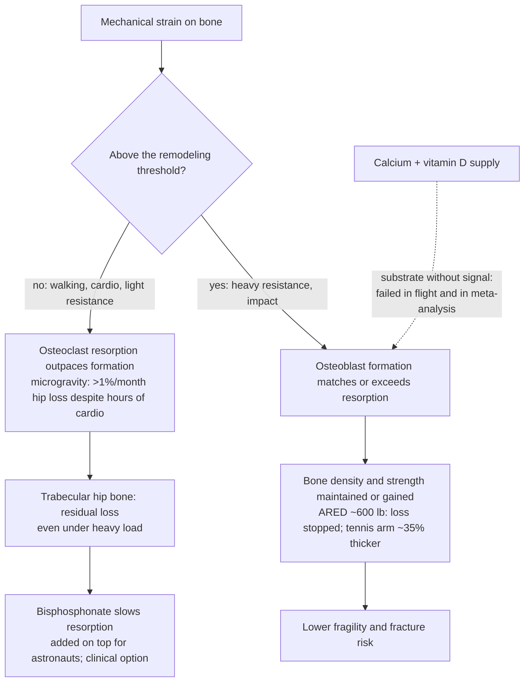

# Bone remodeling and mechanical loading

Bone is living tissue under continuous reconstruction: osteoclasts dissolve old bone while osteoblasts lay down new bone behind them, a demolition crew and a construction crew working simultaneously throughout life. Whether the skeleton gains, holds, or loses mass depends on the balance between the two, and the decisive input to that balance is mechanical force, not raw material. Bone rebuilds when it is loaded hard enough that it has no choice but to respond; the signal is the force, not the supply of calcium. This principle — the mechanostat — explains why supplying more building blocks fails while sufficiently heavy loading succeeds, and it was worked out most cleanly in the one environment where loading can be removed entirely: spaceflight. (@DrBradStanfield (Dr Brad Stanfield) — "NASA Found How To Stop Osteoporosis", 2026-08-12, [link](https://www.youtube.com/watch?v=bPviC3mFAxg))

## Microgravity as the clean experiment

Astronauts in microgravity lose bone at a rate reported as ten times faster than postmenopausal women — hip losses well over 1% per month — which compresses decades of terrestrial bone aging into months and lets candidate countermeasures be tested against a fast, measurable endpoint. The elimination sequence is the teaching value of the program. Hours of daily treadmill and cycle exercise, prescribed anyway for heart and muscle, left hip loss unchanged: movement without high loading is not the signal. Calcium plus vitamin D supplementation did nothing to stop the loss: the bone was not starving for substrate. An interim resistance device loading up to about 300 lb performed no better than cardio: submaximal resistance is still below threshold. Only the Advanced Resistive Exercise Device, flown in 2008 and loading up to about 600 lb — the space equivalent of heavy barbell squats and deadlifts — stopped the loss: where hip bone strength fell about 8% on the lighter machine, on the heavier machine it barely moved, with every measurable site shifting the same way. One residuum remained: even heavy loading did not fully protect the trabecular (spongy) bone inside the hip, and NASA added a bisphosphonate on top to close that gap. (@DrBradStanfield (Dr Brad Stanfield) — "NASA Found How To Stop Osteoporosis", 2026-08-12, [link](https://www.youtube.com/watch?v=bPviC3mFAxg))

The same dose–response is written into skeletons on Earth. A professional tennis player's racket arm — same genes, same diet, same calcium as the other arm — carries bone reported as nearly 35% thicker, built by nothing but decades of harder load. (@DrBradStanfield (Dr Brad Stanfield) — "NASA Found How To Stop Osteoporosis", 2026-08-12, [link](https://www.youtube.com/watch?v=bPviC3mFAxg))

## Why calcium supplementation is not the lever

Calcium the mineral is necessary; calcium the supplement has failed its outcome test. A 2017 analysis pooling around 51,000 people found calcium supplementation, with or without vitamin D, not linked to fewer fractures of any kind — spinal or otherwise. Worse, the Auckland trials led by Ian Reid and Mark Bolland, designed expecting fewer fractures in supplemented older women, instead observed more heart attacks in the calcium group — an unsought harm signal the investigators defended for years against industry and parts of the bone-medicine field before winning New Zealand's top scientific prize, with official US guidance subsequently shifting to advise against calcium supplements for fracture prevention in most people. The coherent reading is the mechanostat's: fracture risk was never a supply problem in calcium-replete people, so adding supply changes nothing except possibly vascular exposure. Dietary calcium from dairy, leafy greens, and fish remains the recommended route, and a clinician-directed supplement for true deficiency or dairy avoidance is a separate, legitimate indication. The vitamin D recommended daily allowance cited alongside is 800 IU, a figure that assumes zero sun exposure. The vascular-harm association is contested territory rather than settled causation — the video presents the trial signal without opposing re-analyses — so it is recorded here as a credible safety signal backed by a null benefit, which is already sufficient to reverse the default. (@DrBradStanfield (Dr Brad Stanfield) — "NASA Found How To Stop Osteoporosis", 2026-08-12, [link](https://www.youtube.com/watch?v=bPviC3mFAxg)) See [[supplement-evidence-and-safety]] for the general pattern of supplement decisions outrunning outcome evidence.

## The loading ladder in clinical populations

**Hopping is the validated entry point.** In a within-person controlled design where women hopped on one leg daily with the other leg as built-in comparison, the hopped hip gained about 1.8% bone density while the resting hip did not change; a separate trial found the effect held after menopause, where the hopping leg gained density while the contralateral leg lost it. The dose feature is daily practice, the effect size is modest, and spinal density does not improve — a starting exercise snack, not a cure. (@DrBradStanfield (Dr Brad Stanfield) — "NASA Found How To Stop Osteoporosis", 2026-08-12, [link](https://www.youtube.com/watch?v=bPviC3mFAxg)) Multidirectional jumping protocols and the osteogenic strain threshold of roughly 3.5–4× body weight are covered in [[womens-exercise-across-the-lifespan]]; the two records agree that ordinary locomotion undershoots the stimulus.

**Progressive heavy resistance training is what rebuilds meaningful bone.** In an 8-month randomized trial in older women who already had low bone density — the protocol matches the LIFTMOR trial already cited on [[resistance-training]] — twice-weekly 30-minute supervised sessions of deadlifts, overhead presses, and back squats protected bone, while the gentle low-intensity comparison group kept losing significant spine and hip density. The safety finding is the part patients disbelieve: in exactly the population usually told to be careful, the heavy-lifting group's only recorded injury was one minor lower-back spasm. The load-bearing condition is supervision — the trial exercises were coached by an exercise scientist and physiotherapist, and the transcript's clinical practice is to route novices through a personal trainer for technique and load selection before independence. (@DrBradStanfield (Dr Brad Stanfield) — "NASA Found How To Stop Osteoporosis", 2026-08-12, [link](https://www.youtube.com/watch?v=bPviC3mFAxg))

**Bisphosphonates are the pharmacological backstop.** When loading is insufficient or unachievable, the drug class NASA added for its astronauts slows osteoclastic resorption. The named counseling risk is osteonecrosis of the jaw — non-healing jaw bone with pain and infection — which is why dental hygiene is verified before prescribing. Prescription, monitoring, and candidacy are clinician decisions on top of, not instead of, the loading ladder. (@DrBradStanfield (Dr Brad Stanfield) — "NASA Found How To Stop Osteoporosis", 2026-08-12, [link](https://www.youtube.com/watch?v=bPviC3mFAxg))

## Gaps & open questions

- Do the trabecular-sparing limits of heavy loading seen at the astronaut hip apply to terrestrial trainees, and does any exercise mode reach trabecular hip bone without pharmacotherapy?
- The heavy-resistance trials measure density and strength surrogates; randomized fracture-outcome evidence for exercise protocols remains thin.
- How does the osteogenic threshold shift with age, sex, hormone status, and medication — is the same absolute load required at 75 as at 55?
- The calcium cardiovascular-harm signal's mechanism and dose dependence remain unresolved, as does whether food-source calcium is merely neutral or actively protective.
- What is the minimum effective hopping/impact dose, and can spine-effective impact protocols be designed at acceptable risk?
- How much of the astronaut bisphosphonate benefit generalizes to older adults already doing heavy resistance work?

## Practical implications

- **Get calcium from food (dairy, leafy greens, fish), not routine supplements — strong: pooled null fracture evidence (~51,000 people) plus a trial-derived cardiovascular safety signal, reflected in current US guidance against supplements for fracture prevention in most people.** Do not stop a supplement your clinician prescribed for documented deficiency or dairy avoidance without discussing it. Vitamin D at the 800 IU RDA assumes no sun exposure. (@DrBradStanfield (Dr Brad Stanfield) — "NASA Found How To Stop Osteoporosis", 2026-08-12, [link](https://www.youtube.com/watch?v=bPviC3mFAxg))
- **Start daily hopping as a bone exercise snack if joints and balance permit — moderate: within-person controlled trials, ~1.8% hip density gain, holds postmenopause, no spinal effect.** A brief set after each hour of desk work is the modeled cadence. (@DrBradStanfield (Dr Brad Stanfield) — "NASA Found How To Stop Osteoporosis", 2026-08-12, [link](https://www.youtube.com/watch?v=bPviC3mFAxg))
- **To rebuild bone, progress to supervised heavy resistance training (deadlift, overhead press, squat patterns; twice-weekly 30-minute sessions in the cited trial) — moderate-to-strong for density in low-bone-density older women; gentle exercise demonstrably does not substitute.** Begin with qualified instruction; the trial's safety record is conditional on supervision. (@DrBradStanfield (Dr Brad Stanfield) — "NASA Found How To Stop Osteoporosis", 2026-08-12, [link](https://www.youtube.com/watch?v=bPviC3mFAxg))
- **If loading plus nutrition is insufficient, discuss bisphosphonates with a clinician — strong as an established drug class; verify dental health first because osteonecrosis of the jaw is the counseling risk.** (@DrBradStanfield (Dr Brad Stanfield) — "NASA Found How To Stop Osteoporosis", 2026-08-12, [link](https://www.youtube.com/watch?v=bPviC3mFAxg))

## Related

[[bone-health-osteoporosis-and-fracture-prevention]] · [[resistance-training]] · [[womens-exercise-across-the-lifespan]] · [[muscle-strength-and-mortality]] · [[perimenopause-assessment-and-testing]] · [[menopause-hormone-therapy]] · [[low-energy-availability-and-menstrual-function]] · [[youth-resistance-training]] · [[supplement-evidence-and-safety]] · [[daily-movement-mobility-and-pain]] · [[aging-model]] · [[practice-playbook]]
