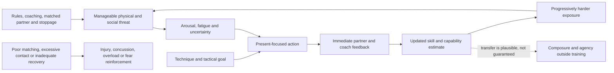

# Combat sports as controlled stress training

Combat-sport practice combines physical conditioning, perceptual decision-making, interpersonal pressure, and immediate feedback. Boxing, wrestling, Brazilian jiu-jitsu, and Muay Thai can therefore function as controlled stress exposure: the learner enters a bounded setting, experiences arousal and uncertainty, acts under rules, receives feedback, and repeats. This can plausibly train present-focused attention and confidence, but personal transformation narratives are not controlled evidence that fighting is a treatment for anxiety, depression, ADHD, or trauma. (@matt.kaeberlein (Healthspan Medicine) — "How Fighting Gives You A Bulletproof Mind with Noah Neiman", 2026-02-22, [link](https://www.youtube.com/watch?v=9XD8bqYlqxQ))

## Mechanism and transfer

The learning signal comes from controllability. A difficult exchange supplies arousal, while rules, a coach, and the ability to stop keep exposure within a trainable range. Technique narrows attention to position, timing, breathing, and the next action; successful coping or intelligible failure then updates the learner's estimate of what can be handled. This is consistent with the graded-action loop in [[mental-strength-and-behavioral-skills]] and the effort-versus-danger distinction in [[stress-threat-discrimination]]. Trainer Noah Neiman's distinctive position is that training habits generalize into how a person meets non-sport adversity; the transcript supports this through lived experience, not comparative trials. (@matt.kaeberlein (Healthspan Medicine) — "How Fighting Gives You A Bulletproof Mind with Noah Neiman", 2026-02-22, [link](https://www.youtube.com/watch?v=9XD8bqYlqxQ))

Combat training also bundles vigorous exercise, strength and conditioning, a regular schedule, sleep and nutrition incentives, mentorship, team belonging, service to other trainees, and reduced time in harmful environments. Psychological improvement may arise from one or several of these rather than striking or grappling itself. Immediate feedback and unavoidable task focus may be unusual features, but transfer to work, relationships, or a depressive episode remains an inference unless measured directly. (@matt.kaeberlein (Healthspan Medicine) — "How Fighting Gives You A Bulletproof Mind with Noah Neiman", 2026-02-22, [link](https://www.youtube.com/watch?v=9XD8bqYlqxQ))

## Dose, safety, and recovery

More exposure is not automatically better. Skill drills, bag work, controlled positional sparring, hard sparring, and competition impose different neurological and orthopedic risks. The transcript describes frequent training and extensive mobility work as one person's practice, but it does not establish an optimal weekly dose. A useful program separates technical learning and conditioning from unnecessary head impacts, progresses partner resistance, matches size and experience, and preserves recovery. (@matt.kaeberlein (Healthspan Medicine) — "How Fighting Gives You A Bulletproof Mind with Noah Neiman", 2026-02-22, [link](https://www.youtube.com/watch?v=9XD8bqYlqxQ))

## Practical implications

- **For interested beginners: attend one or two coached, beginner-appropriate sessions per week and progress only while technique and emotional control remain intact — moderate for safe skill acquisition, weak for mental-health transfer.** Prefer gyms that match partners, normalize tapping or stopping, and do not require routine head contact. (@matt.kaeberlein (Healthspan Medicine) — "How Fighting Gives You A Bulletproof Mind with Noah Neiman", 2026-02-22, [link](https://www.youtube.com/watch?v=9XD8bqYlqxQ))
- **Each session: use a specific technical goal and review feedback afterward — moderate mechanistic support.** The objective is repeated coping and skill updating, not simply exhaustion. (@matt.kaeberlein (Healthspan Medicine) — "How Fighting Gives You A Bulletproof Mind with Noah Neiman", 2026-02-22, [link](https://www.youtube.com/watch?v=9XD8bqYlqxQ))
- **Weekly: retain general strength, aerobic work, sleep, and recovery — strong for health and training capacity.** Do not credit combat practice alone for effects produced by the whole lifestyle bundle. (@matt.kaeberlein (Healthspan Medicine) — "How Fighting Gives You A Bulletproof Mind with Noah Neiman", 2026-02-22, [link](https://www.youtube.com/watch?v=9XD8bqYlqxQ))
- **For anxiety, depression, ADHD, trauma, or substance-use problems: use training only as a possible adjunct, not a replacement for assessment or evidence-based care — strong caution.** Stop and seek appropriate help if training worsens symptoms, compulsive exercise, aggression, or injury. (@matt.kaeberlein (Healthspan Medicine) — "How Fighting Gives You A Bulletproof Mind with Noah Neiman", 2026-02-22, [link](https://www.youtube.com/watch?v=9XD8bqYlqxQ))
- **At every session involving contact: minimize avoidable head impacts and follow concussion evaluation and return-to-sport guidance — strong.** Psychological goals do not justify cumulative neurological exposure. (@matt.kaeberlein (Healthspan Medicine) — "How Fighting Gives You A Bulletproof Mind with Noah Neiman", 2026-02-22, [link](https://www.youtube.com/watch?v=9XD8bqYlqxQ))

## Gaps & open questions

- Do combat sports improve emotion regulation or functioning more than equally social and demanding non-combat exercise?
- Which component—contact, technical complexity, acute arousal, coaching, community, or conditioning—drives any psychological benefit?
- How much stress exposure produces useful updating before it reinforces threat or causes dropout?
- Do benefits transfer objectively beyond the gym, and how durable are they after training stops?
- What formats preserve learning benefits while minimizing concussion and musculoskeletal risk?

## Related

[[mental-strength-and-behavioral-skills]] · [[stress-threat-discrimination]] · [[protective-threat-responses]] · [[resistance-training]] · [[cardiorespiratory-fitness]] · [[daily-movement-mobility-and-pain]] · [[practice-playbook]]
