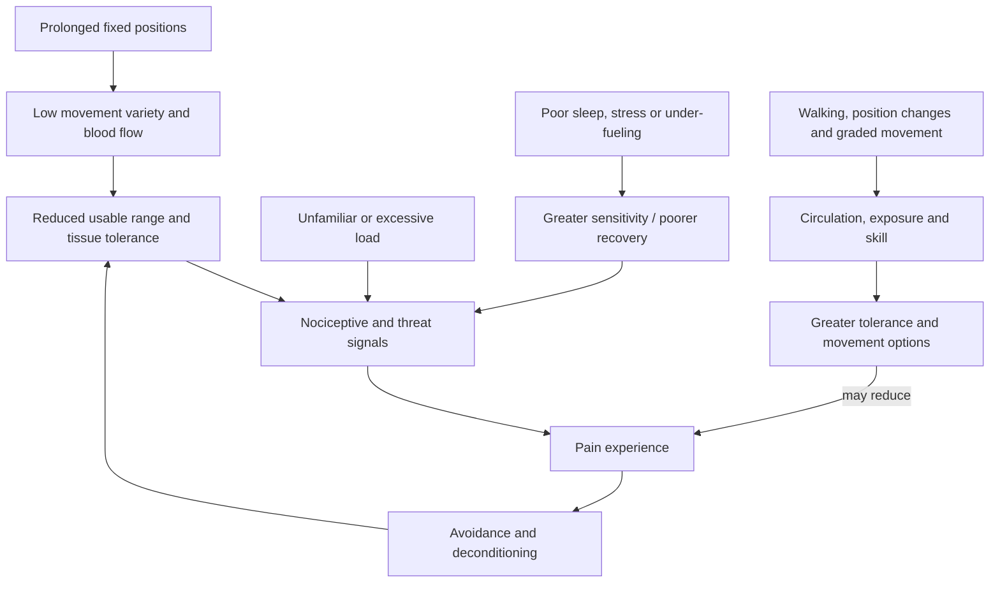
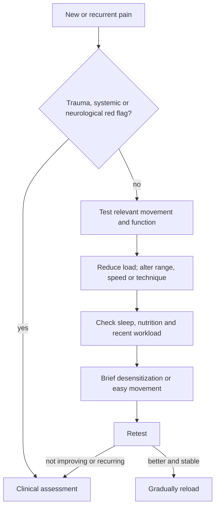

# Daily movement, mobility, and pain

Daily movement is the accumulation of walking, position changes, floor transitions, play, household activity, and brief exercise outside a formal workout. Mobility is the usable range of motion a person can control under the demands of a task. Neither is interchangeable with gym fitness: one concentrated session can build capacity while long sedentary periods leave many positions, loads, and coordination problems unpracticed. (@FoundMyFitness (FoundMyFitness) — "The Scientific Formula for a 'Healthy Day' | Dr. Kelly Starrett", 2026-05-04, [link](https://www.youtube.com/watch?v=IXmOJsfebMM))

## Pain is information, not a diagnosis

Pain is produced by the nervous system from sensory input, context, prior experience, stress, sleep, and perceived threat; its intensity therefore does not map perfectly onto tissue damage. This supports curiosity and graded modification for ordinary soreness or load-related discomfort, but it does not justify dismissing pain. A clear traumatic mechanism, deformity, loss of function, progressive neurological symptoms, fever, night sweats, unexplained systemic illness, or persistent worsening calls for clinical assessment. Kelly Starrett's framing of pain as a request for change is useful as a self-management heuristic, not a diagnostic rule. (@FoundMyFitness (FoundMyFitness) — "The Scientific Formula for a 'Healthy Day' | Dr. Kelly Starrett", 2026-05-04, [link](https://www.youtube.com/watch?v=IXmOJsfebMM))

For non-red-flag discomfort, a decision sequence can test whether changing load, range, tempo, technique, or recovery restores function. Soft-tissue pressure or foam rolling can transiently improve range, blood flow, soreness, and pain tolerance, creating a window for movement; it does not repair every tissue problem or replace progressive loading. The source proposes limiting work to about five minutes per muscle group, keeping intensity low enough to breathe, and using test–retest of the relevant movement. These are practitioner protocols with plausible mechanisms and short-term evidence, not proof of structural remodeling. (@FoundMyFitness (FoundMyFitness) — "The Scientific Formula for a 'Healthy Day' | Dr. Kelly Starrett", 2026-05-04, [link](https://www.youtube.com/watch?v=IXmOJsfebMM))

Self-applied soft-tissue work is not one category, and treating it as one obscures a mechanically meaningful choice. Compression pushes tissue toward bone; traction lengthens or offloads a segment. The two load tissue in opposite directions, and an individual can respond well to one and negligibly to the other — the low back in particular is reported to respond far better to traction, with relief lasting hours rather than the seconds attributed to rolling, while other regions respond better to compression. This makes "rolling didn't help" an incomplete test. It also opens the option of a breath-driven, pain-free technique for people who cannot tolerate pressure-based work. The evidence remains practitioner protocol plus uncontrolled reports, and the test–retest rule below still governs whether to keep it. [[spinal-traction-and-fascial-decompression]] (@drandygalpin (Andy Galpin) — "How to Decompress your Spine for Lower Back Relief | Dr. Andy Galpin & Jill Miller", 2026-08-11, [link](https://www.youtube.com/watch?v=4pCDgzb12OU))

A terminology caution travels with this literature. "Self-myofascial release" asserts a mechanism — that myofascial tissue releases — which the evidence does not establish, and both the physiologist and the practitioner in the source reject the term while proposing that only the verifiable part be named: massage, or manipulation. The subjective experience of release is real and often striking; its attribution to a specific tissue event is not. Expect part of the effect to run through slow breathing, supported rest, and reduced arousal rather than through tissue change. (@drandygalpin (Andy Galpin) — "How to Decompress your Spine for Lower Back Relief | Dr. Andy Galpin & Jill Miller", 2026-08-11, [link](https://www.youtube.com/watch?v=4pCDgzb12OU))

## Movement distributed through the day

Walking is low impact, scalable, compatible with conversation or work, and easier to repeat than high-exertion exercise for many people. A 2025 review is described as finding meaningful health benefit around 7,000 daily steps, reinforcing that 10,000 is a convenient target rather than a biological threshold. Walking does not fully replace resistance training or higher-intensity aerobic work when strength, power, or cardiorespiratory capacity is the target; its principal advantage is high adherence at low perceived cost. (@maxlugavere (Max Lugavere) — "Carbs Don’t Make You Fat: 10 Health Myths That Need to Die", 2026-08-05, [link](https://www.youtube.com/watch?v=TqcKy8yuc1U))

For resistance training, safe exercise selection is a constraint problem rather than a loyalty test between machines and free weights. Stable machines can reduce balance and technique demands while still loading muscle; bodyweight, cables, and free weights are alternatives. Start with controllable resistance, minimize unwanted momentum, train major lower-body, pushing, and pulling functions, and modify any movement that causes pain. Lugavere’s claim that machines and free weights produce no meaningful difference in muscle gain is directionally useful but unquantified in the transcript; choice should follow goals, access, skill, and tolerance. (@maxlugavere (Max Lugavere) — "Carbs Don’t Make You Fat: 10 Health Myths That Need to Die", 2026-08-05, [link](https://www.youtube.com/watch?v=TqcKy8yuc1U))

Sport transfer adds a second constraint: general loading can raise force capacity, while sport practice supplies task-specific perception, timing, and coordination. Squats and deadlifts are therefore neither mandatory nor merely useful for becoming better at those same lifts; they are candidate tools when lower-body or trunk force limits the target activity and their recovery cost is acceptable. Claims that they inherently create imbalance or fail to transfer remain contested, as do claims that visual resemblance makes a cable exercise more functional. (@biolayne1 (Dr. Layne Norton) — "Powerlifting is Bad for Athletic Performance? | What the Fitness | Biolayne", 2026-07-31, [link](https://www.youtube.com/watch?v=xK6nNmazh4s)) [[strength-transfer-and-exercise-specificity]]

Step-count cohorts associate roughly 8,000 daily steps with substantially lower mortality than very low step counts, but the transcript's quoted 51% reduction should not be interpreted as an individual causal guarantee: observational estimates depend on comparator, population, measurement, and confounding. The actionable principle is to replace some sedentary time with achievable walking and position changes. Brief movement “snacks” can add muscular, metabolic, coordination, and cognitive stimulus when a full workout is impractical; the optimal type and dose depend on the goal. (@FoundMyFitness (FoundMyFitness) — "The Scientific Formula for a 'Healthy Day' | Dr. Kelly Starrett", 2026-05-04, [link](https://www.youtube.com/watch?v=IXmOJsfebMM))

Floor sitting and getting up expose hips, knees, ankles, trunk, and balance to ranges that chairs omit. The value is repeated practice and retained options, not a special property of the floor. Older or mobility-limited people can use hands, furniture, cushions, or partial transitions and progress safely; inability or fear should prompt graded assistance rather than forced unsupported practice. Training should ultimately support valued activities and sport skills, because isolated VO2 max, strength, or range has value only insofar as it improves health and usable function. (@FoundMyFitness (FoundMyFitness) — "The Scientific Formula for a 'Healthy Day' | Dr. Kelly Starrett", 2026-05-04, [link](https://www.youtube.com/watch?v=IXmOJsfebMM))

## Corrective drills and test–retest reasoning

A regional drill can be selected by measuring a relevant task before and immediately after one controlled bout. A kneeling kettlebell weight shift pairs active hip external rotation with a light adductor stretch and can be screened with a pelvis-controlled FABER movement; a reverse plank pairs posterior-chain isometric work with shoulder extension and can be screened with a wall-constrained overhead reach. In both cases, an immediate improvement suggests the drill may be useful as a warm-up or movement break for that person, but it does not diagnose the restricted tissue or prove durable structural change. (@SquatUniversity (Squat University) — "Have Tight Hips? This One Exercises Fixes EVERYTHING!", 2026-08-08, [link](https://www.youtube.com/watch?v=cIg1I5WN4l4)) (@SquatUniversity (Squat University) — "Sitting All Day? This One Exercise Fixes Everything!", 2026-07-12, [link](https://www.youtube.com/watch?v=mwaEHn2mZsE)) [[hip-mobility-and-adductor-loading]] [[sedentary-posture-and-reverse-plank]]

Shoulder exercise selection follows the same logic at greater anatomical complexity: rotator-cuff forces center the humeral head while serratus and trapezius forces position the scapula, so a generic strengthening drill cannot be assumed to correct every painful movement. Start in a tolerable arm position, train the deficient function under control, retest the target press or reach, and progressively restore load and position specificity. High muscle activation supports target loading but does not alone establish pain relief, injury prevention, or superiority over another exercise. (@SquatUniversity (Squat University) — "The Only 14 Shoulder Exercises You Ever Need!", 2026-07-28, [link](https://www.youtube.com/watch?v=B3lGOPPBRFg)) [[shoulder-force-couples-and-exercise-selection]]

## Practical implications

- **Two or more times weekly: train major movement functions with machines, free weights, cables, or bodyweight according to control and comfort — strong for resistance training, moderate for modality equivalence.** Begin light, progress gradually, and distinguish ordinary delayed soreness from pain during a lift. (@maxlugavere (Max Lugavere) — "Carbs Don’t Make You Fat: 10 Health Myths That Need to Die", 2026-08-05, [link](https://www.youtube.com/watch?v=TqcKy8yuc1U))

- **Daily: accumulate walking and break long fixed positions with brief movement — moderate-to-strong for cardiometabolic and mortality association; moderate for causal effects of breaks.** About 8,000 steps is a useful benchmark, not a threshold or universal prescription; increase gradually from baseline. (@FoundMyFitness (FoundMyFitness) — "The Scientific Formula for a 'Healthy Day' | Dr. Kelly Starrett", 2026-05-04, [link](https://www.youtube.com/watch?v=IXmOJsfebMM))
- **Several times daily: change position or use a 5–10-minute movement snack — moderate for acute metabolic and functional benefit.** Choose brisk walking, stairs, controlled bodyweight work, play, or mobility practice according to capacity. (@FoundMyFitness (FoundMyFitness) — "The Scientific Formula for a 'Healthy Day' | Dr. Kelly Starrett", 2026-05-04, [link](https://www.youtube.com/watch?v=IXmOJsfebMM))
- **Before a relevant task or during a movement break: test one controlled regional drill and retain it only when a standardized retest improves — limited for the specific hip and reverse-plank protocols.** An acute response is a programming clue, not a diagnosis or permanent correction. (@SquatUniversity (Squat University) — "Have Tight Hips? This One Exercises Fixes EVERYTHING!", 2026-08-08, [link](https://www.youtube.com/watch?v=cIg1I5WN4l4)) (@SquatUniversity (Squat University) — "Sitting All Day? This One Exercise Fixes Everything!", 2026-07-12, [link](https://www.youtube.com/watch?v=mwaEHn2mZsE))
- **Most evenings or after demanding training: if helpful, use up to about 10 minutes of tolerable self-massage or mobility work, then retest a relevant movement — limited-to-moderate for short-term range and soreness.** Long-term capacity still requires graded loading. (@FoundMyFitness (FoundMyFitness) — "The Scientific Formula for a 'Healthy Day' | Dr. Kelly Starrett", 2026-05-04, [link](https://www.youtube.com/watch?v=IXmOJsfebMM))
- **For low-back tension specifically: try traction before adding more compression — limited evidence, low risk.** A poor response to foam rolling does not predict a poor response to offloading; see [[spinal-traction-and-fascial-decompression]] for the setup and its cautions. (@drandygalpin (Andy Galpin) — "How to Decompress your Spine for Lower Back Relief | Dr. Andy Galpin & Jill Miller", 2026-08-11, [link](https://www.youtube.com/watch?v=4pCDgzb12OU))
- **At each painful episode: screen for red flags and modify rather than automatically stop all activity — strong for triage principle, individualized for treatment.** Seek assessment when symptoms are severe, progressive, traumatic, systemic, neurologic, or fail to improve.

## Gaps & open questions

- At equal effort and volume, how do machines, free weights, and bodyweight training differ in injury risk, strength transfer, and long-term adherence across ages?

- What frequency and duration of movement breaks independently improve long-term outcomes after total activity is controlled?
- Which pain presentations benefit from self-directed graded movement, and which are most often delayed diagnoses?
- Do floor transitions add benefit beyond equivalent strength, balance, and range training?
- How much do transient mobility changes transfer to durable function and injury reduction?
- Do traction and compression produce different durations of relief in controlled comparison, and does the tissue region predict which works?
- Can immediate test–retest response predict long-term benefit from a mobility or corrective drill better than symptom-guided progressive exercise alone?

## Related

[[aging-model]] · [[practice-playbook]] · [[spinal-traction-and-fascial-decompression]] · [[breathing-mechanics-and-state-regulation]] · [[hip-mobility-and-adductor-loading]] · [[shoulder-force-couples-and-exercise-selection]] · [[sedentary-posture-and-reverse-plank]] · [[strength-transfer-and-exercise-specificity]] · [[trunk-training]] · [[performance-nutrition-and-hydration]] · [[youth-resistance-training]] · [[stress-threat-discrimination]]
