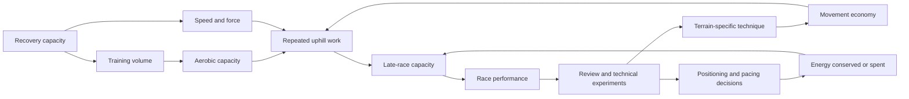

# Elite endurance development

Elite endurance performance is not a single aerobic trait. It emerges from the interaction of oxygen transport, local muscular endurance, speed and force, movement economy, technical decision-making, recovery capacity, and years of sport-specific practice. Cross-country skiing makes this integration unusually visible because races span roughly three minutes to two hours, terrain changes continuously, and both upper and lower body contribute. Johannes Høsflot Klæbo identifies high maximal oxygen uptake, terrain-specific technique, fast fibers, and endurance as simultaneous requirements; this is an elite-athlete case description, not comparative proof that skiing is uniquely healthful or that his program generalizes to recreational athletes. (@richroll (Rich Roll) — "The World’s Greatest Winter Olympian Shares the Secrets to His Success", 2026-08-10, [link](https://www.youtube.com/watch?v=6ym0a5mqqxg))

## A coupled performance system

Maximal oxygen uptake sets an upper bound on aerobic energy production, but performance below that ceiling depends on economy: how much oxygen and muscular work a given speed costs. In variable terrain, economy includes choosing a technique for the gradient, drafting and positioning, preserving speed downhill while recovering, and deciding when an energetically expensive acceleration is worth its downstream fatigue. Repeated racing and retrospective analysis can turn these choices into pattern recognition, so the fastest athlete in an isolated test need not be the best tactical finisher. (@richroll (Rich Roll) — "The World’s Greatest Winter Olympian Shares the Secrets to His Success", 2026-08-10, [link](https://www.youtube.com/watch?v=6ym0a5mqqxg)) [[strength-transfer-and-exercise-specificity]]

Technique can be developed experimentally rather than accepted as fixed tradition. Klæbo describes comparing an uphill running-style technique with conventional gliding under different grip conditions, timing both, and then refining the faster solution over years. The maneuver can create an immediate advantage but carries muscular and recovery costs across a multi-race weekend. This illustrates a general decision rule: judge an innovation by total event cost, repeatability, and context—not its fastest isolated trial. (@richroll (Rich Roll) — "The World’s Greatest Winter Olympian Shares the Secrets to His Success", 2026-08-10, [link](https://www.youtube.com/watch?v=6ym0a5mqqxg))

## Development across a career

Speed, technique, and endurance do not necessarily have the same developmental window. Klæbo’s case began with sprint specialization in late adolescence, then progressively added altitude exposure, longer sessions, and distance emphasis while retaining speed work. He and Rich Roll propose that speed is harder to add after long-distance specialization and age-related slowing; that ordering is a distinctive coaching position supported here by one successful career, not a universal law. (@richroll (Rich Roll) — "The World’s Greatest Winter Olympian Shares the Secrets to His Success", 2026-08-10, [link](https://www.youtube.com/watch?v=6ym0a5mqqxg))

Child development need not begin with early specialization. The Norwegian club model described in the interview delays formal ranking for young children, rewards attendance, uses varied relay constraints, encourages multiple sports, and postpones consequential specialization until roughly ages 15–17. The proposed mechanism is retention: broad sampling helps children find intrinsically rewarding activities, develops varied movement skills, and leaves a larger participant pool from which later specialists emerge. These are plausible explanations and a cultural case study, not causal evidence that this model alone produces elite athletes. (@richroll (Rich Roll) — "The World’s Greatest Winter Olympian Shares the Secrets to His Success", 2026-08-10, [link](https://www.youtube.com/watch?v=6ym0a5mqqxg)) [[youth-resistance-training]]

## Intensity distribution and specificity

Training zones are tools, not universally optimal destinations. In a reported 32-hour summer week, Klæbo describes about 2.5 hours at threshold, two hours of strength, most remaining work at very easy intensity, and little zone-two work. His rationale is that moderate work creates too much total recovery cost and may compromise fast-fiber qualities, whereas threshold resembles his racing demand and very easy work permits high volume. Lactate is checked during most threshold sessions to control intensity. This distribution is highly individual and sport-specific; it conflicts with any blanket prescription that all endurance athletes should maximize zone two, but the transcript supplies no controlled comparison showing that his approach is superior. (@richroll (Rich Roll) — "The World’s Greatest Winter Olympian Shares the Secrets to His Success", 2026-08-10, [link](https://www.youtube.com/watch?v=6ym0a5mqqxg))

Cross-training should preserve the target adaptation while reducing a limiting cost. Cycling increased aerobic volume, offered power-based feedback, and substituted during a collarbone injury; running with poles more closely resembled classic skiing, while roller skiing preserved the greatest movement specificity. Klæbo reports that a low-running season during hamstring injury still produced excellent results, reinforcing that no single auxiliary mode is indispensable. This is consistent with [[strength-transfer-and-exercise-specificity]]: general capacity transfers, while tactics and technique require representative practice. (@richroll (Rich Roll) — "The World’s Greatest Winter Olympian Shares the Secrets to His Success", 2026-08-10, [link](https://www.youtube.com/watch?v=6ym0a5mqqxg))

## Psychological load and sustainable excellence

Long solo sessions can support race visualization, self-talk, and attention control, but they are not a substitute for mental-health care. Klæbo describes pre-championship throat pain despite reassuring data, interpreting it as anxiety-linked arousal associated with an important event. He also reports that infection avoidance, isolation, and rigid control before a home championship became unhealthy, while restoring travel, relationships, and enjoyment preceded a more successful and sustainable Olympic period. These temporal associations cannot prove causality, but they show that reducing all uncertainty can itself impose psychological cost. (@richroll (Rich Roll) — "The World’s Greatest Winter Olympian Shares the Secrets to His Success", 2026-08-10, [link](https://www.youtube.com/watch?v=6ym0a5mqqxg)) [[stress-threat-discrimination]] [[mental-strength-and-behavioral-skills]]

## Practical implications

- **Each training block: define the event’s actual demands, then allocate aerobic, speed, strength, and technical work around the weakest limiting factor — moderate principle, individualized dose.** Do not copy an elite skier’s hours or zone distribution. (@richroll (Rich Roll) — "The World’s Greatest Winter Olympian Shares the Secrets to His Success", 2026-08-10, [link](https://www.youtube.com/watch?v=6ym0a5mqqxg))
- **Weekly: preserve at least some representative technique and speed while building endurance — moderate for specificity, limited for the proposed speed-first career sequence.** Increase volume progressively and monitor injury, mood, sleep, and performance. (@richroll (Rich Roll) — "The World’s Greatest Winter Olympian Shares the Secrets to His Success", 2026-08-10, [link](https://www.youtube.com/watch?v=6ym0a5mqqxg))
- **After key sessions or races: review one tactical decision or technical constraint and test it under repeatable conditions — limited but mechanistically sound.** Compare total fatigue and repeatability as well as immediate time. (@richroll (Rich Roll) — "The World’s Greatest Winter Olympian Shares the Secrets to His Success", 2026-08-10, [link](https://www.youtube.com/watch?v=6ym0a5mqqxg))
- **For children: prioritize enjoyment, broad sport sampling, attendance, and skill variety; delay high-stakes ranking and specialization — moderate developmental rationale, limited causal evidence in this source.** [[youth-resistance-training]] (@richroll (Rich Roll) — "The World’s Greatest Winter Olympian Shares the Secrets to His Success", 2026-08-10, [link](https://www.youtube.com/watch?v=6ym0a5mqqxg))
- **At least weekly during demanding blocks: audit whether illness control, data tracking, or performance identity is shrinking relationships and enjoyment — limited case evidence.** Persistent anxiety or physical symptoms warrant appropriate clinical evaluation rather than being presumed psychological. (@richroll (Rich Roll) — "The World’s Greatest Winter Olympian Shares the Secrets to His Success", 2026-08-10, [link](https://www.youtube.com/watch?v=6ym0a5mqqxg))

## Gaps & open questions

- Does a speed-first, endurance-later sequence outperform other development paths after maturation, total practice, and selection are controlled?
- Which athletes benefit from very-low-intensity plus threshold training rather than greater zone-two volume, and how should that choice be monitored?
- How much multisport sampling causally improves elite attainment, long-term participation, and injury risk?
- Which technical advantages survive across courses and race formats after their recovery cost is counted?
- How should athletes distinguish anxiety-linked symptoms from infection without either dismissing illness or reinforcing hypervigilance?

## Related

[[strength-transfer-and-exercise-specificity]] · [[youth-resistance-training]] · [[training-frequency-and-hypertrophy]] · [[performance-nutrition-and-hydration]] · [[tendon-adaptation-and-rehabilitation]] · [[mental-strength-and-behavioral-skills]] · [[stress-threat-discrimination]] · [[practice-playbook]]
