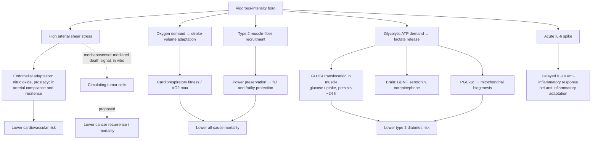

# Exercise intensity and health outcomes

Physical-activity guidelines have long priced exercise intensity with a fixed exchange rate: one minute of vigorous activity counts as two minutes of moderate activity, which is why the World Health Organization's targets read 150–300 minutes per week of moderate activity or 75–150 minutes of vigorous. That 1:2 ratio did not come from measuring health outcomes. It came from metabolic equivalents (METs) — vigorous activity burns roughly twice the calories per minute of moderate activity, so the durations were set to equalize energy expenditure. Energy expenditure is the right currency for weight management, but disease risk is a different outcome, and when intensity is priced against mortality, cardiovascular events, diabetes, and cancer instead of calories, the exchange rate changes by a factor of two to five. (@FoundMyFitness (FoundMyFitness) — "Why Vigorous Exercise Is 4–10x More Effective Than Moderate (New Evidence)", 2025-12-08, [link](https://www.youtube.com/watch?v=QnloZ45PVxQ))

## Intensity categories: guideline "vigorous" is broader than HIIT

In guideline and accelerometer terms, light activity is casual strolling, standing, or light chores; moderate is brisk walking, leisurely cycling, or yard work; vigorous is running, swimming, sports, energetic play — roughly zone-two effort and above. This is materially less intense than the colloquial meaning of vigorous (high-intensity interval training at ≥80% of maximum heart rate), and the distinction matters for reading the evidence below: the large intensity-gradient findings apply to purposeful, breathy movement, not only to structured intervals. Physical activity is also broader than exercise — it includes stair sprints, carrying loads, and playing with children, whether or not the person considers themselves an exerciser. (@FoundMyFitness (FoundMyFitness) — "Why Vigorous Exercise Is 4–10x More Effective Than Moderate (New Evidence)", 2025-12-08, [link](https://www.youtube.com/watch?v=QnloZ45PVxQ))

## The wearable-derived health equivalence ratios

A Nature Communications analysis from the group behind the VILPA studies (led by Emmanuel Stamatakis) asked the outcome-priced version of the question directly: how many minutes of moderate or light activity produce the same risk reduction as one minute of vigorous activity? It used more than 73,000 UK Biobank adults aged 40–79 who wore a wrist accelerometer for one week at baseline and were followed about eight years for all-cause mortality, cardiovascular mortality, major adverse cardiovascular events, incident type 2 diabetes, and cancer outcomes. Intensity was classified from movement measured every 10 seconds — not from heart rate — and healthy-user bias was addressed by excluding people with disease at baseline and anyone diagnosed within the first 12 months of follow-up. The reported equivalence ratios: one vigorous minute equaled roughly 4 moderate minutes for all-cause mortality, about 5.4 for major adverse cardiovascular events, about 7.8 for cardiovascular mortality, about 9.4 for incident type 2 diabetes, and about 3.4–3.5 for cancer mortality. Against light activity the ratios ran from roughly 53 to 94 minutes per vigorous minute across the main outcomes, reaching about 156 minutes for cancer mortality. (@FoundMyFitness (FoundMyFitness) — "Why Vigorous Exercise Is 4–10x More Effective Than Moderate (New Evidence)", 2025-12-08, [link](https://www.youtube.com/watch?v=QnloZ45PVxQ))

The dose–response shapes differed by intensity. Vigorous activity showed an approximately linear gradient, with roughly 30–40 minutes per day associated with 50% or greater reductions in several outcomes; moderate activity showed a linear gradient up to about 50 minutes per day and then flattened; light activity produced a small (~10–15%) risk reduction that did not grow with additional hours and, for several cardiovascular outcomes, was not considered meaningful by the authors, who wrote that "not even the largest amounts of daily LPA or low-intensity physical activity can elicit the health benefits of moderate or vigorous intensity". The risk reductions in play across outcomes ranged from about 5% to 35% at ordinary doses, with the larger reductions at the high end of vigorous dose. (@FoundMyFitness (FoundMyFitness) — "Why Vigorous Exercise Is 4–10x More Effective Than Moderate (New Evidence)", 2025-12-08, [link](https://www.youtube.com/watch?v=QnloZ45PVxQ))

Design limits temper the headline numbers. This is a single observational cohort: exposure was measured for one week and assumed representative of years; wrist-accelerometer intensity classification is a movement proxy that can misfile activities (it likely counts resistance exercise as vigorous and undercounts cycling against resistance); UK Biobank volunteers are healthier than the general population; and equivalence ratios as extreme as 1 minute ≈ 1–2.5 hours of light activity should be read as evidence that the light-activity dose–response is nearly flat, not as a validated conversion table. The ratios are also relative-risk arithmetic — the absolute benefit depends on baseline risk, and no randomized trial has tested intensity substitution against these outcomes. (@FoundMyFitness (FoundMyFitness) — "Why Vigorous Exercise Is 4–10x More Effective Than Moderate (New Evidence)", 2025-12-08, [link](https://www.youtube.com/watch?v=QnloZ45PVxQ))

## VILPA and exercise snacks: short bursts count

Vigorous intermittent lifestyle physical activity (VILPA) is the unplanned form of vigorous movement — stair sprints, rushing for a bus, chasing a child or dog — measured by accelerometer in people who report no structured exercise. In the VILPA cohort studies, one-to-two-minute vigorous bursts about three times daily associated with roughly 40% lower all-cause mortality, 40% lower cancer mortality, and 50% lower cardiovascular mortality versus none; a study in women found about 3.4 minutes per day of VILPA associated with 45% lower major-adverse-cardiovascular-event risk and 67% lower heart-failure risk; and a comparison against roughly 62,000 structured exercisers found comparable risk reductions, suggesting the body responds to the movement itself rather than to its scheduling. These are observational accelerometer cohorts (largely the same UK Biobank resource and research group as the equivalence-ratio study, so the convergence is not fully independent), but they measure real movement rather than recalled workouts. (@FoundMyFitness (FoundMyFitness) — "Why Vigorous Exercise Is 4–10x More Effective Than Moderate (New Evidence)", 2025-12-08, [link](https://www.youtube.com/watch?v=QnloZ45PVxQ)) (@FoundMyFitness (FoundMyFitness) — "Dr. Rhonda Patrick: Maximizing Healthspan with Exercise, Sauna, & Cold Exposure", 2026-01-22, [link](https://www.youtube.com/watch?v=OCddz_0NrEE))

Exercise snacks are the planned counterpart: brief (30 seconds to ~3 minutes) deliberate bouts — bodyweight squats, a hard stationary-bike burst, stair repeats — repeated several times daily without changing clothes or visiting a gym. Interventional work (Martin Gibala's group and others) reports VO2 max gains of about 2–3 mL/kg/min over 6–8 weeks of regular snacks in untrained people, similar to structured training in that population, and one study found about 30 bodyweight squats every 45 minutes across a workday improved glucose regulation more than a single 30-minute walk — consistent with the distributed-movement logic in [[free-sugars-and-glycemic-response]]. The 2018 US guideline revision removed the old requirement that activity accrue in bouts of ≥10 minutes, which these data support. (@FoundMyFitness (FoundMyFitness) — "Why Vigorous Exercise Is 4–10x More Effective Than Moderate (New Evidence)", 2025-12-08, [link](https://www.youtube.com/watch?v=QnloZ45PVxQ)) (@FoundMyFitness (FoundMyFitness) — "Dr. Rhonda Patrick: Maximizing Healthspan with Exercise, Sauna, & Cold Exposure", 2026-01-22, [link](https://www.youtube.com/watch?v=OCddz_0NrEE))

## Why intensity produces disproportionate adaptation

The organizing principle is that adaptation scales with stimulus strength, and several of the relevant stimuli are threshold- or intensity-gated rather than accumulating with duration.

**Vascular shear stress.** Faster blood flow increases frictional shear on the endothelium, which drives nitric-oxide and prostacyclin release and, with repetition, more compliant, atherosclerosis-resistant arteries. Volume-matched randomized comparisons of interval versus moderate continuous training consistently favor intervals for endothelial function and arterial stiffness, indicating the adaptation tracks peak shear intensity, not shear time-under-curve. This is the light-breeze-versus-strong-wind asymmetry: long low flow cannot substitute for brief high flow. (@FoundMyFitness (FoundMyFitness) — "Why Vigorous Exercise Is 4–10x More Effective Than Moderate (New Evidence)", 2025-12-08, [link](https://www.youtube.com/watch?v=QnloZ45PVxQ))

**Lactate as an intensity-gated signal.** Above the intensity at which mitochondrial ATP supply cannot keep pace, glycolysis produces lactate, which functions as a systemic signaling molecule as well as a fuel ([[cardiorespiratory-fitness]] covers the lactate shuttle). In muscle, lactate signaling increases GLUT4 transporter translocation, and the transporters stay active for roughly a day, extending glucose disposal well beyond the bout; lactate also feeds the PGC-1α pathway driving mitochondrial biogenesis, where volume-matched trials again favor higher intensity. In the brain, lactate crosses into circulation and stimulates brain-derived neurotrophic factor and neurotransmitter synthesis ([[exercise-enhanced-learning]]). Because lactate production requires crossing an intensity threshold, moderate volume cannot buy these signals by accumulation. (@FoundMyFitness (FoundMyFitness) — "Why Vigorous Exercise Is 4–10x More Effective Than Moderate (New Evidence)", 2025-12-08, [link](https://www.youtube.com/watch?v=QnloZ45PVxQ))

**Circulating tumor cells and shear.** Cancer cells that escape a primary tumor into circulation carry heavy mutation loads and elevated anti-apoptotic signaling, and are mechanosensitive; the shear forces of vigorous blood flow can act as a death signal, shown in vitro, and physically active people with circulating tumor cells show lower recurrence and metastasis in observational data. This is a mechanistic account offered for the cancer-mortality gradient, not an established causal pathway. (@FoundMyFitness (FoundMyFitness) — "Why Vigorous Exercise Is 4–10x More Effective Than Moderate (New Evidence)", 2025-12-08, [link](https://www.youtube.com/watch?v=QnloZ45PVxQ))

**Type 2 fiber recruitment.** Fast-twitch fibers — the power fibers that atrophy first with age and that catch a stumble before it becomes a hip fracture — are recruited only as intensity or load rises. Vigorous daily movement therefore maintains the fiber population most relevant to fall-initiated mortality cascades in older adults, complementing [[muscle-strength-and-mortality]] and [[resistance-training]]. (@FoundMyFitness (FoundMyFitness) — "Why Vigorous Exercise Is 4–10x More Effective Than Moderate (New Evidence)", 2025-12-08, [link](https://www.youtube.com/watch?v=QnloZ45PVxQ))

**Hormetic inflammation.** A vigorous bout spikes IL-6, which triggers a delayed anti-inflammatory IL-10 response lasting beyond the session — the same acute-spike-versus-chronic-elevation distinction developed in [[inflammaging-and-il-6]]. The same logic answers the cortisol objection to intense training: transient cortisol pulses with recovery are the adaptive stimulus; the pathology belongs to chronic elevation. (@FoundMyFitness (FoundMyFitness) — "Why Vigorous Exercise Is 4–10x More Effective Than Moderate (New Evidence)", 2025-12-08, [link](https://www.youtube.com/watch?v=QnloZ45PVxQ))

## Populations and dose boundaries

Older adults were well represented in the equivalence-ratio cohort (up to age 79) and benefited substantially; interval protocols such as the Norwegian 4x4 have been run safely in supervised studies of 65-year-olds with diabetes, where 85% of maximum heart rate corresponds to a modest absolute workload, and cardiac stiffening with age appears to specifically require higher-intensity stimulus to counter ([[cardiorespiratory-fitness]]). The claim that women should avoid high-intensity training traces to under-fueled athletes combining caloric deficit with extreme training volumes — a low-energy-availability problem, not an intensity problem ([[low-energy-availability-and-menstrual-function]]). At the other end, intensity is overdoable: excessive high-intensity volume without recovery shows mitochondrial-dysfunction signals in at least one study, and the endurance-athlete convention of roughly 80% easy / 20% hard sessions is a reasonable heuristic for distributing intensity ([[elite-endurance-development]]). In children, the cardiorespiratory-fitness–academic-performance association argues for sports and play rather than structured interval training. (@FoundMyFitness (FoundMyFitness) — "Why Vigorous Exercise Is 4–10x More Effective Than Moderate (New Evidence)", 2025-12-08, [link](https://www.youtube.com/watch?v=QnloZ45PVxQ))

## Gaps & open questions

- No randomized trial has tested intensity substitution (same time budget, different intensity mix) against mortality or event outcomes; the equivalence ratios are observational arithmetic from one cohort resource.
- How much of the vigorous-activity gradient survives in cohorts measured with heart rate rather than wrist-movement intensity, and in populations less healthy than UK Biobank volunteers?
- One week of accelerometry defines years of exposure; how stable are individual intensity profiles, and does within-person change in vigorous minutes predict outcome change?
- The VILPA and equivalence-ratio literatures share a data resource and research group; independent replication in NHANES-type or wearable-industry datasets is outstanding.
- Where the light-activity plateau sits for people who are frail or starting from near-zero capacity is unresolved — the cap may not apply at the lowest baselines.
- Whether wearable algorithms and public guidelines will re-price intensity (replacing step counts and the 1:2 rule with outcome-based equivalents) is an open policy question, not a settled plan.

## Practical implications

- **Include genuinely vigorous work in the week rather than accumulating only light activity — strong for the direction (convergent observational gradient plus randomized intermediate-endpoint evidence), moderate for any specific exchange rate.** Guideline-vigorous means breathy purposeful movement (running, brisk hills, sports), not necessarily formal intervals; the light-activity dose–response plateaus at ~10–15% risk reduction no matter the hours. (@FoundMyFitness (FoundMyFitness) — "Why Vigorous Exercise Is 4–10x More Effective Than Moderate (New Evidence)", 2025-12-08, [link](https://www.youtube.com/watch?v=QnloZ45PVxQ))
- **Daily: exploit or plant short vigorous bursts — moderate, observational for mortality outcomes, interventional for fitness and glucose endpoints.** Three one-to-two-minute bursts a day (stair sprints, fast hills, 1 minute of hard bodyweight squats, a hard bike burst each working hour) associate with 40–50% lower mortality outcomes in accelerometer cohorts and measurably improve VO2 max and glucose regulation in trials. Bouts under 10 minutes count; accumulation is legitimate. (@FoundMyFitness (FoundMyFitness) — "Dr. Rhonda Patrick: Maximizing Healthspan with Exercise, Sauna, & Cold Exposure", 2026-01-22, [link](https://www.youtube.com/watch?v=OCddz_0NrEE))
- **Weekly: keep one or two truly high-intensity interval sessions if capacity and recovery permit, distributed roughly 80/20 against easier volume — moderate, consistent with trial evidence for VO2 max and with athletic practice.** This complements rather than replaces the zone-two volume logic in [[cardiorespiratory-fitness]]. (@FoundMyFitness (FoundMyFitness) — "Why Vigorous Exercise Is 4–10x More Effective Than Moderate (New Evidence)", 2025-12-08, [link](https://www.youtube.com/watch?v=QnloZ45PVxQ))
- **Deconditioned, older, or chronically ill: enter progressively — interval walking (10–20-second pace pickups), chair squats, then longer intervals — moderate for feasibility and safety in supervised studies; clinician involvement for chronic disease.** Relative intensity is what matters; 85% of maximum heart rate is a low absolute workload for an unfit person. (@FoundMyFitness (FoundMyFitness) — "Why Vigorous Exercise Is 4–10x More Effective Than Moderate (New Evidence)", 2025-12-08, [link](https://www.youtube.com/watch?v=QnloZ45PVxQ))
- **Do not read wearable step counts or minute totals as intensity-blind currency — moderate.** A minute of vigorous work and a minute of strolling are not interchangeable for disease risk; judge weeks by whether they contained vigorous minutes, not by step totals. (@FoundMyFitness (FoundMyFitness) — "Why Vigorous Exercise Is 4–10x More Effective Than Moderate (New Evidence)", 2025-12-08, [link](https://www.youtube.com/watch?v=QnloZ45PVxQ))

## Related

[[cardiorespiratory-fitness]] · [[daily-movement-mobility-and-pain]] · [[exercise-program-design]] · [[time-efficient-concurrent-training]] · [[exercise-enhanced-learning]] · [[muscle-strength-and-mortality]] · [[inflammaging-and-il-6]] · [[free-sugars-and-glycemic-response]] · [[low-energy-availability-and-menstrual-function]] · [[elite-endurance-development]] · [[rhonda-patrick]] · [[aging-model]] · [[practice-playbook]]
