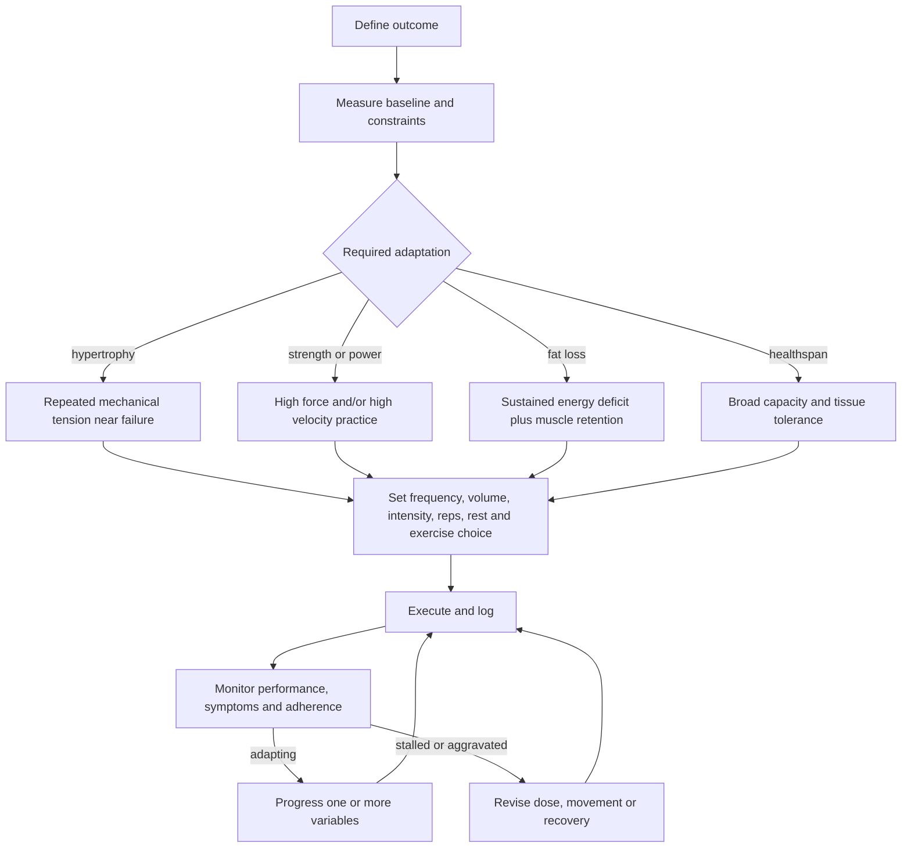

# Exercise program design

Exercise program design translates a desired outcome into a repeatable dose of stress, recovery, and progression. The exercise list comes late: first define the primary adaptation, constraints, and baseline; then select movements and manipulate frequency, intensity, volume, repetition range, rest, tempo, and exercise order. A program is therefore a testable prescription rather than a collection of individually good exercises. (@drandygalpin (Andy Galpin) — "The Fundamentals of Training for Muscle, Strength & Longevity", 2026-07-22, [link](https://www.youtube.com/watch?v=DVZIUoW61Kc))

## Design from adaptation, not equipment

Hypertrophy requires sufficient mechanical tension and hard sets; loads from roughly 5 to 30 repetitions can grow muscle when effort is high enough, and the final sets should generally finish within about one to three repetitions of failure. Galpin's 72-hour rule is a beginner heuristic to expose a target muscle about every three days, not a physiological deadline: body-part splits and full-body sessions can both deliver the stimulus, and equipment is interchangeable only insofar as it loads the intended tissue safely and progressively. (@drandygalpin (Andy Galpin) — "The Fundamentals of Training for Muscle, Strength & Longevity", 2026-07-22, [link](https://www.youtube.com/watch?v=DVZIUoW61Kc)) [[training-frequency-and-hypertrophy]]

Maximal strength is more specific to high force, technique, and neural recruitment. Galpin's 3-to-5 starting template uses three to five exercises, sets, and repetitions, with roughly three to five minutes of rest and three to five weekly sessions; this is an attributed coaching mnemonic, not evidence that every element is independently optimal. Power adds velocity, so the load must remain light enough to move fast. Fat loss, by contrast, is not created by a special lifting rep range: Galpin's 5-4-3-2-1 framework distributes weekly movement across five movement days, four cardiovascular sessions, three resistance sessions, two flexibility sessions, and one rest day, while nutrition establishes the energy deficit. The sessions may overlap, making this a scheduling scaffold rather than a requirement for 14 separate workouts. (@drandygalpin (Andy Galpin) — "The Fundamentals of Training for Muscle, Strength & Longevity", 2026-07-22, [link](https://www.youtube.com/watch?v=DVZIUoW61Kc)) [[energy-balance-and-calorie-counting]]

## Healthspan as a portfolio of capacities

Longevity programming should preserve optionality: muscle mass, strength, power, balance, proprioception, mobility, muscular endurance, aerobic capacity, long-duration low-intensity activity, multiplanar movement, and tissue tolerance all support the ability to meet unfamiliar demands. Specializing in one mode leaves untrained speeds, ranges, and tissues vulnerable when life suddenly demands them. This is a mechanistic and coaching synthesis rather than proof that a particular diversity score extends life. (@drandygalpin (Andy Galpin) — "The Fundamentals of Training for Muscle, Strength & Longevity", 2026-07-22, [link](https://www.youtube.com/watch?v=DVZIUoW61Kc)) [[aging-model]]

Grip strength and [[cardiorespiratory-fitness|VO2 max]] illustrate the difference between a marker and a target. Each predicts health outcomes partly because it reflects broader health and capacity, yet each also has direct functional value. Galpin's contrarian emphasis is that raising a clearly low capacity may matter greatly, whereas moving an already good score toward elite status has uncertain longevity return and may displace neglected capacities. The threshold examples in the source are expert judgment rather than trial-derived treatment cutoffs. (@drandygalpin (Andy Galpin) — "The Fundamentals of Training for Muscle, Strength & Longevity", 2026-07-22, [link](https://www.youtube.com/watch?v=DVZIUoW61Kc)) [[muscle-strength-and-mortality]]

## Selection, sequencing, and revision

Movements should be selected by the adaptation they deliver, the person's skill and anatomy, equipment, enjoyment, and risk—not by whether they resemble a sport or daily task. Within a session, priority work usually comes first; compound and technically demanding movements often precede isolation work, while supersets can save time if fatigue in one exercise does not undermine the other. Full-range resistance training can build usable range of motion, and loading the lengthened portion may support hypertrophy, but restricted ranges remain appropriate when the task or joint requires them. Static stretching remains useful for flexibility or relaxation; long static holds immediately before peak performance may transiently reduce output, while pre-training stretching can still be worthwhile when it enables a better lifting position. (@drandygalpin (Andy Galpin) — "The Fundamentals of Training for Muscle, Strength & Longevity", 2026-07-22, [link](https://www.youtube.com/watch?v=DVZIUoW61Kc)) [[strength-transfer-and-exercise-specificity]]

Revision closes the design loop. Track the intended output, technical quality, pain or symptom response, adherence, and recovery; change a variable when the evidence indicates a mismatch. AI can efficiently summarize logs, plot trends, or perform rule-based substitutions, but its normative judgments may reflect generic populations, prominent online views, or missing context. Galpin's position is that automated organization is currently more trustworthy than labeling an individual result good or bad or prescribing a context-heavy solution; expert review becomes more valuable as constraints and stakes multiply. (@drandygalpin (Andy Galpin) — "The Fundamentals of Training for Muscle, Strength & Longevity", 2026-07-22, [link](https://www.youtube.com/watch?v=DVZIUoW61Kc)) [[human-centered-ai-and-learning]]

## Practical implications

- **At the start of each 6–12-week block: name one primary adaptation, inventory constraints and baseline capacity, then choose the smallest set of movements that covers it — strong design logic, while the block length is a practical convention.** Keep secondary healthspan capacities at maintenance doses rather than trying to maximize everything simultaneously. (@drandygalpin (Andy Galpin) — "The Fundamentals of Training for Muscle, Strength & Longevity", 2026-07-22, [link](https://www.youtube.com/watch?v=DVZIUoW61Kc))
- **For hypertrophy: expose each target muscle roughly two or three times weekly, accumulate hard sets across tolerable rep ranges, and finish most final sets around 1–3 RIR — moderate-to-strong general evidence; 72 hours is a heuristic.** Progress load, repetitions, sets, range, or execution when performance is stable. (@drandygalpin (Andy Galpin) — "The Fundamentals of Training for Muscle, Strength & Longevity", 2026-07-22, [link](https://www.youtube.com/watch?v=DVZIUoW61Kc))
- **For general health across each week: include resistance, aerobic and faster work, mobility or full-range loading, balance, and ordinary long-duration movement — strong for the major components, limited for any exact allocation.** Emphasize deficient capacities before chasing elite scores in existing strengths. (@drandygalpin (Andy Galpin) — "The Fundamentals of Training for Muscle, Strength & Longevity", 2026-07-22, [link](https://www.youtube.com/watch?v=DVZIUoW61Kc))
- **Review the log weekly and the program after several weeks: preserve what is progressing and revise what produces persistent pain, poor adherence, or stalled output — expert practice.** Use AI for organization and constrained substitutions, but obtain qualified human review for diagnosis, high-stakes interpretation, or interacting limitations. (@drandygalpin (Andy Galpin) — "The Fundamentals of Training for Muscle, Strength & Longevity", 2026-07-22, [link](https://www.youtube.com/watch?v=DVZIUoW61Kc))

## Gaps & open questions

- How much movement variety is necessary for resilience, and when does variety dilute skill and progressive overload?
- Where do diminishing returns begin for grip strength, VO2 max, power, and other capacity markers across age and baseline risk?
- How do Galpin's 72-hour, 3-to-5, and 5-4-3-2-1 heuristics compare with individually optimized programs in controlled trials?
- Which monitoring signals best distinguish insufficient stimulus, insufficient recovery, technical mismatch, and ordinary short-term variability?
- When can an AI system make individualized exercise judgments reliably, and what reference populations, uncertainty reporting, and prospective validation would be required?

## Related

[[resistance-training]] · [[training-frequency-and-hypertrophy]] · [[cardiorespiratory-fitness]] · [[muscle-strength-and-mortality]] · [[strength-transfer-and-exercise-specificity]] · [[energy-balance-and-calorie-counting]] · [[human-centered-ai-and-learning]] · [[trunk-training]] · [[practice-playbook]] · [[aging-model]]
