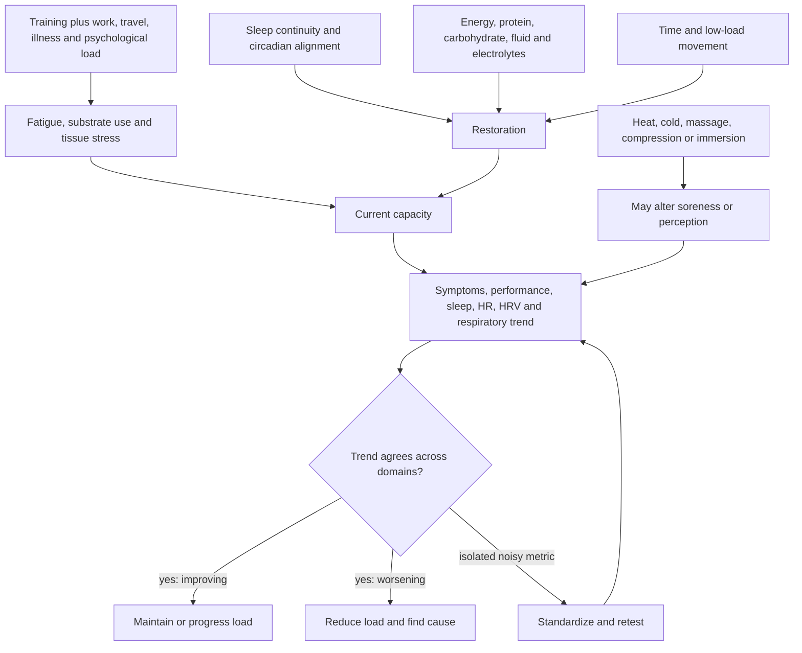

# Exercise recovery and readiness

Exercise recovery is restoration of the capacity needed for the next training demand, not the elimination of every symptom or the maximization of a wearable score. Readiness is therefore outcome-specific: soreness, motivation, resting heart rate, heart-rate variability (HRV), respiratory rate, sleep continuity, and actual performance each sample different parts of the system. No single value diagnoses under-recovery or overtraining; the useful signal is a repeated within-person departure that agrees with symptoms or performance. (@FoundMyFitness (FoundMyFitness) — "Dr. Andy Galpin: The Optimal Diet, Supplement, & Recovery Protocol for Peak Performance", 2025-04-28, [link](https://www.youtube.com/watch?v=DwtNC2A8gBk))

## The recovery decision system

Training stress is only one input. Insufficient energy or carbohydrate, sleep disruption, infection, allergens, travel, environmental heat, and psychological strain can produce similar readiness signals. The transcript presents widening day-to-day HRV variability, rising respiratory rate, elevated resting heart rate, fatigue, appetite or motivation change, and performance decline as constraint-finding clues rather than interchangeable diagnoses. Commercial devices differ in algorithms and measurement conditions, so absolute comparisons between people are especially weak. (@FoundMyFitness (FoundMyFitness) — "Dr. Andy Galpin: The Optimal Diet, Supplement, & Recovery Protocol for Peak Performance", 2025-04-28, [link](https://www.youtube.com/watch?v=DwtNC2A8gBk)) [[blood-marker-variability-and-reference-change]]

## Foundations before modalities

The highest-leverage recovery inputs are an appropriate training dose, adequate food and hydration, sufficient sleep, and manageable total stress. Carbohydrate timing matters most when glycogen demand is high and the next session is soon; total daily intake dominates for ordinary sessions separated by a day or more. Protein timing is similarly secondary to adequate daily protein. Fasted training may fit a short easy session or personal preference, but the source does not identify a general adaptation advantage and reports that compressed eight-hour eating during high-volume hypertrophy training increased fatigue and napping when calories and carbohydrate were difficult to fit. (@FoundMyFitness (FoundMyFitness) — "Dr. Andy Galpin: The Optimal Diet, Supplement, & Recovery Protocol for Peak Performance", 2025-04-28, [link](https://www.youtube.com/watch?v=DwtNC2A8gBk)) [[performance-nutrition-and-hydration]]

Sleep should be judged partly by daytime function and continuity rather than consumer-estimated stage percentages. Fragmentation, stability, opportunity, regularity, and next-day cognition or performance are more decision-relevant than chasing a fixed architecture. Galpin's distinctive coaching position is that a consistent wind-down sequence can act as a learned permission signal even when it includes a phone or television; this is compatible with stimulus-control principles only when the activity is reliably non-arousing and does not displace sleep. He also emphasizes bedroom ventilation and nasal patency as overlooked contributors, while the transcript's suggested 900 ppm carbon-dioxide threshold is a coaching boundary rather than a universally validated clinical cutoff. (@FoundMyFitness (FoundMyFitness) — "Dr. Andy Galpin: The Optimal Diet, Supplement, & Recovery Protocol for Peak Performance", 2025-04-28, [link](https://www.youtube.com/watch?v=DwtNC2A8gBk)) [[sleep-quality-and-circadian-alignment]] [[pre-sleep-routines-and-stimulus-control]]

## Modalities change different endpoints

Heat, water immersion, compression, massage, and cold can change circulation, edema, soreness, autonomic state, or subjective readiness without accelerating every part of tissue repair. Warm-water immersion or sauna may increase blood flow and provide a low-impact cardiovascular stimulus; it can also add thermal strain after a very hot or prolonged session. Cold-water immersion can reduce soreness and may help rapid return to competition, but repeated immediate use after resistance training can blunt hypertrophy-related signaling and muscle protein synthesis. The transcript also reports variable sympathetic and sleep responses, so cold is a situational tool rather than a recovery default. (@FoundMyFitness (FoundMyFitness) — "Dr. Andy Galpin: The Optimal Diet, Supplement, & Recovery Protocol for Peak Performance", 2025-04-28, [link](https://www.youtube.com/watch?v=DwtNC2A8gBk)) [[sauna-and-deliberate-heat-exposure]] [[deliberate-cold-exposure]]

## Supplement and deficiency triage

Supplements should follow constraint identification. [[creatine]] has direct strength, power, and lean-mass evidence; caffeine has acute performance evidence but can borrow from sleep; [[omega-3-fatty-acids]] has selected disuse-atrophy findings but no basis as a universal recovery agent. Magnesium is lost in sweat and inadequate dietary intake is common, yet routine serum magnesium is a poor screen for marginal tissue status because extracellular concentration is tightly regulated. Galpin reports frequent magnesium use in his athletes and possible sleep or soreness improvements, but this is practitioner experience without a qualifying trial or outcome-supported dose in the transcript. Different salts mainly change absorption and gastrointestinal tolerance; they do not establish a general need. (@FoundMyFitness (FoundMyFitness) — "Dr. Andy Galpin: The Optimal Diet, Supplement, & Recovery Protocol for Peak Performance", 2025-04-28, [link](https://www.youtube.com/watch?v=DwtNC2A8gBk)) [[supplement-evidence-and-safety]]

Iron illustrates why more is not safer. Deficiency can impair oxygen transport and performance, particularly in menstruating or endurance athletes, but excess iron is harmful and symptoms are nonspecific. The source's position is to test and identify the cause rather than supplement empirically; ferritin must be interpreted with hemoglobin, transferrin saturation, inflammation, diet, blood loss, and the athlete's context. This is a diagnostic pathway, not permission for routine iron use. (@FoundMyFitness (FoundMyFitness) — "Dr. Andy Galpin: The Optimal Diet, Supplement, & Recovery Protocol for Peak Performance", 2025-04-28, [link](https://www.youtube.com/watch?v=DwtNC2A8gBk)) [[proactive-health-monitoring]]

## Practical implications

- **Daily: assess actual function before wearable scores — moderate coaching principle.** Ask whether performance, motivation, soreness, daytime sleepiness, and ordinary function are stable; use device data to investigate a pattern, not to veto a good session because of one number. (@FoundMyFitness (FoundMyFitness) — "Dr. Andy Galpin: The Optimal Diet, Supplement, & Recovery Protocol for Peak Performance", 2025-04-28, [link](https://www.youtube.com/watch?v=DwtNC2A8gBk))
- **When monitoring HRV, heart rate, or respiratory rate: standardize device, posture, time, and context and interpret rolling within-person trends — limited-to-moderate.** Escalate a sustained multi-domain decline; ignore an isolated deviation unless symptoms or performance agree. (@FoundMyFitness (FoundMyFitness) — "Dr. Andy Galpin: The Optimal Diet, Supplement, & Recovery Protocol for Peak Performance", 2025-04-28, [link](https://www.youtube.com/watch?v=DwtNC2A8gBk))
- **Every training week: match recovery effort to the next demand — moderate.** Rapid carbohydrate restoration and symptom-reducing modalities matter most with same-day or next-day performance; ordinary schedules usually have time to recover through meals and sleep. (@FoundMyFitness (FoundMyFitness) — "Dr. Andy Galpin: The Optimal Diet, Supplement, & Recovery Protocol for Peak Performance", 2025-04-28, [link](https://www.youtube.com/watch?v=DwtNC2A8gBk))
- **Nightly: use a repeatable wind-down sequence and avoid late fluid loading that repeatedly causes nocturia — moderate for routine and sleep continuity, individualized for fluid timing.** Persistent nocturia, nasal obstruction, snoring, witnessed apneas, or unrefreshing sleep warrants assessment rather than endless routine optimization. (@FoundMyFitness (FoundMyFitness) — "Dr. Andy Galpin: The Optimal Diet, Supplement, & Recovery Protocol for Peak Performance", 2025-04-28, [link](https://www.youtube.com/watch?v=DwtNC2A8gBk)) [[obstructive-sleep-apnea]]
- **Use cold-water immersion only when short-term soreness or rapid return matters, and keep it away from hypertrophy sessions — moderate.** Do not use cold to compensate for excessive training load, and stop if it worsens sleep or nervous-system symptoms. (@FoundMyFitness (FoundMyFitness) — "Dr. Andy Galpin: The Optimal Diet, Supplement, & Recovery Protocol for Peak Performance", 2025-04-28, [link](https://www.youtube.com/watch?v=DwtNC2A8gBk))
- **Do not use magnesium or iron as generic recovery insurance — strong for the diagnostic boundary, limited for transcript-specific efficacy.** Improve magnesium-rich food intake first when feasible; investigate suspected iron deficiency with appropriately interpreted labs and a cause-directed plan before supplementing. (@FoundMyFitness (FoundMyFitness) — "Dr. Andy Galpin: The Optimal Diet, Supplement, & Recovery Protocol for Peak Performance", 2025-04-28, [link](https://www.youtube.com/watch?v=DwtNC2A8gBk))
- **Do not infer recovery from fatigue alone — strong as a decision boundary.** Falling asleep quickly can coexist with persistent arousal, fragmented sleep, inadequate intake, illness, or accumulated overload. (@FoundMyFitness (FoundMyFitness) — "Dr. Andy Galpin: The Optimal Diet, Supplement, & Recovery Protocol for Peak Performance", 2025-04-28, [link](https://www.youtube.com/watch?v=DwtNC2A8gBk))

## Gaps & open questions

- Which combinations of subjective and wearable measures best predict injury, illness, and performance loss in non-elite trainees?
- What magnitude and duration of within-person HRV or respiratory-rate change should alter training?
- Does bedroom carbon dioxide independently impair sleep after temperature, allergens, noise, and ventilation are controlled?
- Which recovery modalities improve subsequent performance rather than soreness alone, and at what cost to adaptation?
- How much additional sleep, if any, is required by different training loads and sports?
- When does time-restricted eating impair recovery after energy, carbohydrate, sleep, and adherence are matched?
- Which athletes benefit from magnesium supplementation after dietary adequacy and sweat loss are measured, and do changes improve performance rather than subjective recovery alone?

## Related

[[exercise-program-design]] · [[performance-nutrition-and-hydration]] · [[sleep-quality-and-circadian-alignment]] · [[pre-sleep-routines-and-stimulus-control]] · [[obstructive-sleep-apnea]] · [[creatine]] · [[omega-3-fatty-acids]] · [[supplement-evidence-and-safety]] · [[proactive-health-monitoring]] · [[deliberate-cold-exposure]] · [[sauna-and-deliberate-heat-exposure]] · [[blood-marker-variability-and-reference-change]] · [[practice-playbook]]
