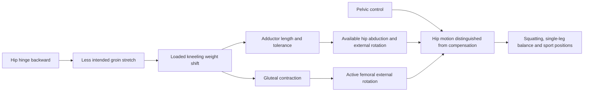

# Hip mobility and adductor loading

Hip mobility is the range that the femur can use relative to the pelvis while the trunk and pelvis remain controlled. Hip opening combines several motions, especially abduction and external rotation; apparent range can therefore come from the hip itself or from compensatory pelvic rotation. The adductors resist hip abduction and also contribute to force production and joint control, so a useful mobility drill may expose them to length while the gluteal muscles actively position the femur rather than relying on passive stretching alone. (@SquatUniversity (Squat University) — "Have Tight Hips? This One Exercises Fixes EVERYTHING!", 2026-08-08, [link](https://www.youtube.com/watch?v=cIg1I5WN4l4))

## Assessment before exercise selection

The figure-four form of the flexion-abduction-external-rotation, or FABER, test can be used as a simple movement screen: lie supine, place one heel near the opposite knee, stabilize the pelvis, and allow the bent knee to move outward. A large side-to-side difference or restricted descent may indicate that hip opening is limited, but the screen does not identify one tissue as the cause and is not by itself a diagnosis. Pain, a hard block, trauma, or persistent functional loss warrants clinical assessment rather than forceful stretching. (@SquatUniversity (Squat University) — "Have Tight Hips? This One Exercises Fixes EVERYTHING!", 2026-08-08, [link](https://www.youtube.com/watch?v=cIg1I5WN4l4)) [[daily-movement-mobility-and-pain]]

Test–retest changes answer a narrow question: whether a drill immediately changes that test under similar conditions. They do not show that tissue length permanently changed, that the adductors caused pain, or that injury risk fell. The source proposes the drill especially when FABER is asymmetric and improves after one bout; this is a pragmatic exercise-selection heuristic, not a validated diagnostic algorithm. (@SquatUniversity (Squat University) — "Have Tight Hips? This One Exercises Fixes EVERYTHING!", 2026-08-08, [link](https://www.youtube.com/watch?v=cIg1I5WN4l4))

## Kettlebell weight-shift mechanism and protocol

In a half-kneeling or supported kneeling position, place a light kettlebell or dumbbell in front of the pelvis. Actively rotate the upper hip outward by contracting the gluteals, press the hips forward until the implement provides a position cue, keep the torso upright, and shift the upper knee over the toes until a light groin stretch appears. Foot and thigh angle should be adjusted because anatomy and the location of restriction differ between people. Hinging backward unloads the intended adductor stretch, while excessive weight adds little to a drill whose load mainly cues hip extension. (@SquatUniversity (Squat University) — "Have Tight Hips? This One Exercises Fixes EVERYTHING!", 2026-08-08, [link](https://www.youtube.com/watch?v=cIg1I5WN4l4))

The exercise combines a dynamic adductor exposure with active gluteal control. The source reports that research on similar dynamic adductor weight shifts found immediate improvements in proprioception and single-leg balance, but it gives no citation, sample, comparator, or effect size. This supports the drill as a plausible warm-up option with limited evidence; it does not establish durable mobility, pain relief, improved lifting performance, or injury prevention. (@SquatUniversity (Squat University) — "Have Tight Hips? This One Exercises Fixes EVERYTHING!", 2026-08-08, [link](https://www.youtube.com/watch?v=cIg1I5WN4l4))

## Practical implications

- **Before a lower-body session or sport: use one light, controlled bout when FABER or the target task is restricted, then retest — limited evidence for acute range, proprioception, and balance.** Keep the pelvis and torso controlled, seek only a light groin stretch, and retain the drill only if the change improves the movement that matters. (@SquatUniversity (Squat University) — "Have Tight Hips? This One Exercises Fixes EVERYTHING!", 2026-08-08, [link](https://www.youtube.com/watch?v=cIg1I5WN4l4))
- **Across weeks: pair temporary mobility work with progressive strength through the newly available range — moderate biomechanical rationale, not directly tested in the source.** A warm-up effect is a window for practice, not proof of lasting remodeling. (@SquatUniversity (Squat University) — "Have Tight Hips? This One Exercises Fixes EVERYTHING!", 2026-08-08, [link](https://www.youtube.com/watch?v=cIg1I5WN4l4)) [[strength-transfer-and-exercise-specificity]]
- **At every session: stop and seek assessment for sharp pain, a hard mechanical block, marked loss of function, or worsening symptoms — strong triage principle.** Do not interpret asymmetry alone as injury or force the knee downward. The source itself limits the drill to the right person rather than presenting it as a universal fix. (@SquatUniversity (Squat University) — "Have Tight Hips? This One Exercises Fixes EVERYTHING!", 2026-08-08, [link](https://www.youtube.com/watch?v=cIg1I5WN4l4)) [[daily-movement-mobility-and-pain]]

## Gaps & open questions

- Which study and population support the reported immediate proprioception and balance effects, and how large and durable were they?
- Does a positive FABER test–retest identify people who benefit over weeks, or only people susceptible to short-term measurement change?
- How does the loaded weight shift compare with unweighted dynamic stretching, adductor strengthening, or ordinary warm-up sets?
- Do acute changes improve squat mechanics or reduce knee cave, pain, or injury when training exposure is matched?

## Related

[[daily-movement-mobility-and-pain]] · [[lunge-biomechanics-and-programming]] · [[strength-transfer-and-exercise-specificity]] · [[tendon-adaptation-and-rehabilitation]] · [[practice-playbook]] · [[aging-model]]
