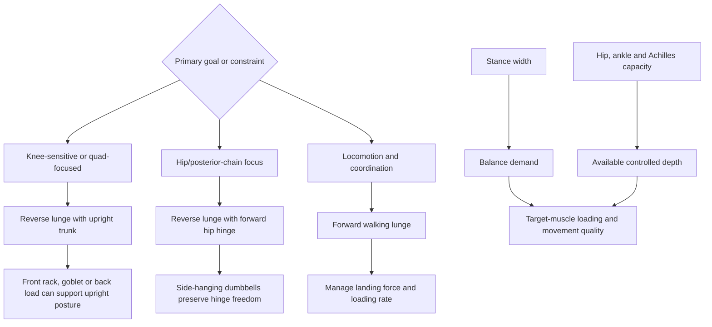

# Lunge biomechanics and programming

A lunge is a unilateral lower-body task in which one leg accepts most of the load while the body lowers and rises over a split stance. Step direction, stance width, trunk angle, external-load position, depth, and movement speed alter the balance demand and the moments at the knee and hip. There is therefore no single correct lunge: the useful variation is the one that matches the training target, current mobility, and tissue tolerance. (@athleanx (ATHLEAN-X™) — "Stop Doing Lunges Like This! (SAVE A FRIEND)", 2026-07-27, [link](https://www.youtube.com/watch?v=Pwsn3HR4L90))

## Step direction and loading rate

In a forward lunge, the stepping leg must accept force after foot contact; in a reverse lunge, the working front foot remains planted while the other leg steps back. This distinction can reduce the abrupt loading demand and may make reverse lunges more tolerable for some painful knees. The source reports a force of 4.6 times body weight and characterizes forward lunges as unnecessarily stressful to the patellofemoral joint and patellar tendon, but it does not identify the measurement conditions or comparative research. The number and the universal preference for reverse lunges should therefore be treated as unverified, not as a general injury rule. (@athleanx (ATHLEAN-X™) — "Stop Doing Lunges Like This! (SAVE A FRIEND)", 2026-07-27, [link](https://www.youtube.com/watch?v=Pwsn3HR4L90)) [[tendon-adaptation-and-rehabilitation]]

A forward lunge that requires pushing backward to the start can invite a hip shift as fatigue or balance changes. Continuing forward into a walking lunge removes that reversal task, although the stepping leg still has to absorb landing force. Reverse, forward-return, and walking lunges are consequently different coordination and loading problems, not interchangeable labels for the same exercise. (@athleanx (ATHLEAN-X™) — "Stop Doing Lunges Like This! (SAVE A FRIEND)", 2026-07-27, [link](https://www.youtube.com/watch?v=Pwsn3HR4L90)) [[strength-transfer-and-exercise-specificity]]

## Stance, trunk, and external load

A narrow, nearly tandem stance raises balance demands. Stepping backward and somewhat outward creates a wider base so force production rather than balance is more likely to limit the set. The source proposes at least two shoulder widths and using toe contact as an individualized distance landmark; these are coaching heuristics, not universal anthropometric rules. A small shoulder turn toward the working front leg is also proposed to stabilize the pelvis, but the transcript provides no comparative evidence that this cue improves force, pain, or injury risk. (@athleanx (ATHLEAN-X™) — "Stop Doing Lunges Like This! (SAVE A FRIEND)", 2026-07-27, [link](https://www.youtube.com/watch?v=Pwsn3HR4L90))

Trunk angle changes joint moments. A more upright torso tends to preserve a knee-dominant pattern and greater quadriceps demand, whereas hinging forward increases the hip moment and shifts emphasis toward the gluteal and hamstring complex. External load should permit the intended torso position: side-hanging dumbbells leave room for a forward hinge, while a goblet, front-rack, or back-loaded implement can be compatible with an upright pattern. These shifts are graded rather than binary; changing posture does not switch one muscle completely off. (@athleanx (ATHLEAN-X™) — "Stop Doing Lunges Like This! (SAVE A FRIEND)", 2026-07-27, [link](https://www.youtube.com/watch?v=Pwsn3HR4L90))

## Depth and individual constraints

Depth is the greatest range that can be reached with the intended stance and torso strategy under control. The rear knee may lightly touch the floor as a depth reference, but driving it into the floor adds impact without a training benefit. Limited ankle dorsiflexion, calf or Achilles tolerance, hip mobility, pain, and limb proportions can all reduce available depth. Forcing apparent depth by pitching the torso forward changes the exercise toward a hip-dominant pattern; stopping at the controlled range is a valid modification rather than a failed repetition. (@athleanx (ATHLEAN-X™) — "Stop Doing Lunges Like This! (SAVE A FRIEND)", 2026-07-27, [link](https://www.youtube.com/watch?v=Pwsn3HR4L90)) [[daily-movement-mobility-and-pain]]

## Practical implications

- **At each lower-body session: select lunge direction from the goal and symptoms — moderate biomechanical rationale, limited comparative injury evidence.** Begin with a reverse lunge when forward landing provokes knee pain; use a walking lunge when forward locomotion is the task and landing can be controlled. (@athleanx (ATHLEAN-X™) — "Stop Doing Lunges Like This! (SAVE A FRIEND)", 2026-07-27, [link](https://www.youtube.com/watch?v=Pwsn3HR4L90))
- **On every set: use a stance wide enough that balance does not obscure the intended strength stimulus — moderate coaching evidence.** Adjust width and step length to anatomy rather than enforcing the source’s two-shoulder-width cue literally. (@athleanx (ATHLEAN-X™) — "Stop Doing Lunges Like This! (SAVE A FRIEND)", 2026-07-27, [link](https://www.youtube.com/watch?v=Pwsn3HR4L90))
- **Choose torso angle and implement together — moderate biomechanical rationale.** Stay more upright for a knee-dominant emphasis; hinge from the hip and use side-hanging loads for a posterior emphasis, while keeping the foot stable and the movement controlled. (@athleanx (ATHLEAN-X™) — "Stop Doing Lunges Like This! (SAVE A FRIEND)", 2026-07-27, [link](https://www.youtube.com/watch?v=Pwsn3HR4L90))
- **Progress depth and external load only within a tolerable range — strong general load-management principle, limited evidence for the specific cues.** Persistent pain, swelling, instability, or loss of function warrants assessment rather than repeated form experimentation. (@athleanx (ATHLEAN-X™) — "Stop Doing Lunges Like This! (SAVE A FRIEND)", 2026-07-27, [link](https://www.youtube.com/watch?v=Pwsn3HR4L90))

## Gaps & open questions

- How do forward, reverse, and walking lunges compare for patellofemoral force, patellar-tendon loading rate, pain, hypertrophy, and injury across populations?
- Under what testing conditions does the reported 4.6-times-body-weight force arise, and is it relevant to ordinary training loads?
- Does slight trunk rotation toward the working leg improve pelvic stability or outcomes?
- What stance-width and step-length rules best scale to limb proportions and balance capacity?
- Does pain-guided reverse-lunge substitution improve long-term knee capacity, or only short-term tolerance?

## Related

[[tendon-adaptation-and-rehabilitation]] · [[daily-movement-mobility-and-pain]] · [[strength-transfer-and-exercise-specificity]] · [[youth-resistance-training]] · [[practice-playbook]] · [[aging-model]]
