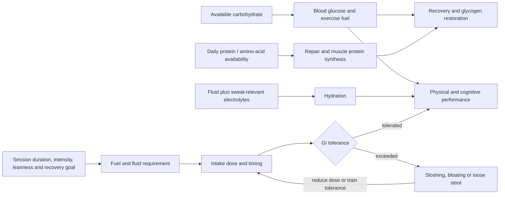
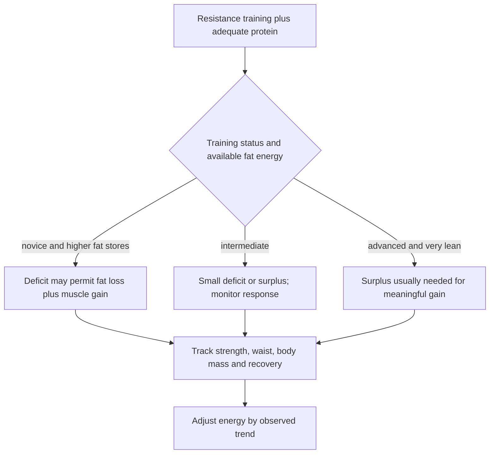

# Performance nutrition and hydration

Performance nutrition supplies the energy, substrates, fluid, and electrolytes needed to perform training and recover from it without creating gastrointestinal burden. Its first principle is goal dependence: the minimum needed to complete an ordinary session is not the same as the intake that maximizes prolonged performance or rapid recovery. Most short, ordinary workouts do not require carbohydrate during the session when the person begins adequately fed, whereas long or highly demanding events can make intake during exercise consequential. (@drandygalpin (Andy Galpin) — "The Fundamentals of Nutrition, Hydration & Performance Fueling", 2026-08-05, [link](https://www.youtube.com/watch?v=_GEhu3vdL7w))

## The fueling system

### Carbohydrate and protein

Carbohydrate availability can support blood glucose, perceived energy, cognition, cellular hydration, training output, and recovery. Muscle also acts as a glucose sink: it takes up and stores carbohydrate for fuel and tissue metabolism, linking muscle mass and training to glucose regulation. This does not mean carbohydrate must be consumed during every workout; endogenous stores and meals outside the session are often sufficient. For multi-hour endurance competition, the source reports performance-oriented intakes near 80 g/hour and, among some athletes, 100–120 g/hour, but these high doses are specialized and limited by gastrointestinal tolerance. (@drandygalpin (Andy Galpin) — "The Fundamentals of Nutrition, Hydration & Performance Fueling", 2026-08-05, [link](https://www.youtube.com/watch?v=_GEhu3vdL7w))

Amino acids must be available for repair, but a narrow post-workout window is not required. When total protein across roughly 24 hours is adequate, the source describes similar muscle-growth outcomes regardless of whether protein is taken immediately before or after training. Supplements are one delivery method, not a mechanistic necessity. (@drandygalpin (Andy Galpin) — "The Fundamentals of Nutrition, Hydration & Performance Fueling", 2026-08-05, [link](https://www.youtube.com/watch?v=_GEhu3vdL7w))

For muscle gain, about 1.6 g protein/kg/day is presented as the point near which additional hypertrophy benefit usually diminishes, not as a minimum for all health or a guarantee of optimal growth. Galpin prefers about 2.2 g/kg/day as a broad coaching default for satiety and coverage, while explicitly distinguishing that preference from evidence that protein above 1.6 g/kg produces more muscle. He suggests that lean people in an energy deficit who are trying to maximize muscle retention or gain may require still more, potentially approaching 3 g/kg/day; this upper value is context-specific and less securely established in the transcript. Resistance training remains the primary growth signal, followed by adequate energy, with protein becoming more limiting as intake falls and leanness rises. (@drandygalpin (Andy Galpin) — "The Fundamentals of Nutrition, Hydration & Performance Fueling", 2026-08-05, [link](https://www.youtube.com/watch?v=_GEhu3vdL7w))

A second source converges on the same daily range from the aging direction: the 0.8 g/kg/day RDA is a malnutrition floor, generally inadequate for building or even preserving muscle with age, and people training for strength or mass should target roughly 1.6–2.4 g/kg/day (about 0.8–1 g per pound of body weight), with less active and older people potentially needing the upper end or beyond because of anabolic resistance; intakes near 0.4–0.5 g per pound are almost certainly insufficient for the demands of aging. Protein quality is judged by essential-amino-acid completeness and digestibility — leucine is the key trigger of muscle protein synthesis — on which animal sources (dairy, eggs, beef) generally outperform plant sources; a fully plant-based approach can still meet goals but requires eating more total protein and cooking it where possible to improve digestibility. (Peter Attia MD — "Building strength and muscle mass: optimize training & nutrition for longevity (AMA #71 rebroadcast)", 2026-07-06, [link](https://www.youtube.com/watch?v=CqNqfb37gig))

The claim that only 30 g of protein can be absorbed or used from a meal confuses the acute muscle-protein-synthesis response with whole-body digestion and utilization. The source describes evidence of utilization at intakes up to 100 g in one feeding, although this does not establish that very large boluses maximize hypertrophy or are optimal for every digestive system. (@drandygalpin (Andy Galpin) — "The Fundamentals of Nutrition, Hydration & Performance Fueling", 2026-08-05, [link](https://www.youtube.com/watch?v=_GEhu3vdL7w))

The corpus records a residual disagreement about per-meal incorporation: acute tracer studies using liquid protein suggest only 30–40 g are incorporated at once, favoring multiple smaller feedings, but those findings are source-dependent — casein delivers amino acids far more slowly than whey, and whole-food meals behave differently from shakes. Attia's current practice weights timing lightly: roughly 40–50 g of protein about four times daily from meals, avoiding trivial 10 g doses, without stressing the clock; the post-workout anabolic window is broad (about four to six hours), so eating within an hour or two of training is fine and hunger usually handles it. Both sources thus agree that total daily protein dominates timing; they differ only on how much per-meal distribution matters at the margin. (Peter Attia MD — "Building strength and muscle mass: optimize training & nutrition for longevity (AMA #71 rebroadcast)", 2026-07-06, [link](https://www.youtube.com/watch?v=CqNqfb37gig)) (@drandygalpin (Andy Galpin) — "The Fundamentals of Nutrition, Hydration & Performance Fueling", 2026-08-05, [link](https://www.youtube.com/watch?v=_GEhu3vdL7w))

Pre-sleep protein is one optional distribution strategy. Acute studies support digestion and overnight muscle protein synthesis, but a 12-week training study that reported greater muscle size and strength also raised total intake from about 1.3 to 1.9 g/kg/day in the supplemented group. It therefore cannot separate the effect of bedtime timing from the effect of more daily protein. A roughly 30–40 g protein-dominant serving before bed is most defensible when it closes a daily gap and is tolerated, not as a mandatory anabolic window. (@drandygalpin (Andy Galpin) — "The Truth About Eating Before Bed | Dr. Michael Ormsbee & Dr. Andy Galpin", 2026-08-01, [link](https://www.youtube.com/watch?v=fOeZrm7LlZs)) [[pre-sleep-protein-feeding]]

### Fluid, electrolytes, and gastrointestinal tolerance

A rough starting point for total daily water is half of body weight in pounds expressed as fluid ounces, with exercise, heat, body size, sweat rate, diet, and clinical context requiring adjustment. During exercise, the source proposes roughly 3–6 oz every 15–20 minutes for many people. These are heuristics, not universal physiological requirements; frequent urination or sleep disruption can indicate needless excess. Water intake must also account for sodium and chloride lost in sweat, with potassium and magnesium contributing to the broader electrolyte system. (@drandygalpin (Andy Galpin) — "The Fundamentals of Nutrition, Hydration & Performance Fueling", 2026-08-05, [link](https://www.youtube.com/watch?v=_GEhu3vdL7w))

When rapid rehydration is important, pre- and post-exercise body mass can estimate net fluid loss. Replacing about 125% of the lost mass as fluid accounts for continuing urinary loss; some research uses 150%, but the larger target can be impractical. Fluid already consumed during exercise must be included, and wet clothing can invalidate the measurement. (@drandygalpin (Andy Galpin) — "The Fundamentals of Nutrition, Hydration & Performance Fueling", 2026-08-05, [link](https://www.youtube.com/watch?v=_GEhu3vdL7w))

The limiting system is often the gut. High carbohydrate, sodium, or fluid doses can exceed absorption and cause bloating, sloshing, or diarrhea. Endurance athletes can progressively train gastrointestinal tolerance by practicing intake and increasing it gradually; recreational trainees should instead reduce in-session intake or move it earlier or later if the nominal target impairs the workout. (@drandygalpin (Andy Galpin) — "The Fundamentals of Nutrition, Hydration & Performance Fueling", 2026-08-05, [link](https://www.youtube.com/watch?v=_GEhu3vdL7w))

## Body recomposition

In active girls and women, adequacy comes before fine timing. Training can suppress appetite, school or caregiving can displace meals, and gastrointestinal symptoms can make large meals around exercise impractical. Planned intake and energy-dense foods can close the gap; carbohydrate remains a primary training fuel and should not be crowded out by a protein-only framing. Menstrual disruption, repeated stress injury, fatigue, and poor recovery raise concern for [[low-energy-availability-and-menstrual-function]]. (@PeterAttiaMD (Peter Attia MD) — "378 ‒ Women’s health & performance: how training, nutrition, & hormones interact across life stages", 2026-01-05, [link](https://www.youtube.com/watch?v=CDsH60jt34o))

Body recomposition means gaining lean tissue while losing fat. It is most feasible when body-fat stores are ample and resistance-training experience is low, because stored energy can help finance new tissue while a novel training stimulus drives growth. It becomes progressively harder in very lean, highly trained people, who may require an energy surplus to add muscle. Galpin offers approximately 10–12% body fat for men and 15% for women as rough thresholds below which recomposition becomes difficult; these are coaching estimates, not diagnostic cutoffs. (@drandygalpin (Andy Galpin) — "The Fundamentals of Nutrition, Hydration & Performance Fueling", 2026-08-05, [link](https://www.youtube.com/watch?v=_GEhu3vdL7w))

Lean-mass preservation bounds how aggressive a deficit can be. Any deficit large enough to drive weight loss puts muscle at risk in people not using supraphysiologic anabolics; the mitigations are meeting protein needs (roughly 1 g per pound of body weight) and maintaining hard resistance training, which studies support even at 30–40% caloric restriction. The protection has limits: in near-total fasting, even high protein intake would mostly be converted to glucose amid the deficit, with too little anabolic stimulus to prevent muscle loss — which is why bodybuilders preserve lean mass by cutting slowly rather than rapidly. The bricks-and-bricklayers framing (protein supplies bricks; training supplies the signal; both are required in an energy deficit) is attributed to Luc van Loon via this source. (Peter Attia MD — "Building strength and muscle mass: optimize training & nutrition for longevity (AMA #71 rebroadcast)", 2026-07-06, [link](https://www.youtube.com/watch?v=CqNqfb37gig))

For many people, a 5–10% energy deficit or surplus is a conservative starting range that limits unnecessary fat gain or performance loss. Larger deficits may be tolerable when fat stores are very high, but the transcript does not provide clinical safeguards or validate a universal rate. The familiar 3,500-kcal-per-pound fat estimate and the proposed roughly 1,800-kcal cost to build a pound of muscle are explicitly rough averages; real tissue change is dynamic rather than a fixed conversion. (@drandygalpin (Andy Galpin) — "The Fundamentals of Nutrition, Hydration & Performance Fueling", 2026-08-05, [link](https://www.youtube.com/watch?v=_GEhu3vdL7w))

## Practical implications

- **Before ordinary sessions: begin fed and hydrated according to tolerance; do not add intra-workout carbohydrate by default — moderate.** Consider carbohydrate during prolonged or unusually demanding work when maximizing output or rapid recovery matters. (@drandygalpin (Andy Galpin) — "The Fundamentals of Nutrition, Hydration & Performance Fueling", 2026-08-05, [link](https://www.youtube.com/watch?v=_GEhu3vdL7w))
- **Daily: meet total protein needs before optimizing timing — moderate-to-strong for training adaptation.** About 1.6 g/kg/day is a reasonable muscle-gain target for many trainees; higher targets are a context-dependent preference, especially during energy restriction, and may not add hypertrophy in energy balance. (@drandygalpin (Andy Galpin) — "The Fundamentals of Nutrition, Hydration & Performance Fueling", 2026-08-05, [link](https://www.youtube.com/watch?v=_GEhu3vdL7w))
- **When the daily protein target would otherwise be missed: consider 30–40 g before bed — moderate for overnight protein synthesis, limited for an independent long-term timing effect.** Keep the serving modest and reassess sleep and digestive tolerance. (@drandygalpin (Andy Galpin) — "The Truth About Eating Before Bed | Dr. Michael Ormsbee & Dr. Andy Galpin", 2026-08-01, [link](https://www.youtube.com/watch?v=fOeZrm7LlZs)) [[pre-sleep-protein-feeding]]
- **During exercise: take small, tolerable fluid doses rather than forcing a formula — moderate.** Roughly 3–6 oz every 15–20 minutes is a starting heuristic; personalize with sweat loss, conditions, duration, thirst, electrolyte losses, and medical needs. (@drandygalpin (Andy Galpin) — "The Fundamentals of Nutrition, Hydration & Performance Fueling", 2026-08-05, [link](https://www.youtube.com/watch?v=_GEhu3vdL7w))
- **After high-sweat sessions when rapid recovery matters: replace roughly 125% of measured net mass loss over the recovery period — moderate.** Include sodium as appropriate and subtract what was consumed during training. (@drandygalpin (Andy Galpin) — "The Fundamentals of Nutrition, Hydration & Performance Fueling", 2026-08-05, [link](https://www.youtube.com/watch?v=_GEhu3vdL7w))
- **During a body-composition phase: start near a 5–10% energy change and review trends every one to two weeks — moderate coaching evidence; cadence not trial-validated.** Preserve resistance training, assess performance and recovery, and avoid assuming scale change identifies fat versus muscle. (@drandygalpin (Andy Galpin) — "The Fundamentals of Nutrition, Hydration & Performance Fueling", 2026-08-05, [link](https://www.youtube.com/watch?v=_GEhu3vdL7w))

- **When gaining or preserving muscle: target roughly 1.6–2.4 g protein/kg/day (about 1 g/lb), biased higher when older or in a deficit, from complete sources or larger cooked plant portions, in meaningful per-meal doses — moderate-to-strong.** Muscle tissue is about 70% water, so hydration and [[creatine]] support the same system. (Peter Attia MD — "Building strength and muscle mass: optimize training & nutrition for longevity (AMA #71 rebroadcast)", 2026-07-06, [link](https://www.youtube.com/watch?v=CqNqfb37gig))
- **During intentional weight loss: keep the deficit moderate, protein near 1 g/lb, and resistance training hard; do not expect protein to rescue lean mass during extreme restriction or prolonged fasting — moderate.** (Peter Attia MD — "Building strength and muscle mass: optimize training & nutrition for longevity (AMA #71 rebroadcast)", 2026-07-06, [link](https://www.youtube.com/watch?v=CqNqfb37gig))

## Gaps & open questions

- Which athletes benefit from carbohydrate during shorter sessions, and how should dose vary by prior diet and glycogen state?
- What fluid and electrolyte heuristics best predict individual needs across climates, medications, kidney function, and sweat phenotypes?
- How much protein is optimal in a deficit at different body-fat levels, and does protein distribution matter after total intake is matched?
- What are reliable, accessible measures of recomposition when hydration and glycogen obscure short-term body mass?
- How quickly and durably can gastrointestinal carbohydrate and fluid tolerance be trained?

## Related

[[nutrition-evidence-and-personalization]] · [[pre-sleep-protein-feeding]] · [[visceral-and-ectopic-fat]] · [[caloric-restriction-and-meal-timing]] · [[resistance-training]] · [[muscle-strength-and-mortality]] · [[creatine]] · [[trunk-training]] · [[youth-resistance-training]] · [[womens-exercise-across-the-lifespan]] · [[low-energy-availability-and-menstrual-function]] · [[practice-playbook]] · [[aging-model]]
