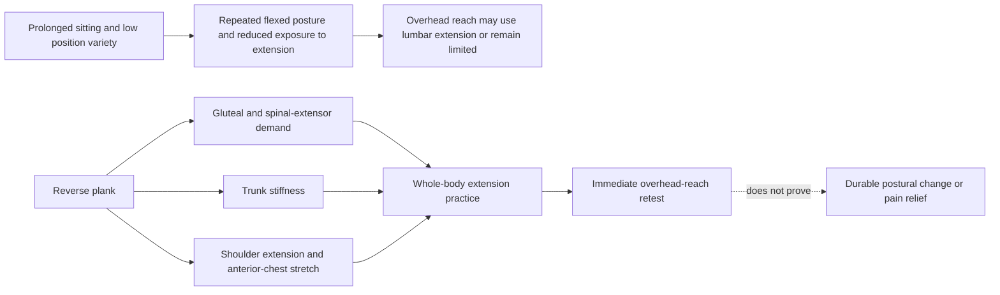

# Sedentary posture and the reverse plank

Posture is a task-dependent arrangement of body segments, not a fixed diagnosis. Prolonged sitting repeatedly exposes the hips and shoulders to flexed positions and reduces movement variety, but a rounded shoulder or anterior pelvic position does not by itself prove that a muscle is shortened, weak, atrophied, or causing pain. A reverse plank can temporarily train the opposite pattern—hip extension, trunk stiffness, scapular retraction and depression, and shoulder extension—while loading the posterior chain and exposing the anterior chest to length. (@SquatUniversity (Squat University) — "Sitting All Day? This One Exercise Fixes Everything!", 2026-07-12, [link](https://www.youtube.com/watch?v=mwaEHn2mZsE)) [[daily-movement-mobility-and-pain]]

## What the drill trains

From long sitting with the legs straight and hands or forearms slightly behind the hips, raise the pelvis until the trunk and legs approach a straight line. Actively lift the chest, draw the shoulder blades back and down, and contract the gluteals so the hips do not sag. Using the hands rather than forearms reduces the shoulder-extension demand and may be a more tolerable entry point. The reverse plank is therefore a multi-joint isometric, not a selective test or treatment for one postural muscle. (@SquatUniversity (Squat University) — "Sitting All Day? This One Exercise Fixes Everything!", 2026-07-12, [link](https://www.youtube.com/watch?v=mwaEHn2mZsE)) [[trunk-training]]

An overhead wall reach can make compensation visible: stand with the hips and lower back against a wall and raise the arms without allowing the lumbar spine to arch away. Limited reach may reflect shoulder, thoracic, scapular, or trunk-control constraints; it cannot distinguish them by itself. Comparing the same reach before and immediately after the reverse plank can show an acute change, but improved contact with the wall may reflect motor learning, warm-up, stretch tolerance, or test familiarity rather than corrected structure. (@SquatUniversity (Squat University) — "Sitting All Day? This One Exercise Fixes Everything!", 2026-07-12, [link](https://www.youtube.com/watch?v=mwaEHn2mZsE))

The source reports a study in people with rounded-shoulder posture using five 30-second reverse-plank holds and finding immediate increases in activation of previously underactive muscles alongside decreases in pectoral and upper-trapezius activation. Because the transcript provides no citation, participant details, comparator, persistence, or clinical outcome, this is limited evidence for an acute activation shift. Describing it as a nervous-system reset is a useful metaphor for task-specific recruitment changing after a drill, not proof that posture has been permanently reset. (@SquatUniversity (Squat University) — "Sitting All Day? This One Exercise Fixes Everything!", 2026-07-12, [link](https://www.youtube.com/watch?v=mwaEHn2mZsE))

## Posture, pain, and causality

Static alignment is not enough to identify a pain mechanism. The practical target is therefore tolerance and access to multiple positions, not the unsupported promise that one drill can hold the body in an ideal posture all day. Reverse planks may be useful as one movement break or strength accessory, but the source does not establish that they replace walking, resistance training, workstation changes, or assessment of persistent shoulder, back, or hip pain. (@SquatUniversity (Squat University) — "Sitting All Day? This One Exercise Fixes Everything!", 2026-07-12, [link](https://www.youtube.com/watch?v=mwaEHn2mZsE)) [[daily-movement-mobility-and-pain]]

## Practical implications

- **As a movement break or warm-up, one to several times during a sedentary day: trial a tolerable reverse-plank bout and retest overhead reach or comfort — limited evidence for immediate activation and range effects.** The research protocol reported in the source used five 30-second holds, but that dose has not been shown here to be uniquely necessary or superior. (@SquatUniversity (Squat University) — "Sitting All Day? This One Exercise Fixes Everything!", 2026-07-12, [link](https://www.youtube.com/watch?v=mwaEHn2mZsE))
- **Several times daily: change position and walk rather than relying on one corrective drill — moderate-to-strong for distributed movement, limited for posture correction.** Use the reverse plank only if shoulder extension is comfortable and the drill improves the chosen task. (@SquatUniversity (Squat University) — "Sitting All Day? This One Exercise Fixes Everything!", 2026-07-12, [link](https://www.youtube.com/watch?v=mwaEHn2mZsE)) [[daily-movement-mobility-and-pain]]
- **Two or more times weekly: progressively train the trunk, hips, pulling, and pressing functions needed for durable capacity — strong for resistance training generally, untested by this source for permanently changing resting posture.** The reverse plank is one possible posterior-chain and trunk exercise rather than a complete program. (@SquatUniversity (Squat University) — "Sitting All Day? This One Exercise Fixes Everything!", 2026-07-12, [link](https://www.youtube.com/watch?v=mwaEHn2mZsE)) [[trunk-training]] [[shoulder-force-couples-and-exercise-selection]]

## Gaps & open questions

- What study supports the five-by-30-second protocol, and were the activation changes larger than those from another movement break?
- How long do changes in overhead reach or muscle activation persist, and do they affect pain, function, or work tolerance?
- Which limitation—shoulder extension, overhead elevation, thoracic motion, hip extension, or trunk control—predicts benefit or intolerance?
- Do repeated reverse planks change habitual posture beyond general strength training and more frequent position changes?

## Related

[[daily-movement-mobility-and-pain]] · [[shoulder-force-couples-and-exercise-selection]] · [[trunk-training]] · [[strength-transfer-and-exercise-specificity]] · [[practice-playbook]] · [[aging-model]]
