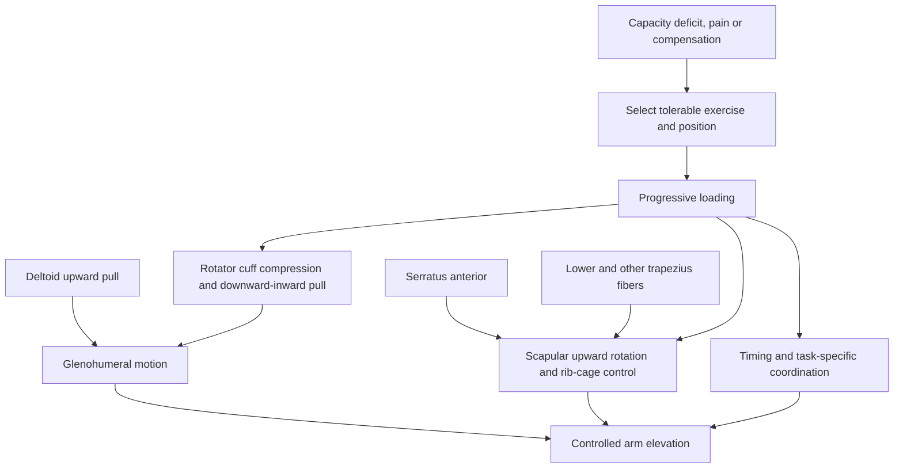
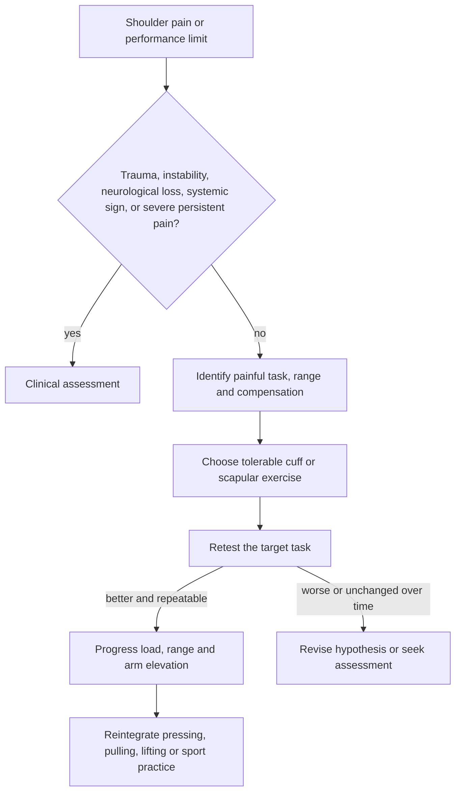

# Shoulder force couples and exercise selection

Shoulder function emerges from coordinated motion at the glenohumeral joint and scapula rather than from one muscle in isolation. During arm elevation, the deltoid produces an upward force on the humerus while the rotator cuff compresses and helps center the humeral head. At the same time, the serratus anterior and trapezius coordinate scapular upward rotation and posterior positioning. These paired actions are force couples: different force directions combine to create controlled joint motion. (@SquatUniversity (Squat University) — "The Only 14 Shoulder Exercises You Ever Need!", 2026-07-28, [link](https://www.youtube.com/watch?v=B3lGOPPBRFg))

## Rotator-cuff functions and exercise matching

The infraspinatus and teres minor externally rotate the shoulder and contribute to posterior cuff control. Side-lying external rotation can load them while limiting deltoid contribution: keep the elbow near the ribs, rotate through the shoulder without flaring the elbow, and use a light load with slow control. A towel under the upper arm can constrain compensation. Standing versions require a band or cable because a dumbbell's gravitational resistance changes with body orientation; excessive scapular retraction can turn the task into a mid-back exercise instead of the intended glenohumeral rotation. (@SquatUniversity (Squat University) — "The Only 14 Shoulder Exercises You Ever Need!", 2026-07-28, [link](https://www.youtube.com/watch?v=B3lGOPPBRFg))

External rotation with the arm by the side is a low-demand entry point, but control does not automatically transfer to an elevated arm. Progressions can therefore support the elbow at an elevated angle, remove that support, and finally combine a row, external rotation, and overhead press. End-range pauses of roughly three to five seconds and light loads are proposed to reduce momentum and expose whether the humerus can rotate without the elbow dropping or scapula substituting. These are position-specific coaching protocols; the source does not report comparative clinical outcomes. (@SquatUniversity (Squat University) — "The Only 14 Shoulder Exercises You Ever Need!", 2026-07-28, [link](https://www.youtube.com/watch?v=B3lGOPPBRFg)) [[strength-transfer-and-exercise-specificity]]

Loaded external rotation can also expose posterior shoulder tissues to internal-rotation range during the lowering phase. The usable endpoint is reached before the front of the shoulder rolls forward; allowing the scapula to tip to manufacture extra range changes the motion being trained. The source presents this as useful when bench pressing is painful and internal rotation is limited, but its single-patient example of immediate pain-free pressing cannot establish efficacy or identify who will respond. (@SquatUniversity (Squat University) — "The Only 14 Shoulder Exercises You Ever Need!", 2026-07-28, [link](https://www.youtube.com/watch?v=B3lGOPPBRFg)) [[daily-movement-mobility-and-pain]]

The supraspinatus contributes to humeral control during elevation. A full-can raise uses thumbs up in the scapular plane, about 30 degrees forward of a strict lateral raise, and stops initially near shoulder height. The source prefers this to a thumbs-down empty-can raise because both recruit supraspinatus and deltoid but the latter is described as reducing subacromial space. Anatomical space alone is not a clinical outcome, so universal claims that the empty-can exercise causes impingement are stronger than the evidence supplied; symptom response, load, and the reason for testing or training still matter. (@SquatUniversity (Squat University) — "The Only 14 Shoulder Exercises You Ever Need!", 2026-07-28, [link](https://www.youtube.com/watch?v=B3lGOPPBRFg))

The subscapularis internally rotates and helps center the humeral head. The source considers isolated internal-rotation work a lower priority for most lifters because this muscle is often relatively stronger than the posterior cuff, while acknowledging that injury and sport demands can reverse that decision. Its prone three-position warm-up begins palms down, then uses palms up and a T position for 20–25 light repetitions; this is a coaching routine rather than evidence that every shoulder needs the same activation sequence. (@SquatUniversity (Squat University) — "The Only 14 Shoulder Exercises You Ever Need!", 2026-07-28, [link](https://www.youtube.com/watch?v=B3lGOPPBRFg))

## Scapular stabilizers

The push-up plus trains scapular protraction around the rib cage and is described as producing high serratus-anterior activation. Because it can also recruit pectoralis minor, the source advises caution when the scapula already presents with prominent anterior tilt or winging and instead proposes a cable or landmine punch that continues into torso rotation and scapular upward rotation. The correct exercise cannot be inferred from surface posture alone, and electromyographic activation does not prove pain relief or superior long-term function. (@SquatUniversity (Squat University) — "The Only 14 Shoulder Exercises You Ever Need!", 2026-07-28, [link](https://www.youtube.com/watch?v=B3lGOPPBRFg))

Lower-trapezius exercises align the arm with the fiber direction in an overhead Y. A prone Y raise uses a thumbs-up position, light load, and a three-to-five-second hold; separating scapular positioning from arm lift can make compensation easier to detect. Floor, bench, hands-behind-head, and banded variants change range and resistance but retain the same intended scapular-control problem. (@SquatUniversity (Squat University) — "The Only 14 Shoulder Exercises You Ever Need!", 2026-07-28, [link](https://www.youtube.com/watch?v=B3lGOPPBRFg))

## A decision framework, not a universal list

Exercise selection should follow the impaired or intolerable task: choose a joint position the person can control, load it without provoking unacceptable symptoms, then progress toward the position and force demands of lifting or sport. Muscle activation can help verify that an exercise loads a target, but pain is not caused simply by one inactive muscle and strengthening a weak muscle does not automatically correct the movement strategy or diagnosis. (@SquatUniversity (Squat University) — "The Only 14 Shoulder Exercises You Ever Need!", 2026-07-28, [link](https://www.youtube.com/watch?v=B3lGOPPBRFg))

## Practical implications

- **Two or three times weekly during a shoulder-capacity block: train the identified cuff and scapular functions with light-to-moderate progressive resistance — moderate for exercise-based rehabilitation generally, limited for this exact menu and sequencing.** Use controlled repetitions and brief end-range holds; increase range, load, or task specificity only when the prior level is tolerated. (@SquatUniversity (Squat University) — "The Only 14 Shoulder Exercises You Ever Need!", 2026-07-28, [link](https://www.youtube.com/watch?v=B3lGOPPBRFg))
- **Before pressing or overhead work: an optional short, light warm-up may rehearse external rotation, scapular upward rotation, and lower-trapezius control — limited for acute performance or injury prevention.** A warm-up should not fatigue the shoulder enough to degrade the main task. (@SquatUniversity (Squat University) — "The Only 14 Shoulder Exercises You Ever Need!", 2026-07-28, [link](https://www.youtube.com/watch?v=B3lGOPPBRFg))
- **At each exercise choice: judge symptom response and transfer to the target task, not muscle burn alone — moderate decision principle.** Stop treating the drill as corrective if it repeatedly worsens symptoms or never improves relevant function. (@SquatUniversity (Squat University) — "The Only 14 Shoulder Exercises You Ever Need!", 2026-07-28, [link](https://www.youtube.com/watch?v=B3lGOPPBRFg)) [[daily-movement-mobility-and-pain]]

## Gaps & open questions

- Which of the activation rankings reported in the source translate into superior pain, function, recurrence, or return-to-sport outcomes?
- Which clinical findings distinguish a cuff-capacity problem from instability, tendon pathology, neurological weakness, referred pain, or primarily load-related sensitivity?
- Does adding end-range pauses or a towel roll improve outcomes beyond ordinary progressive external-rotation training?
- When does a push-up plus worsen clinically meaningful anterior tilt, and can surface scapular posture validly select a serratus exercise?
- How should volume and progression differ for acute pain, postoperative rehabilitation, chronic tendinopathy, and healthy performance training?

## Related

[[daily-movement-mobility-and-pain]] · [[strength-transfer-and-exercise-specificity]] · [[tendon-adaptation-and-rehabilitation]] · [[training-frequency-and-hypertrophy]] · [[practice-playbook]] · [[aging-model]]
