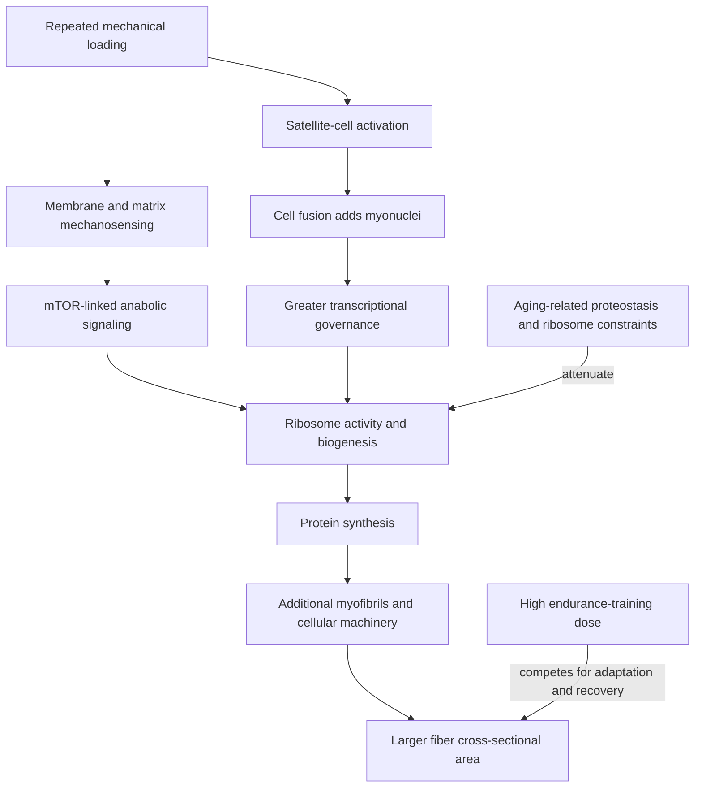

# Skeletal muscle hypertrophy

Skeletal muscle hypertrophy is an increase in muscle size produced mainly by enlargement of existing muscle fibers. In conventional resistance-training studies this is radial growth: fiber cross-sectional area increases as additional myofibrils and supporting cellular machinery accumulate. Human studies discussed in the source commonly use 10–16 weeks of full-body training two or three times weekly; reported averages near 10–15% for whole-muscle cross-sectional area and 20–25% for type 2 fiber area are study-context estimates, not promises for an individual. Type 1 fibers may grow less, particularly in trained people. (@drandygalpin (Andy Galpin) — "What Drives Muscle Growth & What Doesn't | Dr. Mike Roberts", 2026-07-08, [link](https://www.youtube.com/watch?v=CoU8-R0Id-g))

## From load to a larger fiber

Mechanical tension is the initiating signal. Force transmitted through the extracellular matrix and membrane-spanning mechanosensors such as integrin complexes changes intracellular signaling, including pathways that converge on mTOR and protein synthesis. Ribosomes translate messenger RNA into protein; repeated training can increase ribosome content, expanding translational capacity. Myofibrils—the longitudinal bundles containing repeating sarcomeres and their actin–myosin machinery—appear to retain a relatively conserved diameter, so radial growth occurs substantially by adding myofibrils rather than indefinitely thickening each existing one. (@drandygalpin (Andy Galpin) — "What Drives Muscle Growth & What Doesn't | Dr. Mike Roberts", 2026-07-08, [link](https://www.youtube.com/watch?v=CoU8-R0Id-g))

Muscle fibers are unusually long, multinucleated cells. The myonuclear-domain model proposes that each nucleus governs a finite region of cytoplasm; as a fiber expands, nearby satellite cells activate, fuse with it, and donate new myonuclei. Higher responders in the studies described began with more satellite cells and showed larger satellite-cell activation and ribosome increases, making these plausible determinants of response. They are not practical screening tests: biopsy associations do not yet tell a trainee which program will work best. (@drandygalpin (Andy Galpin) — "What Drives Muscle Growth & What Doesn't | Dr. Mike Roberts", 2026-07-08, [link](https://www.youtube.com/watch?v=CoU8-R0Id-g))

Most measured trainees gain at least some muscle, while a small tail—estimated in the source as under about 5%—appears not to grow under a particular study protocol. A nonresponse is therefore protocol- and measurement-specific, not proof of a fixed inability to hypertrophy. At normal physiological concentrations in young adults, circulating testosterone in men and estrogen in women did not predict relative hypertrophy; pharmacologically high testosterone increases growth and profound hypogonadism can blunt, but not necessarily eliminate, it. Young women appear to gain muscle at least as well as young men in relative terms. (@drandygalpin (Andy Galpin) — "What Drives Muscle Growth & What Doesn't | Dr. Mike Roberts", 2026-07-08, [link](https://www.youtube.com/watch?v=CoU8-R0Id-g))

## Dose, load, and proximity to failure

Hypertrophy can occur across a broad loading range when sets approach voluntary fatigue: studies comparing roughly 30% and 80% of one-repetition maximum found similar growth, while the heavier condition produced more strength. Light-load sets require many more repetitions and may be less tolerable. The proposed explanation is threshold-like recruitment and mechanosignaling: once sufficient fibers experience sufficient tension, adding time under tension does not scale growth indefinitely. (@drandygalpin (Andy Galpin) — "What Drives Muscle Growth & What Doesn't | Dr. Mike Roberts", 2026-07-08, [link](https://www.youtube.com/watch?v=CoU8-R0Id-g))

About six hard weekly sets per muscle may produce appreciable growth, while Mike Roberts proposes progressing toward roughly 20 when maximizing hypertrophy or troubleshooting a low response. His escalating-volume study suggested about 20 rather than 32 weekly sets, but it did not randomize parallel groups to each dose, and water changes complicate size measurement. Twenty sets is therefore a high-volume working hypothesis, not a universal optimum. Distributing volume across two or three sessions makes quality and time demands more manageable; taking every set to absolute failure would make this volume unsustainable. This extends the volume-distribution logic in [[training-frequency-and-hypertrophy]]. (@drandygalpin (Andy Galpin) — "What Drives Muscle Growth & What Doesn't | Dr. Mike Roberts", 2026-07-08, [link](https://www.youtube.com/watch?v=CoU8-R0Id-g))

## Aging, mitochondria, and concurrent training

Older muscle remains trainable but may show anabolic resistance. In Roberts's datasets, adults roughly 50–70 years old gained about half as much muscle as college-aged adults under comparable 12-week programs. An unpublished analysis described in the interview associates this attenuation with less remodeling of the muscle proteome, including proteostasis- and ribosome-related proteins, rather than attributing it primarily to menopausal estrogen loss or age-related testosterone decline. Because the analysis was unpublished at recording, both the magnitude and mechanism are preliminary. (@drandygalpin (Andy Galpin) — "What Drives Muscle Growth & What Doesn't | Dr. Mike Roberts", 2026-07-08, [link](https://www.youtube.com/watch?v=CoU8-R0Id-g))

Resistance training does not simply dilute or damage mitochondria. A growing fiber can contain more mitochondria in absolute terms even when mitochondrial density falls, and older deconditioned adults showed mitochondrial-biogenesis signals after resistance training. This does not make lifting equivalent to endurance training for aerobic adaptation. High endurance volume can still interfere with maximal hypertrophy through competing molecular programming, energetic demand, and recovery cost; the simple model in which AMPK switches off mTOR is inadequate. When both goals matter, the source favors a low dose of high-intensity cycling—about two sessions weekly—as a lower-eccentric-load compromise, but this is a goal-specific synthesis rather than a universal concurrent-training prescription. (@drandygalpin (Andy Galpin) — "What Drives Muscle Growth & What Doesn't | Dr. Mike Roberts", 2026-07-08, [link](https://www.youtube.com/watch?v=CoU8-R0Id-g)) [[time-efficient-concurrent-training]]

## What does not yet count as a primary driver

Human lactate infusion around resistance exercise did not augment post-exercise muscle-protein synthesis, weakening the claim that lactate accumulation independently explains growth from metabolite-heavy methods such as blood-flow restriction. Stretch under sufficient load can itself provide mechanical tension, and training at longer muscle lengths may enhance growth, but passive stretching protocols and exercise range-of-motion effects cannot be treated as interchangeable. Muscle damage and soreness often accompany loading but are not established requirements; that conflict is examined in [[muscle-damage-and-hypertrophy]]. (@drandygalpin (Andy Galpin) — "What Drives Muscle Growth & What Doesn't | Dr. Mike Roberts", 2026-07-08, [link](https://www.youtube.com/watch?v=CoU8-R0Id-g))

Whether adult human training adds new fibers—hyperplasia—remains unsettled. Mike Roberts takes the minority position that a small contribution is plausible, citing fiber splitting and the mismatch between whole-muscle size and sampled fiber size in highly trained people. Troy Hornberger and Stuart Phillips reject that interpretation; changes in fiber pennation angle can make cross-sections appear to contain more fibers, biopsies are only tiny snapshots, and some suggestive evidence comes from rodents or anabolic-steroid users. Existing evidence does not support programming specifically to induce hyperplasia. (@drandygalpin (Andy Galpin) — "What Drives Muscle Growth & What Doesn't | Dr. Mike Roberts", 2026-07-08, [link](https://www.youtube.com/watch?v=CoU8-R0Id-g))

## Practical implications

- **Train each target muscle at least twice weekly and accumulate roughly 6–12 challenging sets per week initially — moderate-to-strong for hypertrophy; exact dose individualized.** Add sets gradually when performance, recovery, and measurements show little change; do not jump directly to 20. (@drandygalpin (Andy Galpin) — "What Drives Muscle Growth & What Doesn't | Dr. Mike Roberts", 2026-07-08, [link](https://www.youtube.com/watch?v=CoU8-R0Id-g))
- **Choose loads that permit controlled, hard sets; both light and heavy loads can grow muscle when sufficiently close to failure — strong for a broad load range, with heavier loads better for strength.** Most sets need not reach absolute failure. (@drandygalpin (Andy Galpin) — "What Drives Muscle Growth & What Doesn't | Dr. Mike Roberts", 2026-07-08, [link](https://www.youtube.com/watch?v=CoU8-R0Id-g))
- **Review progress every 4–8 weeks using repeatable strength and circumference or imaging measures — moderate measurement principle.** Treat an apparent nonresponse as a prompt to check adherence, effort, dose, nutrition, recovery, and measurement error before assuming biology prevents growth. (@drandygalpin (Andy Galpin) — "What Drives Muscle Growth & What Doesn't | Dr. Mike Roberts", 2026-07-08, [link](https://www.youtube.com/watch?v=CoU8-R0Id-g))
- **For concurrent aerobic and hypertrophy goals, keep the highest-fatigue endurance work proportionate to the goal and separate it from lifting when practical — moderate.** Low-volume cycling intervals may reduce interference, but aerobic health should not be sacrificed solely to maximize size. (@drandygalpin (Andy Galpin) — "What Drives Muscle Growth & What Doesn't | Dr. Mike Roberts", 2026-07-08, [link](https://www.youtube.com/watch?v=CoU8-R0Id-g))
- **Older adults should continue progressive resistance training two or more times weekly — strong for strength and retained hypertrophy, uncertain for the exact age penalty.** Expect slower size change rather than no adaptability. (@drandygalpin (Andy Galpin) — "What Drives Muscle Growth & What Doesn't | Dr. Mike Roberts", 2026-07-08, [link](https://www.youtube.com/watch?v=CoU8-R0Id-g))

## Gaps & open questions

- Which feasible blood or imaging markers can predict individual hypertrophy response without a biopsy?
- How much of responder variation is stable biology versus training quality, nutrition, recovery, and measurement error?
- Is roughly 20 weekly sets truly optimal for most trained people when tested in randomized parallel-dose trials?
- Which proteostasis, ribosome, chromatin, or nutrient-sensing changes cause age-related anabolic resistance, and can they be modified?
- Does mitochondrial expansion directly enable hypertrophy, or merely accompany the energy and perfusion adaptations of training?
- Does exercise-induced hyperplasia occur in adult humans, and if so, does it contribute meaningfully to ordinary training gains?

## Related

[[resistance-training]] · [[training-frequency-and-hypertrophy]] · [[muscle-damage-and-hypertrophy]] · [[muscle-strength-and-mortality]] · [[time-efficient-concurrent-training]] · [[performance-nutrition-and-hydration]] · [[aging-model]] · [[practice-playbook]]
