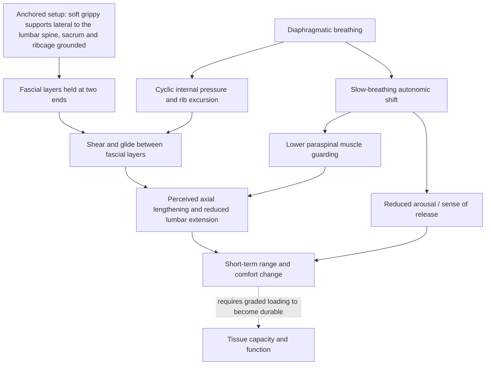

# Spinal traction and fascial decompression

Manual and self-applied soft-tissue work divides into two mechanically opposite families. **Compression** pushes tissue toward underlying bone — the foam roller, the thumb, the massage gun — and shortens the distance between skin and skeleton at the point of contact. **Traction**, or decompression, does the reverse: it applies force that lengthens or offloads a segment, separating structures rather than pressing them together. The two are often bundled under one heading ("rolling out"), but they load tissue differently and a person can respond well to one and poorly to the other. In the low back specifically, traction is reported to produce larger and much longer-lasting subjective change than compression, with relief measured in hours rather than seconds; other body regions may respond better to compression. This is a within-person clinical observation about where each family of technique is worth trying first, not a demonstration that traction outperforms compression on measured outcomes. (@drandygalpin (Andy Galpin) — "How to Decompress your Spine for Lower Back Relief | Dr. Andy Galpin & Jill Miller", 2026-08-11, [link](https://www.youtube.com/watch?v=4pCDgzb12OU))

## The thoracolumbar fascia is a shared tendon, not a wrapper

The thoracolumbar aponeurosis is a stack of flat sheets of dense connective tissue across the low back. It functions as the tendon of latissimus dorsi and of the external oblique, internal oblique, and transversus abdominis, and it invests the erector spinae; further layers envelop psoas and quadratus lumborum. Because so many muscles with different lines of pull terminate in the same laminated structure, force generated in the arm, trunk, or hip is distributed through shared tissue rather than acting on an isolated muscle. Where those layers converge at the lateral border there is a seam, the **lateral raphe**, running roughly between the top of the iliac crest and the twelfth rib. (@drandygalpin (Andy Galpin) — "How to Decompress your Spine for Lower Back Relief | Dr. Andy Galpin & Jill Miller", 2026-08-11, [link](https://www.youtube.com/watch?v=4pCDgzb12OU))

This anatomy makes a specific mechanical prediction: a technique that anchors the layered sheet at its lateral seams and then moves tissue from the inside should generate shear between layers along the whole span, rather than a point-pressure effect. Layered tissue that slides poorly on itself is a plausible contributor to stiffness and to the sensation that a region is "stuck," which is why the intent of the technique is described as glide and slide — restoring relative motion between layers — rather than crushing any single muscle. A skin pinch-and-twist held until the pinch discomfort fades, after which the region moves more freely, is offered as a low-cost demonstration of the same principle. This is a mechanism proposal supported by anatomy and immediate perceived change, not by imaging of layer displacement during the technique. (@drandygalpin (Andy Galpin) — "How to Decompress your Spine for Lower Back Relief | Dr. Andy Galpin & Jill Miller", 2026-08-11, [link](https://www.youtube.com/watch?v=4pCDgzb12OU))

## Breath as the moving force

The distinguishing feature of the technique is that the external tools are static and the mobilizing force is internal. In the described setup — informally the **lumbar hammock**, formally named spinal decompression via the lateral raphe in Jill Miller's *Body by Breath* — two soft, inflatable, high-friction balls are placed on either side of the low back at the level of the lateral raphe, with the sacrum, ribcage, and head resting on the floor. The balls broaden the low back laterally while the spine is free to lengthen axially. The practitioner then breathes diaphragmatically for several minutes; the diaphragm's descent and the rib excursion supply repeated internal pressure changes against the anchored fascial layers, described as "the breath is the tool that's creating this almost like this squeegee swipe balloon action inside your body." No rolling, aggressive friction, or pain is involved. (@drandygalpin (Andy Galpin) — "How to Decompress your Spine for Lower Back Relief | Dr. Andy Galpin & Jill Miller", 2026-08-11, [link](https://www.youtube.com/watch?v=4pCDgzb12OU))

Three effects are reported after several minutes: a sense of axial lengthening from sacrum to skull, a change in resting pelvic position from passive anterior tilt toward neutral, and loss of the feeling of a hypertonic, extended lumbar spine. Because the trunk is a single pressurized container, the same maneuver is proposed to alter loading on abdominal viscera as well as on the spine. Attributed explanations that discs have reperfused or that a person has gained an inch of height are experiential interpretations offered by the practitioner, not measurements; height varies diurnally with disc hydration, and no imaging or stadiometry accompanies the claim. The reliable part of the observation is the perceived postural and tension change, which is testable by simple before-and-after movement screening. (@drandygalpin (Andy Galpin) — "How to Decompress your Spine for Lower Back Relief | Dr. Andy Galpin & Jill Miller", 2026-08-11, [link](https://www.youtube.com/watch?v=4pCDgzb12OU))

Grip is the non-negotiable material property. Producing shear from skin to bone requires the support to hold the skin rather than slide under it, which is why soft inflated rubber balls that feel tacky against skin are specified over hard, slick implements. Improvised substitutes therefore need a high-friction surface: rolled yoga mats or rolled towels can supply the shape, but something grippy must cover them, and small rubber jar openers placed over a rolled towel are suggested as a household approximation. Shape without friction reproduces compression, not traction. (@drandygalpin (Andy Galpin) — "How to Decompress your Spine for Lower Back Relief | Dr. Andy Galpin & Jill Miller", 2026-08-11, [link](https://www.youtube.com/watch?v=4pCDgzb12OU))

## Autonomic and affective effects are part of the mechanism, not a side note

Several reported outcomes are difficult to explain through tissue mechanics alone. The technique is described as producing an emotional release disproportionate to its physical intensity — a sense that held strain has evaporated after lying still on two air-filled balls without pain or movement. The plausible pathway is not mysterious: several minutes of slow diaphragmatic breathing in a supported supine position is itself an autonomic intervention, and reduced arousal lowers protective muscle guarding, which in turn changes both perceived stiffness and available range. This places the practice partly in the same causal territory as [[breathing-mechanics-and-state-regulation]] and the threat-appraisal pathways in [[stress-threat-discrimination]], where perceived safety modifies muscular and pain output. It also predicts that some of the benefit is not specific to the lateral raphe at all — an important open question rather than a settled attribution. (@drandygalpin (Andy Galpin) — "How to Decompress your Spine for Lower Back Relief | Dr. Andy Galpin & Jill Miller", 2026-08-11, [link](https://www.youtube.com/watch?v=4pCDgzb12OU))

The originating context supports this reading: the technique was developed during a period of acute personal stress and panic attacks, in the course of writing about stress regulation, and the practitioner frames much of her soft-tissue work as stress-regulation practice that happens to help with pain and other syndromes. Reported observations in other populations point the same way. An unnamed researcher in Wisconsin is described as working with a firefighter who was failing a stair-climb-with-pack certification test, adding gentle non-painful rolling and other breath-based techniques over about a month, after which she completed the test without pain and with energy to spare; a cohort study in firefighters is being assembled. The same researcher is described as observing immediate postural improvement and reduced or stopped tremor in people with Parkinson's disease. These are uncontrolled single cases and unpublished observations with obvious expectancy, attention, and reporting effects; they justify running the trials, not acting as if the trials have reported. (@drandygalpin (Andy Galpin) — "How to Decompress your Spine for Lower Back Relief | Dr. Andy Galpin & Jill Miller", 2026-08-11, [link](https://www.youtube.com/watch?v=4pCDgzb12OU))

## "Release" is a contested term

The field's standard label, self-myofascial release, embeds a mechanistic claim that the evidence does not support: that the myofascial tissue itself is what releases. Both the physiologist and the practitioner in this source reject the term while disagreeing about what should replace it. The physiologist's position is that the scientific literature does not endorse "release"; the practitioner's position is that the subjective phenomenon is real and clinically important even though its name is wrong, and that "foam rolling" is an equally poor label. Their agreed resolution is to name only what can be verified: "the actual result the the release we can't guarantee. We can guarantee the massage part or the manipulation." Massage, myofascial manipulation, or simply the technique's mechanical description are proposed as honest alternatives. (@drandygalpin (Andy Galpin) — "How to Decompress your Spine for Lower Back Relief | Dr. Andy Galpin & Jill Miller", 2026-08-11, [link](https://www.youtube.com/watch?v=4pCDgzb12OU))

A second, sharper disagreement concerns how to act while evidence is thin. Miller's contrarian position is that the myofascial-release literature is expanding fast — she estimates it has roughly doubled in the last couple of years — but remains behind practice, and that in this specific field clinicians and coaches should be leaned on for technique-level guidance because the science will trail them for some time. That is an explicit inversion of the wiki's default hierarchy, in which practitioner experience generates hypotheses and does not license recommendations. The defensible synthesis is narrow: for a low-risk, non-painful, low-cost technique with an immediately measurable individual response, practitioner-derived protocols are a reasonable thing to test on yourself with test–retest, while claims about tissue remodeling, disc rehydration, or disease modification still require the ordinary evidence. Growth in publication volume is also not evidence of effect — a doubling of a small literature is still a small literature. (@drandygalpin (Andy Galpin) — "How to Decompress your Spine for Lower Back Relief | Dr. Andy Galpin & Jill Miller", 2026-08-11, [link](https://www.youtube.com/watch?v=4pCDgzb12OU))

## Where this sits in the movement system

This technique enters [[aging-model]] where [[daily-movement-mobility-and-pain]] does: as a low-dose exposure that can transiently improve comfort, range, and willingness to move, opening a window in which graded loading can proceed. It does not build tissue capacity by itself. Its distinctive contribution to that branch is the traction-versus-compression distinction and the use of breath rather than external force, which makes it available to people who cannot tolerate pressure-based work. The durable adaptations still come from [[trunk-training]], [[resistance-training]], and accumulated daily movement.

## Practical implications

- **When low-back tension is the complaint, test traction before assuming more compression is needed — limited evidence (practitioner protocol plus uncontrolled reports), low risk.** Foam rolling and traction are not interchangeable, and a poor response to rolling does not predict a poor response to offloading. (@drandygalpin (Andy Galpin) — "How to Decompress your Spine for Lower Back Relief | Dr. Andy Galpin & Jill Miller", 2026-08-11, [link](https://www.youtube.com/watch?v=4pCDgzb12OU))
- **Set up so the supports sit lateral to the lumbar spine between iliac crest and twelfth rib, with sacrum and ribcage grounded, then breathe diaphragmatically for several minutes without rolling — limited evidence.** Nothing should hurt; pain is a signal to change position or stop, not to push through. (@drandygalpin (Andy Galpin) — "How to Decompress your Spine for Lower Back Relief | Dr. Andy Galpin & Jill Miller", 2026-08-11, [link](https://www.youtube.com/watch?v=4pCDgzb12OU))
- **Improvise with grip, not just shape — practical guidance from the source.** Rolled yoga mats or towels need a high-friction cover (rubber jar openers are suggested) to produce shear rather than pressure. (@drandygalpin (Andy Galpin) — "How to Decompress your Spine for Lower Back Relief | Dr. Andy Galpin & Jill Miller", 2026-08-11, [link](https://www.youtube.com/watch?v=4pCDgzb12OU))
- **Use daily to several times weekly if it helps, or in the evening and after long sitting — cadence is a pragmatic wiki extrapolation, not a tested schedule.** Reported relief lasting hours implies re-application rather than a one-time correction; keep it as a supplement to loading, not a replacement.
- **Judge it by test–retest, not by sensation — moderate as a general programming principle.** Screen a relevant movement (forward bend, sit-to-stand, a training set) before and after, and keep the practice only if the retest improves. This is the same decision rule used for other regional drills in [[daily-movement-mobility-and-pain]].
- **Screen for red flags first — strong for the triage principle.** Traumatic mechanism, progressive neurological symptoms, bowel or bladder change, unexplained weight loss, fever, night pain, known vertebral fracture, or severe osteoporosis call for clinical assessment rather than self-applied spinal techniques.

## Gaps & open questions

- How much of the effect comes from fascial shear at the lateral raphe versus slow diaphragmatic breathing, supported supine rest, expectation, and attention? A sham with identical position and breathing but non-grippy supports would separate them.
- Do the reported changes in perceived length, pelvic tilt, and lumbar extension correspond to measurable changes in posture, disc height, or fascial layer displacement?
- How long does the effect last under controlled conditions, and does repeated practice extend it or produce accommodation?
- Does adding this practice to graded loading improve pain, function, or adherence more than graded loading alone in chronic low-back pain?
- Do the firefighter and Parkinson's observations survive controlled testing, and if so does the benefit run through autonomic state rather than tissue?
- Which populations should be excluded — spinal instability, recent fracture, advanced osteoporosis, pregnancy, or post-surgical spines have not been characterized for this technique.
- Is there a defensible replacement term for "myofascial release" that describes the intervention without asserting an unverified mechanism?

## Related

[[daily-movement-mobility-and-pain]] · [[trunk-training]] · [[breathing-mechanics-and-state-regulation]] · [[stress-threat-discrimination]] · [[sedentary-posture-and-reverse-plank]] · [[tendon-adaptation-and-rehabilitation]] · [[resistance-training]] · [[aging-model]] · [[practice-playbook]]
