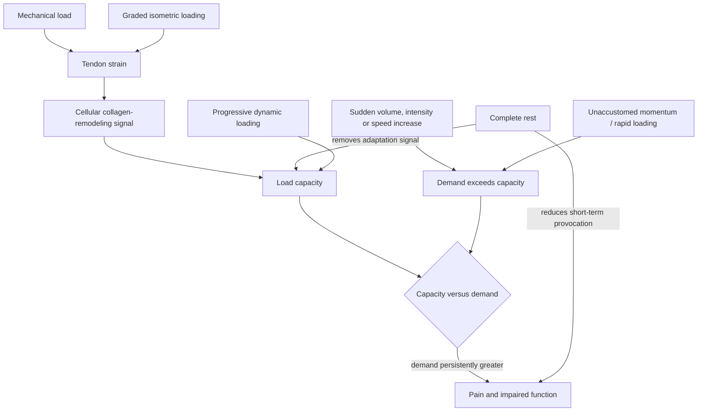

# Tendon adaptation and rehabilitation

Tendons transmit muscle force to bone and temporarily store elastic energy. Their collagen-rich matrix is mechanically strong but adapts more slowly than muscle, so pain and injury risk often arise when training demand rises faster than tissue capacity. Tendon pain is not diagnosed by clicking alone, and recurrent joint-region pain can have causes other than tendon pathology; persistent, severe, traumatic, or function-limiting symptoms require clinical assessment. (@JeremyEthier (Jeremy Ethier) — "It's Weird, But It Re-Builds Your Tendons In 30 Days", 2026-06-28, [link](https://www.youtube.com/watch?v=GSwL3Lgw6zI))

## Load, rate, and tissue capacity

Rapid loading lets a tendon protect muscle by stretching and returning energy, but it also creates high connective-tissue demand. Heavy load and momentum are not intrinsically damaging: trained power athletes adapt to them. Risk rises when volume, intensity, speed, or a new movement changes abruptly. The source proposes keeping increases below roughly 30%, but presents this as a rule of thumb rather than a universally validated threshold; individual capacity and the time window over which load is counted are unspecified. (@JeremyEthier (Jeremy Ethier) — "It's Weird, But It Re-Builds Your Tendons In 30 Days", 2026-06-28, [link](https://www.youtube.com/watch?v=GSwL3Lgw6zI))

Lunge direction illustrates the rate component. A forward-stepping leg transitions from swing to force acceptance at ground contact, whereas the working front leg in a reverse lunge begins planted; this may make reverse lunges more tolerable when rapid knee loading provokes symptoms. The source reports 4.6 times body weight and claims lower patellofemoral and patellar-tendon stress with reverse lunges, but it does not identify the underlying measurement, so the exact force and general injury implication remain unverified. (@athleanx (ATHLEAN-X™) — "Stop Doing Lunges Like This! (SAVE A FRIEND)", 2026-07-27, [link](https://www.youtube.com/watch?v=Pwsn3HR4L90)) [[lunge-biomechanics-and-programming]]

The muscle–tendon capacity gap is a distinct risk pattern with prevention implications, not only rehabilitation ones. Muscle adapts faster than tendon, so a formerly athletic person who retrains or suddenly attempts an explosive movement can carry muscle force that exceeds connective-tissue capacity — the typical setting of midlife Achilles rupture, an injury Attia describes as devastating precisely because it removes months of training. His preventive protocol is deliberately unglamorous: regular calf raises and progressive bouncing/plyometric exposure to strengthen the muscle–bone connective link before explosive demands are reintroduced. This is expert practice with a coherent mechanism rather than trial-validated prophylaxis. (Peter Attia MD — "Building strength and muscle mass: optimize training & nutrition for longevity (AMA #71 rebroadcast)", 2026-07-06, [link](https://www.youtube.com/watch?v=CqNqfb37gig))

Pain relief from complete rest does not necessarily restore capacity because removing provocation also removes the mechanical signal needed for remodeling. The useful alternative is relative rest plus tolerable, progressive loading. This principle does not mean training through every pain state: acute rupture, marked weakness, swelling after trauma, neurological symptoms, or worsening function changes the decision. (@JeremyEthier (Jeremy Ethier) — "It's Weird, But It Re-Builds Your Tendons In 30 Days", 2026-06-28, [link](https://www.youtube.com/watch?v=GSwL3Lgw6zI)) [[daily-movement-mobility-and-pain]]

## Isometric loading

An isometric contraction produces force while joint position remains approximately fixed. Keith Baar’s proposed mechanism is stress relaxation or creep: during a sustained hold, initially stiffer regions lengthen, distributing strain progressively through more of the tendon and stimulating aligned collagen synthesis. Thirty-second holds are proposed to distribute the signal. This is a mechanistic interpretation and clinical protocol from the source, not proof that isometrics uniquely rebuild all symptomatic tendons or outperform progressive isotonic or eccentric rehabilitation. (@JeremyEthier (Jeremy Ethier) — "It's Weird, But It Re-Builds Your Tendons In 30 Days", 2026-06-28, [link](https://www.youtube.com/watch?v=GSwL3Lgw6zI))

The exercise should load the painful function without movement—for example, a static press, curl, wall-supported knee-extension position, or machine hold. A suggested pain-monitoring rule permits symptoms up to 3–4 out of 10 during loading only if the condition is not worse the next day. Immediate analgesia, when it occurs, is a response marker rather than evidence that matrix repair is complete. (@JeremyEthier (Jeremy Ethier) — "It's Weird, But It Re-Builds Your Tendons In 30 Days", 2026-06-28, [link](https://www.youtube.com/watch?v=GSwL3Lgw6zI))

## Practical implications

- **When a familiar tendon-related movement is mildly painful: reduce the provoking load and use three 30-second isometric holds in a similar position, up to twice daily initially — expert-derived protocol with moderate mechanistic rationale but uncertain comparative evidence.** Keep pain at or below 3–4/10 and reduce effort if next-day symptoms worsen. (@JeremyEthier (Jeremy Ethier) — "It's Weird, But It Re-Builds Your Tendons In 30 Days", 2026-06-28, [link](https://www.youtube.com/watch?v=GSwL3Lgw6zI))
- **Continue graded loading three or four times weekly for at least four to eight weeks after early symptom relief, then retain maintenance exposure — moderate rehabilitation principle; exact dose is condition-specific.** Pain improving within one or two weeks does not establish full tissue recovery. (@JeremyEthier (Jeremy Ethier) — "It's Weird, But It Re-Builds Your Tendons In 30 Days", 2026-06-28, [link](https://www.youtube.com/watch?v=GSwL3Lgw6zI))
- **During training changes: increase volume, load, and speed gradually and control the lowering/turnaround phase unless rapid force is a trained goal — moderate risk-management rationale.** The proposed 30% ceiling is a heuristic, not a guarantee. (@JeremyEthier (Jeremy Ethier) — "It's Weird, But It Re-Builds Your Tendons In 30 Days", 2026-06-28, [link](https://www.youtube.com/watch?v=GSwL3Lgw6zI))
- **When forward lunges provoke knee or patellar-tendon pain: trial reverse lunges at a controlled depth and tempo — moderate biomechanical rationale, weak comparative clinical evidence.** Treat the substitution as a way to keep loading within capacity, not proof that forward lunges are inherently damaging. (@athleanx (ATHLEAN-X™) — "Stop Doing Lunges Like This! (SAVE A FRIEND)", 2026-07-27, [link](https://www.youtube.com/watch?v=Pwsn3HR4L90))

- **For formerly athletic adults returning to explosive activity: precede it with weeks of graded calf-raise and bouncing/plyometric preparation to close the muscle–tendon capacity gap — expert protocol, moderate mechanistic rationale, no comparative prevention trial here.** (Peter Attia MD — "Building strength and muscle mass: optimize training & nutrition for longevity (AMA #71 rebroadcast)", 2026-07-06, [link](https://www.youtube.com/watch?v=CqNqfb37gig))

## Gaps & open questions

- Does structured tendon-preparation work (calf raises, graded plyometrics) measurably reduce Achilles rupture incidence in returning midlife athletes?
- For each tendinopathy, how do isometric, eccentric, heavy-slow resistance, and combined protocols compare on pain, function, structure, and recurrence?
- Does creep during a 30-second hold meaningfully distribute strain into disorganized human tendon in vivo?
- What load-progression metric predicts injury better than a fixed percentage rule?
- When is clicking clinically meaningful, and which findings distinguish tendon pathology from joint, bursal, or referred pain?
- Do reverse lunges reduce patellofemoral or patellar-tendon symptoms over time compared with load-matched forward or walking lunges?

## Related

[[lunge-biomechanics-and-programming]] · [[arm-hypertrophy-specialization]] · [[training-frequency-and-hypertrophy]] · [[resistance-training]] · [[muscle-strength-and-mortality]] · [[daily-movement-mobility-and-pain]] · [[strength-transfer-and-exercise-specificity]] · [[performance-nutrition-and-hydration]] · [[practice-playbook]] · [[aging-model]]
