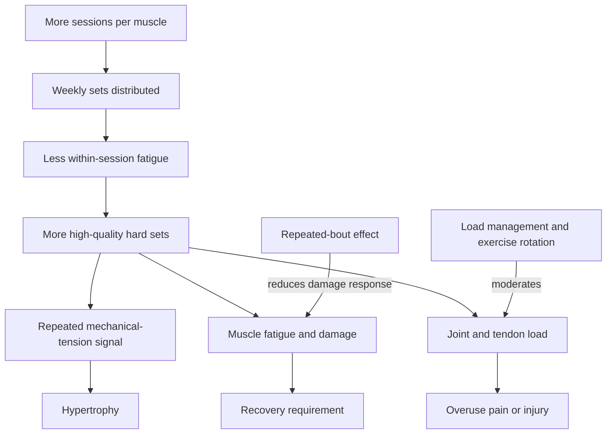

# Training frequency and hypertrophy

Training frequency is how often a muscle is trained over a given period. It is not itself the anabolic dose: hypertrophy depends more directly on the amount of sufficiently hard, recoverable work, while frequency determines how that work is distributed. Spreading volume across sessions can preserve repetition quality and permit more weekly sets, but training every day has no established magic beyond those effects. (@JeremyEthier (Jeremy Ethier) — "It’s Dumb, But It Builds Muscle Almost 4x Faster", 2026-07-26, [link](https://www.youtube.com/watch?v=4OP8FI1TXK8))

## Adaptation and recovery

Hard resistance exercise transiently reduces force capacity and increases muscle-protein synthesis during the subsequent recovery period. Delayed-onset muscle soreness is an imperfect readiness marker: soreness may peak after force production has substantially recovered. Repeated exposure to the same muscular stress also produces a repeated-bout effect, reducing subsequent damage and soreness. These adaptations explain why a muscle can sometimes tolerate short inter-session intervals; they do not prove that incomplete recovery is harmless or that soreness should always be ignored. (@JeremyEthier (Jeremy Ethier) — "It’s Dumb, But It Builds Muscle Almost 4x Faster", 2026-07-26, [link](https://www.youtube.com/watch?v=4OP8FI1TXK8))

The effective frequency range is wide, and the corpus now records both ends. At one end sits the daily-training demonstration below; at the other, Peter Attia's position that with the right exercise selection, intensity, and volume, training each body part hard once per week can suffice — some of the most serious bodybuilders have trained this way — with full-body sessions two to three times weekly better suited to beginners and deeper per-session muscle-group focus emerging with experience. These are not contradictory once frequency is seen as a distribution lever for a recoverable dose: a single very hard weekly exposure can leave a body part needing days of recovery, while lower per-session stress permits more frequent exposure. The disagreement that remains substantive is whether added frequency provides benefit beyond enabling volume, which the demonstration below cannot isolate. (Peter Attia MD — "Building strength and muscle mass: optimize training & nutrition for longevity (AMA #71 rebroadcast)", 2026-07-06, [link](https://www.youtube.com/watch?v=CqNqfb37gig))

How much recovery a session demands also depends on contraction phase, not just volume: the eccentric phase produces the mechanical stress and micro-damage that drives hypertrophy but lengthens recovery, whereas concentric-only work (for example, trap-bar deadlifts with the bar dropped at the top) produces strength and power stimulus with so little tissue damage that it can be repeated three to four times weekly. Deliberately removing the eccentric is therefore a frequency-enabling tool when size is not the goal. On deloading, Mike Israetel's attributed protocol is a significant deload or full off week every eighth week plus an annual two-week break; Attia's position is that most non-elite trainees never train hard enough to need scheduled deloads, which life supplies through travel anyway — a live disagreement about intensity thresholds rather than mechanism. (Peter Attia MD — "Building strength and muscle mass: optimize training & nutrition for longevity (AMA #71 rebroadcast)", 2026-07-06, [link](https://www.youtube.com/watch?v=CqNqfb37gig))

Muscle, tendon, joint, and motivation do not necessarily adapt at the same rate. A schedule that the target muscle tolerates may still overload connective tissue, especially when it repeats the same joint path daily. The source describes exercise rotation and temporary load reduction as safeguards, while also reporting a separate 34-day daily-bench study in which strength rose but more than half of participants were injured; because the underlying study is not identified in the transcript, the exact rate and conditions require verification. (@JeremyEthier (Jeremy Ethier) — "It’s Dumb, But It Builds Muscle Almost 4x Faster", 2026-07-26, [link](https://www.youtube.com/watch?v=4OP8FI1TXK8)) [[tendon-adaptation-and-rehabilitation]]

## What the demonstration can establish

In a 30-day, within-person demonstration, three trained participants trained one side daily for about 35 hard sets per week and the other side twice weekly for about 10 sets. After three rest days, blinded MRI analysis reportedly found more growth on every daily-trained side: roughly 3% versus 1% for arms, 2–3% versus 0% for legs, and almost 20% versus 5% for chest. The daily sides also improved exercise performance more. This is an uncontrolled three-person demonstration that changed both frequency and weekly volume, used different muscles and people, and ran for only one month. It therefore generates a hypothesis that distributed high volume can accelerate short-term growth; it cannot isolate frequency from volume, estimate average effects, establish safety, or support the title’s universal fourfold claim. (@JeremyEthier (Jeremy Ethier) — "It’s Dumb, But It Builds Muscle Almost 4x Faster", 2026-07-26, [link](https://www.youtube.com/watch?v=4OP8FI1TXK8))

Strength gains are also not interchangeable with muscle growth because frequent practice improves coordination and skill in the tested movement. MRI reduces that ambiguity for size, but very short studies remain vulnerable to measurement error and tissue-fluid effects even when several rest days precede scanning. (@JeremyEthier (Jeremy Ethier) — "It’s Dumb, But It Builds Muscle Almost 4x Faster", 2026-07-26, [link](https://www.youtube.com/watch?v=4OP8FI1TXK8)) [[strength-transfer-and-exercise-specificity]]

## Short specialization blocks

A 22-day arm protocol illustrates how frequency can distribute several distinct stimuli: each elbow-flexor and elbow-extensor session occurs about three times weekly, while shortened-position pulses, rest-pause load progression, and slow eccentric work rotate across those exposures. Existing direct arm work is removed, but compound pressing and pulling remain. The protocol therefore tests a package rather than frequency alone, and its guaranteed-growth framing is unsupported because the transcript presents no outcome data. (@athleanx (ATHLEAN-X™) — "How to Get 'Bigger Arms' Fast (22 DAYS | NO B.S)", 2026-07-19, [link](https://www.youtube.com/watch?v=CTblai7olJo)) [[arm-hypertrophy-specialization]]

Short tape-measure intervals are particularly vulnerable to muscle pump, inflammation, glycogen, hydration, landmark placement, and tape tension. Standardization can improve repeatability but cannot turn a 22-day circumference change into a direct measure of new contractile tissue. (@athleanx (ATHLEAN-X™) — "How to Get 'Bigger Arms' Fast (22 DAYS | NO B.S)", 2026-07-19, [link](https://www.youtube.com/watch?v=CTblai7olJo))

## Practical implications

- **For ordinary programming: choose a sustainable weekly volume and distribute it across at least two sessions when a single session’s quality falls — moderate evidence for the general principle; very low evidence from this demonstration for daily training.** Track performance, pain, and recovery rather than soreness alone. (@JeremyEthier (Jeremy Ethier) — "It’s Dumb, But It Builds Muscle Almost 4x Faster", 2026-07-26, [link](https://www.youtube.com/watch?v=4OP8FI1TXK8))
- **For a temporary specialization block: place two or three hard sets for the priority muscle early in several weekly sessions and rotate between two movement patterns — expert protocol with plausible rationale, not directly validated here.** Reduce competing volume and stop escalating if performance declines or joint/tendon symptoms worsen. (@JeremyEthier (Jeremy Ethier) — "It’s Dumb, But It Builds Muscle Almost 4x Faster", 2026-07-26, [link](https://www.youtube.com/watch?v=4OP8FI1TXK8))
- **Do not use seven-day training as a default or infer that 35 weekly hard sets is broadly optimal — strong caution from study-design limits and connective-tissue risk.** Daily exposure should be treated as an advanced, monitored experiment rather than a requirement for growth. (@JeremyEthier (Jeremy Ethier) — "It’s Dumb, But It Builds Muscle Almost 4x Faster", 2026-07-26, [link](https://www.youtube.com/watch?v=4OP8FI1TXK8))
- **For a two- to three-week specialization block: replace overlapping direct work, count compound-work fatigue, and distribute the remaining target volume across up to three sessions — moderate general rationale, very low evidence for the exact arm protocol.** Use performance and joint symptoms to scale progression rather than automatically adding fixed weight or pulses. (@athleanx (ATHLEAN-X™) — "How to Get 'Bigger Arms' Fast (22 DAYS | NO B.S)", 2026-07-19, [link](https://www.youtube.com/watch?v=CTblai7olJo))

- **When training for strength or power without size, concentric-emphasized or eccentric-free variants permit higher weekly frequency — expert protocol with coherent mechanism, no comparative trial in this corpus.** Conversely, keep hypertrophy-focused sessions spaced far enough for eccentric damage to resolve. (Peter Attia MD — "Building strength and muscle mass: optimize training & nutrition for longevity (AMA #71 rebroadcast)", 2026-07-06, [link](https://www.youtube.com/watch?v=CqNqfb37gig))

## Gaps & open questions

- What is the independent effect of frequency when weekly volume, effort, exercise selection, and supervision are matched?
- At what training intensity do scheduled deloads (fixed every-eighth-week protocols) begin to outperform readiness-based back-off?
- How do optimal frequency and volume vary by training age, muscle group, age, sex, sleep, and energy availability?
- Do short specialization blocks produce durable gains after normal training resumes?
- Which performance and symptom thresholds best identify recoverable fatigue before connective-tissue injury develops?
- Do short arm blocks combining rest-pause, partials, and eccentric overload outperform an equal-volume conventional program, and which component matters?

## Related

[[skeletal-muscle-hypertrophy]] · [[muscle-damage-and-hypertrophy]] · [[arm-hypertrophy-specialization]] · [[tendon-adaptation-and-rehabilitation]] · [[strength-transfer-and-exercise-specificity]] · [[resistance-training]] · [[muscle-strength-and-mortality]] · [[performance-nutrition-and-hydration]] · [[daily-movement-mobility-and-pain]] · [[practice-playbook]] · [[aging-model]]
