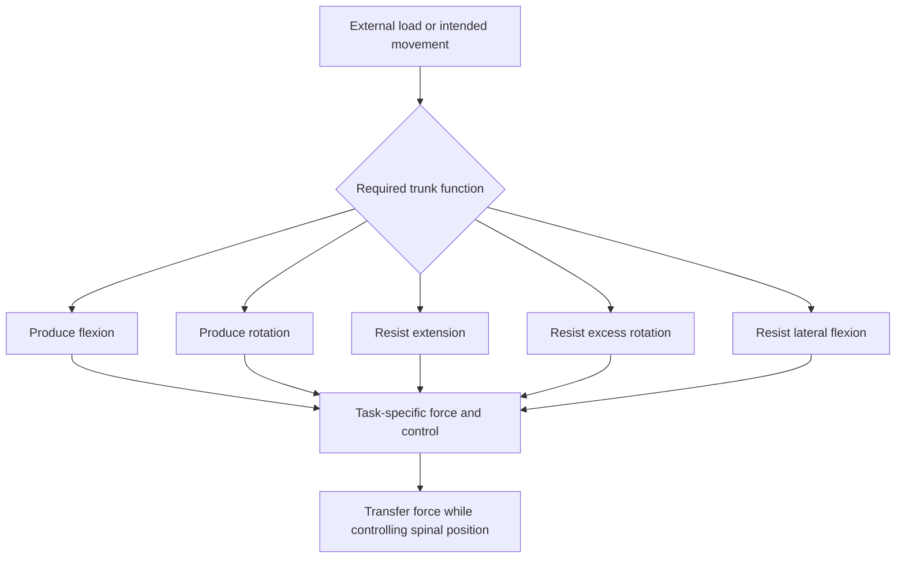
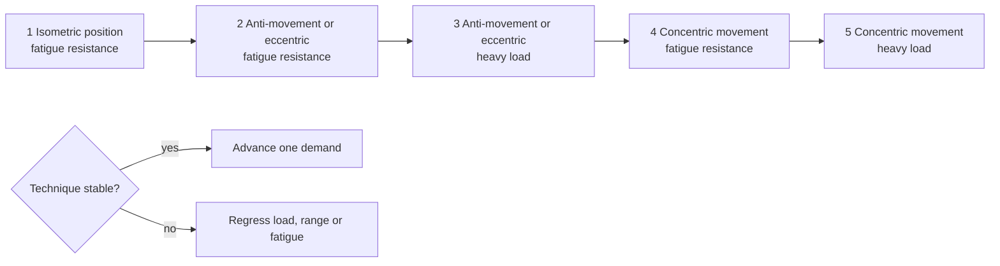

# Trunk training

Trunk training develops the capacity of the torso to create motion when motion is wanted and resist motion when external load would disturb posture. The useful unit is therefore not a named abdominal muscle but a mechanical function: flexion, rotation, anti-extension, anti-rotation, or anti-lateral flexion. A complete program samples both movement production and stabilization rather than treating the core as a single muscle or relying on one exercise. (@drandygalpin (Andy Galpin) — "Simple Weekly Core Workout Plan | Dr. Andy Galpin", 2026-08-08, [link](https://www.youtube.com/watch?v=A6nlC-632nM))

Visible abdominal definition is a separate outcome from trunk capacity. Flexion training can develop the abdominal musculature, but the amount and distribution of overlying fat are governed primarily by whole-body energy balance and anatomy rather than by local exercise. [[abdominal-definition-and-training]] therefore connects this page’s movement functions to [[satiety-oriented-diet-design]] and [[energy-balance-and-calorie-counting]]. (@athleanx (ATHLEAN-X™) — "I'm 51. Here's How I Still Have Visible Abs (WORKS AT ANY AGE)", 2026-08-04, [link](https://www.youtube.com/watch?v=ZOMKA0qCQ_w))

## Mechanical functions

Anti-movement exercises train force production without allowing the imposed direction to dominate. In a loaded dead bug or ab-wheel exercise, the trunk resists extension while the limbs move. In a suitcase carry, a unilateral load creates lateral-bending and rotational moments; walking requires the torso to permit necessary gait rotation while suppressing excess motion. A loaded cable crunch supplies the complementary flexion-producing task. These exercises differ in movement and loading, so one cannot stand in for the whole category. (@drandygalpin (Andy Galpin) — "Simple Weekly Core Workout Plan | Dr. Andy Galpin", 2026-08-08, [link](https://www.youtube.com/watch?v=A6nlC-632nM))

For flexion work, the mechanical endpoint should match the intended function. A top-down curl flexes the trunk as the shoulder blades leave the floor; a bottom-up curl requires pelvic and spinal motion rather than leg movement alone. Sequencing long-lever bottom-up work before combined movements and simpler top-down curls is one way to manage fatigue, but the source does not compare that order with alternatives. Exhaling while narrowing the abdominal wall may cue trunk control, whereas claims of selective lower-abdominal recruitment from squeezing the knees or a leaner appearance from this breathing strategy remain untested in the transcript. (@athleanx (ATHLEAN-X™) — "I'm 51. Here's How I Still Have Visible Abs (WORKS AT ANY AGE)", 2026-08-04, [link](https://www.youtube.com/watch?v=ZOMKA0qCQ_w))

## Programming load and variation

Heavy work can use roughly 6–12 repetitions for two or three working sets, provided technique remains controlled. External resistance can turn familiar low-load exercises into strength tasks: a dead bug may be loaded with a kettlebell, ankle weights, or bands, while a suitcase carry can progress toward the heaviest load that grip and posture allow. The aim is task failure near the intended repetition range, not accumulating dozens of easy repetitions. (@drandygalpin (Andy Galpin) — "Simple Weekly Core Workout Plan | Dr. Andy Galpin", 2026-08-08, [link](https://www.youtube.com/watch?v=A6nlC-632nM))

Variation can occur across a week or across training blocks. An undulating week may alternate heavy 6–12-repetition sessions with higher-repetition sessions of about 15–30 repetitions; a block approach may hold one style for six to eight weeks before changing it. Galpin's distinctive programming preference is to select movements across functional categories rather than isolate individual trunk muscles, while allowing muscle-specific work as an accessory. This is a coherent coaching framework, but the transcript does not compare it with alternative programs in controlled trials. (@drandygalpin (Andy Galpin) — "Simple Weekly Core Workout Plan | Dr. Andy Galpin", 2026-08-08, [link](https://www.youtube.com/watch?v=A6nlC-632nM))

A five-stage progression can scale a single trunk function from positional control to loaded movement: (1) isometric control under fatigue, (2) anti-movement or eccentric control under fatigue, (3) the same pattern under heavier load, (4) concentric movement under fatigue, and (5) heavy concentric movement. A plank, high-repetition controlled reverse crunch or dead bug, loaded eccentric crunch, cable crunch, and heavy 5–8-repetition cable crunch illustrate the sequence. Progression is competency-based rather than calendar-based: technical breakdown defines failure, and a stage may last days or months. This is Galpin's personal coaching framework; the transcript presents no trial comparing it with direct entry into loaded dynamic work. (@drandygalpin (Andy Galpin) — "5 Steps for Training a Strong & Defined Core | Dr. Andy Galpin", 2026-07-19, [link](https://www.youtube.com/watch?v=Xf-4kDiUOPI))

The cue to flex and extend the spine one vertebra at a time may help some people control loaded crunches, but Galpin explicitly identifies little research behind it. It should be treated as an optional coaching cue, not a demonstrated method for preventing back pain; existing pain, neurologic symptoms, osteoporosis, pregnancy, or prior spinal surgery require individualized exercise selection. (@drandygalpin (Andy Galpin) — "5 Steps for Training a Strong & Defined Core | Dr. Andy Galpin", 2026-07-19, [link](https://www.youtube.com/watch?v=Xf-4kDiUOPI))

## Practical implications

- **Each week: include flexion, rotation, anti-extension, and anti-rotation or anti-lateral-flexion work — moderate as a comprehensive programming framework.** The categories may be distributed across sessions rather than performed every day. (@drandygalpin (Andy Galpin) — "Simple Weekly Core Workout Plan | Dr. Andy Galpin", 2026-08-08, [link](https://www.youtube.com/watch?v=A6nlC-632nM))
- **For a strength-focused session: use two or three controlled working sets of about 6–12 repetitions and add load progressively — moderate coaching evidence.** Stop or reduce load when spinal position or intended motion can no longer be controlled. (@drandygalpin (Andy Galpin) — "Simple Weekly Core Workout Plan | Dr. Andy Galpin", 2026-08-08, [link](https://www.youtube.com/watch?v=A6nlC-632nM))
- **Across six- to eight-week blocks or within the week: vary heavy and higher-repetition work according to the goal — plausible but not established as superior.** Track load, repetitions, and technical quality rather than novelty alone. (@drandygalpin (Andy Galpin) — "Simple Weekly Core Workout Plan | Dr. Andy Galpin", 2026-08-08, [link](https://www.youtube.com/watch?v=A6nlC-632nM))
- **During flexion-focused sets: verify shoulder-blade or pelvic motion and stop when limb momentum substitutes for trunk motion — moderate biomechanical rationale, limited outcome evidence for the cues.** Exercise order can place the hardest stable or highest-priority pattern first; it need not always follow one fixed sequence. (@athleanx (ATHLEAN-X™) — "I'm 51. Here's How I Still Have Visible Abs (WORKS AT ANY AGE)", 2026-08-04, [link](https://www.youtube.com/watch?v=ZOMKA0qCQ_w))
- **When learning or returning to loaded trunk flexion: progress from stable holds through eccentric control to active heavy motion only as technique remains stable — expert protocol, untested as a five-stage sequence.** Reassess each session; do not wait a fixed number of weeks to advance or force progression through pain. (@drandygalpin (Andy Galpin) — "5 Steps for Training a Strong & Defined Core | Dr. Andy Galpin", 2026-07-19, [link](https://www.youtube.com/watch?v=Xf-4kDiUOPI))

## Gaps & open questions

- What weekly volume and frequency optimize trunk strength, hypertrophy, pain prevention, or sport transfer for different populations?
- Does category-balanced trunk training outperform compound lifting alone for injury or functional outcomes?
- How should loading be modified for existing spinal pain, pregnancy, osteoporosis, or prior surgery?
- Which tests validly measure anti-rotation and anti-lateral-flexion capacity outside the gym?
- Do adductor co-contraction, abdominal-wall narrowing, or a bottom-up-first exercise order improve hypertrophy, function, or appearance beyond teaching the intended motion?
- Does staged isometric-to-eccentric-to-concentric progression reduce pain or injury, improve adherence, or delay strength gains compared with beginning dynamic loading immediately?
- Are segment-by-segment spinal-flexion cues safer or more effective than self-selected controlled motion in people with and without back pain?

## Related

[[abdominal-definition-and-training]] · [[spinal-traction-and-fascial-decompression]] · [[daily-movement-mobility-and-pain]] · [[exercise-program-design]] · [[resistance-training]] · [[performance-nutrition-and-hydration]] · [[satiety-oriented-diet-design]] · [[youth-resistance-training]] · [[practice-playbook]]
