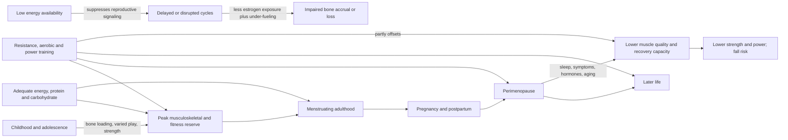

# Women's exercise across the lifespan

Women respond to the same basic training inputs as men — overload, specificity, recovery, and adequate substrate — but the consequences and constraints of training change across reproductive stages. Childhood and adolescence build peak bone, movement skill, and fitness reserve; menstruating years add cyclic symptoms and the possibility of [[low-energy-availability-and-menstrual-function|low energy availability]]; pregnancy and postpartum change load tolerance and recovery; and perimenopause concentrates changes in muscle quality, fat distribution, sleep, symptoms, and metabolic flexibility. The correct framework is therefore a stable physiological foundation with stage-specific adjustments, not a separate female training system. (@PeterAttiaMD (Peter Attia MD) — "378 ‒ Women’s health & performance: how training, nutrition, & hormones interact across life stages", 2026-01-05, [link](https://www.youtube.com/watch?v=CDsH60jt34o))

## Building reserve early

The early objective is broad capacity rather than early specialization. Varied sport and play, supervised total-body resistance work, bands, medicine balls, light weights, and plyometrics expose bone and muscle to different forces while developing movement skill. Menarche is also a common point of sport dropout, so menstrual education and a training environment that does not reward amenorrhea are part of long-term physical development. The source treats resistance training as an injury-prevention tool, but supplies no comparative effect size for girls specifically; this supports the direction of practice more strongly than any single protocol. (@PeterAttiaMD (Peter Attia MD) — "How Early Training Choices Shape Women’s Health for Life | Abbie Smith-Ryan, Ph.D.", 2026-01-09, [link](https://www.youtube.com/watch?v=bsw0pKcWf5c))

Bone is unusually time-sensitive because much of peak density is established by late adolescence, whereas strength and aerobic capacity remain improvable at any age. Early loading raises reserve; later exercise primarily maintains tissue, slows decline, and reduces the functional consequences of loss. The claim that osteoporosis begins in childhood is therefore a reserve model, not a claim that childhood fully determines later fracture risk. (@PeterAttiaMD (Peter Attia MD) — "How Early Training Choices Shape Women’s Health for Life | Abbie Smith-Ryan, Ph.D.", 2026-01-09, [link](https://www.youtube.com/watch?v=bsw0pKcWf5c))

## Menstrual cycles: symptoms versus trainability

Cycle phase is not a reliable universal switch for whether a woman can train or compete. Smith-Ryan's position, based on her laboratory work and the broader literature she describes, is that training is possible throughout the cycle and peak performance generally remains available; late-luteal fatigue, bloating, thermoregulatory change, soreness, mood symptoms, or poorer recovery may nevertheless change how a session feels and how much recovery an individual needs. She therefore favors tracking personal bleeding and symptom patterns and periodizing primarily around goals and events, rather than imposing a generic monthly intensity wave. This is a moderately supported, deliberately contrarian alternative to rigid cycle-synced programming. (@PeterAttiaMD (Peter Attia MD) — "378 ‒ Women’s health & performance: how training, nutrition, & hormones interact across life stages", 2026-01-05, [link](https://www.youtube.com/watch?v=CDsH60jt34o))

Tracking is useful for pattern recognition, not for turning population averages into commands. A repeated fall in performance at the same phase can justify extra sleep, recovery time, hydration, or adjusted expectations; a new or persistent cycle change should instead trigger assessment of pregnancy, energy availability, medication, endocrine disease, and the menopausal transition. The source notes that consumer urine-hormone devices can show daily patterns but are not equivalent to blood assays, so their clinical interpretation remains unsettled. (@PeterAttiaMD (Peter Attia MD) — "378 ‒ Women’s health & performance: how training, nutrition, & hormones interact across life stages", 2026-01-05, [link](https://www.youtube.com/watch?v=CDsH60jt34o))

## Pregnancy and postpartum

Pregnancy is not automatically a reason to stop exercise, but the transcript offers personal practice rather than a clinical protocol. Smith-Ryan frames delivery as a demanding physical event and describes continuing aerobic and resistance work while modifying intensity, emphasizing muscles useful for delivery, maintaining a modest energy surplus, and returning after uncomplicated delivery through walking and light resistance before harder running. This is expert experience with weak generalizability: delivery type, pelvic-floor symptoms, bleeding, pain, anemia, sleep, lactation, and medical complications should govern progression. (@PeterAttiaMD (Peter Attia MD) — "378 ‒ Women’s health & performance: how training, nutrition, & hormones interact across life stages", 2026-01-05, [link](https://www.youtube.com/watch?v=CDsH60jt34o))

## Perimenopause and later life

Perimenopause may be a particularly important intervention window. The discussed longitudinal and imaging work reports changes in muscle size, muscle quality, bone, substrate use, and cardiometabolic physiology during the transition, with some measures appearing more stable after menopause; however, small perimenopausal samples and incomplete separation of chronological aging, hormone change, and lifestyle weaken causal confidence. High-intensity exercise can improve metabolic flexibility despite age and hormone state, while resistance work preserves strength and lean tissue. (@PeterAttiaMD (Peter Attia MD) — "378 ‒ Women’s health & performance: how training, nutrition, & hormones interact across life stages", 2026-01-05, [link](https://www.youtube.com/watch?v=CDsH60jt34o))

The practical priority is a portfolio: progressive [[resistance-training]], aerobic work that includes some vigorous stimulus, and safe power practice. Power matters because rapid force lets a person recover from a stumble; it declines earlier than strength or muscle size. Joint pain, vasomotor symptoms, sleep disruption, and fatigue can reduce tolerable training volume, so symptom treatment may enable training indirectly, but the transcript does not establish that menopause hormone therapy directly increases muscle or that it prevents tendon injury. (@PeterAttiaMD (Peter Attia MD) — "378 ‒ Women’s health & performance: how training, nutrition, & hormones interact across life stages", 2026-01-05, [link](https://www.youtube.com/watch?v=CDsH60jt34o))

It is never physiologically too late to begin: older women can gain strength and muscle. A novice may start with controlled machines or bands, total-body push–pull and lower-body work, and unloaded versions of carries or balance-demanding tasks, then add load once technique is safe. The transcript describes three resistance days plus movement on most days as a possible starting framework, but also stresses titrating soreness and adherence; this is an example, not a universal prescription. (@PeterAttiaMD (Peter Attia MD) — "378 ‒ Women’s health & performance: how training, nutrition, & hormones interact across life stages", 2026-01-05, [link](https://www.youtube.com/watch?v=CDsH60jt34o))

## Practical implications

- **Childhood and adolescence: combine varied play or sport with supervised total-body strength and impact work several times weekly — moderate-to-strong for capacity; moderate for female-specific injury prevention.** Protect food intake and treat menstrual delay or loss as a health signal, not an achievement. (@PeterAttiaMD (Peter Attia MD) — "How Early Training Choices Shape Women’s Health for Life | Abbie Smith-Ryan, Ph.D.", 2026-01-09, [link](https://www.youtube.com/watch?v=bsw0pKcWf5c))
- **Across menstruating years: train consistently and track symptoms over several cycles before changing the program — moderate.** Adjust recovery when a reproducible pattern exists; evidence is insufficient for universal cycle-synced periodization. (@PeterAttiaMD (Peter Attia MD) — "378 ‒ Women’s health & performance: how training, nutrition, & hormones interact across life stages", 2026-01-05, [link](https://www.youtube.com/watch?v=CDsH60jt34o))
- **During pregnancy and postpartum: continue or resume progressively only within individualized obstetric and pelvic-health guidance — moderate for remaining active, weak for the specific transcript protocol.** New pain, bleeding, pressure, incontinence, or delayed recovery warrants clinical assessment. (@PeterAttiaMD (Peter Attia MD) — "378 ‒ Women’s health & performance: how training, nutrition, & hormones interact across life stages", 2026-01-05, [link](https://www.youtube.com/watch?v=CDsH60jt34o))
- **From the late 30s onward: prioritize progressive strength, some vigorous aerobic work, and safely scaled power — moderate-to-strong for fitness and function; preliminary for uniquely perimenopausal metabolic effects.** Use symptoms and recovery to set dose rather than abandoning intensity categorically. (@PeterAttiaMD (Peter Attia MD) — "378 ‒ Women’s health & performance: how training, nutrition, & hormones interact across life stages", 2026-01-05, [link](https://www.youtube.com/watch?v=CDsH60jt34o))
- **For a previously sedentary older adult: begin two or three nonconsecutive total-body sessions weekly and movement on most days, initially with supervision when feasible — moderate.** Progress from controlled, unloaded skill to resistance while limiting soreness enough to preserve attendance. (@PeterAttiaMD (Peter Attia MD) — "378 ‒ Women’s health & performance: how training, nutrition, & hormones interact across life stages", 2026-01-05, [link](https://www.youtube.com/watch?v=CDsH60jt34o))

## Gaps & open questions

- Which observed perimenopausal changes are caused by ovarian hormones rather than age, sleep, activity, or energy intake?
- Does aligning periodized training to an individual's cycle improve outcomes beyond symptom-guided adjustment?
- How should menopause hormone therapy and training be combined, and do benefits arise directly in tissue or indirectly through sleep, pain, and capacity?
- What progression best restores power while minimizing tendon and joint injury in symptomatic midlife women?
- Which pregnancy and postpartum prescriptions are safe and effective by delivery type, complication, and prior training status?

## Related

[[low-energy-availability-and-menstrual-function]] · [[time-efficient-concurrent-training]] · [[youth-resistance-training]] · [[resistance-training]] · [[cardiorespiratory-fitness]] · [[performance-nutrition-and-hydration]] · [[perimenopause-assessment-and-testing]] · [[tendon-adaptation-and-rehabilitation]] · [[muscle-strength-and-mortality]] · [[aging-model]] · [[practice-playbook]]
