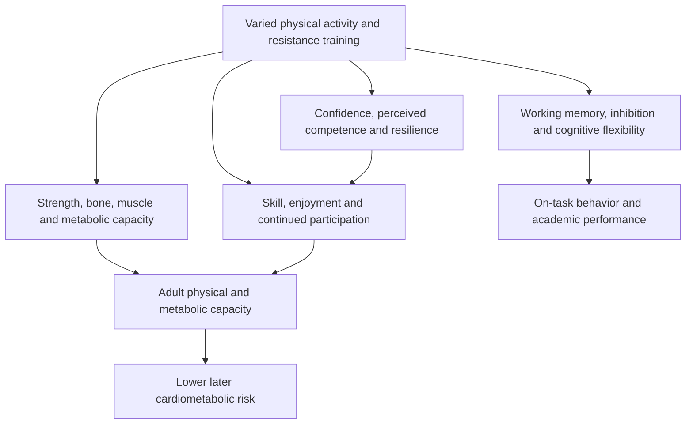
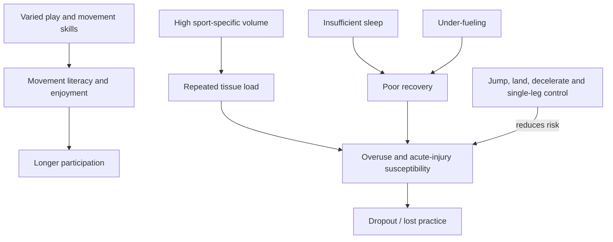

# Youth resistance training

Youth resistance training is developmentally appropriate exercise in which children and adolescents work against external resistance to improve force production, movement skill, and physical capacity. Its relevance extends beyond sport: physical activity and strength work can affect musculoskeletal and metabolic development, cognitive performance, mental health, perceived competence, and the likelihood of remaining active later in life. The transcript reports these domains together but does not provide the age ranges, program doses, or study-level effect sizes needed to prescribe a universal protocol. (@drandygalpin (Andy Galpin) — "Health Benefits of Strength Training in Kids | Dr. Andy Galpin", 2026-08-02, [link](https://www.youtube.com/watch?v=Re2sad9Bd5s))

## Developmental pathways

## Cognitive and psychological outcomes

Endurance exercise has a well-established association with better executive function in children, especially working memory, inhibition, and cognitive flexibility. The source describes newer evidence that resistance training can produce statistically significant and clinically meaningful, though not large, improvements in intelligence-related measures. Greater total activity and participation in a wider variety of sports are also associated with cognition, direct academic achievement, and on-task behavior. These findings support physical activity as a contributor to learning conditions, but they do not show that exercise substitutes for teaching or that every measured association is causal. (@drandygalpin (Andy Galpin) — "Health Benefits of Strength Training in Kids | Dr. Andy Galpin", 2026-08-02, [link](https://www.youtube.com/watch?v=Re2sad9Bd5s))

Reported psychosocial associations include lower anxiety and depressive symptoms, benefit in ADHD-related outcomes, greater confidence and self-esteem, perceived competence, and resilience. Perceived competence is mechanistically important because children who believe they perform poorly relative to peers may withdraw from activity, reducing practice and reinforcing the initial gap. Resistance training can offer measurable, individual progression outside competitive sport, but the transcript does not distinguish randomized effects from selection into sport or quantify adverse events. (@drandygalpin (Andy Galpin) — "Health Benefits of Strength Training in Kids | Dr. Andy Galpin", 2026-08-02, [link](https://www.youtube.com/watch?v=Re2sad9Bd5s))

## Lifecourse evidence

For girls, the reserve model has a particularly time-sensitive bone branch: much of peak density is established by late adolescence, while delayed menarche or amenorrhea associated with heavy training and inadequate intake can reduce the hormonal support for bone accrual. Menarche is also a reported dropout point from sport, making menstrual education, adequate fueling, and normalization of resistance training part of continued participation rather than peripheral health topics. [[low-energy-availability-and-menstrual-function]] (@PeterAttiaMD (Peter Attia MD) — "How Early Training Choices Shape Women’s Health for Life | Abbie Smith-Ryan, Ph.D.", 2026-01-09, [link](https://www.youtube.com/watch?v=bsw0pKcWf5c))

More-active children tend to become stronger adults, and the source describes lower later type 2 diabetes and atherosclerosis among those who were active, played sports, or strength trained when young. Confidence rises because similar patterns appear across sibling-controlled analyses, direct follow-up extending roughly 40 years, interventions, questionnaires, and epidemiology. This is convergent rather than definitive evidence: familial adjustment reduces one class of confounding, but later behavior and social conditions can still mediate or confound the association. (@drandygalpin (Andy Galpin) — "Health Benefits of Strength Training in Kids | Dr. Andy Galpin", 2026-08-02, [link](https://www.youtube.com/watch?v=Re2sad9Bd5s))

A complementary reserve argument sharpens why the early years matter: strength, VO2 max, and bone density peak around the fourth decade and then decline, so lifetime trajectory depends on two levers — the height of the peak and the slope of the decline. Training hard before and during the peak years raises the starting point of the entire later curve, which is why someone who reached a very high VO2 max in adolescence can remain relatively high decades later despite normal decline. The corollary caution is equally attributed: reaching genetic potential should not require the injuries that often accompany uninformed maximal training in youth, since injury is itself the main accelerant of later decline. (Peter Attia MD — "Building strength and muscle mass: optimize training & nutrition for longevity (AMA #71 rebroadcast)", 2026-07-06, [link](https://www.youtube.com/watch?v=CqNqfb37gig))

The distinctive practical position is that sport is optional while broad physical activity is not. Organized sport is one delivery system, but children who dislike competition can obtain relevant physical, cognitive, and emotional exposure through non-sport strength training and varied movement. This separates the health objective from athletic identity and allows the intervention to be adapted around competence and enjoyment. (@drandygalpin (Andy Galpin) — "Health Benefits of Strength Training in Kids | Dr. Andy Galpin", 2026-08-02, [link](https://www.youtube.com/watch?v=Re2sad9Bd5s))

## Movement literacy, specialization, and recovery

Youth development should build a broad movement vocabulary before maximizing sport-specific volume. Running, acceleration, jumping and single-leg landing, throwing and catching, tumbling, crawling, and bodyweight control expose children to perception and coordination that isolated drills miss. Play changes shapes and decisions in ways that fixed repetitions do not, while later adolescence can add progressively formal strength and conditioning. Early specialization is not automatically harmful, but continuous single-sport volume without an off-season, free play, or complementary movement narrows exposure and can combine with sleep loss and under-fueling to raise injury and dropout risk. (@FoundMyFitness (FoundMyFitness) — "The Scientific Formula for a 'Healthy Day' | Dr. Kelly Starrett", 2026-05-04, [link](https://www.youtube.com/watch?v=IXmOJsfebMM))

Neuromuscular warm-up programs that teach hopping, landing, deceleration, and single-leg control have substantially better injury-prevention support than decorative “agility” drills or extra pitching, hitting, and private skill volume. The transcript invokes FIFA's validated lower-extremity program as an example but gives no study estimates, so the direction is credible while the magnitude cannot be reconstructed here. Sleep and adequate total energy are foundational recovery inputs; the source's proposed minimum of eight hours for adolescent athletes is a practical floor, not a complete age-specific sleep guideline. (@FoundMyFitness (FoundMyFitness) — "The Scientific Formula for a 'Healthy Day' | Dr. Kelly Starrett", 2026-05-04, [link](https://www.youtube.com/watch?v=IXmOJsfebMM))

## Practical implications

- **Most days: provide varied, enjoyable physical activity — strong for general child health; moderate for specific academic and long-term disease effects.** Organized sport is optional, and variety should not become forced specialization. (@drandygalpin (Andy Galpin) — "Health Benefits of Strength Training in Kids | Dr. Andy Galpin", 2026-08-02, [link](https://www.youtube.com/watch?v=Re2sad9Bd5s))
- **Regularly: include supervised, developmentally appropriate resistance training — moderate-to-strong for strength and broader health, moderate for cognitive benefit.** Emphasize movement competence, progressive challenge, and a psychologically safe setting; the source does not establish a universal weekly dose. (@drandygalpin (Andy Galpin) — "Health Benefits of Strength Training in Kids | Dr. Andy Galpin", 2026-08-02, [link](https://www.youtube.com/watch?v=Re2sad9Bd5s))
- **Each training block: track mastery and self-referenced progress rather than peer ranking — mechanistically plausible, with moderate psychosocial support.** The aim is to strengthen perceived competence and continued participation. (@drandygalpin (Andy Galpin) — "Health Benefits of Strength Training in Kids | Dr. Andy Galpin", 2026-08-02, [link](https://www.youtube.com/watch?v=Re2sad9Bd5s))
- **At school or clinical review: consider physical activity when attention, mood, confidence, or metabolic risk is being assessed — moderate.** Exercise complements rather than replaces educational, psychological, or medical treatment. (@drandygalpin (Andy Galpin) — "Health Benefits of Strength Training in Kids | Dr. Andy Galpin", 2026-08-02, [link](https://www.youtube.com/watch?v=Re2sad9Bd5s))
- **Each practice: include an evidence-based neuromuscular warm-up emphasizing landing, deceleration, and single-leg control — moderate-to-strong for lower-extremity injury reduction.** Train the program consistently rather than adding more sport-specific “junk volume.” (@FoundMyFitness (FoundMyFitness) — "The Scientific Formula for a 'Healthy Day' | Dr. Kelly Starrett", 2026-05-04, [link](https://www.youtube.com/watch?v=IXmOJsfebMM))
- **Daily and weekly: protect adequate sleep, total energy, movement variety, and genuine time away from repetitive sport load — strong for sleep and nutrition adequacy; moderate for specialization-risk management.** Persistent pain, fatigue, falling performance, menstrual disruption, or mood change warrants assessment rather than normalization. (@FoundMyFitness (FoundMyFitness) — "The Scientific Formula for a 'Healthy Day' | Dr. Kelly Starrett", 2026-05-04, [link](https://www.youtube.com/watch?v=IXmOJsfebMM))

## Gaps & open questions

- Which resistance-training dose, supervision model, and exercise selection best fit each developmental stage?
- How much of the academic association is mediated by executive function, sleep, mood, classroom behavior, or socioeconomic factors?
- Do benefits differ by sex, neurodevelopmental condition, baseline fitness, or access to organized sport?
- Which childhood exposures independently reduce adult diabetes and atherosclerosis after adult activity is measured repeatedly?
- What program features maximize adherence and minimize injury, stigma, and early sport specialization?
- Which specialization patterns are harmful after total load, sleep, nutrition, coaching quality, and off-season time are controlled?

## Related

[[cognitive-reserve-and-brain-health]] · [[exercise-enhanced-learning]] · [[daily-movement-mobility-and-pain]] · [[trunk-training]] · [[muscle-strength-and-mortality]] · [[resistance-training]] · [[womens-exercise-across-the-lifespan]] · [[low-energy-availability-and-menstrual-function]] · [[performance-nutrition-and-hydration]] · [[aging-model]] · [[practice-playbook]]
