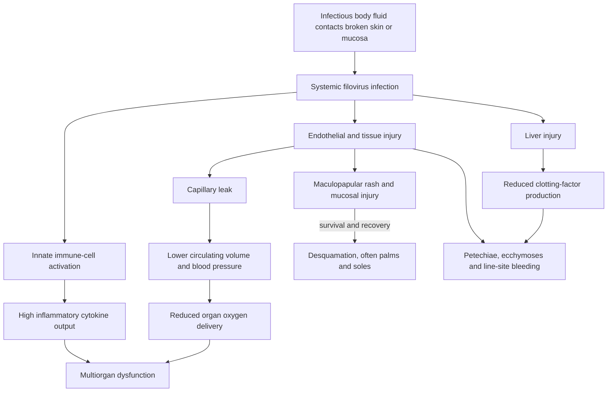

# Ebola virus disease and skin signs

Ebola virus disease is a severe multisystem filovirus infection transmitted when infectious body fluids from an infected person or animal contact broken skin or mucous membranes. It is not described as airborne transmission in this source. The skin findings are clinically useful surface manifestations of deeper innate-immune dysregulation, endothelial injury, liver dysfunction, fluid loss, and impaired coagulation; none is specific enough to diagnose Ebola by appearance alone. (@DrDrayzday (Dr Dray) — "Ebola Rash Explained: Dermatologist Breaks Down the Skin Signs", 2026-08-05, [link](https://www.youtube.com/watch?v=oD6Uch-vfkQ))

## From infection to visible signs

After an incubation interval, illness typically begins abruptly with nonspecific fever, fatigue, headache, myalgia, arthralgia, appetite loss, and sometimes dry cough. Gastrointestinal disease can then produce nausea, vomiting, diarrhea, and abdominal pain, compounding vascular leakage with major fluid loss. Conjunctivitis, painful swallowing, sore throat, and mucosal bleeding can appear as disease advances. Intractable hiccups with fever have historically been associated with severe disease, but are a red flag in context rather than a diagnostic sign. (@DrDrayzday (Dr Dray) — "Ebola Rash Explained: Dermatologist Breaks Down the Skin Signs", 2026-08-05, [link](https://www.youtube.com/watch?v=oD6Uch-vfkQ))

The characteristic eruption is a non-itchy, nonspecific maculopapular rash, often appearing about four to six days into illness on the upper arms, thighs, and trunk before becoming more confluent. Dusky or purpuric areas may develop as vascular and coagulation injury advances. In survivors, desquamation can begin several days later and may be conspicuous on palms and soles because of their thick stratum corneum; the rash can resolve over subsequent weeks. Petechiae are pinpoint hemorrhages, whereas coalescing or larger subcutaneous bleeding produces ecchymoses; oozing from catheter sites and bleeding from friable mucosa reflect the same hemostatic failure. (@DrDrayzday (Dr Dray) — "Ebola Rash Explained: Dermatologist Breaks Down the Skin Signs", 2026-08-05, [link](https://www.youtube.com/watch?v=oD6Uch-vfkQ))

Skin biopsy can show cellular swelling, necrosis, endothelial injury, and fibroblast involvement, but these findings overlap with other severe viral infections. Once appropriately fixed in formalin the sampled tissue is described as noninfectious for pathology handling, yet biopsy is not a stand-alone diagnostic test. Diagnosis instead combines epidemiological and exposure history with appropriate laboratory testing such as PCR or antigen detection under infection-control and public-health protocols. (@DrDrayzday (Dr Dray) — "Ebola Rash Explained: Dermatologist Breaks Down the Skin Signs", 2026-08-05, [link](https://www.youtube.com/watch?v=oD6Uch-vfkQ))

Survival does not necessarily end morbidity. Persistent fatigue, muscle weakness, nutritional depletion, eye pain, photophobia, tearing, blurred vision, and delayed telogen effluvium can follow severe illness; the hair shedding may emerge roughly three months after the systemic stress because many follicles synchronously leave active growth. Eye symptoms warrant prompt ophthalmologic evaluation, while post-illness shedding should still be assessed within the broader diagnosis-first framework in [[hair-loss-diagnosis-and-scalp-health]]. (@DrDrayzday (Dr Dray) — "Ebola Rash Explained: Dermatologist Breaks Down the Skin Signs", 2026-08-05, [link](https://www.youtube.com/watch?v=oD6Uch-vfkQ))

## Practical implications

- **Immediately after a plausible exposure or compatible febrile illness in an epidemiological-risk setting: avoid unprotected contact and contact emergency/public-health services — strong safety practice.** A rash image, skin biopsy, or resemblance to measles cannot safely rule Ebola in or out; exposure history, systemic course, and laboratory testing determine the pathway. (@DrDrayzday (Dr Dray) — "Ebola Rash Explained: Dermatologist Breaks Down the Skin Signs", 2026-08-05, [link](https://www.youtube.com/watch?v=oD6Uch-vfkQ))
- **In clinical care: treat petechiae, mucosal bleeding, line-site oozing, hypotension, and severe fluid loss as systemic danger signs — strong.** They represent vascular, coagulation, and volume failure rather than a skin-limited disorder and require specialized infection control and supportive care. (@DrDrayzday (Dr Dray) — "Ebola Rash Explained: Dermatologist Breaks Down the Skin Signs", 2026-08-05, [link](https://www.youtube.com/watch?v=oD6Uch-vfkQ))
- **During recovery: monitor vision, strength, nutrition, skin healing, and delayed shedding — moderate.** Persistent ocular pain, light sensitivity, tearing, or blurred vision merits prompt ophthalmologic care; diffuse shedding several months later may be telogen effluvium but should not be assumed when the pattern is atypical or persistent. (@DrDrayzday (Dr Dray) — "Ebola Rash Explained: Dermatologist Breaks Down the Skin Signs", 2026-08-05, [link](https://www.youtube.com/watch?v=oD6Uch-vfkQ))

## Gaps & open questions

- Which combinations of skin and mucosal signs improve early recognition without generating excessive false positives among other febrile viral illnesses? (@DrDrayzday (Dr Dray) — "Ebola Rash Explained: Dermatologist Breaks Down the Skin Signs", 2026-08-05, [link](https://www.youtube.com/watch?v=oD6Uch-vfkQ))
- Can serial skin sampling provide clinically useful information about endothelial or immune injury beyond blood-based testing? (@DrDrayzday (Dr Dray) — "Ebola Rash Explained: Dermatologist Breaks Down the Skin Signs", 2026-08-05, [link](https://www.youtube.com/watch?v=oD6Uch-vfkQ))
- What predicts persistent ocular, nutritional, neuromuscular, and hair-cycle complications among survivors? (@DrDrayzday (Dr Dray) — "Ebola Rash Explained: Dermatologist Breaks Down the Skin Signs", 2026-08-05, [link](https://www.youtube.com/watch?v=oD6Uch-vfkQ))

## Related

[[immune-recognition-and-trafficking]] · [[hair-loss-diagnosis-and-scalp-health]] · [[skin-barrier-and-moisturization]] · [[dr-dray]]
