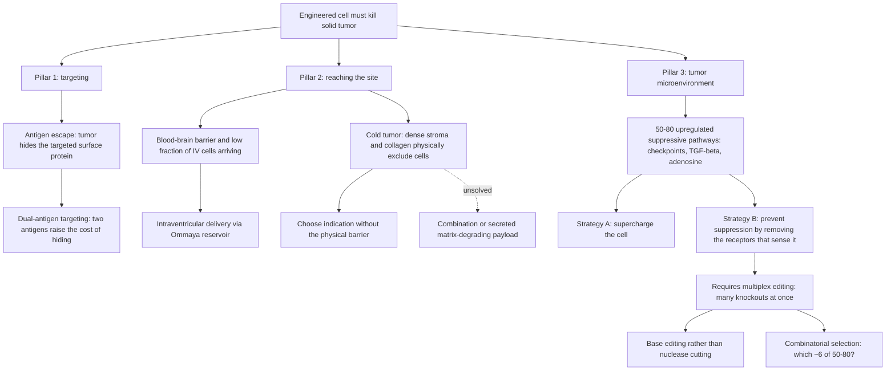

# Engineered cell therapy for solid tumors

Engineered cell therapy takes a living immune cell out of its normal regulatory context, adds recognition and resistance properties it does not naturally possess, and returns it to a patient as a drug that replicates, migrates, and kills. In blood cancers this approach already produces durable remissions. In solid tumors it largely does not, and the reasons why are specific and separable rather than a single unsolved mystery. This chapter treats the solid-tumor problem as a design problem with three distinct failure modes — what the cell targets, whether it arrives, and whether it still works once there — and examines the engineering choices each failure mode forces.

## Immunosurveillance and why it fails

A cancer is a cell lineage with growth that is no longer constrained, usually named for the tissue of origin, arising when a mutation or other change frees it from normal limits. The immune system continuously identifies and removes such abnormal cells, so a clinically apparent cancer represents a case where uncontrolled growth outpaced the immune system's ability to clear those cells rather than a case where surveillance was never operating. (@TheSheekeyScienceShow (The Sheekey Science Show) — "Rewiring Immunity Against Cancer with AI & Gene Editing - Aaron Edwards (KiraGen Bio)", 2025-07-11, [link](https://www.youtube.com/watch?v=OMOCa8DmJxQ))

There is no single reason surveillance loses the race, and the failure is better understood by cancer class than by a general rule. A leukemia circulates through the body, so endogenous immune cells and infused cell therapies encounter it readily. A solid tumor, particularly an intracranial one, is harder for immune cells to reach, identify, and clear, and once reached it deploys offensive and defensive mechanisms that liquid tumors either lack or express differently. Every challenge that exists in blood cancers becomes harder in the transition to solid tumors. (@TheSheekeyScienceShow (The Sheekey Science Show) — "Rewiring Immunity Against Cancer with AI & Gene Editing - Aaron Edwards (KiraGen Bio)", 2025-07-11, [link](https://www.youtube.com/watch?v=OMOCa8DmJxQ))

This framing complements rather than contradicts the checkpoint-threshold account in [[immune-recognition-and-trafficking]]: tolerance of altered self is one mechanism of escape, but location, physical access, and locally secreted suppression are independent mechanisms that a purely threshold-based model does not capture.

## What a chimeric antigen receptor adds to a T cell

Cytotoxic T cells are the usual chassis because they kill target cells directly and because a large body of prior engineering experience exists for them, from both patient and healthy-donor starting material. The same logic can in principle be applied to natural killer cells or gamma delta T cells, whose different characteristics suit different long-term therapeutic goals. (@TheSheekeyScienceShow (The Sheekey Science Show) — "Rewiring Immunity Against Cancer with AI & Gene Editing - Aaron Edwards (KiraGen Bio)", 2025-07-11, [link](https://www.youtube.com/watch?v=OMOCa8DmJxQ))

A chimeric antigen receptor is chimeric in the literal sense: it is an amalgamation assembled from components of T-cell functionality that gives the cell properties it does not naturally have. A T cell natively carries a T-cell receptor. First-generation CAR constructs replace that recognition module with the binding domain of an antibody — an scFv — attached to the T cell, coupled to artificial intracellular signalling domains. The scFv acts as targeting, functioning like a GPS that brings the cell to the tumour cell; when it binds, the artificial domains fire the same signalling cascade a T cell would normally run, effectively forcing the cell to kill what it has bound. The construct thus separates two things evolution had joined: what the cell recognises, and what it does on recognition. (@TheSheekeyScienceShow (The Sheekey Science Show) — "Rewiring Immunity Against Cancer with AI & Gene Editing - Aaron Edwards (KiraGen Bio)", 2025-07-11, [link](https://www.youtube.com/watch?v=OMOCa8DmJxQ))

## The three-pillar failure analysis

Challenges for cell therapy in solid tumors decompose into three pillars: targeting, arrival at the tumor site, and the tumor microenvironment. Treating them as one problem is the standard error, because the interventions differ and because a program that solves one and ignores the others will still fail.

### Pillar one: antigen targeting and antigen escape

Commercialized patient-derived CAR-T products for blood cancers target a single antigen on the tumor surface, such as a B-cell surface protein, and this has produced transformative outcomes. But cancer cells can hide what is being targeted, and they can do so easily. Targeting two antigens rather than one raises the probability that an already-mutated cell cannot escape recognition, and the superiority of two targets over one has been demonstrated rather than merely assumed — a point that sounds like common sense but which, from a scientific and clinical standpoint, had to be established iteratively, minimizing variables so that each layer is built on a known foundation. (@TheSheekeyScienceShow (The Sheekey Science Show) — "Rewiring Immunity Against Cancer with AI & Gene Editing - Aaron Edwards (KiraGen Bio)", 2025-07-11, [link](https://www.youtube.com/watch?v=OMOCa8DmJxQ))

### Pillar two: trafficking and delivery

Trafficking is a rate-limiting step, not a formality. In a leukemia, an infused T cell is likely to encounter the cancer simply by circulating. For a solid tumor the cell must rely on its native ability to home to the tumor site, which was long an open question, though cell therapies are now known to arrive. (@TheSheekeyScienceShow (The Sheekey Science Show) — "Rewiring Immunity Against Cancer with AI & Gene Editing - Aaron Edwards (KiraGen Bio)", 2025-07-11, [link](https://www.youtube.com/watch?v=OMOCa8DmJxQ))

The hot-versus-cold vocabulary describes access rather than temperature, and is acknowledged to be imperfect labelling. Immune cells reach a hot tumor relatively easily; a cold tumor presents a physically dense barrier that any cell struggles to cross. That barrier is built from stroma and collagen, structural components of the microenvironment that exclude cells before any signalling question arises. Notably, current engineered products may include nothing at all that enhances penetration of a physical barrier — which makes barrier avoidance, not barrier defeat, the operative design decision, and makes indication selection a technical choice rather than a commercial one. A future option is combination with another agent, or engineering the cells to secrete something that degrades the barrier so they can enter and do their job; this remains proposed rather than demonstrated. (@TheSheekeyScienceShow (The Sheekey Science Show) — "Rewiring Immunity Against Cancer with AI & Gene Editing - Aaron Edwards (KiraGen Bio)", 2025-07-11, [link](https://www.youtube.com/watch?v=OMOCa8DmJxQ))

Intracranial delivery is the clearest worked example of avoiding rather than solving a delivery barrier. Glioblastoma patients frequently already have an Ommaya reservoir surgically installed, a port normally used for chemotherapy delivery, and academic centers have shown that CAR-T cells can be injected directly into it. This bypasses the blood-brain barrier and simultaneously bypasses the physical barriers that have historically excluded cell therapies from cold indications. (@TheSheekeyScienceShow (The Sheekey Science Show) — "Rewiring Immunity Against Cancer with AI & Gene Editing - Aaron Edwards (KiraGen Bio)", 2025-07-11, [link](https://www.youtube.com/watch?v=OMOCa8DmJxQ))

The dose and toxicity argument for local delivery is specific and worth stating in full, because it explains why the route is preferred rather than merely convenient. Immune surveillance in the brain genuinely differs because of the barrier, and whether intravenously infused cells could reach brain tumors at all was a live question. A Stanford trial compared routes within the same patients and found that intravenous infusion does deliver cells to the brain, but fewer of them, so a higher starting dose is required; along the way those cells encounter other tissue, begin activating, and produce systemic toxicity. Direct delivery permits a smaller dose, which is both cheaper and somewhat less toxic, and places the cells at the site. The conclusion is not that intravenous delivery is impossible but that it is not the best route. (@TheSheekeyScienceShow (The Sheekey Science Show) — "Rewiring Immunity Against Cancer with AI & Gene Editing - Aaron Edwards (KiraGen Bio)", 2025-07-11, [link](https://www.youtube.com/watch?v=OMOCa8DmJxQ))

### Pillar three: the tumor microenvironment

The microenvironment contributes both the physical exclusion described above and an active signalling defense. Tumors secrete proteins and can upregulate on the order of 50 to 80 different pathways that rapidly shut down both the endogenous immune system and infused cell therapies. These environments exist around blood cancers too, but are far denser and materially different in solid tumors. (@TheSheekeyScienceShow (The Sheekey Science Show) — "Rewiring Immunity Against Cancer with AI & Gene Editing - Aaron Edwards (KiraGen Bio)", 2025-07-11, [link](https://www.youtube.com/watch?v=OMOCa8DmJxQ))

The suppressive repertoire spans distinct categories, which matters for design because blocking two members of the same category buys less than blocking two categories. Checkpoint molecules such as PD-1 are one category; secreted suppressive mediators such as TGF-beta and adenosine are another. A design that spreads its edits across categories blocks non-overlapping pathways rather than redundantly reinforcing one. (@TheSheekeyScienceShow (The Sheekey Science Show) — "Rewiring Immunity Against Cancer with AI & Gene Editing - Aaron Edwards (KiraGen Bio)", 2025-07-11, [link](https://www.youtube.com/watch?v=OMOCa8DmJxQ))

## Suppression prevention versus supercharging

Two opposed strategies address the same microenvironmental problem. The supercharging strategy makes the T cell intrinsically stronger, adding function so that it overwhelms the suppression it meets; this is a defined approach appropriate to some indications. The suppression-prevention strategy instead removes the cell's ability to receive suppressive signals, knocking out the surface receptors that sense the pathways the tumor upregulates. The argument for prevention over supercharging is that suppression is the actual problem being observed in the translation from leukemias to solid tumors, so addressing it directly is more likely to transfer than adding strength. (@TheSheekeyScienceShow (The Sheekey Science Show) — "Rewiring Immunity Against Cancer with AI & Gene Editing - Aaron Edwards (KiraGen Bio)", 2025-07-11, [link](https://www.youtube.com/watch?v=OMOCa8DmJxQ))

The reason prevention was not pursued earlier is a technical one rather than a conceptual one: it requires targeting many things at once, and until multiplex editing was practical the strategy was unavailable. This is a case where a manufacturing capability, not a biological insight, gates which therapeutic hypothesis can be tested at all. There is also a stated skepticism of silver-bullet approaches — the search for one or two modifications that make cells strong enough for any tumor — on the grounds that no single solution will serve every indication. That is a design philosophy, attributable and defensible, not a demonstrated result. (@TheSheekeyScienceShow (The Sheekey Science Show) — "Rewiring Immunity Against Cancer with AI & Gene Editing - Aaron Edwards (KiraGen Bio)", 2025-07-11, [link](https://www.youtube.com/watch?v=OMOCa8DmJxQ))

## Autologous versus allogeneic manufacturing

Autologous means derived from the patient; allogeneic means derived from someone else. Commercialized products to date are patient-derived, and showing that a patient-derived product works was the necessary first wave before anyone could know what to improve. Its limitations are threefold. It is expensive. It requires a separate manufacturing run per patient, which is a procedural burden and not only a cost one. And every person's cells differ — critically, a patient with cancer already has somewhat dysfunctional immune cells, since that dysfunction is part of why the tumor established itself, so the starting material is compromised at the outset. (@TheSheekeyScienceShow (The Sheekey Science Show) — "Rewiring Immunity Against Cancer with AI & Gene Editing - Aaron Edwards (KiraGen Bio)", 2025-07-11, [link](https://www.youtube.com/watch?v=OMOCa8DmJxQ))

Healthy-donor starting material, collected much as blood is donated but harvesting T cells rather than red cells, addresses both problems at once: the input cells are healthier, and the process can be identical to the one developed in the lab rather than varying per patient. Healthy-donor material is also easier to modify extensively, which is what enables the multiplex editing the suppression-prevention strategy requires. This connects immune aging directly to therapeutic manufacturing — if the quality of a person's own T cells is a limiting input, then engineering from a healthy donor is a way of routing around the immune decline described in [[immune-aging-and-rejuvenation]] rather than repairing it. (@TheSheekeyScienceShow (The Sheekey Science Show) — "Rewiring Immunity Against Cancer with AI & Gene Editing - Aaron Edwards (KiraGen Bio)", 2025-07-11, [link](https://www.youtube.com/watch?v=OMOCa8DmJxQ))

A pre-manufactured product is described as off-the-shelf: rather than collecting a patient's cells, manufacturing, waiting for quality control, and returning the product, the therapy is made in advance and ready when a patient is diagnosed. The clinical value of this depends on the disease's time constant. For recurrent glioblastoma, where expected survival is stated as roughly six to nine months, patients do not have manufacturing time to spend, so speed of access is a therapeutic property rather than a logistical convenience. (@TheSheekeyScienceShow (The Sheekey Science Show) — "Rewiring Immunity Against Cancer with AI & Gene Editing - Aaron Edwards (KiraGen Bio)", 2025-07-11, [link](https://www.youtube.com/watch?v=OMOCa8DmJxQ))

## Multiplex base editing and why cut count is the constraint

Gene editing has moved through generations in the same way cell therapy has. First-generation editors — nucleases and meganucleases — make double-strand cuts. A cut is a perfectly good way to make one change, and marketed products including sickle-cell therapies rely on one. But cuts do not scale: as the number of cuts rises, DNA damage rises with it, repair fails to proceed properly, and downstream consequences accumulate. Cut count, not editing capability in general, is therefore what caps multiplexing. (@TheSheekeyScienceShow (The Sheekey Science Show) — "Rewiring Immunity Against Cancer with AI & Gene Editing - Aaron Edwards (KiraGen Bio)", 2025-07-11, [link](https://www.youtube.com/watch?v=OMOCa8DmJxQ))

Base editors — and other tools capable of the same thing — make many changes simultaneously without generating many cuts, which lifts that cap and makes a biological hypothesis requiring many simultaneous knockouts testable for the first time. A parallel constraint applies on the synthetic-biology side: how much sequence can be inserted into a cell is limited, so payload size caps what can be added even when knockouts are cheap. The practical consequence is that the bottleneck has moved. Editing capability is no longer the limiting factor; decision-making is. (@TheSheekeyScienceShow (The Sheekey Science Show) — "Rewiring Immunity Against Cancer with AI & Gene Editing - Aaron Edwards (KiraGen Bio)", 2025-07-11, [link](https://www.youtube.com/watch?v=OMOCa8DmJxQ))

## The combinatorial selection problem

Choosing roughly six pathways to block from a candidate set of 50 to 80 generates a number of combinations that cannot be enumerated in a wet lab even with unlimited money and people. This is a hard mathematical problem, and it is the point at which computational prioritization stops being optional. The workflow that follows is: narrow the candidate list using clinical-trial data indicating which pathways are genuinely suppressive, use a model to rank combinations, test the best of them in the wet lab, and confirm whether they are good or bad before advancing. The model steers; it does not decide. [[ai-guided-therapeutic-design]] (@TheSheekeyScienceShow (The Sheekey Science Show) — "Rewiring Immunity Against Cancer with AI & Gene Editing - Aaron Edwards (KiraGen Bio)", 2025-07-11, [link](https://www.youtube.com/watch?v=OMOCa8DmJxQ))

Edit count in a real program is not set by the technical maximum. KiraGen Bio's lead program uses six edits — a company statement about a research-stage product, not a validated result — and the stated reason for six is a balance between moving the needle on outcomes and not provoking excessive regulatory concern, with all chosen pathways being well characterized and the design building on a previously quadruple-base-edited product developed at Beam Therapeutics. The underlying principle generalizes: drug development means shipping a good product, learning from it, and iterating, rather than waiting for a hypothetical perfect ten- or twenty-edit design while patients cannot wait. Whether six is enough against 50 to 80 pathways is precisely the question the first clinical data will answer. (@TheSheekeyScienceShow (The Sheekey Science Show) — "Rewiring Immunity Against Cancer with AI & Gene Editing - Aaron Edwards (KiraGen Bio)", 2025-07-11, [link](https://www.youtube.com/watch?v=OMOCa8DmJxQ))

## Persistence as a tunable window

How long an engineered cell survives in the patient is a design parameter with an optimum, not a quantity to maximize. In blood cancers, donor-derived products have historically been less durable than patient-derived ones because they are cleared by the host immune system sooner, so the two manufacturing routes carry different persistence trade-offs. In solid tumors the situation differs again; published trials report persistence ranging from a couple of months to occasionally a couple of years depending on indication. (@TheSheekeyScienceShow (The Sheekey Science Show) — "Rewiring Immunity Against Cancer with AI & Gene Editing - Aaron Edwards (KiraGen Bio)", 2025-07-11, [link](https://www.youtube.com/watch?v=OMOCa8DmJxQ))

The stated design target is a window rather than permanence: long enough to evade both host clearance and tumor suppression and do the job, then cleared. A permanent supercell is explicitly not the goal, and the worry that engineering might produce one is treated as a legitimate concern the design should answer. For glioblastoma the target is persistence beyond roughly a month — longer than current patient-derived products achieve — but not years. This reframes a property usually discussed as efficacy into one that is jointly an efficacy and a safety parameter. (@TheSheekeyScienceShow (The Sheekey Science Show) — "Rewiring Immunity Against Cancer with AI & Gene Editing - Aaron Edwards (KiraGen Bio)", 2025-07-11, [link](https://www.youtube.com/watch?v=OMOCa8DmJxQ))

## Ex vivo, in vivo, and multi-cell-type products

Current practice is ex vivo: cells are removed from a patient or donor, engineered in a lab, and infused. An emerging in vivo alternative delivers the editing machinery to the patient's own cells without removing them, and some in vivo approaches can address multiple cell types at once. Multi-cell-type products are attractive because different immune cell types have complementary capabilities and because the three-pillar problem may not be solvable by one cell type alone. The obstacles are real: getting different cell types to activate through the same engineered components is more challenging and nuanced, and someone has to demonstrate it first before others build on it. Combinations such as a T cell plus an NK cell have been planned on the ex vivo side without much visible progress to date. (@TheSheekeyScienceShow (The Sheekey Science Show) — "Rewiring Immunity Against Cancer with AI & Gene Editing - Aaron Edwards (KiraGen Bio)", 2025-07-11, [link](https://www.youtube.com/watch?v=OMOCa8DmJxQ))

Alpha beta T cells remain the default chassis for reasons of engineering tractability and abundance rather than superiority: they are the most common T-cell type, well represented in the body, and easy to engineer. Gamma delta T cells possess properties alpha beta cells lack but are much harder to engineer, and NK cells offer different capabilities again. The protective pathways identified for alpha beta cells are reported by multiple groups to be protective in other cell types as well, which suggests the suppression-prevention edits may transfer across chassis even though the chassis choice itself is currently made on tractability. (@TheSheekeyScienceShow (The Sheekey Science Show) — "Rewiring Immunity Against Cancer with AI & Gene Editing - Aaron Edwards (KiraGen Bio)", 2025-07-11, [link](https://www.youtube.com/watch?v=OMOCa8DmJxQ))

## Practical implications

- **For clinicians and patients: there is no action to take from this material — the multiplex-edited allogeneic approach described here is preclinical, at research-candidate stage, with no clinical evidence for the specific product.** A stated IND target of early 2028 is a company projection, not a schedule. Existing approved CAR-T products for blood cancers are a separate and evidenced matter; nothing here changes their indications. Evidence: **absent for the specific product; strong for the general principle that solid-tumor CAR-T remains investigational.** (@TheSheekeyScienceShow (The Sheekey Science Show) — "Rewiring Immunity Against Cancer with AI & Gene Editing - Aaron Edwards (KiraGen Bio)", 2025-07-11, [link](https://www.youtube.com/watch?v=OMOCa8DmJxQ))
- **When evaluating any solid-tumor cell-therapy claim, ask which of the three pillars it addresses and what it does about the other two — strong analytical principle.** A program that solves targeting but not delivery, or delivery but not suppression, has not solved the problem. Ask specifically: how many antigens, by what route, and what does the cell do when it meets TGF-beta.
- **Distinguish a persistence claim from an efficacy claim — moderate.** Longer is not automatically better; the target is a window, and permanence is a safety liability. (@TheSheekeyScienceShow (The Sheekey Science Show) — "Rewiring Immunity Against Cancer with AI & Gene Editing - Aaron Edwards (KiraGen Bio)", 2025-07-11, [link](https://www.youtube.com/watch?v=OMOCa8DmJxQ))
- **Treat edit count as a claim requiring justification, not a figure of merit — moderate.** More edits is not intrinsically better; the relevant questions are whether the blocked pathways are non-overlapping, whether they were confirmed suppressive in the target patient population, and what the editing method costs in DNA damage.
- **For researchers: where a combinatorial design space exceeds wet-lab enumeration, the precondition for useful modeling is an assay correlative to clinical outcome, not a bigger model — strong methodological principle.** [[ai-guided-therapeutic-design]]

## Gaps & open questions

- Is six edits sufficient against 50 to 80 suppressive pathways, or does blocking a subset simply select for the remainder? No clinical data yet addresses this.
- Do knocked-out suppressive receptors carry a cost in normal T-cell regulation that only appears at scale — autoimmunity, uncontrolled expansion, or off-tumor activity?
- Does the healthy-donor advantage in starting-material quality outweigh the historical durability disadvantage of allogeneic products in solid tumors specifically, where persistence requirements differ from blood cancers?
- Can a physical stromal or collagen barrier be degraded therapeutically, or will cold tumors remain accessible only by local delivery to anatomically convenient sites?
- How many solid tumors have an anatomically available delivery route comparable to the Ommaya reservoir in glioblastoma? If few, indication selection is a narrow ladder rather than a general strategy.
- What fraction of the microenvironmental suppression observed in trials is receptor-mediated and therefore knockout-addressable, versus metabolic, hypoxic, or physical and therefore not?
- Do multiplex base edits accumulate off-target or bystander changes in ways that only long-term follow-up would reveal?
- Does the tumor microenvironment converge enough across brain indications, and partially across tissues such as breast, to make a model trained on one indication predictive for another?

## Related

[[immune-recognition-and-trafficking]] · [[immune-aging-and-rejuvenation]] · [[ai-guided-therapeutic-design]] · [[inflammaging-and-il-6]] · [[microbiome-directed-cancer-therapy]] · [[genomic-instability-and-dna-repair]] · [[aging-model]]
