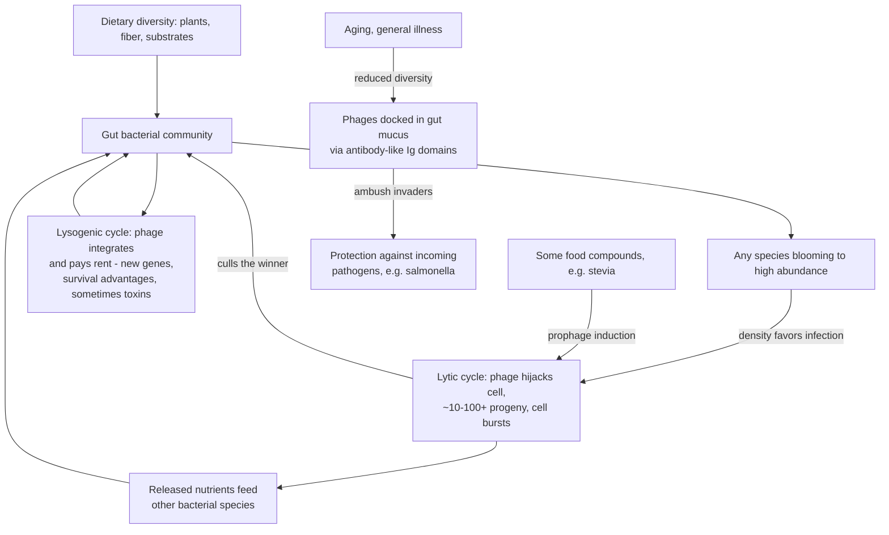

# Gut virome and bacteriophages

Bacteriophages (phages, from the Greek for "to eat") are viruses that infect only bacteria. They are the most numerous biological entities on Earth — an estimated 10³¹, roughly ten phages per bacterial cell everywhere bacteria live, from seawater (about a million bacteria and ten million phages per teaspoon) to the human colon (on the order of ten billion phages per gram of gut contents). The gut microbiome therefore carries a viral layer, the virome, that continuously shapes which bacteria are present. Phage science lags bacterial microbiome science by roughly 25 years (Tim Spector's estimate), and about 80% of gut phage genetic content has no known function — the field's discovery space is mostly unmapped. This page covers the ecology and health correlations; the clinical use of phages against antibiotic-resistant infection is at [[phage-therapy]]. (@joinzoe (ZOE) — "10 million deaths a year! Why did we stop using the one treatment that still works?", 2026-05-21, [link](https://www.youtube.com/watch?v=OLqoYs__A_I))

The primary expert is Martha Clokie, professor of microbiology at the University of Leicester, who has worked on phages for over 20 years from marine ecology to therapeutic development.

## Why phages cannot infect human cells

A virus is a genome in a protein (sometimes lipid) package with no metabolism of its own; it must enter a host cell and hijack its machinery. Entry and replication are both highly specific: a phage recognizes surface structures found only on particular bacteria — often only particular strains within a species — and its genetic program runs only on bacterial machinery. Human cell surfaces are built from entirely different material, so a phage can neither enter a human cell nor do anything if it somehow arrived inside. This double lock is why trillions of phages resident in the gut pose no infection risk, and why the immune system — which vigorously attacks enteric human viruses — treats commensal phages the way it treats commensal bacteria: visible but tolerated, with tolerance trained from infancy as colonization proceeds. (@joinzoe (ZOE) — "10 million deaths a year! Why did we stop using the one treatment that still works?", 2026-05-21, [link](https://www.youtube.com/watch?v=OLqoYs__A_I))

## Two lifestyles: predation and partnership

Phages run two strategies against a bacterial world they have co-evolved with for billions of years. **Lytic** phages inject their genome, convert the cell into a phage factory producing tens to hundreds of progeny, and burst it. **Lysogenic** (temperate) phages integrate and persist — and because carrying a phage must be worth the risk, they characteristically pay their rent (Clokie's phrase): donating genes that make the host bacterium hardier in niches like the anaerobic gut, better at producing certain metabolites, or sometimes more toxic. Ecologically, lytic predation is density-dependent — the more abundant a species becomes, the more likely its phages find it — so phages act as gamekeepers (Clokie) or like wolves culling deer (Spector), pruning blooms before they exhaust their resources and recycling the burst cells' contents as food for other species. The virome is thus a standing regulator of microbiome composition, not a passive passenger. (@joinzoe (ZOE) — "10 million deaths a year! Why did we stop using the one treatment that still works?", 2026-05-21, [link](https://www.youtube.com/watch?v=OLqoYs__A_I))

## The virome as defense layer

Phages carry antibody-like immunoglobulin (Ig) domains on their capsids that let them adhere to the mucus lining the gut (and gums), positioning them where incoming bacteria must pass — a resident ambush against pathogens such as salmonella. Clokie's lab experience makes the point operationally: hunting for salmonella-killing phages, they found none in sick animals (the bacterium had already escaped control) but reliably found them in the feces of healthy pigs, chickens, and sheep — carrying protective phages is part of what being healthy looks like. The system can still be overwhelmed by a large enough inoculum or a weakened host. This mucus-resident protective role is described as demonstrated for mucosal surfaces and likely for the gut. (@joinzoe (ZOE) — "10 million deaths a year! Why did we stop using the one treatment that still works?", 2026-05-21, [link](https://www.youtube.com/watch?v=OLqoYs__A_I))

## Diversity, disease, and the lifespan trajectory

The recurring empirical pattern is that phage diversity mirrors bacterial diversity, which tracks health: twin-cohort work (Spector) finds gut viral diversity correlating with the bacterial diversity already linked to health; Crohn's disease shows reduced phage abundance and diversity; and in some disease states particular bacteria–phage combinations appear to drive pathology while in health the virome maintains balance. Developmentally, phage colonization begins at birth, rises to stabilization around age two, increases again through the teenage years, and — for unknown reasons — declines in diversity with age, paralleling the bacterial pattern in [[immune-aging-and-rejuvenation]]-adjacent microbiome aging. Whether declining virome diversity causes rising late-life infection susceptibility is explicitly not yet known (Clokie declined the inference when offered it). All of these are early, largely correlational findings in a field that concedes 80% ignorance of what it is measuring. (@joinzoe (ZOE) — "10 million deaths a year! Why did we stop using the one treatment that still works?", 2026-05-21, [link](https://www.youtube.com/watch?v=OLqoYs__A_I))

## Diet and the virome

Direct diet–virome evidence is sparse and mostly correlational: a large habitual-diet analysis found coffee drinkers carry distinctively elevated levels of a set of gut phages (function unknown — Spector: probably good, certainly not bad, and causation unestablished; the episode cites a 2026 Nature Communications microbiome paper); an in-vitro food-screening study found some compounds trigger prophage induction — resident lysogenic phages popping out of their hosts — with stevia among the most potent; and unpackaged, garden- or market-grown produce carries far more bacteria and associated phages than bagged, modified-atmosphere salad, with pesticides and herbicides reducing both. The working synthesis, offered as such: the same diverse, plant-rich, minimally processed diet that supports bacterial diversity supports phage diversity, and no phage-specific dietary prescription exists — there is not yet even a concept of which phages are "healthy." (@joinzoe (ZOE) — "10 million deaths a year! Why did we stop using the one treatment that still works?", 2026-05-21, [link](https://www.youtube.com/watch?v=OLqoYs__A_I)) [[food-patterns-and-gut-ecology]] [[coffee-preparation-and-health]]

## Practical implications

- **No virome-specific action is warranted beyond the existing microbiome-supporting pattern — and the sources say so plainly.** Diverse plants, adequate fiber, and minimally processed food remain the route ([[food-patterns-and-gut-ecology]]); the virome adds mechanism, not a new to-do. (@joinzoe (ZOE) — "10 million deaths a year! Why did we stop using the one treatment that still works?", 2026-05-21, [link](https://www.youtube.com/watch?v=OLqoYs__A_I))
- **Optionally: prefer some fresh, minimally packaged (or home/market-grown) produce over exclusively bagged, atmosphere-packed salad — weak evidence (one comparative microbial-load study; no human outcome), low cost.** Wash appropriately; this is not a food-safety exemption. (@joinzoe (ZOE) — "10 million deaths a year! Why did we stop using the one treatment that still works?", 2026-05-21, [link](https://www.youtube.com/watch?v=OLqoYs__A_I))
- **Do not drink untreated "healing" water (the Ganges origin story notwithstanding) or buy phage wellness products — strong safety boundary.** The historical bactericidal observation in Ganges water (Hankin, late 19th century) is real and phage-rich rivers plausibly explain it, but raw river water carries pathogens and human remains exposure; therapeutic phages are purified, matched preparations ([[phage-therapy]]), not the water itself — a distinction Clokie herself draws. (@joinzoe (ZOE) — "10 million deaths a year! Why did we stop using the one treatment that still works?", 2026-05-21, [link](https://www.youtube.com/watch?v=OLqoYs__A_I))

## Gaps & open questions

- What do the ~80% of gut phage genes with no known function encode, and which phages matter for health?
- Is virome diversity a cause of gut health, a mirror of bacterial diversity, or both? No interventional evidence yet exists.
- Why does phage diversity decline with age, and does that decline causally raise infection susceptibility?
- What defines a "healthy" phage community — is there a virome analog of butyrate producers?
- Do diet-driven prophage-induction effects (e.g., stevia) matter physiologically at real intakes?
- Does the coffee–phage association replicate, and which compounds drive it?
- How much of fermented-food and fresh-produce benefit, if any, travels through ingested phages rather than bacteria?

## Related

[[phage-therapy]] · [[food-patterns-and-gut-ecology]] · [[probiotics-prebiotics-and-postbiotics]] · [[dietary-fiber]] · [[coffee-preparation-and-health]] · [[immune-recognition-and-trafficking]] · [[immune-aging-and-rejuvenation]] · [[culinary-mushrooms-and-fungal-nutrition]] · [[tim-spector]] · [[practice-playbook]]
