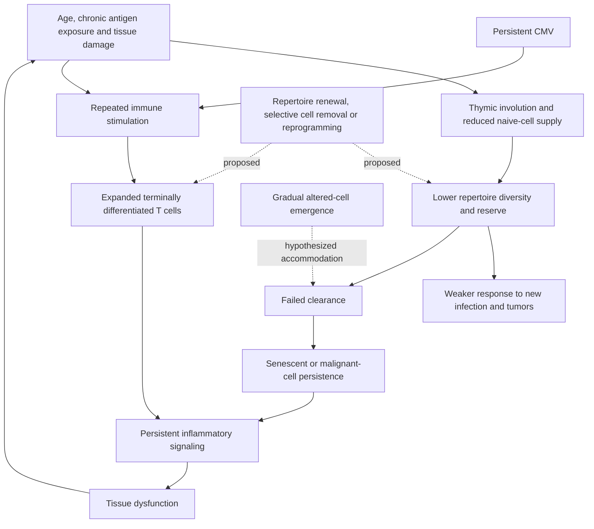

# Immune aging and rejuvenation

Immune aging is the loss of immune diversity, regulation, and adaptive reserve with time. It is not simply weaker immunity: older systems can combine poor responses to new infections and tumors with persistent inflammatory activity and autoimmunity. T-cell composition is especially important. Naive cells retain broad proliferative and differentiation potential, memory cells preserve prior responses, and repeatedly stimulated effector cells can become terminally differentiated, inflammatory, and poor at generating new responses. (@FoundMyFitness (FoundMyFitness) — "Why the Next 10 Years May Add 50 to Your Lifespan | Dr. Derya Unutmaz", 2026-07-22, [link](https://www.youtube.com/watch?v=OJCgQUT1aic))

Aging also makes the tissues being surveyed more heterogeneous. Somatic mutations accumulate in different cell lineages, fitter clones can expand during repair, and the body becomes a mosaic rather than a population of genetically identical cells. Krummel proposes that this expanding variation makes immune discrimination harder at the same time that cell production and function decline: the recognition system must tolerate more versions of self without overlooking malignant or infected cells. This is a mechanistic framing, not proof that somatic mosaicism is the dominant cause of immune aging. [[immune-recognition-and-trafficking]] (@hubermanlab (Andrew Huberman) — "How Your Immune System Works & How to Improve It | Dr. Max Krummel", 2026-08-03, [link](https://www.youtube.com/watch?v=s_tkMm5U9aY))

The discontinuity theory adds a distinct and potentially conflicting explanation for failed surveillance. The ordinary account says declining immune competence permits senescent and malignant cells to persist. The alternative is that these altered states often emerge gradually, so chronic exposure produces accommodation or desensitization before the deviation becomes large; failure would then reflect the time profile of change as well as loss of immune capacity. Eleanor Sheekey presents this as a hypothesis derived from Thomas Pradeu's framework, not a demonstrated root cause of aging. Both mechanisms could operate together, and neither establishes that immune failure initiates organism-wide aging rather than amplifying damage that arose elsewhere. [[immune-recognition-and-trafficking]] [[cellular-senescence]] (@TheSheekeyScienceShow (The Sheekey Science Show) — "Is aging a loss of biological self?", 2025-02-25, [link](https://www.youtube.com/watch?v=cHEyn7MpzXw))

Aging tissue also supplies the immune system with persistent self-derived stimuli, which gives part of the inflammatory state a concrete source rather than leaving it as an unexplained drift. Elastin-derived fragments, released when long-lived matrix elastin is cleaved by elastases, are recognized by an elastin receptor complex on innate immune cells; that recognition activates the innate compartment, which recruits cytotoxic T cells, and the resulting tissue damage liberates further fragments. Fragment levels rise with age in plasma in both mice and humans, and blocking fragment binding to the receptor extended mouse lifespan — additively with rapamycin, arguing that this is a route to mortality partly independent of nutrient sensing. This is an identified, measurable, self-derived ligand driving chronic innate activation, and it does not require senescent cells to explain it. [[extracellular-matrix-aging]] (@TheSheekeyScienceShow (The Sheekey Science Show) — "This years biggest breakthroughs in longevity! (2025)", 2025-12-21, [link](https://www.youtube.com/watch?v=X-Hzyzo1Jpk))

## Composition, function, and measurement

Persistent cytomegalovirus (CMV) illustrates repertoire crowding: a large fraction of a person's T cells can become dedicated to a small number of viral antigens, remain expanded after they would normally contract, and contribute inflammatory signals. Selectively removing dysfunctional cells could improve the composition of blood without rejuvenating skin, brain, liver, or the organism as a whole. This is why a methylation-age change in blood can partly represent changed immune-cell proportions rather than within-cell reversal. Functional immune assessment should therefore distinguish cell counts and phenotype from repertoire diversity, response to new antigen, tumor surveillance, inflammatory output, and clinical outcomes. (@FoundMyFitness (FoundMyFitness) — "Why the Next 10 Years May Add 50 to Your Lifespan | Dr. Derya Unutmaz", 2026-07-22, [link](https://www.youtube.com/watch?v=OJCgQUT1aic))

The immune system also connects aging to cancer. A tumor is derived from self, so immune tolerance can prevent its recognition; checkpoint therapy removes inhibitory signals, engineered CAR-T cells impose recognition of a chosen surface marker, and personalized mRNA vaccines can present tumor-specific mutations to train an immune response. These approaches show that immune recognition is engineerable, but efficacy is cancer- and patient-specific and can be limited by target loss, immune suppression, off-tumor activity, and systemic inflammation. (@FoundMyFitness (FoundMyFitness) — "Why the Next 10 Years May Add 50 to Your Lifespan | Dr. Derya Unutmaz", 2026-07-22, [link](https://www.youtube.com/watch?v=OJCgQUT1aic))

Cancer immunotherapy also provides a bounded proof of principle for restoring recognition: checkpoint inhibitors can remove tumor-induced inhibitory restraint, and engineered T cells can impose a target that the native repertoire missed. This demonstrates that some failures of altered-self surveillance are reversible in selected cancers; it does not show that nonspecific immune activation clears senescent cells, slows aging, or has a favorable whole-body safety profile. The markers and pathways by which immune cells recognize and remove senescent cells remain less settled than tumor-antigen recognition. (@TheSheekeyScienceShow (The Sheekey Science Show) — "Is aging a loss of biological self?", 2025-02-25, [link](https://www.youtube.com/watch?v=cHEyn7MpzXw))

Cell therapy makes the quality of a person's own cytotoxic T cells a manufacturing input rather than an abstract measure, which supplies an unusually concrete test of whether degraded T-cell function matters. A patient with cancer already has somewhat dysfunctional immune cells — that dysfunction is part of why the tumor established itself — so the starting material for an autologous product is compromised before engineering begins. The response is to build from healthy-donor T cells instead, which are both healthier as input and easier to modify extensively. This is engineering around immune decline rather than reversing it, and it inverts the usual framing of this chapter: where rejuvenation strategies ask how to restore a person's repertoire, allogeneic cell therapy asks how to avoid depending on it. The trade-off is durability, since donor-derived products have historically been cleared by the host immune system sooner than patient-derived ones. [[engineered-cell-therapy-for-solid-tumors]] (@TheSheekeyScienceShow (The Sheekey Science Show) — "Rewiring Immunity Against Cancer with AI & Gene Editing - Aaron Edwards (KiraGen Bio)", 2025-07-11, [link](https://www.youtube.com/watch?v=OMOCa8DmJxQ))

## Rejuvenation strategies and evidence

Possible strategies act at different levels: restoring thymic output, selectively depleting harmful expanded clones, engineering replacement immune cells, or partially reprogramming differentiated cells toward a more youthful state without erasing identity. Full Yamanaka-factor reprogramming can return a somatic cell to pluripotency, proving that cellular epigenetic state is reversible; it is not a usable whole-body rejuvenation protocol because loss of identity and tumor formation are central risks. Partial reprogramming aims to recover youthful function while preserving lineage, but delivery, timing, tissue specificity, cancer risk, and functional benefit remain experimental. [[thymus-regeneration]] [[biological-age-reversal]] (@FoundMyFitness (FoundMyFitness) — "Why the Next 10 Years May Add 50 to Your Lifespan | Dr. Derya Unutmaz", 2026-07-22, [link](https://www.youtube.com/watch?v=OJCgQUT1aic))

Derya Unutmaz's distinctive forecast is that AI-assisted biological engineering will eventually enable an “immune system 2.0” and that complete age reversal may arrive within roughly 15–20 years. This is an attributed technological prediction, not clinical evidence. His more defensible near-term claim is narrower: immune systems contain measurable cell states, targets, and feedback that AI may help model and engineer, while experiments and clinical validation remain necessary. (@FoundMyFitness (FoundMyFitness) — "Why the Next 10 Years May Add 50 to Your Lifespan | Dr. Derya Unutmaz", 2026-07-22, [link](https://www.youtube.com/watch?v=OJCgQUT1aic))

## Practical implications

- **At routine preventive cadence: maintain vaccination and manage infections, metabolic disease, smoking, sleep, and physical activity — strong for established health outcomes, indirect for immune rejuvenation.** These actions reduce avoidable immune burden but have not been shown to rebuild a youthful repertoire wholesale. (@FoundMyFitness (FoundMyFitness) — "Why the Next 10 Years May Add 50 to Your Lifespan | Dr. Derya Unutmaz", 2026-07-22, [link](https://www.youtube.com/watch?v=OJCgQUT1aic))
- **When evaluating an immune-aging intervention: require cell-composition, repertoire, function, inflammation, safety, and clinical endpoints — strong methodological principle.** A younger blood clock or larger thymus alone is insufficient. (@FoundMyFitness (FoundMyFitness) — "Why the Next 10 Years May Add 50 to Your Lifespan | Dr. Derya Unutmaz", 2026-07-22, [link](https://www.youtube.com/watch?v=OJCgQUT1aic))
- **Do not use growth hormone, gene therapy, immune-cell depletion, or reprogramming factors for anti-aging outside a regulated trial — strong safety conclusion.** The prospective mechanisms include malignancy, autoimmunity, infection, and loss of tissue identity. (@FoundMyFitness (FoundMyFitness) — "Why the Next 10 Years May Add 50 to Your Lifespan | Dr. Derya Unutmaz", 2026-07-22, [link](https://www.youtube.com/watch?v=OJCgQUT1aic))

## Gaps & open questions

- Which age-associated immune-cell changes are causes of systemic aging rather than consequences or compensations?
- Can harmful antigen-specific expansions be removed without losing pathogen control?
- What combination of repertoire, challenge-response, inflammation, and clinical endpoints validates immune rejuvenation?
- Can partial reprogramming preserve cell identity and immune memory while reducing cancer risk?
- How much of age-associated innate activation is driven by self-derived matrix fragments, and would blocking that recognition impair normal remodeling and wound repair?
- Is the dysfunction of a cancer patient's T cells measurable well enough before manufacturing to predict whether an autologous product will underperform, which would make the autologous-versus-allogeneic choice a stratifiable one?
- Does gradual emergence of senescent or malignant phenotypes cause immune accommodation independently of immune-cell aging, and can rate-of-change experiments distinguish the two mechanisms?
- Which recognition signals are necessary and sufficient for immune clearance of senescent cells in living humans?

## Related

[[aging-model]] · [[immune-recognition-and-trafficking]] · [[engineered-cell-therapy-for-solid-tumors]] · [[inflammaging-and-il-6]] · [[extracellular-matrix-aging]] · [[cellular-senescence]] · [[therapeutic-plasma-exchange]] · [[thymus-regeneration]] · [[biological-age-biomarkers]] · [[biological-age-reversal]] · [[ai-guided-therapeutic-design]]
