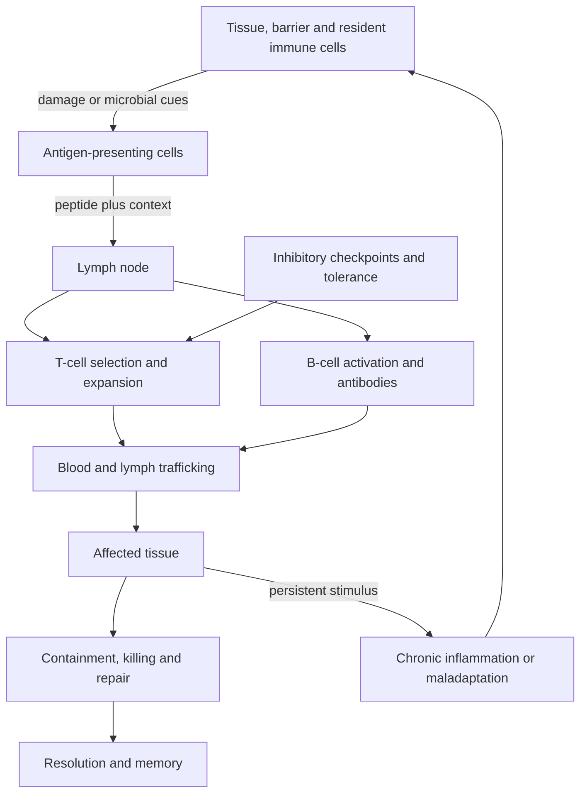
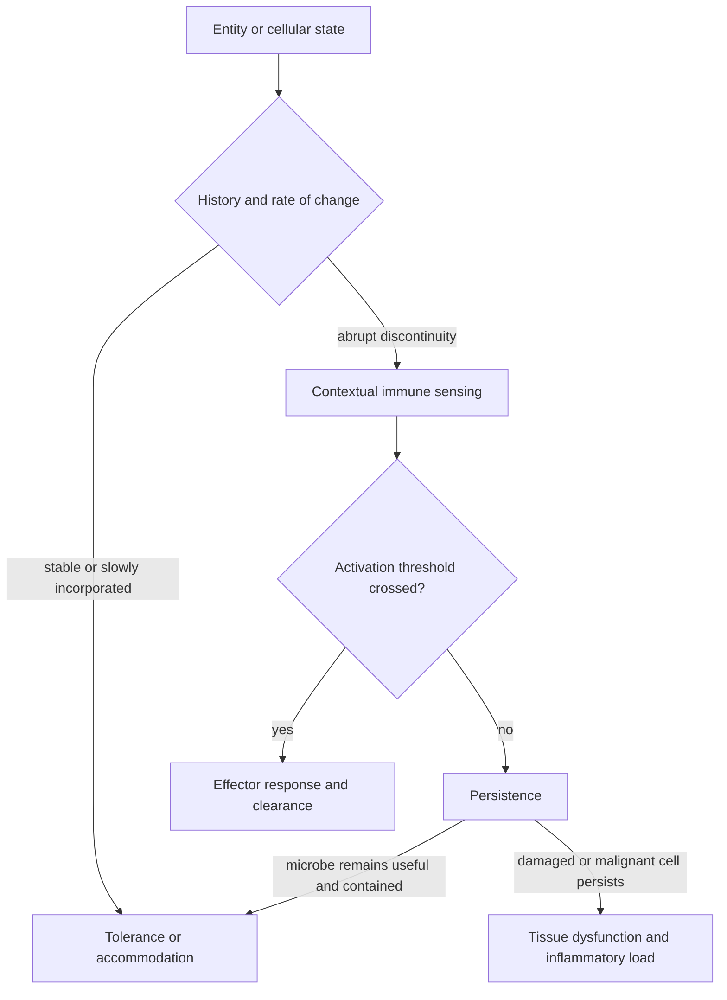
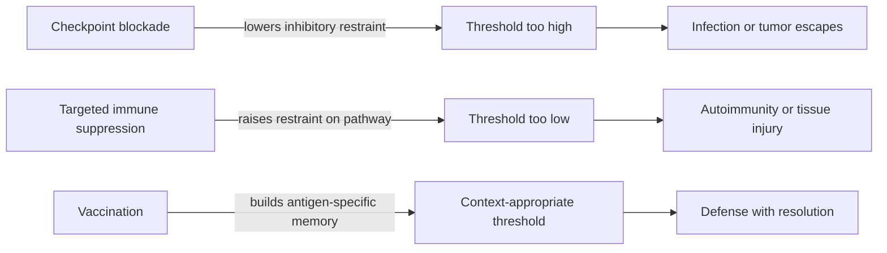

# Immune recognition and trafficking

The immune system is a distributed sensing, communication, and repair network. It must detect harmful change without destroying healthy tissue, tolerate useful microbes while containing them, remove damaged cells, and coordinate local repair. Immunity is therefore not simply on against infection and off at rest: activation thresholds, tissue context, cell movement, memory, and inhibitory signals continually tune what response occurs. (@hubermanlab (Andrew Huberman) — "How Your Immune System Works & How to Improve It | Dr. Max Krummel", 2026-08-03, [link](https://www.youtube.com/watch?v=s_tkMm5U9aY))

## Recognition is contextual

T cells act as mobile sensors whose receptors recognize short peptide fragments presented by other cells. Recognition alone is insufficient: concentration, co-stimulation, inhibitory checkpoints, tissue signals, and prior activation help determine whether a cell ignores, assists, kills, or becomes dysfunctional. B cells generate antibodies against extracellular targets, while innate and tissue-resident cells supply rapid sensing, containment, cleanup, and instructions for adaptive responses. The system also supports homeostasis in the gut, liver, heart, and brain, including tolerance of commensal microbes and clearance of cellular by-products. (@hubermanlab (Andrew Huberman) — "How Your Immune System Works & How to Improve It | Dr. Max Krummel", 2026-08-03, [link](https://www.youtube.com/watch?v=s_tkMm5U9aY))

Housekeeping clearance is a load-bearing immune function with disease consequences when it fails. About 90% of women experience retrograde menstruation — endometrial tissue refluxing through the fallopian tubes into the pelvis — yet only about 10% develop endometriosis; pelvic macrophages normally clear the refluxed tissue, and immune dysregulation that lets clearance fall behind the load (a load roughly quadrupled by the modern four-fold increase in lifetime ovulatory cycles) is a proposed gate between a near-universal exposure and a chronic disease. Poor sleep is suggested to shift macrophage phenotype and impair this clearance, though causal evidence is limited. This makes endometriosis a concrete example of tissue-level immune capacity, not just recognition, determining outcomes. [[endometriosis]] (Peter Attia MD — "397 - Endometriosis and adenomyosis: diagnosis, fertility, reproductive aging, & emerging treatments", 2026-06-22, [link](https://www.youtube.com/watch?v=IxHRYDM64dQ))

The body’s boundary includes microbial ecosystems on surfaces and in the gut. Early life therefore requires both defense and negotiated tolerance. Infants initially have limited adaptive experience; subsequent infections and vaccination build memory while microbial exposure helps establish a diverse ecosystem. The transcript proposes that reduced early immune activity may protect a rapidly changing developing body from self-reactivity, but this evolutionary explanation is more speculative than the established observation that infant immune responses and vaccine schedules differ by age. (@hubermanlab (Andrew Huberman) — "How Your Immune System Works & How to Improve It | Dr. Max Krummel", 2026-08-03, [link](https://www.youtube.com/watch?v=s_tkMm5U9aY))

### Biological identity as continuity

A binary self/non-self rule cannot by itself explain tolerance of commensal microbes, pregnancy, autoimmunity, or surveillance of tumors and senescent cells, all of which are mixtures of familiar and altered material. The discontinuity theory instead treats immunity as change detection: persistent molecular patterns tend to acquire tolerance, whereas sufficiently abrupt departures from the current tissue context are more likely to trigger an effector response. On this view, biological self is not a fixed inventory of molecules but a regulated continuity among host cells, microbes, and tissue signals. Thomas Pradeu developed this framing; the transcript uses it as an explanatory theory rather than presenting direct evidence that rate of change is the immune system's master variable. (@TheSheekeyScienceShow (The Sheekey Science Show) — "Is aging a loss of biological self?", 2025-02-25, [link](https://www.youtube.com/watch?v=cHEyn7MpzXw))

The theory complements rather than replaces antigen specificity, co-stimulation, checkpoints, and tissue geography. A stable microbe can still become pathogenic if it crosses a barrier, and an abruptly changing host cell can remain invisible if it lacks a presented target or suppresses the response. Conversely, autoimmunity shows that host origin does not guarantee tolerance. Continuity is therefore one input to contextual recognition, not a clinical diagnostic rule. (@TheSheekeyScienceShow (The Sheekey Science Show) — "Is aging a loss of biological self?", 2025-02-25, [link](https://www.youtube.com/watch?v=cHEyn7MpzXw))

## Movement through tissues

Immune function depends on geography. Blood transports cells rapidly, lymphatic vessels drain tissue fluid and antigens, and lymph nodes create meeting places where rare antigen-specific lymphocytes can encounter presenting cells and expand. Some lymphocytes remain resident in particular tissues, where local blood flow, growth factors, nerves, and stromal cells shape their behavior. A systemic peptide or infused cell can therefore fail because it does not reach the right compartment or because the local tissue supplies the wrong instructions. (@hubermanlab (Andrew Huberman) — "How Your Immune System Works & How to Improve It | Dr. Max Krummel", 2026-08-03, [link](https://www.youtube.com/watch?v=s_tkMm5U9aY))

Trafficking becomes rate-limiting, rather than merely relevant, when the effector cell is an infused drug. A circulating blood cancer is encountered by an infused T cell almost incidentally; a solid tumor requires the cell to home to a specific site, and whether cell therapies could do so was long an open question, though they are now known to arrive. Where the barrier is physical rather than instructional — dense stroma and collagen surrounding a so-called cold tumor — no amount of correct signalling substitutes for access. Trafficking failure and suppression failure are therefore separate problems with separate remedies, a distinction that a threshold-based model of immune function does not by itself supply. [[engineered-cell-therapy-for-solid-tumors]] (@TheSheekeyScienceShow (The Sheekey Science Show) — "Rewiring Immunity Against Cancer with AI & Gene Editing - Aaron Edwards (KiraGen Bio)", 2025-07-11, [link](https://www.youtube.com/watch?v=OMOCa8DmJxQ))

The brain is the clearest case of compartment-specific access constraining immunity. Immune surveillance in the brain genuinely differs because of the blood-brain barrier, and the extent of that difference has been a contested question. A Stanford trial compared delivery routes within the same patients: intravenously infused cells do reach the brain, but fewer arrive, so a higher starting dose is needed, and en route those cells encounter other tissue and begin activating, producing systemic toxicity. Delivering directly into the ventricular space through an already-installed Ommaya reservoir bypasses both the barrier and the intervening tissue, permitting a smaller and less toxic dose. The general lesson is that the geography described above is not only about where cells can go but about what they do to the patient on the way. (@TheSheekeyScienceShow (The Sheekey Science Show) — "Rewiring Immunity Against Cancer with AI & Gene Editing - Aaron Edwards (KiraGen Bio)", 2025-07-11, [link](https://www.youtube.com/watch?v=OMOCa8DmJxQ))

Sleep and stress can affect this traffic and signaling rather than merely changing a single global immunity score. Chronic stress is associated with impaired defense, whereas short acute stress can temporarily mobilize immune activity; these directionally different effects make duration and context essential. The transcript discusses sleep-dependent immune-cell migration and neuroimmune communication mechanistically, but does not establish an exact sleep dose that optimizes immunity or show that deliberate acute stress prevents illness. (@hubermanlab (Andrew Huberman) — "How Your Immune System Works & How to Improve It | Dr. Max Krummel", 2026-08-03, [link](https://www.youtube.com/watch?v=s_tkMm5U9aY))

## Cancer, autoimmunity, and tunable thresholds

Cancer exposes the limits of a binary self/non-self model because a tumor is altered self. Inhibitory checkpoint molecules can keep tumor-reactive T cells below an activation threshold; checkpoint-blocking antibodies release that brake, while CAR-T cells impose recognition of a selected surface target and tumor vaccines present tumor-associated peptides. Dramatic responses in some cancers prove that thresholds can be therapeutically tuned, but nonresponse, immune toxicity, tumor heterogeneity, and loss of the target show that activation is neither universally effective nor intrinsically safe. [[microbiome-directed-cancer-therapy]] (@hubermanlab (Andrew Huberman) — "How Your Immune System Works & How to Improve It | Dr. Max Krummel", 2026-08-03, [link](https://www.youtube.com/watch?v=s_tkMm5U9aY))

Inhibitory signalling around a tumor is broader than the checkpoint receptors that have been drugged. Solid tumors secrete suppressive proteins and can upregulate on the order of 50 to 80 distinct pathways that rapidly switch off both endogenous immune cells and infused cell therapies, and these fall into distinct categories: cell-surface checkpoint molecules such as PD-1 on one hand, and secreted mediators such as TGF-beta and adenosine on the other. Suppressive microenvironments exist around blood cancers too but are markedly denser and different in solid tumors. This complicates the tunable-threshold picture above in a specific way: releasing one brake may accomplish little when many non-overlapping brakes are engaged simultaneously, which is the mechanistic argument for why single-agent checkpoint blockade succeeds in some tumors and not others. [[engineered-cell-therapy-for-solid-tumors]] (@TheSheekeyScienceShow (The Sheekey Science Show) — "Rewiring Immunity Against Cancer with AI & Gene Editing - Aaron Edwards (KiraGen Bio)", 2025-07-11, [link](https://www.youtube.com/watch?v=OMOCa8DmJxQ))

Autoimmunity is also heterogeneous. Genetic failures of inhibitory pathways can permit autoantibodies, but clinically similar labels can arise from different cellular configurations: asthma may be eosinophil- or neutrophil-dominant, and inflammatory bowel disease can respond to different cytokine-directed drugs or lose response over time. Max Krummel’s distinctive framing is to treat these as immune archetypes that require state-specific intervention, rather than as single diseases defined only by the affected organ or symptom. This is consistent with variable treatment response but remains an incomplete classification system. (@hubermanlab (Andrew Huberman) — "How Your Immune System Works & How to Improve It | Dr. Max Krummel", 2026-08-03, [link](https://www.youtube.com/watch?v=s_tkMm5U9aY))

## Vaccination and evidence boundaries

Vaccination supplies antigen and context so memory develops before dangerous exposure; cancer vaccines apply the same organizing principle to tumor-specific material. The source supports the protective value of vaccination while raising a narrower question about whether every combination and timing schedule has been compared directly. Krummel describes delaying a child’s dose briefly during illness as a personal decision, not evidence for an alternative schedule. That uncertainty must not be converted into a claim that spacing vaccines is safer: schedule changes alter the period without protection and belong in shared decisions using current clinical guidance. (@hubermanlab (Andrew Huberman) — "How Your Immune System Works & How to Improve It | Dr. Max Krummel", 2026-08-03, [link](https://www.youtube.com/watch?v=s_tkMm5U9aY))

## Practical implications

- **At routine preventive cadence: follow current clinician- and jurisdiction-recommended vaccination schedules, including age- and risk-specific adult vaccines — strong for prevention of target infections.** Ask a clinician about acute illness, contraindications, or a missed dose rather than constructing an unsupported spacing protocol. (@hubermanlab (Andrew Huberman) — "How Your Immune System Works & How to Improve It | Dr. Max Krummel", 2026-08-03, [link](https://www.youtube.com/watch?v=s_tkMm5U9aY))
- **Daily: protect sleep opportunity and manage persistent stress; maintain regular physical activity — strong for general health, moderate and context-dependent for specific immune outcomes.** Do not use deliberate sleep loss, infection exposure, or acute stress as immune training. (@hubermanlab (Andrew Huberman) — "How Your Immune System Works & How to Improve It | Dr. Max Krummel", 2026-08-03, [link](https://www.youtube.com/watch?v=s_tkMm5U9aY))
- **For autoimmune disease or cancer: classify the tissue, cells, pathway, and prior response before choosing an immune-directed treatment — strong clinical principle, with test utility varying by disease.** Immune stimulation and suppression can each help or harm depending on state. (@hubermanlab (Andrew Huberman) — "How Your Immune System Works & How to Improve It | Dr. Max Krummel", 2026-08-03, [link](https://www.youtube.com/watch?v=s_tkMm5U9aY))
- **Do not infer efficacy from the words peptide, cell therapy, or immune boosting — strong evidence-screening principle.** Delivery, compartment, target, dose, product quality, and controlled outcomes remain necessary. [[experimental-peptides]] [[supplement-evidence-and-safety]] (@hubermanlab (Andrew Huberman) — "How Your Immune System Works & How to Improve It | Dr. Max Krummel", 2026-08-03, [link](https://www.youtube.com/watch?v=s_tkMm5U9aY))

## Gaps & open questions

- Which measurements capture tissue immune state rather than only circulating cell counts?
- Can immune archetypes prospectively select an effective autoimmune or cancer treatment?
- Why do some patients respond durably to checkpoint or cytokine therapy while others fail or relapse?
- How do sleep stage, circadian phase, and stress duration alter trafficking in humans and clinical outcomes?
- Which vaccine combinations or intervals merit direct comparative study without withholding established protection?
- How much of the brain's apparent immune privilege is restricted access versus genuinely different local regulation, and does bypassing the barrier surgically restore normal effector function?
- Which of the many suppressive pathways around a tumor are dominant rather than merely present, and does blocking a subset select for the remainder?
- In humans, does immune activation track the rate of molecular change independently of antigen identity, dose, location, and inflammatory context?
- Which stable non-self communities are tolerated because of continuity rather than barrier location, active regulatory programs, or mutual benefit?

## Related

[[immune-aging-and-rejuvenation]] · [[engineered-cell-therapy-for-solid-tumors]] · [[inflammaging-and-il-6]] · [[endometriosis]] · [[experimental-peptides]] · [[microbiome-directed-cancer-therapy]] · [[supplement-evidence-and-safety]] · [[aging-model]]
