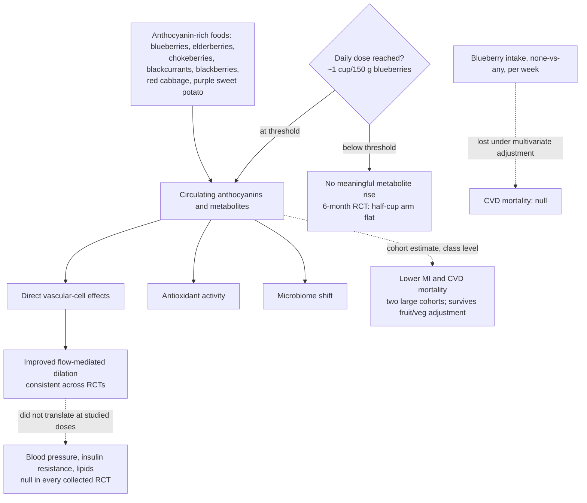

# Anthocyanins and cardiovascular health

Anthocyanins are the red-to-purple flavonoid pigments of berries and other deeply colored plants. They sit inside a larger polyphenol family (flavonols, phenolic acids) and are studied for cardiovascular protection through three proposed routes: direct effects on vascular cells, antioxidant activity distinct from the other antioxidants in the same foods, and a shift in gut-microbiome composition toward a healthier profile. Blueberries are the emblematic delivery food because their anthocyanin content is high — which makes the evidence pattern on this page instructive, because the molecule class and its flagship food do not carry the same strength of evidence. (@Physionic (Physionic) — "The Surprisingly Negative Findings around Blueberries", 2026-06-29, [link](https://www.youtube.com/watch?v=1BSF2HJc3Xg))

This page is the mirror image of [[tomato-products-and-lycopene]]. There, the whole food carries the outcome evidence and the isolated molecule disappoints; here, estimated intake of the molecule class associates with outcomes while the single flagship food does not survive adjustment. Both are the same lesson from opposite directions: evidence belongs to the exposure actually measured, and neither "food" nor "molecule" is the privileged unit by default ([[nutrition-evidence-and-personalization]]).

## Evidence for the molecule class

Two large prospective cohorts, together covering tens of thousands of participants, associate higher estimated anthocyanin intake with lower cardiovascular risk: a trend toward fewer myocardial infarctions with greater anthocyanin intake in young and middle-aged women, and lower cardiovascular-disease mortality in postmenopausal women. The myocardial-infarction association survived a secondary analysis that additionally adjusted for fruit and vegetable intake, which strengthens — without proving — the case that the anthocyanin fraction itself, rather than general produce consumption, tracks the protection. These are food-frequency-derived nutrient estimates in observational designs: single-molecule attributions from such data always carry residual-confounding and measurement error, and no randomized trial of isolated anthocyanins on cardiovascular events exists in this record. (@Physionic (Physionic) — "The Surprisingly Negative Findings around Blueberries", 2026-06-29, [link](https://www.youtube.com/watch?v=1BSF2HJc3Xg))

## Blueberry trials: one endpoint moves, the clinical panel does not

Randomized controlled trials that feed people blueberries against a blueberry-free control produce a consistent, reproducible improvement in flow-mediated dilation — the artery's capacity to relax and constrict appropriately, an endothelial-function measure related to blood-pressure regulation, whose impairment marks poor vascular health. In an acute crossover design the blueberry condition showed clearly better dilation across six hours of measurement. But across every randomized trial collected in the analysis, blueberry consumption did nothing to blood pressure, insulin resistance, or circulating cholesterol-carrying lipoproteins. By the wiki's outcome hierarchy, blueberries currently move one intermediate vascular biomarker while leaving the established clinical risk factors unchanged at studied doses. (@Physionic (Physionic) — "The Surprisingly Negative Findings around Blueberries", 2026-06-29, [link](https://www.youtube.com/watch?v=1BSF2HJc3Xg))

## The blueberry paradox and the dose explanation

The long-term data are where blueberries disappoint. In cohort analyses relating blueberry consumption (rather than total anthocyanin intake) to cardiovascular-disease mortality, an apparent risk reduction present under age-and-energy adjustment disappears under fuller multivariate adjustment — consuming more blueberries does not relate to reduced cardiovascular mortality once other factors are accounted for. (@Physionic (Physionic) — "The Surprisingly Negative Findings around Blueberries", 2026-06-29, [link](https://www.youtube.com/watch?v=1BSF2HJc3Xg))

Two methodological explanations keep the question open rather than settling it against blueberries:

- **Exposure quantification was crude.** The cohort comparison was essentially none-versus-any, with intake bands measured per week rather than per day, so the "consumers" may have eaten far too few berries to matter. (@Physionic (Physionic) — "The Surprisingly Negative Findings around Blueberries", 2026-06-29, [link](https://www.youtube.com/watch?v=1BSF2HJc3Xg))
- **Dose appears to have a real threshold.** In a six-month randomized trial comparing placebo, half a cup, and one cup of blueberries daily, only the one-cup-per-day group showed a meaningful rise in blueberry-derived metabolites in blood at six months. Trials and cohorts using smaller or vaguer doses may therefore have been studying sub-threshold exposure. One serving is roughly 150 g. (@Physionic (Physionic) — "The Surprisingly Negative Findings around Blueberries", 2026-06-29, [link](https://www.youtube.com/watch?v=1BSF2HJc3Xg))

## Alternative sources

Blueberries have no monopoly on the molecule class. Elderberries, chokeberries, blackcurrants, and blackberries are all anthocyanin-dense, as are less-discussed sources such as red cabbage and purple sweet potatoes. Since the outcome-linked exposure in the cohorts is total anthocyanin intake rather than any single food, aiming at general anthocyanin consumption across such sources is better supported than loyalty to one berry. (@Physionic (Physionic) — "The Surprisingly Negative Findings around Blueberries", 2026-06-29, [link](https://www.youtube.com/watch?v=1BSF2HJc3Xg))

## Gaps & open questions

- No randomized trial tests anthocyanins or any anthocyanin-rich food against cardiovascular events or mortality; the class-level association rests entirely on cohort nutrient estimates.
- Does sustained one-cup-per-day (or higher) blueberry intake move blood pressure, insulin resistance, or lipoproteins where lower doses did not — i.e., is the null clinical panel a dose artifact or a real ceiling?
- Which mechanism carries the flow-mediated-dilation improvement (direct cell signaling, antioxidant action, microbiome mediation), and why does it not propagate to blood pressure at studied doses?
- Are the different anthocyanin species in different foods (berries versus red cabbage versus purple sweet potato) interchangeable in absorption and effect?
- How much of the cohort association survives more aggressive confounder control, given that anthocyanin intake tracks overall diet quality?

## Practical implications

- **Treat anthocyanin-rich foods as a reasonable component of a healthy dietary pattern, spread across sources rather than concentrated in blueberries — moderate observational evidence at class level, not an outcome-proven therapy.** Elderberries, chokeberries, blackcurrants, blackberries, red cabbage, and purple sweet potatoes all count toward the exposure the cohorts actually measured. (@Physionic (Physionic) — "The Surprisingly Negative Findings around Blueberries", 2026-06-29, [link](https://www.youtube.com/watch?v=1BSF2HJc3Xg))
- **If eating blueberries for cardiovascular reasons, the studied threshold worth knowing is about one cup (~150 g) daily — emerging; a metabolite finding, not an outcome finding.** Smaller amounts did not raise blueberry-derived blood metabolites at six months, and no dose has moved blood pressure, insulin resistance, or lipids in trials. (@Physionic (Physionic) — "The Surprisingly Negative Findings around Blueberries", 2026-06-29, [link](https://www.youtube.com/watch?v=1BSF2HJc3Xg))
- **Do not rank anthocyanins as first-line cardiovascular prevention.** Established interventions on blood pressure, ApoB, smoking, activity, and diet pattern carry the outcome evidence ([[lipoprotein-retention-and-atherogenesis]], [[dietary-fat-quality-and-cardiovascular-risk]]); this is the analyst's own stated position as well. (@Physionic (Physionic) — "The Surprisingly Negative Findings around Blueberries", 2026-06-29, [link](https://www.youtube.com/watch?v=1BSF2HJc3Xg))

## Related

[[nutrition-evidence-and-personalization]] · [[tomato-products-and-lycopene]] · [[lutein]] · [[lipoprotein-retention-and-atherogenesis]] · [[dietary-fat-quality-and-cardiovascular-risk]] · [[nut-consumption-and-mortality]] · [[cheese-and-mortality]] · [[food-patterns-and-gut-ecology]] · [[supplement-evidence-and-safety]] · [[practice-playbook]]
