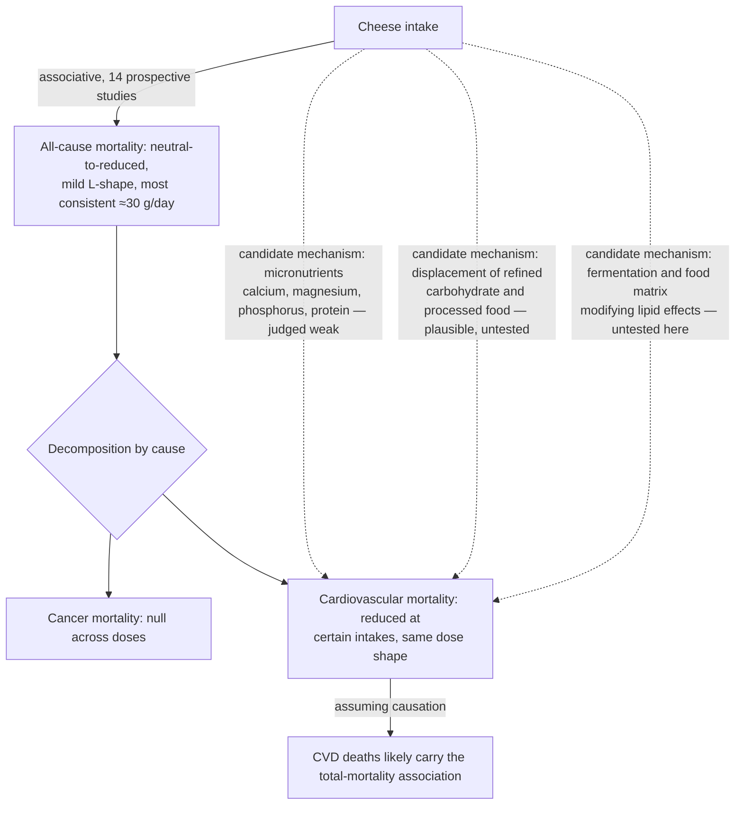

# Cheese and mortality

Cheese is a fermented, energy- and nutrient-dense dairy food: concentrated milk protein and fat carrying calcium, phosphorus, magnesium, and sodium inside a matrix produced by bacterial or fungal fermentation. Because it is rich in saturated fat, a component-level reading of dietary-fat evidence would predict an unfavorable relationship with cardiovascular disease and death ([[dietary-fat-quality-and-cardiovascular-risk]]). The prospective-cohort record does not show that. Cheese is therefore a standing test case for the food-matrix principle — that a food's health relationship is set by its whole package, structure, fermentation, and what it replaces, not by one feared nutrient ([[nutrition-evidence-and-personalization]]).

## The cohort record on all-cause mortality

Across a source analysis of 14 prospective studies — spanning different countries, age groups, sexes, health statuses, body weights, and methods of measuring intake — cheese consumption associated with either reduced or neutral all-cause mortality risk in every study, and with increased risk in none. The dose–response is mildly L-shaped: risk estimates fall below the null at modest intakes, then flatten (and the apparent benefit dissipates) as consumption rises. The most consistent reduced-risk signal sits at about one serving, roughly 30 g/day; between about 30 and 90 g/day the association remains directionally favorable with rising uncertainty; beyond roughly 90 g/day the association is best read as no benefit rather than harm. Some cohorts express the favorable range as cheese about four times per week rather than in grams. (@Physionic (Physionic) — "14 Cheese Studies: A Surprising Relationship with Death", 2026-07-20, [link](https://www.youtube.com/watch?v=9i121BcPYlk))

Two methodological boundaries qualify the record. All of it is associative — prospective cohorts and their meta-analyses, with no randomized trial of cheese on mortality — so the consistent pattern supports at minimum that cheese is unlikely to be a detriment, and at best that it tracks with net benefit, without establishing causation. And the source discarded one large analysis because it contained identical data reported for what were supposed to be different inputs, an apparent compilation error; the synthesis above rests on the remaining studies. (@Physionic (Physionic) — "14 Cheese Studies: A Surprising Relationship with Death", 2026-07-20, [link](https://www.youtube.com/watch?v=9i121BcPYlk))

## Decomposing the mortality signal

All-cause mortality is a composite: deaths must come from specific causes, and a net reduction can hide divergent cause-specific movements — cancer could fall while cardiovascular death stays flat or even rises, with the net still favorable. Decomposed, the cheese association is not cancer-driven: cancer-mortality analyses hover at the null across increasing intake. Cardiovascular mortality, by contrast, shows reduced risk at certain intake levels with the same dose shape as total mortality — so, assuming causation, the total-mortality association would be carried largely through fewer cardiovascular deaths. (@Physionic (Physionic) — "14 Cheese Studies: A Surprising Relationship with Death", 2026-07-20, [link](https://www.youtube.com/watch?v=9i121BcPYlk))

## Why the association might exist

No mechanistic studies anchor the pattern, so candidate explanations are speculation of differing quality. Researchers commonly point to cheese's micronutrient content — calcium, magnesium, phosphorus, and protein — but the source analyst judges that explanation weak. He finds a substitution account slightly more compelling: higher cheese consumers may be displacing refined carbohydrates and more processed foods, so the association would partly measure what cheese replaces rather than what cheese adds — while acknowledging that both accounts amount to guessing without directed mechanistic work. (@Physionic (Physionic) — "14 Cheese Studies: A Surprising Relationship with Death", 2026-07-20, [link](https://www.youtube.com/watch?v=9i121BcPYlk))

The neutral-to-favorable pattern sits in visible tension with saturated-fat substitution evidence, which supports replacing saturated with unsaturated fat for LDL/ApoB-mediated risk ([[dietary-fat-quality-and-cardiovascular-risk]], [[lipoprotein-retention-and-atherogenesis]]). The wiki's standing resolution is not to overwrite either side: substitution trials answer a component-and-replacement question, while cheese cohorts answer a whole-food question in which fermentation, calcium–fat interactions, matrix structure, and displaced foods travel together. Fermented dairy repeatedly shows more favorable associations than its saturated-fat content predicts ([[nutrition-evidence-and-personalization]]); that rebuts component-level extrapolation to cheese, but it does not license unlimited intake, and it leaves saturated-fat guidance intact for butter-like, non-fermented sources. A parallel neutral-to-favorable pattern holds for cheese and dementia risk, where cohorts and limited cognitive trials likewise fail to show harm ([[cognitive-reserve-and-brain-health]]). Neurologist David Perlmutter reads the cheese–dementia association favorably, proposing vitamin K2 and multiple matrix components as candidate mediators while explicitly declining single-ingredient attribution — corroborating the whole-food framing above without adding outcome evidence. (@maxlugavere (Max Lugavere) — "What to Eat to BEAT Alzheimer's - Dr. David Perlmutter", 2026-08-19, [link](https://www.youtube.com/watch?v=HiL3Phwl2d0))

## Gaps & open questions

- No mechanistic or randomized evidence explains which property of cheese — fermentation products, calcium, matrix structure, or displacement of other foods — produces the favorable associations, or whether any of it is causal.
- Substitution analyses (cheese versus specifically named replacement foods) are largely missing; the comparator implicit in each cohort is unknown and probably heterogeneous.
- Whether cheese fat content (full-fat versus reduced-fat) or cheese type (aged, fresh, processed) modifies the mortality association is not settled in the summarized record.
- The intake estimates (~30 g/day most consistent, benefit fading toward ~90 g/day) are the source analyst's cross-study harmonization of heterogeneous intake measures, not a formally pooled dose–response.
- Sodium load from high cheese intake is unexamined in this record despite its blood-pressure relevance.

## Practical implications

- **Cheese eaten at about one 30-g serving per day is compatible with, and observationally tracks with, lower all-cause mortality — moderate-consistency observational evidence, no randomized confirmation.** There is no cohort signal of harm at any studied intake, so cheese does not need to be eliminated from an otherwise sound pattern on saturated-fat grounds alone. (@Physionic (Physionic) — "14 Cheese Studies: A Surprising Relationship with Death", 2026-07-20, [link](https://www.youtube.com/watch?v=9i121BcPYlk))
- **Do not add cheese as a longevity intervention.** The evidence is associative with no mechanistic support; the defensible reading is permission within a healthy pattern, not prescription. Intakes beyond roughly 90 g/day lose even the associative benefit while adding substantial energy and sodium. (@Physionic (Physionic) — "14 Cheese Studies: A Surprising Relationship with Death", 2026-07-20, [link](https://www.youtube.com/watch?v=9i121BcPYlk))
- **Keep the substitution question in view — strong as method.** If cheese displaces refined snacks or processed meat, the trade is plausibly favorable; if it displaces legumes, fish, or unsaturated oils, the trade direction is unestablished. Judge the pattern, not the food in isolation. [[nutrition-evidence-and-personalization]]

## Related

[[nutrition-evidence-and-personalization]] · [[dietary-fat-quality-and-cardiovascular-risk]] · [[lipoprotein-retention-and-atherogenesis]] · [[cognitive-reserve-and-brain-health]] · [[food-patterns-and-gut-ecology]] · [[nut-consumption-and-mortality]] · [[tomato-products-and-lycopene]] · [[practice-playbook]]
