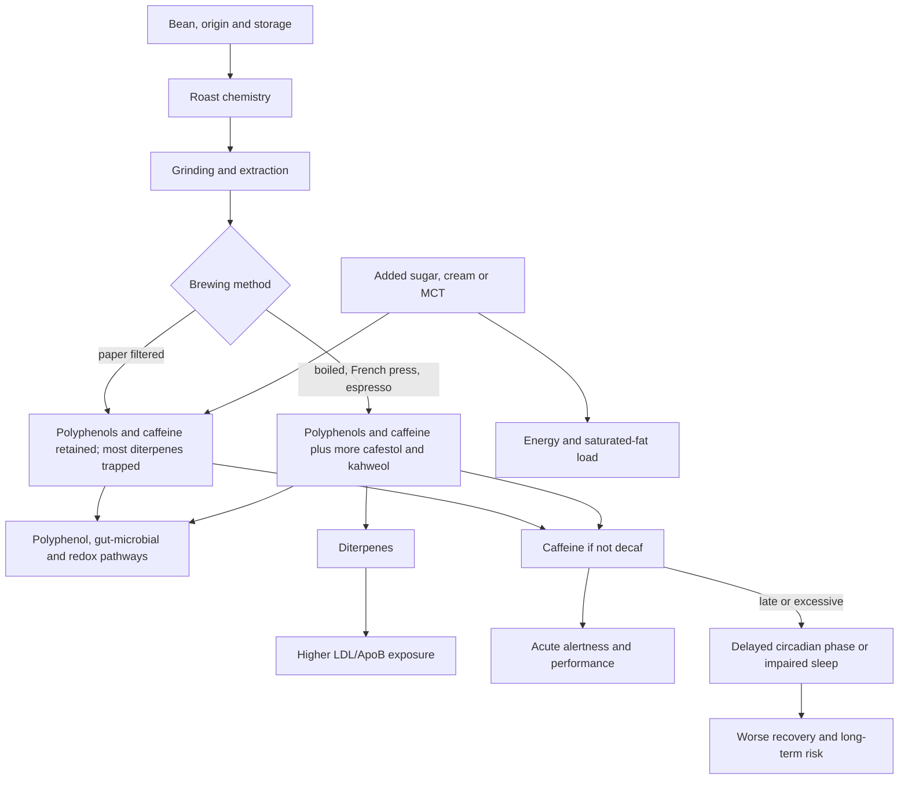

# Coffee preparation and health

Coffee is not one exposure. It is a brewed matrix of caffeine, chlorogenic acids and other polyphenols, roasting products, soluble fiber, and lipid-soluble diterpenes whose dose depends on the bean, roast, extraction, filtration, serving size, additives, and time of use. Caffeine supplies the acute stimulant and most established ergogenic effects; non-caffeine compounds explain why decaffeinated coffee can share some observational metabolic, cancer, and mortality associations. The central practical problem is therefore to preserve a tolerated beverage's benefits without converting it into a source of sleep loss, excess stimulant exposure, or avoidable ApoB elevation. (@FoundMyFitness (FoundMyFitness) — "How To Use Coffee To Live Longer (Full Guide & Research)", 2025-06-16, [link](https://www.youtube.com/watch?v=vgrV9rjqQyA)) [[caffeinated-coffee-and-cognitive-aging]]

## From bean to physiological exposure

Roasting produces both desirable and undesirable compounds. Dark roasting reduces chlorogenic acids but creates melanoidins and, in a small randomized comparison reported in the source, dark-roast coffee reduced leukocyte DNA double-strand breaks relative to water. That is a mechanistic biomarker, not proof of cancer prevention or slower organismal aging. Acrylamide is also produced during roasting, but the transcript places ordinary brewed-coffee exposure far below doses used to cause cancer in animals; it reports the International Agency for Research on Cancer's removal of coffee from the possibly carcinogenic category while distinguishing that decision from proof that coffee prevents cancer. (@FoundMyFitness (FoundMyFitness) — "How To Use Coffee To Live Longer (Full Guide & Research)", 2025-06-16, [link](https://www.youtube.com/watch?v=vgrV9rjqQyA)) [[genomic-instability-and-dna-repair]]

Coffee's soluble fiber, chlorogenic acids, and melanoidins can reach gut microbes. The transcript reports a 23,000-person association between coffee and a distinctive microbial signature, an eight-week filtered-coffee trial that increased selected short-chain-fatty-acid-producing taxa without reducing diversity, and rodent evidence for thicker mucus and pathogen suppression. These results support a prebiotic mechanism but do not establish that microbial change mediates disease or mortality outcomes. (@FoundMyFitness (FoundMyFitness) — "How To Use Coffee To Live Longer (Full Guide & Research)", 2025-06-16, [link](https://www.youtube.com/watch?v=vgrV9rjqQyA)) [[food-patterns-and-gut-ecology]]

## Filtration and the diterpene trade-off

Coffee lipids include cafestol and kahweol. Paper retains much of these lipid-soluble diterpenes while allowing water-soluble polyphenols and caffeine through. Boiled coffee, French press, moka pot, and espresso retain more diterpenes; repeated high intake can therefore raise LDL cholesterol even when coffee's other components are neutral or beneficial. The transcript reports increases of roughly 10–30 mg/dL within weeks for regularly consumed unfiltered coffee, but the effect varies with preparation and dose. This is a direct intermediate-risk-factor route and should not be averaged away by favorable observational coffee associations. (@FoundMyFitness (FoundMyFitness) — "How To Use Coffee To Live Longer (Full Guide & Research)", 2025-06-16, [link](https://www.youtube.com/watch?v=vgrV9rjqQyA)) [[lipoprotein-retention-and-atherogenesis]]

Paper-filtered pour-over is a simple way to reduce diterpenes. The video's additional preference for glass equipment that keeps hot water away from plastic is a precautionary exposure-minimization position, not evidence that plastic coffee makers create a clinically important dose. Likewise, the transcript reports that more than 95% of surveyed coffees were below international ochratoxin A limits and that roasting destroys most contamination; specialty sourcing, dry airtight storage, and using beans within about a month of roasting may improve quality, but special mold-avoidance products have no demonstrated outcome advantage for ordinary consumers. (@FoundMyFitness (FoundMyFitness) — "How To Use Coffee To Live Longer (Full Guide & Research)", 2025-06-16, [link](https://www.youtube.com/watch?v=vgrV9rjqQyA)) [[microplastics-exposure-and-measurement]]

## Timing, dose, and competing outcomes

Long cohorts associate moderate coffee intake with lower all-cause mortality, type 2 diabetes, cardiovascular disease, and some cancers, and with younger epigenetic-clock values. These are exposure associations rather than intervention effects: coffee behavior covaries with smoking, sleep, work schedules, diet, and preclinical illness, while an epigenetic-clock difference is not added life expectancy. The transcript's estimates of 0.12 to roughly one year of younger epigenetic age per daily cup are therefore biomarker associations, not evidence that each cup reverses aging. (@FoundMyFitness (FoundMyFitness) — "How To Use Coffee To Live Longer (Full Guide & Research)", 2025-06-16, [link](https://www.youtube.com/watch?v=vgrV9rjqQyA)) [[biological-age-biomarkers]]

Caffeine antagonizes adenosine receptors and can improve alertness, reaction time, endurance, and some strength or power outcomes. The source reports an ergogenic range of 3–6 mg/kg about 45–60 minutes before performance, while also reporting that benefits often plateau and adverse effects rise above about 400 mg. Those are performance-study parameters, not a daily health target; individual metabolism, habituation, anxiety, arrhythmia susceptibility, pregnancy, medication use, and sleep timing change the risk–benefit balance. L-theanine at 100–200 mg alongside 100–150 mg caffeine is presented as reducing jitters while preserving attention in short cognitive studies, but it does not neutralize caffeine's sleep effect. (@FoundMyFitness (FoundMyFitness) — "How To Use Coffee To Live Longer (Full Guide & Research)", 2025-06-16, [link](https://www.youtube.com/watch?v=vgrV9rjqQyA)) [[performance-nutrition-and-hydration]]

Morning-only coffee is associated with lower mortality than all-day use in one reported cohort, but this does not prove morning coffee causes the difference. The stronger mechanistic point is that caffeine near bedtime can delay melatonin timing and impair sleep. A cutoff about 8–10 hours before bed is a conservative starting heuristic; response, not clock time alone, should determine whether an earlier cutoff or decaf is needed. (@FoundMyFitness (FoundMyFitness) — "How To Use Coffee To Live Longer (Full Guide & Research)", 2025-06-16, [link](https://www.youtube.com/watch?v=vgrV9rjqQyA)) [[sleep-quality-and-circadian-alignment]]

## Dependence, withdrawal, and who carries the benefit

Caffeine is a genuinely dependence-forming drug, and habitual users are largely medicating their own withdrawal at baseline. Michael Pollan's documented three-month abstinence (undertaken on psychopharmacologist Roland Griffiths's advice that a drug relationship can only be examined from outside it) is a useful single-subject portrait of the syndrome: roughly ten days of headaches, jet-lag-like malaise, and lost focus, a persisting sense of not feeling himself off the drug, and eventual relapse through deadline-driven exceptions. He frames moderate caffeine dependence as a drug addiction with essentially no downside — including the workplace's institutionalization of it (the coffee break as employer-supplied stimulant for productivity) — which is attributed expert opinion; this wiki's sleep-timing and individual-susceptibility boundaries above still apply, and the same episode notes sensitivity varies by sex, age, smoking, and oral-contraceptive use, and that dose curves turn: above roughly eight cups daily the association flips toward depression, anxiety, and suicide risk. (@joinzoe (ZOE) — "Michael Pollan: The TRUTH about junk food and why you can’t stop eating", 2026-05-28, [link](https://www.youtube.com/watch?v=2H1kqw-uyM0))

**Evidence update — dose and decaf claims to hold loosely:** the same conversation attributes to the epidemiology a 25–30% heart-disease risk reduction at up to six cups daily — a stronger and higher-dose claim than the two-to-three-cup center of the cohort curves recorded above, unsourced in the episode and retained here as a conflict rather than an update. More useful is the attribution question: the plant matrix (polyphenols in coffee and tea), not caffeine itself, plausibly carries the long-term associations, and Tim Spector reports that decaffeinated coffee drinkers retain the majority of the observed heart-benefit associations with modern decaffeination preserving most polyphenols — supporting decaf substitution as a way to keep the exposure while managing the stimulant, and mixing caffeine sources (coffee, tea, green tea) for polyphenol variety. All observational. (@joinzoe (ZOE) — "Michael Pollan: The TRUTH about junk food and why you can’t stop eating", 2026-05-28, [link](https://www.youtube.com/watch?v=2H1kqw-uyM0))

## Additives and attribution

Milk proteins can bind coffee polyphenols and delay their measured appearance in blood, but delayed bioavailability does not establish loss of long-term health benefit. The video's preference for black coffee when seeking an immediate polyphenol effect is mechanistically reasoned but clinically unvalidated. A clearer chronic trade-off comes from repeatedly adding sugar, heavy cream, or MCT powder: these additions change energy intake and, for saturated-fat-rich additions, can raise ApoB in responsive people. The additive should be evaluated as part of the dietary pattern rather than credited or blamed to coffee itself. (@FoundMyFitness (FoundMyFitness) — "How To Use Coffee To Live Longer (Full Guide & Research)", 2025-06-16, [link](https://www.youtube.com/watch?v=vgrV9rjqQyA)) [[dietary-fat-quality-and-cardiovascular-risk]]

## Practical implications

- **Daily, if coffee is already tolerated: keep intake moderate and protect sleep — moderate for acute caffeine effects, limited observational evidence for chronic outcomes.** Two to three cups is the center of many reported cohort curves, not a prescription or a reason for a non-user to start. Prefer decaf later in the day and move the caffeine cutoff earlier if sleep, anxiety, reflux, palpitations, or blood pressure worsens. (@FoundMyFitness (FoundMyFitness) — "How To Use Coffee To Live Longer (Full Guide & Research)", 2025-06-16, [link](https://www.youtube.com/watch?v=vgrV9rjqQyA))
- **For frequent coffee consumption: prefer paper filtration, especially when LDL/ApoB is elevated — moderate for lowering diterpene exposure and the LDL intermediate endpoint; no direct event trial.** Occasional espresso is a different exposure from several unfiltered servings every day. (@FoundMyFitness (FoundMyFitness) — "How To Use Coffee To Live Longer (Full Guide & Research)", 2025-06-16, [link](https://www.youtube.com/watch?v=vgrV9rjqQyA))
- **For competition or a key training session: caffeine can be used strategically, but do not turn the 3–6 mg/kg research range into a routine default — strong for acute ergogenicity, individualized for safety.** Start below the upper range, count all sources, and do not trade sleep for a small performance gain. (@FoundMyFitness (FoundMyFitness) — "How To Use Coffee To Live Longer (Full Guide & Research)", 2025-06-16, [link](https://www.youtube.com/watch?v=vgrV9rjqQyA))
- **With each bag: store beans dry, airtight, and away from heat; discard visibly moldy or spoiled product — sensible food-quality practice, not a demonstrated longevity intervention.** Do not pay a premium for unvalidated mycotoxin claims when regulated products are already well below limits. (@FoundMyFitness (FoundMyFitness) — "How To Use Coffee To Live Longer (Full Guide & Research)", 2025-06-16, [link](https://www.youtube.com/watch?v=vgrV9rjqQyA))
- **Do not interpret an epigenetic-age association, acute DNA-damage biomarker, or microbiome shift as proof of longer life — strong evidence boundary.** These outcomes sit below clinical events in the outcome hierarchy. (@FoundMyFitness (FoundMyFitness) — "How To Use Coffee To Live Longer (Full Guide & Research)", 2025-06-16, [link](https://www.youtube.com/watch?v=vgrV9rjqQyA))

## Gaps & open questions

- Which coffee components, doses, and preparations causally affect clinical events rather than biomarkers or cohort associations?
- Does paper filtration reduce cardiovascular events, or only diterpene exposure and LDL?
- Are reported microbial changes mediators of benefit, markers of exposure, or neither?
- Do milk–polyphenol binding and roast-dependent chemistry alter any durable human outcome?
- How should pregnancy, slow caffeine metabolism, anxiety, reflux, hypertension, and arrhythmia risk modify dose and timing?
- Can morning-only and all-day drinkers be compared without residual confounding from occupation, chronotype, sleep, and illness?
- Does the six-cup 25–30% heart-disease association survive sourcing and adjustment, or is the two-to-three-cup curve the better summary?
- How much of coffee's observational benefit do decaffeinated-only drinkers retain in well-adjusted cohorts, and does decaffeination method matter?
- What does the coffee–gut-phage association ([[gut-virome-and-bacteriophages]]) mean, if anything, for the prebiotic mechanism?

## Related

[[caffeinated-coffee-and-cognitive-aging]] · [[sleep-quality-and-circadian-alignment]] · [[food-patterns-and-gut-ecology]] · [[gut-virome-and-bacteriophages]] · [[michael-pollan]] · [[dietary-fat-quality-and-cardiovascular-risk]] · [[lipoprotein-retention-and-atherogenesis]] · [[biological-age-biomarkers]] · [[performance-nutrition-and-hydration]] · [[rhonda-patrick]] · [[aging-model]] · [[practice-playbook]]
