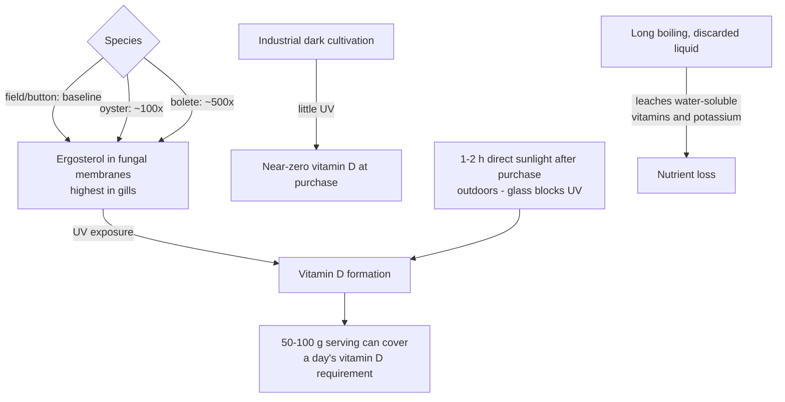

# Culinary mushrooms and fungal nutrition

Mushrooms are the fruiting bodies of fungi — a kingdom of perhaps 1.5 million mostly undescribed species that shares a more recent common ancestor with animals than with plants. That phylogeny has dietary consequences: fungal cell walls are built from chitin (the crustacean-shell polymer) plus beta-glucans rather than plant cellulose, fungal biochemistry produces molecules found nowhere else in the food supply (penicillin and the amino acid ergothioneine are fungal products), and eating mushrooms therefore adds chemistry that no quantity of plant diversity supplies. Nutritionally, common culinary mushrooms deliver fiber, reasonable protein, minimal saturated fat, B and C vitamins, and scavenged trace minerals (potassium, selenium) — fungi accumulate soil nutrients through their underground mycelial networks, which can dwarf the visible mushroom (individual soil fungi spanning miles are documented in the US). (@joinzoe (ZOE) — "The fungi scientist: The #1 mistake you're making when eating mushrooms for health", 2026-06-04, [link](https://www.youtube.com/watch?v=ZUoz97Wn_Xc))

Robin May — microbiology professor at the University of Birmingham and chief scientific adviser to the UK Food Standards Agency — is the source for this page; his consistent register is mechanism-rich, claim-cautious, and worth preserving: mainstream culinary species over exotic supplements, and diversity over any single "best" mushroom.

## Vitamin D: a post-harvest, light-dependent variable

Mushrooms make vitamin D the way human skin does — by UV conversion of a membrane sterol (ergosterol) — and because commercial mushrooms are grown in the dark and sold quickly, they typically contain almost none at purchase. The conversion is a spontaneous photochemical reaction that continues after harvest: one to two hours of direct sunlight (outdoors — glass filters the UV; even crisp winter sun works at northern latitudes) raises vitamin D dramatically, to the point that a 50–100 g serving of sun-exposed mushrooms is described as covering a day's requirement. Species differ enormously: oyster mushrooms average roughly 100-fold more vitamin D than button/field mushrooms, and boletes about 500-fold in one commercial survey; ergosterol concentrates in the gills. These figures are from a single expert summarizing a limited literature (the episode cites a 2018 Nutrients review), and serving-level dose is variable in practice — treat the sunlight trick as a cheap, plausible enhancement, not a measured dosing protocol. It also does not replace supplementation where guidance supports it (dark northern winters; see [[vitamin-d]] for repletion evidence and contested targets). (@joinzoe (ZOE) — "The fungi scientist: The #1 mistake you're making when eating mushrooms for health", 2026-06-04, [link](https://www.youtube.com/watch?v=ZUoz97Wn_Xc))

## Ergothioneine: a candidate nutrient without a defined function

Ergothioneine is a non-proteinogenic amino acid made by fungi and cyanobacteria but not by plants or animals, with potent antioxidant and anti-inflammatory activity in laboratory systems; some researchers argue it should be classified as a vitamin (the episode cites 2022–2023 reviews to that effect). The intriguing core is transporter biology: humans carry a specific, evolutionarily conserved ergothioneine uptake protein, which usually signals functional importance — yet transporter-knockout mice appear healthy, no clinical outcome data exist, sensible intake levels are unknown, and a transporter polymorphism is associated (associations only) with Crohn's disease. May's flat-pack analogy captures the state of knowledge: a left-over part that looks important with no known place. Ordinary button mushrooms contain some; levels vary across species in poorly mapped ways. This is early science supporting mushroom consumption as low-risk diversity, not supplementation. (@joinzoe (ZOE) — "The fungi scientist: The #1 mistake you're making when eating mushrooms for health", 2026-06-04, [link](https://www.youtube.com/watch?v=ZUoz97Wn_Xc))

## Beta-glucans: cholesterol and immune signaling

Fungal cell-wall beta-glucans act through two established routes. First, like oat beta-glucan, they form a gel in the gut that binds cholesterol — especially LDL — for excretion; mushrooms carry less beta-glucan than oats, so they are an addition to, not a replacement for, the oat-class viscous-fiber evidence ([[oats-and-cardiovascular-health]], [[dietary-fiber]]). Second, beta-glucan is a potent immune stimulus — the immune system evolved to detect fungal cell walls, and beta-glucan is used as a vaccine adjuvant. That mechanism is real, but "stimulates the immune system" is not "improves immune health": whether dietary fungal beta-glucan meaningfully modulates human immunity is unresolved, and May explicitly warns immunocompromised people (and everyone) off inhaled or non-dietary fungal products, since a handful of fungal species cause lethal infections in the immunosuppressed. (@joinzoe (ZOE) — "The fungi scientist: The #1 mistake you're making when eating mushrooms for health", 2026-06-04, [link](https://www.youtube.com/watch?v=ZUoz97Wn_Xc))

## Lion's mane and cognition: mechanism ahead of evidence

Extracts of lion's mane (and some other species) stimulate nerve growth in vitro, giving brain claims a plausible mechanism. Human data are thin: small, unreplicated trials report slight improvement or slowed decline in early mild cognitive impairment; one frequently-social-media-cited study found improved cognitive scores in healthy people (unusual for such tests); at least one study found the opposite — worsened word recall. May's calibrated position is worth quoting: he would "happily wager a mortgage payment" that the fungal kingdom contains molecules of major future medical value, while advising against taking any current mushroom supplement in the hope of longevity or cognitive benefit. On population longevity, classical culinary-mushroom intake shows no clear signal — recall-based diet studies, short Western exposure histories, and "mushrooms" being as heterogeneous a category as "plants" all limit inference — though substituting mushrooms for red meat plausibly helps via the meat side of the swap. (@joinzoe (ZOE) — "The fungi scientist: The #1 mistake you're making when eating mushrooms for health", 2026-06-04, [link](https://www.youtube.com/watch?v=ZUoz97Wn_Xc)) [[cognitive-reserve-and-brain-health]] [[supplement-evidence-and-safety]]

## The gut (and skin) mycobiome

Fungi are a normal, numerically minor component of the gut microbiome — long invisible to sequencing because bacteria vastly outnumber them, and long assumed pathological. The emerging view is that some resident fungal species are probably beneficial, helping keep immune responses balanced, though which species and mechanisms remain unknown; dominance of any single species (as in Candida overgrowth) stays undesirable, and Candida itself is a universal commensal — armpit-swab ubiquitous — that is dangerous only out of immune check. Dietarily, fungal carbohydrates feed gut bacteria, so mushrooms function as microbiome substrate much like diverse plants, with plugging-into-ancient-bacterial–fungal-signaling offered as informed speculation. The skin analog is vivid: Malassezia species live on human skin, one reportedly able to complete its reproductive cycle only in the presence of human scalp oils. May extrapolates the plant-diversity logic to fungi — varied mushroom species over a single favorite — labeling it as confident inference without mushroom-specific data. (@joinzoe (ZOE) — "The fungi scientist: The #1 mistake you're making when eating mushrooms for health", 2026-06-04, [link](https://www.youtube.com/watch?v=ZUoz97Wn_Xc)) [[food-patterns-and-gut-ecology]] [[vulvovaginal-candidiasis]] [[seborrheic-dermatitis]]

## Preparation, cooking, and safety

- **Heat and water, not peeling, are the levers.** Brief frying preserves vitamins better than long oven cooking; boiling leaches water-soluble vitamins (B, C) and potassium into the liquid — fine in a sauce that is eaten, wasteful if drained. Washing off soil is aesthetic; peeling removes little.
- **Raw and large intakes deserve caution.** Mushrooms are hard to clean thoroughly (food-poisoning risk somewhat above easily-washed produce), and many edible species contain low levels of hydrazine-class compounds that damage DNA in laboratory studies and are potential carcinogens — rapidly destroyed by heating. This is a reason to cook mushrooms, especially at high intakes, not a reason to avoid them.
- **Foraging and exotica are the real hazards.** Never eat lawn or wild mushrooms without expert identification, and treat unregulated exotic-mushroom supplements skeptically — May names the biggest mushroom myth as "the weirder the mushroom, the better it is for you," and advises caution toward anything sold in a brown packet.

(@joinzoe (ZOE) — "The fungi scientist: The #1 mistake you're making when eating mushrooms for health", 2026-06-04, [link](https://www.youtube.com/watch?v=ZUoz97Wn_Xc))

## Practical implications

- **Weekly: treat mushrooms as a routine vegetable-slot item in the shop rather than an occasional specialty — moderate as a diversity and substitution rationale, weak for any mushroom-specific outcome.** Fried as a side, chopped fine into sauces for texture-averse eaters, or replacing part of the red meat in a dish (the substitution carries the clearest benefit logic). (@joinzoe (ZOE) — "The fungi scientist: The #1 mistake you're making when eating mushrooms for health", 2026-06-04, [link](https://www.youtube.com/watch?v=ZUoz97Wn_Xc))
- **When vitamin D matters (northern winters, low sun exposure): set mushrooms in direct sunlight for one to two hours before cooking, and prefer oyster mushrooms — limited evidence (mechanistically solid photochemistry; dose per serving variable), essentially free and risk-free.** Not a substitute for testing and correcting measured deficiency ([[vitamin-d]]). (@joinzoe (ZOE) — "The fungi scientist: The #1 mistake you're making when eating mushrooms for health", 2026-06-04, [link](https://www.youtube.com/watch?v=ZUoz97Wn_Xc))
- **Rotate species (button, oyster, shiitake, mixed boxes) rather than maximizing one — weak-to-limited evidence, extrapolated from plant-diversity logic and flagged as such by the source.** (@joinzoe (ZOE) — "The fungi scientist: The #1 mistake you're making when eating mushrooms for health", 2026-06-04, [link](https://www.youtube.com/watch?v=ZUoz97Wn_Xc))
- **Cook mushrooms (briefly is fine); keep any boiling liquid; avoid large raw intakes — moderate for the safety rationale (heat-labile hydrazines, cleaning limits), low cost.** (@joinzoe (ZOE) — "The fungi scientist: The #1 mistake you're making when eating mushrooms for health", 2026-06-04, [link](https://www.youtube.com/watch?v=ZUoz97Wn_Xc))
- **Do not buy lion's mane, ergothioneine, or exotic mushroom supplements for longevity, immunity, or IQ — strong as an evidence boundary.** Human trials are small, conflicting, and unreplicated; no sensible ergothioneine intake is even defined; product quality in this category is unregulated. [[supplement-evidence-and-safety]] (@joinzoe (ZOE) — "The fungi scientist: The #1 mistake you're making when eating mushrooms for health", 2026-06-04, [link](https://www.youtube.com/watch?v=ZUoz97Wn_Xc))

## Gaps & open questions

- What does ergothioneine actually do in humans — why is its transporter conserved, why are knockout mice fine, and what does the Crohn's-associated polymorphism mean?
- Do lion's mane trial signals in mild cognitive impairment replicate at scale, and does the negative word-recall finding reflect dose, extract, population, or chance?
- Which gut-resident fungal species are beneficial, at what abundances, and does eating mushrooms change the gut mycobiome at all?
- What are actual ergothioneine, beta-glucan, and vitamin D contents across culinary species and growing conditions — and does sun-exposed mushroom vitamin D (largely D2) raise 25-hydroxyvitamin D as effectively as D3?
- Does mushroom diversity confer benefits beyond generic plant diversity, or is a mushroom nutritionally exchangeable with other fiber-and-polyphenol vehicles?
- At what raw intake, if any, do hydrazine-class compounds in common species carry measurable human risk?

## Related

[[vitamin-d]] · [[dietary-fiber]] · [[oats-and-cardiovascular-health]] · [[food-patterns-and-gut-ecology]] · [[supplement-evidence-and-safety]] · [[cognitive-reserve-and-brain-health]] · [[nutrition-evidence-and-personalization]] · [[seborrheic-dermatitis]] · [[vulvovaginal-candidiasis]] · [[gut-virome-and-bacteriophages]] · [[practice-playbook]]
