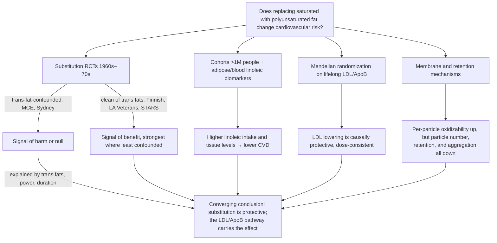

# Dietary fat quality and cardiovascular risk

Dietary fats differ by bond chemistry, and that chemistry propagates to lipoprotein behavior and cardiovascular outcomes. A saturated fatty acid has no double bonds; its straight chains pack tightly, which is why saturated-rich fats are solid at room temperature. A monounsaturated fatty acid has one cis double bond and a polyunsaturated fatty acid several; each cis bond kinks the chain, loosening packing and increasing membrane fluidity — a property that matters for LDL-receptor recognition and particle aggregation ([[lipoprotein-retention-and-atherogenesis]]). A trans double bond leaves the chain straight, so trans fats pack like saturated fat while still carrying an oxidizable double bond — the worst of both configurations — and their atherogenicity is clear enough that the FDA has effectively banned them. Industrial trans fats entered the food supply precisely because they mimic saturated fat's solidity: margarines built to replace butter ran roughly 25–40% trans fat before the harm was recognized. (@PeterAttiaMD (Peter Attia MD) — "380 ‒ The seed oil debate: are they uniquely harmful relative to other dietary fats?", 2026-01-19, [link](https://www.youtube.com/watch?v=iB49uq-t1UM))

Because eating less of one macronutrient means eating more of another, fat-quality questions are inherently substitution questions: the measurable quantity is the effect of isocalorically replacing saturated fat with polyunsaturated fat, monounsaturated fat, or carbohydrate, not the effect of a fat in isolation. Replacing saturated with polyunsaturated fat lowers LDL cholesterol by roughly 15% in feeding studies; monounsaturated fat lowers it less but remains directionally protective; carbohydrate substitution is roughly neutral on average and probably depends on carbohydrate quality. (@PeterAttiaMD (Peter Attia MD) — "380 ‒ The seed oil debate: are they uniquely harmful relative to other dietary fats?", 2026-01-19, [link](https://www.youtube.com/watch?v=iB49uq-t1UM))

## The substitution-trial record and its great confounder

The classic randomized trials replaced saturated fat with polyunsaturated fat in the 1960s–70s, before anyone knew trans fats were atherogenic — and the intervention margarines of that era were trans-fat-heavy. That single fact structures the whole literature.

- **Minnesota Coronary Experiment (≈1966–73, ~9,000 institutionalized patients, isocaloric substitution via corn oil and margarine).** Total cholesterol fell substantially in the low-saturated-fat arm, yet mortality did not improve — a result so surprising the investigators delayed publication for over a decade. Anti-seed-oil readings cite an association of roughly 22% higher mortality per 30 mg/dL cholesterol reduction. Confounds: heavy trans-fat exposure in the intervention arm, mid-study law changes that let patients leave the wards (diluting dietary control, though randomization should distribute that error), and average follow-up of only one to two years against a disease that develops over decades. (@PeterAttiaMD (Peter Attia MD) — "380 ‒ The seed oil debate: are they uniquely harmful relative to other dietary fats?", 2026-01-19, [link](https://www.youtube.com/watch?v=iB49uq-t1UM))
- **Sydney Diet Heart Study (<500 post-MI men; saturated fat 16%→10% of calories, polyunsaturated 6%→15% via safflower oil and safflower margarine).** The only substitution trial to reach statistical significance, and it favored saturated fat: 37 deaths in the treatment arm versus 28 in control, a 74% relative increase with a confidence interval of 1.04–2.91 (Ramsden's reanalysis: 1.03–2.8). The interval nearly crosses unity, the death counts are small enough for sampling error, and the intervention was again trans-fat-confounded. Reverse causality also haunts sick-population cholesterol data: low cholesterol can mark wasting rather than cause survival. (@PeterAttiaMD (Peter Attia MD) — "380 ‒ The seed oil debate: are they uniquely harmful relative to other dietary fats?", 2026-01-19, [link](https://www.youtube.com/watch?v=iB49uq-t1UM))
- **Rose corn oil trial (~80 patients with existing coronary disease, 2 years).** Total deaths 3 (control), 5 (olive oil), 8 (corn oil); cardiac deaths 1, 3, and 6. The corn-oil hazard ratio of 4.64 is the largest in this literature — with a confidence interval of 0.58–37.15. Numbers this small are dominated by sampling error: the same trial shows three times the cardiac deaths on olive oil, which even seed-oil critics consider heart-healthy. (@PeterAttiaMD (Peter Attia MD) — "380 ‒ The seed oil debate: are they uniquely harmful relative to other dietary fats?", 2026-01-19, [link](https://www.youtube.com/watch?v=iB49uq-t1UM))
- **Los Angeles Veterans study (~850 men, ~9 years, institutional feeding, no trans confound).** An 18% reduction in risk, confidence interval 0.56–1.21 — directionally favorable, not significant, and confounded in the other direction by included omega-3s. **Oslo** (~400 people, ~47% risk reduction) shares the omega-3 confound. (@PeterAttiaMD (Peter Attia MD) — "380 ‒ The seed oil debate: are they uniquely harmful relative to other dietary fats?", 2026-01-19, [link](https://www.youtube.com/watch?v=iB49uq-t1UM))
- **Finnish Mental Hospital study (crossover between two hospitals, six years per diet, ~1,200 patients each acting as their own control; saturated fat 18%→9%, polyunsaturated 3–4%→14%; no trans or omega-3 confound).** A 41% reduction in cardiovascular events and mortality with tight confidence intervals. Its weakness is cluster-level rather than individual randomization (hospital characteristics could differ), judged a small risk. Together with **STARS** (one year, angiographic plaque progression favoring the low-saturated/high-polyunsaturated arm), it forms the cleanest evidence in the set. (@PeterAttiaMD (Peter Attia MD) — "380 ‒ The seed oil debate: are they uniquely harmful relative to other dietary fats?", 2026-01-19, [link](https://www.youtube.com/watch?v=iB49uq-t1UM))

Pooled results track the confounders. Including everything, the net effect of substitution is null (trend ~13% increased risk, nonsignificant). Excluding omega-3-confounded trials but keeping trans-confounded ones (one Ramsden analysis) shows harm from polyunsaturated fat. Excluding trans-confounded trials (a 2017 meta-analysis, omega-3s retained) shows roughly a 29–31% risk reduction. The interpretive choice — which confounder to take seriously — is the crux of the seed-oils dispute ([[seed-oils]]), and demands what Layne Norton calls logical symmetry: whoever admits trans-confounded trials as evidence against polyunsaturated fat must admit omega-3-confounded trials as evidence for it, or exclude both. (@PeterAttiaMD (Peter Attia MD) — "380 ‒ The seed oil debate: are they uniquely harmful relative to other dietary fats?", 2026-01-19, [link](https://www.youtube.com/watch?v=iB49uq-t1UM))

## Cohort, biomarker, and causal-inference evidence

A cohort analysis spanning over a million people across countries found higher linoleic-acid intake associated with lower cardiovascular disease, and — because essential fatty acids incorporate into adipose tissue and cell membranes in proportion to intake — tissue-linoleic studies, which bypass dietary-recall error, show the same protective direction. Healthy-user bias typically produces null or inconsistent associations for a truly harmful exposure, not consistently protective ones. The feared linoleic→arachidonic→prostaglandin inflammation cascade also fails empirically: the conversion runs at saturation, so eating more linoleic acid does not raise arachidonic-acid production, and 1:1 substitution of polyunsaturated for saturated fat shows neutral or favorable effects on inflammation, liver fat, insulin sensitivity, and overall metabolic health. (@PeterAttiaMD (Peter Attia MD) — "380 ‒ The seed oil debate: are they uniquely harmful relative to other dietary fats?", 2026-01-19, [link](https://www.youtube.com/watch?v=iB49uq-t1UM))

The strongest causal anchor is indirect: Mendelian randomization establishes that lifelong lower LDL/ApoB causes proportionally lower cardiovascular risk, with the same dose–response regardless of which gene or drug mechanism lowers it ([[lipoprotein-retention-and-atherogenesis]]). Since saturated-to-polyunsaturated substitution reliably lowers LDL, the inference chain to benefit requires only the small extra step from diet to lipoprotein — a step directly measured in feeding studies. This is a test of LDL causality, not of nutrition per se, and should be labeled as such. (@PeterAttiaMD (Peter Attia MD) — "380 ‒ The seed oil debate: are they uniquely harmful relative to other dietary fats?", 2026-01-19, [link](https://www.youtube.com/watch?v=iB49uq-t1UM))

A century-scale caveat frames all of this: linoleic acid was under 3% of total food availability a hundred years ago and is near 10% today (one anti-seed-oil source claims a 75× rise over ~150 years), with tissue levels up more than 100%. The evolutionary-mismatch reading of that trend is examined — and largely rebutted (ancestral populations such as the Hadza run LDL of 50–70 mg/dL, which argues against saturated-fat-heavy "ancestral" prescriptions; naturalism is a fallacy; apparent 20th-century emergence of heart disease largely reflects survivorship and diagnostic capacity) — in [[seed-oils]]. (@PeterAttiaMD (Peter Attia MD) — "380 ‒ The seed oil debate: are they uniquely harmful relative to other dietary fats?", 2026-01-19, [link](https://www.youtube.com/watch?v=iB49uq-t1UM))

## Heating and frying: where oxidation actually happens

Industrial refining is a poor oxidation candidate — bulk oil heats under vacuum (no oxygen), and meaningful oxidation of most seed oils requires sustained temperatures well above 200 °C for hours. Restaurant and home frying is the realistic exposure: in a thin oil layer (the difference between roughly 1 cm and 5 cm of depth is large), significant oxidized products can begin accumulating within 20–30 minutes, and oil reused or held hot all day in a vat likely accumulates substantial oxidized and trans products. Whether frying in lard (oxidation-resistant but LDL-raising saturated fat) beats frying in seed oil (LDL-favorable but oxidation-prone) is genuinely open — the mechanisms compete and no human RCT compares frying media on outcomes. Both are treated as bad; the practical answer is that fried food's problem is mostly the fried food. (@PeterAttiaMD (Peter Attia MD) — "Cooking with Lard vs Seed Oils | Layne Norton, Ph.D.", 2026-01-21, [link](https://www.youtube.com/watch?v=7_cbaDXAWYM))

## Magnitude in context

Plant-based and natural are origin claims, not fatty-acid profiles. Coconut and palm oils can make a vegan meat substitute high in saturated fat, and beef tallow remains saturated-fat-rich despite its traditional or minimally processed image. Randomized evidence summarized in the source shows coconut oil raising LDL cholesterol and ApoB; the source's broader claim that large coconut-oil intake directly speeds plaque is mechanistically consistent but stronger than the trial outcomes it describes. Product formulation and replacement remain the proper units of analysis. [[food-label-literacy-and-health-halos]] (@NutritionMadeSimple (Nutrition Made Simple!) — "15 'Healthy' Foods that are Quietly Clogging your Arteries (And What to Eat Instead)", 2026-04-20, [link](https://www.youtube.com/watch?v=oMOSvXcvnOw))

Fat-quality effects are real but mid-sized levers. Class 3–4 obesity carries mortality hazard ratios of 80–200% even with healthy blood markers, and fitness measures like VO2 max and strength predict mortality by hundreds of percentage points ([[cardiorespiratory-fitness]], [[muscle-strength-and-mortality]]), against roughly 20–30% effects for fat substitution. With average US intake around 3,500 kcal/day and under 20 minutes of daily activity, obsessing over frying media while ignoring energy balance and activity is, in Norton's phrase, "stepping over $100 bills picking up pennies" — offered explicitly as his opinion, since no direct comparison trials exist. (@PeterAttiaMD (Peter Attia MD) — "Cooking with Lard vs Seed Oils | Layne Norton, Ph.D.", 2026-01-21, [link](https://www.youtube.com/watch?v=7_cbaDXAWYM))

## Gaps & open questions

- No human RCT compares frying in saturated versus polyunsaturated fat on any health outcome; the lard-versus-seed-oil frying question is answered only by competing mechanisms.
- Once LDL/ApoB is pharmacologically controlled, does saturated-fat intake still matter — and do oxidation products and aldehydes from cooking become the binding constraint? Raised as an open question and left unanswered. (@PeterAttiaMD (Peter Attia MD) — "Cooking with Lard vs Seed Oils | Layne Norton, Ph.D.", 2026-01-21, [link](https://www.youtube.com/watch?v=7_cbaDXAWYM))
- The trans-fat composition of the MCE and Sydney intervention diets was never directly measured; the confounding argument rests on the era's margarine formulations.
- Only about two substitution trials escape both the trans-fat and omega-3 confounds; the clean evidence base is thin even if consistent.
- Which carbohydrate qualities make carbohydrate-for-saturated-fat substitution protective versus neutral remains unquantified here.
- Real-world exposure to oxidation products from repeatedly reused restaurant frying oil is unmeasured at the population level.
- Do coconut- or palm-oil-based meat substitutes improve or worsen clinical outcomes compared with the specific animal or legume food they replace?

## Practical implications

- **Bias fat intake toward unsaturated fats at the expense of saturated fat — strong, on converging trial, cohort, biomarker, and Mendelian-randomization evidence.** Polyunsaturated substitution has the largest LDL effect; monounsaturated sources (olive, avocado oil) are an acceptable substitute for those who distrust seed oils. (@PeterAttiaMD (Peter Attia MD) — "380 ‒ The seed oil debate: are they uniquely harmful relative to other dietary fats?", 2026-01-19, [link](https://www.youtube.com/watch?v=iB49uq-t1UM))
- **If avoiding seed oils, replace them with something that still displaces saturated fat (leaner proteins, monounsaturated oils), and keep fiber adequate — moderate-to-strong.** Avoidance itself is harmless; recreating a high-saturated-fat diet in its place is the failure mode. (@PeterAttiaMD (Peter Attia MD) — "Cooking with Lard vs Seed Oils | Layne Norton, Ph.D.", 2026-01-21, [link](https://www.youtube.com/watch?v=7_cbaDXAWYM))
- **Treat deep-fried food as an infrequent food regardless of the frying medium, and distrust thin-layer or long-reused frying oil — moderate mechanistic evidence.** Do not read a switch to tallow or lard as making fries healthy; that marketing pivot serves sales, not health. (@PeterAttiaMD (Peter Attia MD) — "Cooking with Lard vs Seed Oils | Layne Norton, Ph.D.", 2026-01-21, [link](https://www.youtube.com/watch?v=7_cbaDXAWYM))
- **Rank the levers: energy balance and physical activity dominate fat-quality choices at the population level — moderate (expert judgment on relative hazard ratios, no direct comparison trials).** Fat quality is worth optimizing after, not instead of, the big levers. (@PeterAttiaMD (Peter Attia MD) — "Cooking with Lard vs Seed Oils | Layne Norton, Ph.D.", 2026-01-21, [link](https://www.youtube.com/watch?v=7_cbaDXAWYM))

## Related

[[seed-oils]] · [[lipoprotein-retention-and-atherogenesis]] · [[nutrition-evidence-and-personalization]] · [[food-label-literacy-and-health-halos]] · [[energy-balance-and-calorie-counting]] · [[omega-3-fatty-acids]] · [[olive-oil-and-cognitive-aging]] · [[ketogenic-diet-apob-and-atherosclerosis]] · [[ezetimibe]] · [[pcsk9-inhibition]] · [[layne-norton]] · [[peter-attia]] · [[practice-playbook]]
