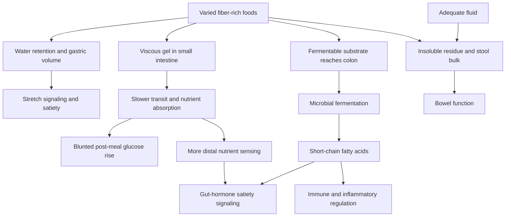

# Dietary fiber

Dietary fiber is a heterogeneous group of plant carbohydrates and related material that escapes digestion in the small intestine. It should not be treated as one molecule: water solubility, viscosity, fermentability, particle structure, and food matrix determine where a fiber acts and what it does. Whole grains, legumes, vegetables, fruits, nuts, and seeds deliver different fibers together with water, micronutrients, and bioactive compounds. (@joinzoe (ZOE) — "You’re obsessing over the wrong thing! The #1 food that cuts disease risk", 2026-07-30, [link](https://www.youtube.com/watch?v=0CWC1GUEzHA))

## Mechanisms from mouth to colon

Viscous soluble fibers absorb water and slow movement through the small intestine, which can moderate glucose absorption and expose nutrients to more distal satiety signaling. Fermentable fibers reach the colon, where microbes convert them into short-chain fatty acids with local and systemic signaling roles. Less-fermentable insoluble material contributes volume and stool bulk. These categories overlap rather than dividing every fiber neatly in two. (@joinzoe (ZOE) — "You’re obsessing over the wrong thing! The #1 food that cuts disease risk", 2026-07-30, [link](https://www.youtube.com/watch?v=0CWC1GUEzHA))

Specific fibers can have specific effects: apple pectin is fermentable, while oat beta-glucan is viscous and can lower LDL cholesterol. Different microbes use different substrates, so diversity may support a broader microbial ecology, but microbiome diversity is an intermediate measure rather than proof of clinical benefit. Higher habitual fiber intake is associated with lower cardiovascular disease, stroke, and some cancer risk; these convergent outcomes are stronger than emerging claims about Alzheimer’s disease, and the contribution of fiber itself remains partly entangled with the foods and patterns that contain it. (@joinzoe (ZOE) — "You’re obsessing over the wrong thing! The #1 food that cuts disease risk", 2026-07-30, [link](https://www.youtube.com/watch?v=0CWC1GUEzHA))

Food-specific trials refine these categories. Oat beta-glucan supplies a viscous, fermentable substrate; berries add fiber and polyphenols; pulses contain fiber and resistant starch; and walnuts provide a different matrix associated with more butyrate-producing organisms. Prunes additionally contain sorbitol, which draws water into the bowel, while kiwifruit improved constipation similarly to fiber-matched psyllium in a trial summarized by the source. These effects support matching food and mechanism to the symptom rather than treating all high-fiber foods as identical. (@NutritionMadeSimple (Nutrition Made Simple!) — "8 Foods That Actually Fix Your Gut (Not Probiotics)", 2026-05-30, [link](https://www.youtube.com/watch?v=ykpITcKqWCo)) [[food-patterns-and-gut-ecology]]

Fiber should also be distinguished from live probiotics and inactivated postbiotics. A cross-sectional analysis that pooled yogurt, prebiotic, and probiotic consumption reported substantially lower colon-cancer prevalence, but could not isolate fiber from cultured food or microbial products and was vulnerable to reverse causation and healthy-user confounding. This weak category-pooled association does not add much to fiber's stronger evidence base from prospective and randomized research, and it cannot show that probiotic supplements reproduce fiber's effects. (@biolayne1 (Dr. Layne Norton) — "Probiotics Cut Cancer Risk by 50% and Melt Fat! | Educational Video | Biolayne", 2026-08-05, [link](https://www.youtube.com/watch?v=RVN6GosoJUI)) [[probiotics-prebiotics-and-postbiotics]]

## Quantity, diversity, and food form

Psyllium is a viscous, gel-forming supplemental fiber that holds water and can change stool consistency in either direction: it may soften hard stool while adding form to loose stool. Gastric distension and slower nutrient delivery can also increase satiety, and lipid lowering is a separate recognized effect. The interview presents these uses as supported by reviews but gives no dose, contraindication, or effect size; psyllium should therefore be treated as a specific tool rather than evidence that all isolated fibers are interchangeable. (@maxlugavere (Max Lugavere) — "Carbs Don’t Make You Fat: 10 Health Myths That Need to Die", 2026-08-05, [link](https://www.youtube.com/watch?v=TqcKy8yuc1U))

UK guidance targets 30 g/day; US guidance uses 14 g per 1,000 kcal, commonly about 25–38 g/day. The suggestion that 40–50 g/day is better for the microbiome is an emerging expert extrapolation with less dose-ranging outcome research, not a settled universal target. Counting grams can reveal a shortfall, but optimizing dry-weight rankings can overvalue concentrated seeds relative to water-rich produce. A varied whole-food portfolio covers more mechanisms and accompanying nutrients than either seven servings of the same fruit or an isolated fiber additive. (@joinzoe (ZOE) — "You’re obsessing over the wrong thing! The #1 food that cuts disease risk", 2026-07-30, [link](https://www.youtube.com/watch?v=0CWC1GUEzHA))

Fiber fortification does not make an ultra-processed product metabolically identical to an intact plant. Conversely, processing is not automatically harmful: cooking can improve tolerance, and frozen or canned beans and vegetables remain practical sources. The relevant questions are retained structure, fiber type, accompanying ingredients, displacement, and the total dietary pattern. (@joinzoe (ZOE) — "You’re obsessing over the wrong thing! The #1 food that cuts disease risk", 2026-07-30, [link](https://www.youtube.com/watch?v=0CWC1GUEzHA)) [[nutrition-evidence-and-personalization]]

## Tolerance and clinical boundaries

A rapid increase can cause gas, bloating, or constipation as fermentation and stool water requirements change. Increase gradually and drink adequately; more is not always better for a person with a stricture, active gastrointestinal disease, severe symptoms, or a clinician-directed restriction. Protein adequacy and fiber adequacy are separate questions: the source’s contrarian framing is that population enthusiasm for supplemental protein is misplaced when most people already meet protein needs while fewer than one in ten meet fiber recommendations. That population claim does not apply automatically to athletes, frail older adults, or people with low energy intake. (@joinzoe (ZOE) — "You’re obsessing over the wrong thing! The #1 food that cuts disease risk", 2026-07-30, [link](https://www.youtube.com/watch?v=0CWC1GUEzHA))

## Practical implications

- **For uncomplicated constipation: first increase fiber gradually, maintain fluid intake, move daily, and keep a regular meal routine — moderate.** Psyllium can be trialed according to its label with adequate fluid; a sudden major bowel change, bleeding, severe pain, vomiting, or failure of basic measures needs clinical assessment. (@maxlugavere (Max Lugavere) — "Carbs Don’t Make You Fat: 10 Health Myths That Need to Die", 2026-08-05, [link](https://www.youtube.com/watch?v=TqcKy8yuc1U))

- **Daily: work toward at least the applicable guideline—about 30 g/day in the UK or 14 g/1,000 kcal in the US — moderate-to-strong.** Build meals from legumes, intact whole grains, vegetables, fruit, nuts, and seeds rather than relying on an additive. (@joinzoe (ZOE) — "You’re obsessing over the wrong thing! The #1 food that cuts disease risk", 2026-07-30, [link](https://www.youtube.com/watch?v=0CWC1GUEzHA))
- **Across each week: rotate fiber sources — moderate for mechanistic breadth, emerging for a specific diversity target.** Repeated inexpensive staples such as beans, oats, whole-grain bread, seasonal vegetables, and fruit can provide variety without specialty products. (@joinzoe (ZOE) — "You’re obsessing over the wrong thing! The #1 food that cuts disease risk", 2026-07-30, [link](https://www.youtube.com/watch?v=0CWC1GUEzHA))
- **For uncomplicated constipation: consider a food-specific trial of prunes or two kiwifruit daily — moderate.** Introduce gradually, substitute calorie-containing portions for another snack, and avoid prunes when diarrhea predominates. (@NutritionMadeSimple (Nutrition Made Simple!) — "8 Foods That Actually Fix Your Gut (Not Probiotics)", 2026-05-30, [link](https://www.youtube.com/watch?v=ykpITcKqWCo))
- **When starting low: increase over several weeks and increase fluid alongside dry, concentrated fiber — moderate.** Pause escalation and seek clinical advice for persistent pain, vomiting, bleeding, obstruction symptoms, or major bowel change. (@joinzoe (ZOE) — "You’re obsessing over the wrong thing! The #1 food that cuts disease risk", 2026-07-30, [link](https://www.youtube.com/watch?v=0CWC1GUEzHA))
- **Periodically: audit both fiber grams and the foods supplying them — moderate.** Do not infer that a high-fiber label neutralizes high free sugar, excess energy density, or displacement of intact foods. (@joinzoe (ZOE) — "You’re obsessing over the wrong thing! The #1 food that cuts disease risk", 2026-07-30, [link](https://www.youtube.com/watch?v=0CWC1GUEzHA))

## Gaps & open questions

- Which psyllium doses and schedules best balance stool normalization, LDL reduction, satiety, tolerability, and medication timing?

- Do 40–50 g/day improve clinical outcomes over current guideline targets, and for whom?
- Which combinations of fiber types best support specific microbial functions rather than diversity alone?
- How much cardiovascular and cancer benefit is caused by fiber versus correlated food-matrix and substitution effects?
- Which escalation schedules minimize symptoms in irritable bowel syndrome and other sensitive populations?
- When do isolated or added fibers reproduce the clinical effects of their intact food sources?

## Related

[[resistant-starch]] · [[probiotics-prebiotics-and-postbiotics]] · [[food-patterns-and-gut-ecology]] · [[colorectal-cancer-prevention-and-screening]] · [[free-sugars-and-glycemic-response]] · [[nutrition-evidence-and-personalization]] · [[evolutionary-mismatch-and-weight-regulation]] · [[visceral-and-ectopic-fat]] · [[practice-playbook]] · [[aging-model]]
