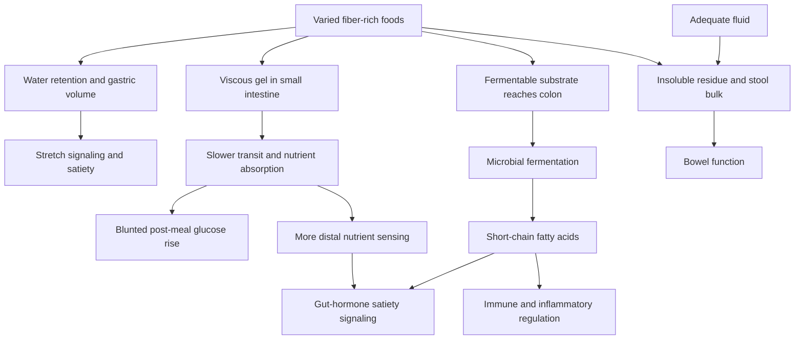

# Dietary fiber

Dietary fiber is a heterogeneous group of plant carbohydrates and related material that escapes digestion in the small intestine. It should not be treated as one molecule: water solubility, viscosity, fermentability, particle structure, and food matrix determine where a fiber acts and what it does. Whole grains, legumes, vegetables, fruits, nuts, and seeds deliver different fibers together with water, micronutrients, and bioactive compounds. (@joinzoe (ZOE) — "You’re obsessing over the wrong thing! The #1 food that cuts disease risk", 2026-07-30, [link](https://www.youtube.com/watch?v=0CWC1GUEzHA))

## Mechanisms from mouth to colon

```mermaid
flowchart TD
  FOOD[Varied fiber-rich foods] --> STOM[Water retention and gastric volume]
  STOM --> STRETCH[Stretch signaling and satiety]
  FOOD --> VISC[Viscous gel in small intestine]
  VISC --> SLOW[Slower transit and nutrient absorption]
  SLOW --> GLU[Blunted post-meal glucose rise]
  SLOW --> DISTAL[More distal nutrient sensing]
  DISTAL --> SAT[Gut-hormone satiety signaling]
  FOOD --> COLON[Fermentable substrate reaches colon]
  COLON --> MIC[Microbial fermentation]
  MIC --> SCFA[Short-chain fatty acids]
  SCFA --> IMM[Immune and inflammatory regulation]
  SCFA --> SAT
  FOOD --> BULK[Insoluble residue and stool bulk]
  WATER[Adequate fluid] --> BULK
  BULK --> TRANSIT[Bowel function]
```

Viscous soluble fibers absorb water and slow movement through the small intestine, which can moderate glucose absorption and expose nutrients to more distal satiety signaling. Fermentable fibers reach the colon, where microbes convert them into short-chain fatty acids with local and systemic signaling roles — including propionate, which acts as a satiety signal, one proposed route by which fiber reduces hunger without reducing food volume. Soluble fiber also carries a body-composition association: each 10-g/day increase was linked to about 3.7% slower visceral-fat accumulation independent of body-mass-index change, an observational finding developed further at [[visceral-and-ectopic-fat]]. (@DrBradStanfield (Dr Brad Stanfield) — "$7 Pill Shrinks the Fat Around Your Heart", 2026-07-15, [link](https://www.youtube.com/watch?v=jn-HKoOUd5o)) Less-fermentable insoluble material contributes volume and stool bulk. These categories overlap rather than dividing every fiber neatly in two. (@joinzoe (ZOE) — "You’re obsessing over the wrong thing! The #1 food that cuts disease risk", 2026-07-30, [link](https://www.youtube.com/watch?v=0CWC1GUEzHA))

Specific fibers can have specific effects: apple pectin is fermentable, while oat beta-glucan is viscous and can lower LDL cholesterol. Different microbes use different substrates, so diversity may support a broader microbial ecology, but microbiome diversity is an intermediate measure rather than proof of clinical benefit. Higher habitual fiber intake is associated with lower cardiovascular disease, stroke, and some cancer risk; these convergent outcomes are stronger than emerging claims about Alzheimer’s disease, and the contribution of fiber itself remains partly entangled with the foods and patterns that contain it. (@joinzoe (ZOE) — "You’re obsessing over the wrong thing! The #1 food that cuts disease risk", 2026-07-30, [link](https://www.youtube.com/watch?v=0CWC1GUEzHA))

The colorectal-cancer expectation deserves a specific downgrade relative to fiber's broader outcome portfolio. A dose–response meta-analysis of ten prospective studies of colorectal cancer and adenomas (Oh et al. 2019, doi:10.1017/S0007114519001454) found only a weak overall risk reduction, with the underlying cohorts split roughly evenly between protective and null results — including large null cohorts such as the Nurses' Health Study (Fuchs et al. 1999, NEJM). The clearest pattern across the cohorts is by sex: studies showing no benefit were predominantly in women, and a well-adjusted cohort that separated sexes found a clear inverse dose–response in men but not women, though residual-confounding explanations have not been excluded. For colorectal-cancer *recurrence* after prior cancer or adenomas the evidence is firmly negative: no epidemiological study that examined recurrence showed benefit, and multiple randomized trials of high-fiber supplementation or diet (wheat-bran fiber, low-fat high-fiber diet, ispaghula husk) found no reduction in adenoma recurrence. The best-supported intake for primary prevention, about 13 g per 1,000 kcal, matches standard recommendations. None of this makes fiber harmful or displaces its cardiovascular, glycemic, and bowel-function rationale; it bounds the size and population-specificity of the colorectal claim. (@Physionic (Physionic) — "The Shocking Result of Fiber on Colorectal Cancer - I did not Expect this!", 2026-07-27, [link](https://www.youtube.com/watch?v=nPWwEdMdbnc)) [[colorectal-cancer-prevention-and-screening]]

Food-specific trials refine these categories. Oat beta-glucan supplies a viscous, fermentable substrate — and its viscosity is the property that matters: randomized trials show LDL lowering depends on the beta-glucan's physicochemical state, which heating, enzymatic treatment, and fermentation during processing can degrade, favoring minimally processed oat forms ([[oats-and-cardiovascular-health]]) (@Physionic (Physionic) — "The Link Between Oats and Heart Disease: Harm or Help?", 2026-08-31, [link](https://www.youtube.com/watch?v=c0Hm9tQ9zuc)); berries add fiber and polyphenols; pulses contain fiber and resistant starch; and walnuts provide a different matrix associated with more butyrate-producing organisms. Prunes additionally contain sorbitol, which draws water into the bowel, while kiwifruit improved constipation similarly to fiber-matched psyllium in a trial summarized by the source. These effects support matching food and mechanism to the symptom rather than treating all high-fiber foods as identical. (@NutritionMadeSimple (Nutrition Made Simple!) — "8 Foods That Actually Fix Your Gut (Not Probiotics)", 2026-05-30, [link](https://www.youtube.com/watch?v=ykpITcKqWCo)) [[food-patterns-and-gut-ecology]]

Fiber should also be distinguished from live probiotics and inactivated postbiotics. A cross-sectional analysis that pooled yogurt, prebiotic, and probiotic consumption reported substantially lower colon-cancer prevalence, but could not isolate fiber from cultured food or microbial products and was vulnerable to reverse causation and healthy-user confounding. This weak category-pooled association does not add much to fiber's stronger evidence base from prospective and randomized research, and it cannot show that probiotic supplements reproduce fiber's effects. (@biolayne1 (Dr. Layne Norton) — "Probiotics Cut Cancer Risk by 50% and Melt Fat! | Educational Video | Biolayne", 2026-08-05, [link](https://www.youtube.com/watch?v=RVN6GosoJUI)) [[probiotics-prebiotics-and-postbiotics]]

## Mortality associations across populations

Higher fiber intake is one of the most consistently replicated dietary correlates of lower all-cause mortality, and the association has now been reported in essentially every population examined, including people with established disease. An umbrella review covering over 17 million subjects links higher intake with lower mortality, cardiovascular disease, and cancer risk (PMID: 40651334, as cited by the source). A 2026 cohort analysis of 3,894 US adults with diabetes extends this to a shorter-lived clinical population: compared with the lowest fiber-intake quartile, the third quartile had a hazard ratio for all-cause death of 0.47 (95% CI 0.37–0.68) after adjustment for demographics, lifestyle, and several health conditions (PMID: 42499112, per the source's description). The video presented this as a type 1 diabetes study; the accompanying description corrects that the cohort included both type 1 and type 2 diabetes — a provenance note worth keeping since the applicability claim differs. The researchers estimated that roughly 13% of the association was statistically mediated by a lower systemic immune-inflammation index, which is consistent with the short-chain-fatty-acid anti-inflammatory mechanism above but is mediation arithmetic in an observational dataset, not proof of mechanism. (@biolayne1 (Dr. Layne Norton) — "The Biohack That Reduces Mortality Risk by 50% | Educational Video | Biolayne", 2026-08-26, [link](https://www.youtube.com/watch?v=gHJ7vzU4iQc))

These are observational estimates with diet measured by dietary interview, so residual confounding — fiber intake travels with income, health literacy, and overall diet quality — keeps the causal fraction of the ~50% relative-risk reduction unknown; no randomized trial shows fiber extending life. What the design limits cannot easily explain away is the convergence: the direction is the same across cohorts, populations, and disease states, and it sits on top of randomized intermediate-endpoint evidence (LDL lowering, glycemic control, blood-pressure effects) that supplies plausible causal routes. The source's contrarian framing is that this unglamorous evidence base exceeds that of most marketed longevity practices — cold plunges, red-light therapy, grounding mats — none of which carries comparable outcome data. (@biolayne1 (Dr. Layne Norton) — "The Biohack That Reduces Mortality Risk by 50% | Educational Video | Biolayne", 2026-08-26, [link](https://www.youtube.com/watch?v=gHJ7vzU4iQc)) [[longevity-intervention-prioritization]]

## Quantity, diversity, and food form

Psyllium is a viscous, gel-forming supplemental fiber that holds water and can change stool consistency in either direction: it may soften hard stool while adding form to loose stool. Gastric distension and slower nutrient delivery can also increase satiety, and lipid lowering is a separate recognized effect. The interview presents these uses as supported by reviews but gives no dose, contraindication, or effect size; psyllium should therefore be treated as a specific tool rather than evidence that all isolated fibers are interchangeable. (@maxlugavere (Max Lugavere) — "Carbs Don’t Make You Fat: 10 Health Myths That Need to Die", 2026-08-05, [link](https://www.youtube.com/watch?v=TqcKy8yuc1U))

UK guidance targets 30 g/day; US guidance uses 14 g per 1,000 kcal, commonly about 25–38 g/day. The dose–response appears steepest at the bottom of the range: the source reads the largest marginal benefit as moving from the average American intake of roughly 13 g/day to about 20–25 g/day — an increase of only about 10 g, achievable from berries and other fruit, vegetables, legumes, and whole grains, with whole-grain fiber carrying some distinct cardiovascular association of its own. (@biolayne1 (Dr. Layne Norton) — "The Biohack That Reduces Mortality Risk by 50% | Educational Video | Biolayne", 2026-08-26, [link](https://www.youtube.com/watch?v=gHJ7vzU4iQc)) The suggestion that 40–50 g/day is better for the microbiome is an emerging expert extrapolation with less dose-ranging outcome research, not a settled universal target. Counting grams can reveal a shortfall, but optimizing dry-weight rankings can overvalue concentrated seeds relative to water-rich produce. A varied whole-food portfolio covers more mechanisms and accompanying nutrients than either seven servings of the same fruit or an isolated fiber additive. (@joinzoe (ZOE) — "You’re obsessing over the wrong thing! The #1 food that cuts disease risk", 2026-07-30, [link](https://www.youtube.com/watch?v=0CWC1GUEzHA))

Fiber fortification does not make an ultra-processed product metabolically identical to an intact plant. Conversely, processing is not automatically harmful: cooking can improve tolerance, and frozen or canned beans and vegetables remain practical sources. The relevant questions are retained structure, fiber type, accompanying ingredients, displacement, and the total dietary pattern. (@joinzoe (ZOE) — "You’re obsessing over the wrong thing! The #1 food that cuts disease risk", 2026-07-30, [link](https://www.youtube.com/watch?v=0CWC1GUEzHA)) [[nutrition-evidence-and-personalization]]

## Skin is a downstream, unvalidated target

Colonic fermentation connects dietary fiber to skin through candidate short-chain-fatty-acid, immune, barrier, and metabolic pathways. Human observations of altered gut communities in atopic dermatitis and psoriasis do not establish causality, and animal improvement after fiber or metabolite exposure does not establish a human treatment. Acne has a separate indirect route: replacing refined carbohydrates with intact fiber-rich foods may lower glycemic load and insulin/IGF-1 signaling. These distinctions support fiber-rich eating for general health while withholding the claim that fiber supplements or a fixed gram target treat inflammatory skin disease. (@DrDrayzday (Dr Dray) — "Can Eating More Fiber Improve Your Skin? | Dermatologist Explains", 2026-08-27, [link](https://www.youtube.com/watch?v=FzrowYqQnnE)) [[fiber-gut-skin-axis]]

## Tolerance and clinical boundaries

A rapid increase can cause gas, bloating, or constipation as fermentation and stool water requirements change. Increase gradually and drink adequately; more is not always better for a person with a stricture, active gastrointestinal disease, severe symptoms, or a clinician-directed restriction. Protein adequacy and fiber adequacy are separate questions: the source’s contrarian framing is that population enthusiasm for supplemental protein is misplaced when most people already meet protein needs while fewer than one in ten meet fiber recommendations. That population claim does not apply automatically to athletes, frail older adults, or people with low energy intake. (@joinzoe (ZOE) — "You’re obsessing over the wrong thing! The #1 food that cuts disease risk", 2026-07-30, [link](https://www.youtube.com/watch?v=0CWC1GUEzHA))

## Practical implications

- **For uncomplicated constipation: first increase fiber gradually, maintain fluid intake, move daily, and keep a regular meal routine — moderate.** Psyllium can be trialed according to its label with adequate fluid; a sudden major bowel change, bleeding, severe pain, vomiting, or failure of basic measures needs clinical assessment. (@maxlugavere (Max Lugavere) — "Carbs Don’t Make You Fat: 10 Health Myths That Need to Die", 2026-08-05, [link](https://www.youtube.com/watch?v=TqcKy8yuc1U))

- **Daily: work toward at least the applicable guideline—about 30 g/day in the UK or 14 g/1,000 kcal in the US — moderate-to-strong.** Build meals from legumes, intact whole grains, vegetables, fruit, nuts, and seeds rather than relying on an additive. (@joinzoe (ZOE) — "You’re obsessing over the wrong thing! The #1 food that cuts disease risk", 2026-07-30, [link](https://www.youtube.com/watch?v=0CWC1GUEzHA))
- **Across each week: rotate fiber sources — moderate for mechanistic breadth, emerging for a specific diversity target.** Repeated inexpensive staples such as beans, oats, whole-grain bread, seasonal vegetables, and fruit can provide variety without specialty products. (@joinzoe (ZOE) — "You’re obsessing over the wrong thing! The #1 food that cuts disease risk", 2026-07-30, [link](https://www.youtube.com/watch?v=0CWC1GUEzHA))
- **For uncomplicated constipation: consider a food-specific trial of prunes or two kiwifruit daily — moderate.** Introduce gradually, substitute calorie-containing portions for another snack, and avoid prunes when diarrhea predominates. (@NutritionMadeSimple (Nutrition Made Simple!) — "8 Foods That Actually Fix Your Gut (Not Probiotics)", 2026-05-30, [link](https://www.youtube.com/watch?v=ykpITcKqWCo))
- **When starting low: increase over several weeks and increase fluid alongside dry, concentrated fiber — moderate.** Pause escalation and seek clinical advice for persistent pain, vomiting, bleeding, obstruction symptoms, or major bowel change. (@joinzoe (ZOE) — "You’re obsessing over the wrong thing! The #1 food that cuts disease risk", 2026-07-30, [link](https://www.youtube.com/watch?v=0CWC1GUEzHA))
- **Do not rely on fiber to prevent colorectal-cancer recurrence after prior cancer or adenomas — moderate-to-strong for the null, from consistent observational and randomized recurrence evidence.** Keep eating fiber for its other benefits, but lean on surveillance colonoscopy and established prevention rather than diet alone; for primary prevention, expect at most a small colorectal-specific benefit, clearer in men, at around 13 g/1,000 kcal. (@Physionic (Physionic) — "The Shocking Result of Fiber on Colorectal Cancer - I did not Expect this!", 2026-07-27, [link](https://www.youtube.com/watch?v=nPWwEdMdbnc))
- **If intake is near the population average (~13 g/day): prioritize adding roughly 10 g/day from whole foods before any other "longevity" purchase — moderate-to-strong observational convergence, no randomized mortality trial.** The low-to-moderate step carries the steepest observed risk gradient, applies in populations with established disease including diabetes, and has more outcome evidence behind it than most marketed biohacks. (@biolayne1 (Dr. Layne Norton) — "The Biohack That Reduces Mortality Risk by 50% | Educational Video | Biolayne", 2026-08-26, [link](https://www.youtube.com/watch?v=gHJ7vzU4iQc))
- **Periodically: audit both fiber grams and the foods supplying them — moderate.** Do not infer that a high-fiber label neutralizes high free sugar, excess energy density, or displacement of intact foods. (@joinzoe (ZOE) — "You’re obsessing over the wrong thing! The #1 food that cuts disease risk", 2026-07-30, [link](https://www.youtube.com/watch?v=0CWC1GUEzHA))

## Gaps & open questions

- Which psyllium doses and schedules best balance stool normalization, LDL reduction, satiety, tolerability, and medication timing?

- Do 40–50 g/day improve clinical outcomes over current guideline targets, and for whom?
- Which combinations of fiber types best support specific microbial functions rather than diversity alone?
- How much cardiovascular and cancer benefit is caused by fiber versus correlated food-matrix and substitution effects?
- How much of the fiber–mortality association is causally mediated by lower systemic inflammation, versus glycemic, lipid, transit, and confounded pathways? The ~13% statistical mediation via the systemic immune-inflammation index in the diabetes cohort is a starting estimate, not a mechanism.
- Is the apparent male–female difference in fiber's colorectal-cancer association real, and if so, is it hormonal, dietary-pattern, adjustment-driven, or screening-related?
- Why does fiber show primary-prevention signals for colorectal cancer but uniformly null recurrence results — different biology of established lesions, too-late exposure, or a non-causal primary association?
- Which escalation schedules minimize symptoms in irritable bowel syndrome and other sensitive populations?
- When do isolated or added fibers reproduce the clinical effects of their intact food sources?

## Related

[[resistant-starch]] · [[longevity-intervention-prioritization]] · [[layne-norton]] · [[oats-and-cardiovascular-health]] · [[probiotics-prebiotics-and-postbiotics]] · [[food-patterns-and-gut-ecology]] · [[fiber-gut-skin-axis]] · [[colorectal-cancer-prevention-and-screening]] · [[free-sugars-and-glycemic-response]] · [[nutrition-evidence-and-personalization]] · [[evolutionary-mismatch-and-weight-regulation]] · [[visceral-and-ectopic-fat]] · [[practice-playbook]] · [[aging-model]]
