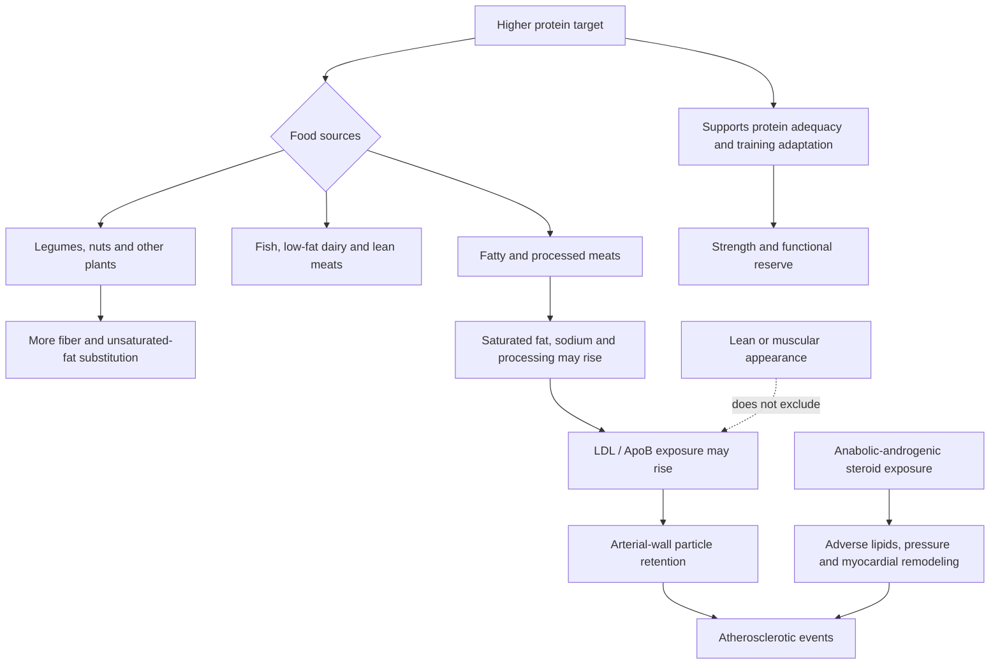

# Dietary protein and cardiovascular risk

A high-protein diet is defined by protein quantity, usually as a percentage of energy or grams per kilogram of body mass. It is not a single food pattern. The same protein target can be reached with legumes, nuts, fish, low-fat dairy, lean meat, processed meat, or fatty meat, while saturated fat, fiber, sodium, energy intake, and food processing vary independently. Cardiovascular inference must therefore separate protein quantity from protein source, the nutrients that accompany it, and the food it replaces. Layne Norton's central objection to claims that high protein causes early heart attacks is this category error: a carnivore pattern that raises LDL/ApoB is not metabolically equivalent to every high-protein diet. (@biolayne1 (Dr. Layne Norton) — "Heart Surgeon Says High Protein Causes Heart Attack | What the Fitness | Biolayne", 2026-08-14, [link](https://www.youtube.com/watch?v=DFhpqZK4qP4))

## Causal decomposition

Protein itself is therefore only one node in several correlated pathways. A high-protein carnivore diet can raise ApoB when it also raises saturated-fat exposure, while a high-protein pattern built from lean and plant sources need not do so. An athletic appearance, low body fat, or high strength can lower some population-level risks yet cannot neutralize sustained ApoB exposure, hypertension, smoking, diabetes, inherited risk, or drug toxicity. Norton accepts the first part of the criticized surgeon's warning—fit-looking people can have plaque—but rejects assigning the plaque to protein without separating these pathways. (@biolayne1 (Dr. Layne Norton) — "Heart Surgeon Says High Protein Causes Heart Attack | What the Fitness | Biolayne", 2026-08-14, [link](https://www.youtube.com/watch?v=DFhpqZK4qP4)) [[lipoprotein-retention-and-atherogenesis]] [[muscle-strength-and-mortality]]

## Evidence on quantity and outcomes

A 2023 meta-analysis of 14 prospective cohorts in adults without established cardiovascular disease found no statistically significant association between higher protein intake and a composite of nonfatal myocardial infarction, nonfatal stroke, or cardiovascular death (13 studies, 525,047 participants; odds ratio 0.87, 95% CI 0.70–1.07). Cardiovascular-death and stroke estimates were also null, but heterogeneity was extreme for the composite and cardiovascular death (I² 97–98%), definitions of high protein varied, and observational adjustment cannot fully separate food sources and lifestyle.[^protein-outcomes-2023] This supports Norton's narrower conclusion that higher protein intake has not been established as an independent cardiovascular cause; it does not prove that every dose, source, or population is safe. (@biolayne1 (Dr. Layne Norton) — "Heart Surgeon Says High Protein Causes Heart Attack | What the Fitness | Biolayne", 2026-08-14, [link](https://www.youtube.com/watch?v=DFhpqZK4qP4))

Randomized evidence mainly addresses intermediate risk factors rather than events. A meta-analysis of 54 trials (4,344 participants, mean BMI 33 kg/m², mean duration 18 weeks) found small favorable effects of higher- versus lower-protein diets on weight, fat mass, systolic pressure, total cholesterol, triglycerides, and fasting insulin, with no significant differences in several other outcomes.[^protein-rct-2021] These short, mostly weight-management trials weaken a simple protein-causes-cardiovascular-dysfunction story but cannot establish long-term event safety, especially at very high intake or in older and kidney-disease populations. Norton's video description invokes this evidence as a rebuttal; the applicable conclusion is about small short-term risk-factor changes, not heart-attack prevention. (@biolayne1 (Dr. Layne Norton) — "Heart Surgeon Says High Protein Causes Heart Attack | What the Fitness | Biolayne", 2026-08-14, [link](https://www.youtube.com/watch?v=DFhpqZK4qP4))

## Source and substitution

A 2020 dose-response meta-analysis of prospective cohorts found that total and animal protein were not significantly associated with cardiovascular mortality after multivariable adjustment, while higher plant-protein intake was associated with lower all-cause and cardiovascular mortality.[^protein-source-2020] That asymmetry does not show that the protein molecule in animal food caused harm: plant-protein intake can proxy or produce substitution toward fiber-rich foods, unsaturated fat, and different dietary patterns. It does make source and replacement a more informative question than protein grams alone, consistent with Norton's position. (@biolayne1 (Dr. Layne Norton) — "Heart Surgeon Says High Protein Causes Heart Attack | What the Fitness | Biolayne", 2026-08-14, [link](https://www.youtube.com/watch?v=DFhpqZK4qP4)) [[dietary-fat-quality-and-cardiovascular-risk]] [[dietary-fiber]]

## Evidence conflicts

The evidence is not uniformly null. A 2026 UK Biobank analysis defined high intake as at least 1.8 g/kg/day and, after propensity matching, associated it with more major cardiovascular events overall (HR 1.21, 95% CI 1.02–1.44) and among participants over 55 (interaction-model HR 1.36, 95% CI 1.13–1.63), but not among younger participants.[^protein-age-2026] This conflicts with Norton's categorical statement that there is no evidence of cardiovascular risk from high-protein diets. The study remains observational, relied heavily on one or few 24-hour dietary recalls, included a predominantly White and female selected sample, and reported an older-group association that was not significant in some alternative subgroup models. It raises a dose-and-age question; it does not isolate protein from its food matrix or establish causality. (@biolayne1 (Dr. Layne Norton) — "Heart Surgeon Says High Protein Causes Heart Attack | What the Fitness | Biolayne", 2026-08-14, [link](https://www.youtube.com/watch?v=DFhpqZK4qP4))

## The bodybuilder confounder

Inferring that protein caused disease because a muscular bodybuilder developed early cardiovascular disease is especially weak when anabolic-androgenic steroid exposure is unknown. In a Danish registry cohort of 1,189 men sanctioned for steroid use and 59,450 age- and sex-matched controls, steroid exposure was associated with myocardial infarction (adjusted HR 3.00, 95% CI 1.67–5.39), cardiomyopathy (8.90, 4.99–15.88), heart failure (3.63, 2.01–6.55), arrhythmia, revascularization, and venous thromboembolism over about 11 years.[^aas-cvd-2025] This is strong observational evidence of a large competing exposure, although sanctioned users are selected and the study does not establish the cause of any particular athlete's event. Norton presents performance-enhancing drugs as the major omitted confounder in physique-based anecdotes. (@biolayne1 (Dr. Layne Norton) — "Heart Surgeon Says High Protein Causes Heart Attack | What the Fitness | Biolayne", 2026-08-14, [link](https://www.youtube.com/watch?v=DFhpqZK4qP4))

## Practical implications

- **Do not diagnose cardiovascular risk from physique, and do not infer protein causation from an athletic person's event—strong causal-inference principle.** Assess ApoB/LDL, blood pressure, smoking, diabetes, family history, symptoms, and relevant drug exposure directly. (@biolayne1 (Dr. Layne Norton) — "Heart Surgeon Says High Protein Causes Heart Attack | What the Fitness | Biolayne", 2026-08-14, [link](https://www.youtube.com/watch?v=DFhpqZK4qP4))
- **Build protein intake inside a cardioprotective pattern—strong for the pattern and substitution direction; uncertain for an independently optimal protein dose.** Favor legumes, nuts, fish, low-fat dairy, and lean meats; keep fiber-rich plants prominent; and replace rather than add calories. (@biolayne1 (Dr. Layne Norton) — "Heart Surgeon Says High Protein Causes Heart Attack | What the Fitness | Biolayne", 2026-08-14, [link](https://www.youtube.com/watch?v=DFhpqZK4qP4))[^protein-source-2020]
- **If a higher-protein pattern raises LDL/ApoB, change the accompanying saturated-fat sources rather than assuming protein is the active exposure—strong mechanistic and lipid-outcome evidence.** Recheck the marker on a clinically appropriate cadence after the dietary change. (@biolayne1 (Dr. Layne Norton) — "Heart Surgeon Says High Protein Causes Heart Attack | What the Fitness | Biolayne", 2026-08-14, [link](https://www.youtube.com/watch?v=DFhpqZK4qP4)) [[lipoprotein-retention-and-atherogenesis]]
- **Treat intakes at or above 1.8 g/kg/day in adults over 55 as an unresolved evidence zone, not a proven toxicity threshold—low-certainty precaution.** One new cohort raises concern, whereas earlier pooled cohorts and short trials do not establish harm; individual needs, kidney function, food sources, and muscle-preservation goals matter.[^protein-age-2026]
- **Avoid non-prescribed anabolic-androgenic steroids—strong safety direction from large-effect observational evidence and established physiological harms.** Their cardiovascular risk cannot be inferred away by leanness, strength, or exercise. (@biolayne1 (Dr. Layne Norton) — "Heart Surgeon Says High Protein Causes Heart Attack | What the Fitness | Biolayne", 2026-08-14, [link](https://www.youtube.com/watch?v=DFhpqZK4qP4))[^aas-cvd-2025]

## Gaps & open questions

- Does sustained protein intake above 1.8 g/kg/day independently change cardiovascular events when food source, saturated fat, fiber, total energy, kidney function, age, and resistance training are measured repeatedly?
- Are the 2026 UK Biobank age interaction and dose threshold reproducible in more diverse cohorts and randomized intermediate-endpoint trials?
- Which plant-for-animal substitutions produce benefit because of amino-acid composition, fiber, fat quality, food processing, or correlated behavior?
- How should protein targets balance muscle preservation against uncertain long-term dose effects in older adults and people with kidney disease?
- How much of the cardiovascular excess in bodybuilding populations is attributable to anabolic steroids, extreme leanness cycles, stimulants, blood pressure, sleep apnea, or diet?

## References

[^protein-outcomes-2023]: Mantzouranis E, et al. “The Impact of High Protein Diets on Cardiovascular Outcomes.” *Nutrients*. 2023. [systematic review and meta-analysis of prospective cohorts]. [PubMed PMID: 36986102](https://pubmed.ncbi.nlm.nih.gov/36986102/)
[^protein-rct-2021]: Vogtschmidt YD, et al. “Is protein the forgotten ingredient: Effects of higher compared to lower protein diets on cardiometabolic risk factors.” *Atherosclerosis*. 2021. [systematic review and meta-analysis of 54 randomized trials]. [PubMed PMID: 34120735](https://pubmed.ncbi.nlm.nih.gov/34120735/)
[^protein-source-2020]: Naghshi S, et al. “Dietary intake of total, animal, and plant proteins and risk of all cause, cardiovascular, and cancer mortality.” *BMJ*. 2020. [systematic review and dose-response meta-analysis of prospective cohorts]. [doi:10.1136/bmj.m2412](https://doi.org/10.1136/bmj.m2412)
[^protein-age-2026]: Zhang H, et al. “Associations between High Protein Intake and Cardiovascular Diseases by Age Groups.” *Journal of Nutrition, Health and Aging*. 2026. [prospective UK Biobank cohort analysis]. [doi:10.1016/j.jnha.2025.100727](https://doi.org/10.1016/j.jnha.2025.100727)
[^aas-cvd-2025]: Windfeld-Mathiasen J, et al. “Cardiovascular Disease in Anabolic Androgenic Steroid Users.” *Circulation*. 2025. [matched national-registry cohort]. [PubMed PMID: 39945117](https://pubmed.ncbi.nlm.nih.gov/39945117/)

## Related

[[nutrition-evidence-and-personalization]] · [[dietary-fat-quality-and-cardiovascular-risk]] · [[dietary-fiber]] · [[lipoprotein-retention-and-atherogenesis]] · [[muscle-strength-and-mortality]] · [[skeletal-muscle-hypertrophy]] · [[resistance-training]] · [[ketogenic-diet-apob-and-atherosclerosis]] · [[layne-norton]] · [[aging-model]] · [[practice-playbook]]
