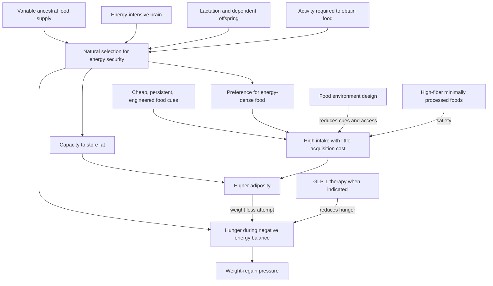

# Evolutionary mismatch and weight regulation

Evolutionary mismatch occurs when a trait that was useful in an ancestral environment meets a novel environment in which its effects become costly. Human appetite and fat storage are not defects engineered for modern weight control: natural selection favored reproductive success under variable food supply, not lifelong leanness amid continuous access to energy-dense food. This lens explains vulnerability; it does not prove that one reconstructed ancestral menu is optimal or that genes make current weight inevitable. (@joinzoe (ZOE) — "Harvard professor: The 3 evolutionary reasons why you can’t lose weight", 2026-08-06, [link](https://www.youtube.com/watch?v=9kXWRFZhj3s))

## Why humans defend energy

Compared with other primates, humans evolved unusually large energy reserves alongside three costly features: a large brain with high childhood energy demand, rapid reproduction with prolonged provisioning and lactation, and a high-output foraging strategy in which obtaining food itself required substantial activity. Fat therefore served as insurance against interruptions in intake, especially for reproduction and dependent offspring; sex differences in reproductive cost help explain higher typical fat reserves in women. Adipose tissue is also an endocrine organ, so its regulation is more complex than passive calorie storage. (@joinzoe (ZOE) — "Harvard professor: The 3 evolutionary reasons why you can’t lose weight", 2026-08-06, [link](https://www.youtube.com/watch?v=9kXWRFZhj3s))

## Energy balance is necessary but behaviorally incomplete

Weight falls when energy intake remains below expenditure, but this accounting identity does not describe how difficult the deficit is to sustain. Negative energy balance recruits hunger and other compensatory responses; after loss, a defended set point or settling point can promote regain. GLP-1 receptor agonists demonstrate that changing appetite biology can make a deficit more achievable, while frequent discontinuation and returning hunger show why a temporary pharmacologic state may not produce permanent maintenance. The source cites an estimate that roughly 60% discontinue by about one year, but it does not identify the paper or establish a universal rate; treat the number as provisional. (@joinzoe (ZOE) — "Harvard professor: The 3 evolutionary reasons why you can’t lose weight", 2026-08-06, [link](https://www.youtube.com/watch?v=9kXWRFZhj3s)) [[glp-1-receptor-agonists]]

This distinction also resolves a common calorie dispute. Approximate labels and unmeasured changes in expenditure limit the accuracy of a budget or prediction, but they do not negate conservation of energy. Protein, fiber, food structure, and processing can affect thermogenesis, satiety, and therefore the values inside the balance; the practical model is dynamic even though the accounting constraint remains. Layne Norton defends this physics-first position against Stacy Sims's emphasis on measurement limits, food quality, and meal timing; the disagreement and the limits of the excerpt are developed in [[energy-balance-and-calorie-counting]]. (@biolayne1 (Dr. Layne Norton) — "Stacy Sims PHD Says Calories Are BS | What the Fitness | Biolayne", 2026-08-07, [link](https://www.youtube.com/watch?v=tN97LNccMGQ))

Calories can also differ in satiety and downstream response because protein, fat, fiber, physical structure, and refined carbohydrate affect gastric emptying, intestinal sensing, and hunger differently. This does not violate energy balance; it locates food composition upstream of intake and adherence. (@joinzoe (ZOE) — "Harvard professor: The 3 evolutionary reasons why you can’t lose weight", 2026-08-06, [link](https://www.youtube.com/watch?v=9kXWRFZhj3s)) [[dietary-fiber]] [[free-sugars-and-glycemic-response]]

Satiety-oriented meal design operationalizes this upstream layer: protein, fiber, intact structure, volume, chewing, beverage substitution, and attentive eating can reduce the amount of repeated inhibition demanded by a cue-rich environment. A one-day diet swap illustrates the possible energy-density contrast but cannot show universal efficacy, and its three-person EEG images cannot diagnose a fixed reward or self-control phenotype. (@JeremyEthier (Jeremy Ethier) — "I Proved My 6-Pack Abs Diet Works For ANYONE", 2026-07-12, [link](https://www.youtube.com/watch?v=HkrWExj1QNk)) [[satiety-oriented-diet-design]]

## Cooking, flexibility, and the paleo fallacy

Humans are adapted to cultural food processing, especially cooking, which raises energy availability from many plant foods and is associated with a relatively longer small intestine and shorter fermentation-dominated large intestine than in other apes. Hunter-gatherer diets varied widely by ecology and included cooked plants, grains, legumes, underground storage organs, honey, and animal foods. Evolution therefore supports dietary flexibility and trade-offs, not a single authentic paleo diet or a universal raw-food prescription. Daniel Lieberman’s distinctive position is that there is no single optimal human diet, though diverse, plant-rich, minimally processed patterns repeatedly share favorable features. (@joinzoe (ZOE) — "Harvard professor: The 3 evolutionary reasons why you can’t lose weight", 2026-08-06, [link](https://www.youtube.com/watch?v=9kXWRFZhj3s)) [[nutrition-evidence-and-personalization]]

## Genes, environment, and agency

Heritability describes variation within a population and environment; it is not the percentage of an individual’s weight caused by genes. The rapid historical rise in obesity cannot reflect comparably rapid genetic change, so inherited susceptibility and the food environment interact. This makes environmental design—what is bought, visible, convenient, and repeatedly cued—a physiological intervention rather than a test of character. Shopping after eating and keeping less-desired foods out of the home are proposed implementations; they are plausible behavioral strategies, not comparative clinical protocols. (@joinzoe (ZOE) — "Harvard professor: The 3 evolutionary reasons why you can’t lose weight", 2026-08-06, [link](https://www.youtube.com/watch?v=9kXWRFZhj3s))

## Practical implications

- **At each grocery trip: shop from a planned list when not hungry and shape the home food environment — moderate mechanistic and behavioral rationale, limited direct evidence in this source.** Make minimally processed, fiber-rich foods the convenient default instead of relying on repeated inhibition of salient cues. (@joinzoe (ZOE) — "Harvard professor: The 3 evolutionary reasons why you can’t lose weight", 2026-08-06, [link](https://www.youtube.com/watch?v=9kXWRFZhj3s))
- **Daily: favor diverse plants, intact fiber sources, and unsaturated rather than saturated fats within a culturally workable pattern — moderate-to-strong pattern evidence as characterized by the source.** No ancestral reenactment, raw-food diet, or unique macronutrient ratio is required. (@joinzoe (ZOE) — "Harvard professor: The 3 evolutionary reasons why you can’t lose weight", 2026-08-06, [link](https://www.youtube.com/watch?v=9kXWRFZhj3s))
- **During weight treatment: plan maintenance from the outset and reassess hunger, weight trajectory, tolerability, and treatment adherence regularly — strong rationale, regimen-specific evidence varies.** Persistent hunger is expected biology, not proof of moral failure; medication decisions belong with a clinician. (@joinzoe (ZOE) — "Harvard professor: The 3 evolutionary reasons why you can’t lose weight", 2026-08-06, [link](https://www.youtube.com/watch?v=9kXWRFZhj3s))
- **Most days: use physical activity for health, metabolic demand, and sleep support, without treating exercise calories as a complete solution to appetite — strong for general health, moderate for weight maintenance.** (@joinzoe (ZOE) — "Harvard professor: The 3 evolutionary reasons why you can’t lose weight", 2026-08-06, [link](https://www.youtube.com/watch?v=9kXWRFZhj3s))

## Gaps & open questions

- How much post-loss regain is attributable to stable biological defense versus a returning food environment, and how does this vary among individuals?
- Which home and retail environment changes produce durable weight maintenance in randomized studies?
- What are the long-term discontinuation rates and weight trajectories for each GLP-1-class treatment under real-world care?
- Which inferred ancestral adaptations are causal explanations rather than plausible evolutionary narratives?
- How should reproductive history, sex, age, sleep, and medication be incorporated into individualized models of defended adiposity?

## Related

[[visceral-and-ectopic-fat]] · [[glp-1-receptor-agonists]] · [[energy-balance-and-calorie-counting]] · [[satiety-oriented-diet-design]] · [[dietary-fiber]] · [[free-sugars-and-glycemic-response]] · [[nutrition-evidence-and-personalization]] · [[caloric-restriction-and-meal-timing]] · [[practice-playbook]] · [[aging-model]]
