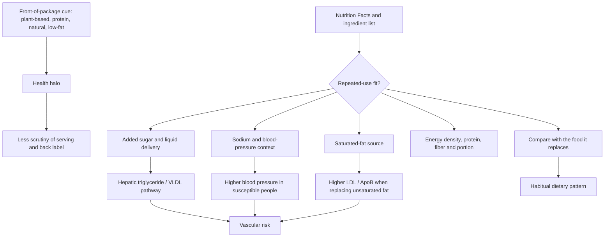

# Food label literacy and health halos

Food label literacy is the ability to distinguish regulated composition data from package cues that imply health without establishing it. Terms such as plant-based, vegan, natural, gluten-free, low-fat, low-carbohydrate, high-protein, or whole-grain can each describe one real property while leaving added sugar, sodium, saturated fat, energy density, serving size, and the overall food matrix undisclosed. This creates a **health halo**: one favorable attribute changes the consumer's judgment of the whole product. (@NutritionMadeSimple (Nutrition Made Simple!) — "15 'Healthy' Foods that are Quietly Clogging your Arteries (And What to Eat Instead)", 2026-04-20, [link](https://www.youtube.com/watch?v=oMOSvXcvnOw))

## From package cue to repeated exposure

The back label answers different questions. Added sugar distinguishes sugar introduced during manufacture from the total sugar that may also include milk or fruit sugars. The ingredient list is ordered by weight and can expose sugar, refined flour, palm or coconut oil, or processed meat behind a favorable front label. Sodium and saturated fat must be interpreted per realistic portion, not only per nominal serving. None of these numbers alone determines healthfulness; they identify exposures that matter when the item is eaten repeatedly and clarify what is being substituted. [[free-sugars-and-glycemic-response]] [[dietary-fat-quality-and-cardiovascular-risk]] (@NutritionMadeSimple (Nutrition Made Simple!) — "15 'Healthy' Foods that are Quietly Clogging your Arteries (And What to Eat Instead)", 2026-04-20, [link](https://www.youtube.com/watch?v=oMOSvXcvnOw))

Examples make the classification problem concrete. A plant-based burger may still concentrate sodium and saturated fat through coconut or palm oil; a protein bar can contain more added sugar than protein; low-fat granola or flavored yogurt can compensate with added sugar; and sweetened smoothies, vitamin waters, lemonade, energy drinks, or iced tea can deliver large sugar doses despite fruit, vitamin, or performance positioning. Conversely, an unsweetened yogurt, low-sodium canned food, minimally sweetened protein product, or appropriately formulated plant burger may fit a sound pattern. The category name is therefore weaker evidence than the finished composition and comparator. (@NutritionMadeSimple (Nutrition Made Simple!) — "15 'Healthy' Foods that are Quietly Clogging your Arteries (And What to Eat Instead)", 2026-04-20, [link](https://www.youtube.com/watch?v=oMOSvXcvnOw))

## Interpreting the cardiovascular pathways

Repeated high added-sugar intake can raise hepatic triglyceride production and VLDL secretion, while high sodium can raise blood pressure in salt-sensitive people and saturated-rich coconut, palm, or animal fats can raise LDL/ApoB relative to unsaturated replacements. These pathways connect food selection to [[lipoprotein-retention-and-atherogenesis]], hypertension, and the vascular branch of [[aging-model]]. They do not mean that one sweetened drink, salty soup, or saturated-fat-containing food acutely clogs an artery; atherosclerosis reflects cumulative exposure, susceptibility, and the foods displaced. (@NutritionMadeSimple (Nutrition Made Simple!) — "15 'Healthy' Foods that are Quietly Clogging your Arteries (And What to Eat Instead)", 2026-04-20, [link](https://www.youtube.com/watch?v=oMOSvXcvnOw))

Potassium-enriched salt is a genuine intervention rather than a label heuristic. A large randomized trial described in the source replaced 25% of regular salt with potassium salt and reduced strokes and total deaths over five years. That supports partial substitution in the studied context, but the transcript does not define clinical eligibility or contraindications and therefore does not support unsupervised use by everyone. (@NutritionMadeSimple (Nutrition Made Simple!) — "15 'Healthy' Foods that are Quietly Clogging your Arteries (And What to Eat Instead)", 2026-04-20, [link](https://www.youtube.com/watch?v=oMOSvXcvnOw))

## A repeatable decision protocol

1. Identify the claim on the front, but do not treat it as a verdict.
2. Normalize the serving to the amount actually consumed and inspect added sugar, sodium, saturated fat, energy, protein, and fiber.
3. Read the first ingredients to learn what supplies most of the product's mass.
4. Ask what the item will replace and how often it will be eaten; an occasional food and a daily default have different consequences.
5. Prefer the simplest feasible swap that preserves the desired function: unsweetened drinks for sweetened drinks, unsweetened yogurt plus fruit for sweetened yogurt, low-sodium soup for standard soup, unsalted nuts or popcorn for salty snacks, or legumes, fish, fermented dairy, lean poultry, seitan, or soy foods for heavily sweetened protein products. (@NutritionMadeSimple (Nutrition Made Simple!) — "15 'Healthy' Foods that are Quietly Clogging your Arteries (And What to Eat Instead)", 2026-04-20, [link](https://www.youtube.com/watch?v=oMOSvXcvnOw))

This protocol complements rather than replaces [[nutrition-evidence-and-personalization]]. A barcode or long ingredient list is not itself a mechanism of harm, and front-label claims are not always false. The decision-relevant questions are what processing changed, which exposures the finished product delivers, whether it is satiating and nutritionally adequate, and what it displaces. (@NutritionMadeSimple (Nutrition Made Simple!) — "The REAL 7 Levels of Eating That Transform Your Health (Backed by Science)", 2026-04-28, [link](https://www.youtube.com/watch?v=U9a4KsG7QNw))

## Practical implications

- **At every first purchase, read the back label and ingredient list; recheck when a formulation changes — moderate evidence as a risk-screening practice.** Prioritize exposures that recur: added sugar in drinks and flavored foods, sodium in soups and meat substitutes, and saturated fat from coconut or palm oil. (@NutritionMadeSimple (Nutrition Made Simple!) — "15 'Healthy' Foods that are Quietly Clogging your Arteries (And What to Eat Instead)", 2026-04-20, [link](https://www.youtube.com/watch?v=oMOSvXcvnOw))
- **Weekly, redesign one repeated purchase rather than policing occasional foods — moderate implementation rationale.** Batch cooking can make minimally processed meals available when hunger and time pressure would otherwise select convenience foods. (@NutritionMadeSimple (Nutrition Made Simple!) — "The REAL 7 Levels of Eating That Transform Your Health (Backed by Science)", 2026-04-28, [link](https://www.youtube.com/watch?v=U9a4KsG7QNw))
- **For hypertension or high cardiovascular risk, compare sodium and saturated fat especially carefully — strong for managing established risk factors, product-specific evidence otherwise.** The source supports lower-sodium alternatives and describes outcome benefit from a potassium-salt substitution trial, but does not establish who should use that intervention. (@NutritionMadeSimple (Nutrition Made Simple!) — "15 'Healthy' Foods that are Quietly Clogging your Arteries (And What to Eat Instead)", 2026-04-20, [link](https://www.youtube.com/watch?v=oMOSvXcvnOw))
- **Do not infer that gluten-free, vegan, natural, high-protein, or low-carbohydrate means healthy — strong conceptual guidance, with outcome strength determined by the actual substitution.** A claim may be factually correct while remaining irrelevant to the product's main repeated exposures. (@NutritionMadeSimple (Nutrition Made Simple!) — "15 'Healthy' Foods that are Quietly Clogging your Arteries (And What to Eat Instead)", 2026-04-20, [link](https://www.youtube.com/watch?v=oMOSvXcvnOw))

## Gaps & open questions

- Which front-of-package claims most strongly alter purchasing, portion size, and repeat consumption in real-world settings?
- Does routine label education improve ApoB, blood pressure, glycemic control, weight, or clinical events beyond general dietary counseling?
- Which label formats best communicate realistic portions and substitution quality without increasing confusion or disordered eating?
- How often do the branded examples and formulations described in the sources change, and how well do they represent their product categories?
- Which minimally reformulated convenience foods preserve adherence while producing outcomes comparable with home-prepared alternatives?

## Related

[[nutrition-evidence-and-personalization]] · [[free-sugars-and-glycemic-response]] · [[dietary-fat-quality-and-cardiovascular-risk]] · [[lipoprotein-retention-and-atherogenesis]] · [[food-patterns-and-gut-ecology]] · [[satiety-oriented-diet-design]] · [[energy-balance-and-calorie-counting]] · [[aging-model]] · [[practice-playbook]]
