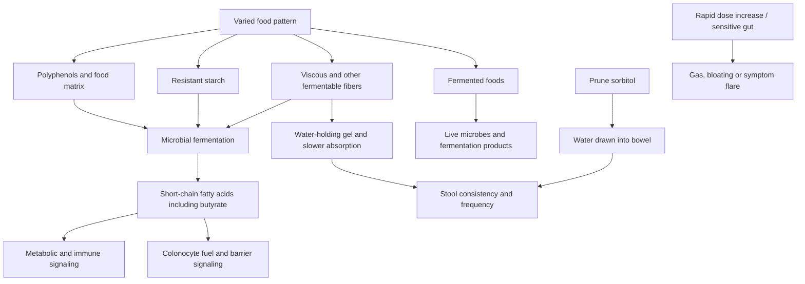

# Food patterns and gut ecology

Gut health is not a single score or the presence of a supposedly beneficial species. It includes bowel function, epithelial integrity, ecological stability, metabolic output, immune signaling, and freedom from disease. A food pattern can act through several of these dimensions at once: live fermented foods introduce organisms and fermentation products, while varied fibers and resistant starch feed resident organisms and alter stool water, transit, and microbial metabolites. The resulting ecosystem framing is more defensible than expecting a cleanse, detox, probiotic capsule, or single superfood to repair every gastrointestinal problem. (@NutritionMadeSimple (Nutrition Made Simple!) — "8 Foods That Actually Fix Your Gut (Not Probiotics)", 2026-05-30, [link](https://www.youtube.com/watch?v=ykpITcKqWCo)) [[probiotics-prebiotics-and-postbiotics]]

## Food-to-function pathways

Oat beta-glucan is viscous and fermentable; pulses such as lentils and beans supply fiber and resistant starch; berries contribute fiber and polyphenols; and walnuts provide a distinct matrix associated in trials with more butyrate-producing organisms. These are plausible complementary substrates rather than eight interchangeable treatments. Resistant starch itself includes structurally different types, so rotating foods may broaden substrate exposure, although a precise diversity prescription has not been validated. (@NutritionMadeSimple (Nutrition Made Simple!) — "8 Foods That Actually Fix Your Gut (Not Probiotics)", 2026-05-30, [link](https://www.youtube.com/watch?v=ykpITcKqWCo)) [[dietary-fiber]] [[resistant-starch]]

## Matching foods to the problem

Constipation can respond to water-holding or osmotic effects. Prunes combine fiber with sorbitol, which draws water into the intestine; trials summarized in the source used roughly 80–100 g/day and improved stool frequency and consistency, with one trial outperforming psyllium. Two gold kiwifruit daily improved bowel frequency and constipation symptoms similarly to fiber-matched psyllium in another randomized trial. These results are condition- and dose-specific: prunes add about 200 kcal at the cited trial dose and may aggravate diarrhea, whereas gel-forming psyllium can sometimes add form to loose stool. (@NutritionMadeSimple (Nutrition Made Simple!) — "8 Foods That Actually Fix Your Gut (Not Probiotics)", 2026-05-30, [link](https://www.youtube.com/watch?v=ykpITcKqWCo)) [[energy-balance-and-calorie-counting]]

Fermented-food trials provide a different signal. A month-long randomized intervention summarized in the source increased microbiome diversity and reduced inflammatory markers. Kefir contains a broader cultured community than typical yogurt and trials are described as showing improvements in glucose and inflammatory measures with consistent use. These intermediate outcomes do not establish that kefir is universally superior, permanently colonizes the bowel, or prevents clinical disease. Added sugar and sodium can also change the net value of a commercial fermented food; the finished product and dietary substitution matter. (@NutritionMadeSimple (Nutrition Made Simple!) — "8 Foods That Actually Fix Your Gut (Not Probiotics)", 2026-05-30, [link](https://www.youtube.com/watch?v=ykpITcKqWCo))

A separate ten-week randomized fermented-food intervention is described as increasing microbial diversity and reducing inflammatory markers. Resistant starch from pulses, whole grains, and cooked-then-cooled starches and viscous fiber from oats, barley, psyllium, fruit, and vegetables provide substrates that microbes can convert to short-chain fatty acids. Direct colonic propionate delivery has stimulated satiety hormones and reduced intake and metabolic deterioration in a controlled experiment, but that does not establish that every listed food produces the same propionate dose or clinical effect. [[resistant-starch]] (@NutritionMadeSimple (Nutrition Made Simple!) — "The REAL 7 Levels of Eating That Transform Your Health (Backed by Science)", 2026-04-28, [link](https://www.youtube.com/watch?v=U9a4KsG7QNw))

Kombucha illustrates the evidence boundary. It can displace sugar-sweetened soda and may contain live organisms, but compelling human evidence for disease treatment is absent and products vary in residual or added sugar. Its value as a preferred beverage is therefore stronger than any claim that it cures disease or reliably remodels the microbiome. (@NutritionMadeSimple (Nutrition Made Simple!) — "8 Foods That Actually Fix Your Gut (Not Probiotics)", 2026-05-30, [link](https://www.youtube.com/watch?v=ykpITcKqWCo))

## Tolerance, processing, and personalization

Microbial fermentation produces gas as well as potentially useful metabolites. A large overnight increase in pulses or fiber can therefore cause bloating even when the food is suitable after adaptation. Gradual exposure is particularly important for irritable bowel syndrome and other symptom-prone conditions, where constipation-predominant and diarrhea-predominant presentations require different choices. Persistent symptoms, bleeding, weight loss, severe pain, or a major bowel change require diagnosis rather than escalation of generic gut-health foods. (@NutritionMadeSimple (Nutrition Made Simple!) — "8 Foods That Actually Fix Your Gut (Not Probiotics)", 2026-05-30, [link](https://www.youtube.com/watch?v=ykpITcKqWCo))

Processing is not a binary health classifier. Unsweetened kefir, frozen berries, canned salt-free pulses, rolled oats, olive oil, and pulse pasta are processed to different degrees yet can retain useful structure or improve affordability and adherence. More relevant questions are what the process changed, what was added, what the food replaces, and whether the overall pattern remains nutritionally adequate. (@NutritionMadeSimple (Nutrition Made Simple!) — "8 Foods That Actually Fix Your Gut (Not Probiotics)", 2026-05-30, [link](https://www.youtube.com/watch?v=ykpITcKqWCo)) [[nutrition-evidence-and-personalization]]

## Practical implications

- **Daily: combine at least one tolerated fiber-rich food with an unsweetened fermented food if desired — moderate for bowel and intermediate microbiome outcomes, weak for disease prevention.** Examples include oats with kefir and berries, or pulses alongside tempeh; variety across the week matters more than a branded gut product. (@NutritionMadeSimple (Nutrition Made Simple!) — "8 Foods That Actually Fix Your Gut (Not Probiotics)", 2026-05-30, [link](https://www.youtube.com/watch?v=ykpITcKqWCo))
- **When intake is low or symptoms are common: begin with a small serving and increase over several weeks — moderate.** Fermented foods may be easier for some people to introduce before large quantities of legumes or fermentable fiber. (@NutritionMadeSimple (Nutrition Made Simple!) — "8 Foods That Actually Fix Your Gut (Not Probiotics)", 2026-05-30, [link](https://www.youtube.com/watch?v=ykpITcKqWCo))
- **For uncomplicated constipation: a monitored trial of prunes or two kiwifruit daily is reasonable — moderate, food-specific evidence.** Substitute rather than simply add calorie-dense portions; avoid an osmotic strategy when diarrhea predominates. (@NutritionMadeSimple (Nutrition Made Simple!) — "8 Foods That Actually Fix Your Gut (Not Probiotics)", 2026-05-30, [link](https://www.youtube.com/watch?v=ykpITcKqWCo))
- **At purchase: prefer minimally sweetened versions and use convenient frozen or canned forms — moderate as implementation guidance.** Processing alone does not determine health value; inspect added sugar, sodium, retained fiber, and the displaced food. (@NutritionMadeSimple (Nutrition Made Simple!) — "8 Foods That Actually Fix Your Gut (Not Probiotics)", 2026-05-30, [link](https://www.youtube.com/watch?v=ykpITcKqWCo))

## Gaps & open questions

- Which fermented-food organisms persist, and how much persistence is necessary for benefit?
- Do observed changes in diversity, butyrate-producing taxa, or inflammatory markers translate into fewer clinical events?
- Which combinations and doses best match constipation, diarrhea-predominant IBS, or mixed symptoms?
- How do resistant-starch types differ in clinically meaningful effects when dose and food matrix are matched?
- Are kefir effects reproducible across dairy and plant substrates and commercial formulations?
- How much benefit comes from the food itself versus displacement of refined snacks or sugar-sweetened beverages?
- Which food patterns reliably raise colonic propionate to the exposure used in direct-delivery trials, and do satiety effects persist?

## Related

[[dietary-fiber]] · [[resistant-starch]] · [[probiotics-prebiotics-and-postbiotics]] · [[nutrition-evidence-and-personalization]] · [[food-label-literacy-and-health-halos]] · [[energy-balance-and-calorie-counting]] · [[inflammaging-and-il-6]] · [[aging-model]] · [[practice-playbook]]
