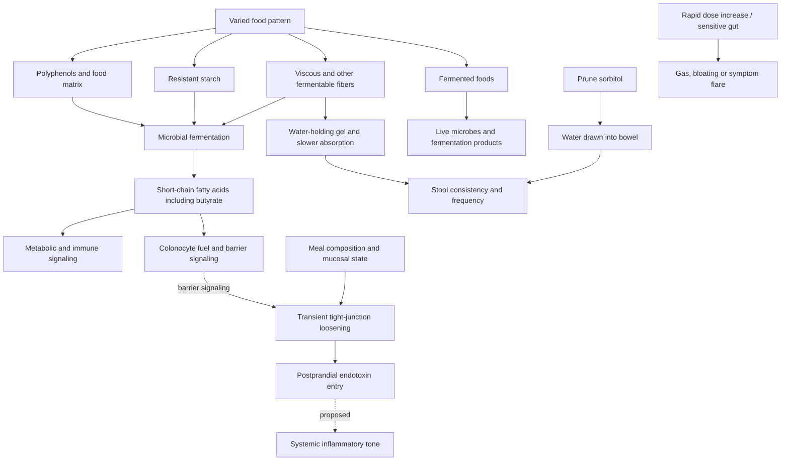

# Food patterns and gut ecology

Gut health is not a single score or the presence of a supposedly beneficial species. It includes bowel function, epithelial integrity, ecological stability, metabolic output, immune signaling, and freedom from disease. A food pattern can act through several of these dimensions at once: live fermented foods introduce organisms and fermentation products, while varied fibers and resistant starch feed resident organisms and alter stool water, transit, and microbial metabolites. The resulting ecosystem framing is more defensible than expecting a cleanse, detox, probiotic capsule, or single superfood to repair every gastrointestinal problem. (@NutritionMadeSimple (Nutrition Made Simple!) — "8 Foods That Actually Fix Your Gut (Not Probiotics)", 2026-05-30, [link](https://www.youtube.com/watch?v=ykpITcKqWCo)) [[probiotics-prebiotics-and-postbiotics]]

## Food-to-function pathways

```mermaid
flowchart TD
  PAT[Varied food pattern] --> FER[Fermented foods]
  PAT --> FIB[Viscous and other fermentable fibers]
  PAT --> RS[Resistant starch]
  PAT --> POLY[Polyphenols and food matrix]
  FER --> LIVE[Live microbes and fermentation products]
  FIB --> GEL[Water-holding gel and slower absorption]
  FIB --> MIC[Microbial fermentation]
  RS --> MIC
  POLY --> MIC
  MIC --> SCFA[Short-chain fatty acids including butyrate]
  SCFA --> LINING[Colonocyte fuel and barrier signaling]
  SCFA --> MET[Metabolic and immune signaling]
  GEL --> STOOL[Stool consistency and frequency]
  SORB[Prune sorbitol] --> WATER[Water drawn into bowel]
  WATER --> STOOL
  DOSE[Rapid dose increase / sensitive gut] --> GAS[Gas, bloating or symptom flare]
  MEAL[Meal composition and mucosal state] --> TJ[Transient tight-junction loosening]
  TJ --> LPS[Postprandial endotoxin entry]
  LPS -. proposed .-> SYS[Systemic inflammatory tone]
  LINING -->|barrier signaling| TJ
```

Oat beta-glucan is viscous and fermentable; pulses such as lentils and beans supply fiber and resistant starch; berries contribute fiber and polyphenols; and walnuts provide a distinct matrix associated in trials with more butyrate-producing organisms. These are plausible complementary substrates rather than eight interchangeable treatments. Resistant starch itself includes structurally different types, so rotating foods may broaden substrate exposure, although a precise diversity prescription has not been validated. (@NutritionMadeSimple (Nutrition Made Simple!) — "8 Foods That Actually Fix Your Gut (Not Probiotics)", 2026-05-30, [link](https://www.youtube.com/watch?v=ykpITcKqWCo)) [[dietary-fiber]] [[resistant-starch]]

## Matching foods to the problem

Constipation can respond to water-holding or osmotic effects. Prunes combine fiber with sorbitol, which draws water into the intestine; trials summarized in the source used roughly 80–100 g/day and improved stool frequency and consistency, with one trial outperforming psyllium. Two gold kiwifruit daily improved bowel frequency and constipation symptoms similarly to fiber-matched psyllium in another randomized trial. These results are condition- and dose-specific: prunes add about 200 kcal at the cited trial dose and may aggravate diarrhea, whereas gel-forming psyllium can sometimes add form to loose stool. (@NutritionMadeSimple (Nutrition Made Simple!) — "8 Foods That Actually Fix Your Gut (Not Probiotics)", 2026-05-30, [link](https://www.youtube.com/watch?v=ykpITcKqWCo)) [[energy-balance-and-calorie-counting]]

Fermented-food trials provide a different signal. A month-long randomized intervention summarized in the source increased microbiome diversity and reduced inflammatory markers. Kefir contains a broader cultured community than typical yogurt and trials are described as showing improvements in glucose and inflammatory measures with consistent use. These intermediate outcomes do not establish that kefir is universally superior, permanently colonizes the bowel, or prevents clinical disease. Added sugar and sodium can also change the net value of a commercial fermented food; the finished product and dietary substitution matter. (@NutritionMadeSimple (Nutrition Made Simple!) — "8 Foods That Actually Fix Your Gut (Not Probiotics)", 2026-05-30, [link](https://www.youtube.com/watch?v=ykpITcKqWCo))

A separate ten-week randomized fermented-food intervention is described as increasing microbial diversity and reducing inflammatory markers. Resistant starch from pulses, whole grains, and cooked-then-cooled starches and viscous fiber from oats, barley, psyllium, fruit, and vegetables provide substrates that microbes can convert to short-chain fatty acids. Direct colonic propionate delivery has stimulated satiety hormones and reduced intake and metabolic deterioration in a controlled experiment, but that does not establish that every listed food produces the same propionate dose or clinical effect. [[resistant-starch]] (@NutritionMadeSimple (Nutrition Made Simple!) — "The REAL 7 Levels of Eating That Transform Your Health (Backed by Science)", 2026-04-28, [link](https://www.youtube.com/watch?v=U9a4KsG7QNw))

Two further ecosystem layers extend the substrate logic beyond plants and bacteria. Culinary mushrooms supply fermentable fungal carbohydrates (beta-glucans and others) that gut bacteria use as food, plus chemistry absent from plants entirely, and a low-abundance resident fungal community (the gut mycobiome) is increasingly read as a normal, probably partly beneficial component rather than contamination — both developed at [[culinary-mushrooms-and-fungal-nutrition]]. (@joinzoe (ZOE) — "The fungi scientist: The #1 mistake you're making when eating mushrooms for health", 2026-06-04, [link](https://www.youtube.com/watch?v=ZUoz97Wn_Xc)) Above the bacteria sits a viral regulator: bacteriophages outnumber gut bacteria roughly tenfold, cull whichever species bloom, donate genes to residents, and appear in early data to track the same diversity-equals-health pattern as the bacteria they control — mechanism and diet links (coffee, fresh unpackaged produce) at [[gut-virome-and-bacteriophages]]. (@joinzoe (ZOE) — "10 million deaths a year! Why did we stop using the one treatment that still works?", 2026-05-21, [link](https://www.youtube.com/watch?v=OLqoYs__A_I))

Epithelial integrity is the dimension where a meal's composition has systemic consequences beyond the bowel. Gram-negative gut bacteria carry lipopolysaccharide (endotoxin) in their outer membranes, and eating transiently loosens the tight junctions between epithelial cells, so a small amount of LPS enters circulation after ordinary meals — a postprandial inflammatory response running alongside the postprandial glycemic one. Its size varies with what is eaten (larger after high-fat, high-refined-carbohydrate meals) and with mucosal state (marked in celiac disease on gluten exposure). This gives "leaky gut" a defensible technical meaning — a graded, meal-linked, measurable permeability, not the syndrome sold in the wellness market — and connects gut ecology to the atherogenic and mood pathways developed in [[lipoprotein-retention-and-atherogenesis]] and [[inflammaging-and-il-6]]. Omega-3 intake is described as suppressing the post-meal LPS excursion, with animal work attributing this to upregulated intestinal alkaline phosphatase that detoxifies LPS in the lumen. The permeability phenomenon is established; the claim that food-driven reductions in postprandial endotoxemia prevent disease is mechanistic and untested at the outcome level. [[omega-3-fatty-acids]] (FoundMyFitness — "How Omega-3s May Slow Biological Aging (New Evidence)", 2026-04-06, [link](https://www.youtube.com/watch?v=nmReeTIZMos))

Fermented foods also carry a brain-and-mood signal running through the same immune dimension. A ZOE community study of about 6,000 people found that 50% of those consuming three or more fermented-food portions daily reported improved mood and energy within the first weeks, with a dose-response across portion counts — self-reported and commercially run, so supportive rather than confirmatory — and a small placebo-controlled trial of a daily probiotic fermented dairy drink in healthy women produced hippocampal volume and connectivity changes over 8 weeks. The proposed route is immune modulation and reduced inflammatory markers rather than colonization; the interventional structure of this evidence, and its limits, are developed in [[nutritional-psychiatry]]. (@joinzoe (ZOE) — "How to build a better brain: Your doctor won't mention THIS for mood, memory and dementia", 2026-07-02, [link](https://www.youtube.com/watch?v=yO-myhWDV98))

Kombucha illustrates the evidence boundary. It can displace sugar-sweetened soda and may contain live organisms, but compelling human evidence for disease treatment is absent and products vary in residual or added sugar. Its value as a preferred beverage is therefore stronger than any claim that it cures disease or reliably remodels the microbiome. (@NutritionMadeSimple (Nutrition Made Simple!) — "8 Foods That Actually Fix Your Gut (Not Probiotics)", 2026-05-30, [link](https://www.youtube.com/watch?v=ykpITcKqWCo))

## Timelines of dietary change

How fast the ecosystem responds is bounded by a daily-sampling study (Cell Host & Microbe, 2019, per the episode's references) in which day-to-day dietary variation produced detectable day-scale microbiome shifts in a small cohort, and by intervention experience at the month scale. Tim Spector's synthesis: some microbes shift within days, others take longer, with clear composite changes inside a month; after a diversity-focused change such as 30 plants a week, expect measurable movement by about 6 weeks and certainly within 3 months — faster and larger from a worse starting microbiome, slower near a high-fiber ceiling. Trajectories are personal (individuals share only about 20% of microbiome composition, on his figure), non-monotonic, and can plateau for months for reasons — season, stress, non-diet factors — that he concedes are not understood. ZOE's own 4-week randomized trial of its Daily30 supplement is cited as producing what Sarah Berry calls profound microbiome changes against two controls; company-run and product-promoting, so supportive at best. Subjective response runs ahead of ecology: mood, energy, hunger, and alertness improvements are reported within 2–3 days of dietary change, before compositional shifts are measurable — offered with the frankly speculative gloss that the brain may detect a healthier gut faster than a stool test does. (@joinzoe (ZOE) — "Tim Spector: They're fooling you! The 3 nutrition scams he wants banned | Live Audience Q&A", 2026-06-25, [link](https://www.youtube.com/watch?v=g3J4phCrvvw)) [[tim-spector]]

On dose, the 30-plants-a-week diversity heuristic is characterized as where current data end rather than an optimum: Federica Amati suggests 35–45 may hold further benefit by analogy with fiber dose-response (30 g/day beneficial, higher intakes possibly better), while recommending rotating the 30 rather than repeating an identical weekly set — extrapolation beyond the data, flagged as such in the episode. (@joinzoe (ZOE) — "Tim Spector: They're fooling you! The 3 nutrition scams he wants banned | Live Audience Q&A", 2026-06-25, [link](https://www.youtube.com/watch?v=g3J4phCrvvw)) [[dietary-fiber]]

## Everyday signs of a stressed gut

Before any test, bowel habit itself carries information, and clinical experience suggests people normalize abnormality because it is their daily baseline: going every two to three days, incomplete evacuation, routinely needing to know where bathrooms are, post-meal bloating that forces loosened clothing, and multi-system food reactivity (digestive, cognitive, or skin) are presented by functional-medicine clinician Will Cole as signs that gut function is degraded even without a diagnosis — with the added claim that brain fog and fatigue can have gut contributions even when bowel habits look normal. These are expert clinical heuristics, not validated screening criteria; the red-flag rule above (bleeding, weight loss, severe pain, major bowel change → diagnosis, not diet escalation) still governs. Defecation posture is a plausible mechanical contributor — squat-like positioning aligns the anorectal angle for more complete emptying, the rationale behind footstool devices — with modest formal evidence. (@maxlugavere (Max Lugavere) — "The Hidden Cause of Brain Fog, Fatigue & Poor Metabolic Health - Dr. Will Cole", 2026-09-02, [link](https://www.youtube.com/watch?v=iXrrcZjx3c4)) [[will-cole]]

## Elimination, reintroduction, and tolerance rebuilding

The gradual-exposure logic of this page has a clinical mirror image for the already-symptomatic gut: temporarily narrowing the diet to calm symptoms, then deliberately reintroducing foods to rebuild tolerance and diversity. Cole's framing — an elimination phase is a cast, worn for a season and removed — is *investigational practice* from telehealth experience rather than trial evidence, but its two boundary conditions align with better-established material. First, the goal is reintroduction: he argues that indefinite elimination is actively harmful because it forfeits the polyphenol- and fiber-driven exposure diversity this page links to ecosystem resilience, leaving the body reactive to everything it no longer encounters. On this the restriction-skeptical position converges with host Max Lugavere's citation of Tufts work (Dariush Mozaffarian's group) finding dietary diversity predicts better health only when the diversity is whole plant and animal foods — diversity across ultra-processed products predicts worse outcomes. Second, tools have ordering: he argues probiotics, postbiotics, or herbs added to an inflamed gut are a drop in the bucket until the food pattern stabilizes symptoms. Specific adjuncts he names — whole-leaf aloe juice, spore-based probiotics used judiciously, fermented teas such as pu-erh — are practitioner preference with thin human evidence; the fermented-food histamine caution is more broadly useful: fermented foods are concentrated histamine sources, so histamine-intolerant people may need to defer rather than force them, titrating in later. Polyphenols themselves act as microbiome-diversifying substrates alongside fiber (a claim consistent with this page's substrate map), with urolithin production from ellagic-acid foods dependent on which bacteria a person hosts. (@maxlugavere (Max Lugavere) — "The Hidden Cause of Brain Fog, Fatigue & Poor Metabolic Health - Dr. Will Cole", 2026-09-02, [link](https://www.youtube.com/watch?v=iXrrcZjx3c4)) [[will-cole]] [[probiotics-prebiotics-and-postbiotics]]

## Tolerance, processing, and personalization

Microbial fermentation produces gas as well as potentially useful metabolites. A large overnight increase in pulses or fiber can therefore cause bloating even when the food is suitable after adaptation. Gradual exposure is particularly important for irritable bowel syndrome and other symptom-prone conditions, where constipation-predominant and diarrhea-predominant presentations require different choices. Persistent symptoms, bleeding, weight loss, severe pain, or a major bowel change require diagnosis rather than escalation of generic gut-health foods. (@NutritionMadeSimple (Nutrition Made Simple!) — "8 Foods That Actually Fix Your Gut (Not Probiotics)", 2026-05-30, [link](https://www.youtube.com/watch?v=ykpITcKqWCo))

Processing is not a binary health classifier. Unsweetened kefir, frozen berries, canned salt-free pulses, rolled oats, olive oil, and pulse pasta are processed to different degrees yet can retain useful structure or improve affordability and adherence. More relevant questions are what the process changed, what was added, what the food replaces, and whether the overall pattern remains nutritionally adequate. (@NutritionMadeSimple (Nutrition Made Simple!) — "8 Foods That Actually Fix Your Gut (Not Probiotics)", 2026-05-30, [link](https://www.youtube.com/watch?v=ykpITcKqWCo)) [[nutrition-evidence-and-personalization]]

## Practical implications

- **Daily: combine at least one tolerated fiber-rich food with an unsweetened fermented food if desired — moderate for bowel and intermediate microbiome outcomes, weak for disease prevention.** Examples include oats with kefir and berries, or pulses alongside tempeh; variety across the week matters more than a branded gut product. (@NutritionMadeSimple (Nutrition Made Simple!) — "8 Foods That Actually Fix Your Gut (Not Probiotics)", 2026-05-30, [link](https://www.youtube.com/watch?v=ykpITcKqWCo))
- **When intake is low or symptoms are common: begin with a small serving and increase over several weeks — moderate.** Fermented foods may be easier for some people to introduce before large quantities of legumes or fermentable fiber. (@NutritionMadeSimple (Nutrition Made Simple!) — "8 Foods That Actually Fix Your Gut (Not Probiotics)", 2026-05-30, [link](https://www.youtube.com/watch?v=ykpITcKqWCo))
- **For uncomplicated constipation: a monitored trial of prunes or two kiwifruit daily is reasonable — moderate, food-specific evidence.** Substitute rather than simply add calorie-dense portions; avoid an osmotic strategy when diarrhea predominates. (@NutritionMadeSimple (Nutrition Made Simple!) — "8 Foods That Actually Fix Your Gut (Not Probiotics)", 2026-05-30, [link](https://www.youtube.com/watch?v=ykpITcKqWCo))
- **At purchase: prefer minimally sweetened versions and use convenient frozen or canned forms — moderate as implementation guidance.** Processing alone does not determine health value; inspect added sugar, sodium, retained fiber, and the displaced food. (@NutritionMadeSimple (Nutrition Made Simple!) — "8 Foods That Actually Fix Your Gut (Not Probiotics)", 2026-05-30, [link](https://www.youtube.com/watch?v=ykpITcKqWCo))

## Gaps & open questions

- Which fermented-food organisms persist, and how much persistence is necessary for benefit?
- Do observed changes in diversity, butyrate-producing taxa, or inflammatory markers translate into fewer clinical events?
- Which combinations and doses best match constipation, diarrhea-predominant IBS, or mixed symptoms?
- How do resistant-starch types differ in clinically meaningful effects when dose and food matrix are matched?
- Are kefir effects reproducible across dairy and plant substrates and commercial formulations?
- How much benefit comes from the food itself versus displacement of refined snacks or sugar-sweetened beverages?
- Which food patterns reliably raise colonic propionate to the exposure used in direct-delivery trials, and do satiety effects persist?
- Does the size of an individual's postprandial endotoxin excursion predict any clinical outcome, and is it modifiable enough by food choice to matter?
- What explains multi-month microbiome plateaus during sustained dietary improvement, and do early subjective improvements (days) predict later compositional change (weeks-to-months)?
- Is there additional benefit above 30 plant types per week, and does rotating varieties beat repeating the same set?
- Do elimination-then-reintroduction protocols outperform simple graded escalation of fiber and fermented foods in controlled comparisons, and how often does the reintroduction phase actually happen outside clinic supervision?
- Do everyday gut-stress signs (infrequent or incomplete bowel movements, post-meal bloating, multi-system food reactivity) predict measurable permeability, inflammatory, or microbiome abnormalities?

## Related

[[dietary-fiber]] · [[resistant-starch]] · [[culinary-mushrooms-and-fungal-nutrition]] · [[gut-virome-and-bacteriophages]] · [[omega-3-fatty-acids]] · [[lipoprotein-retention-and-atherogenesis]] · [[probiotics-prebiotics-and-postbiotics]] · [[nutritional-psychiatry]] · [[nutrition-evidence-and-personalization]] · [[food-label-literacy-and-health-halos]] · [[will-cole]] · [[energy-balance-and-calorie-counting]] · [[inflammaging-and-il-6]] · [[aging-model]] · [[practice-playbook]]
