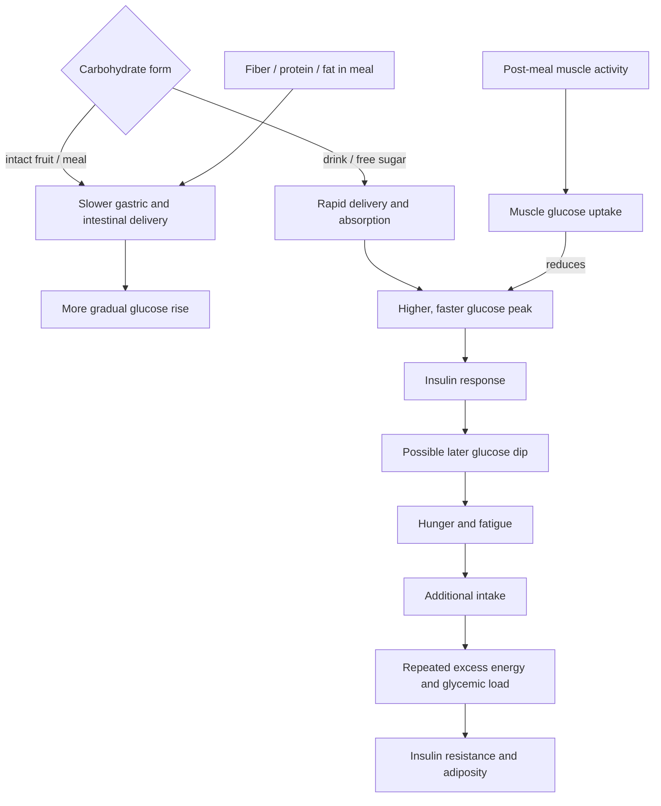

# Free sugars and glycemic response

Sugar is a chemical category, not a complete health classification. Free sugars include sugars added during manufacture or cooking and sugars released from cellular structure in juices; intrinsic sugars remain enclosed within intact food tissue, as in whole fruit. Dose, physical matrix, eating rate, accompanying fiber and protein, energy balance, and metabolic context determine the response. (@joinzoe (ZOE) — "The 5 foods you’re eating every day that are more HARMFUL than sugar", 2026-07-23, [link](https://www.youtube.com/watch?v=yHv2NLaS7kw))

## From food structure to appetite

Removing structure and fiber makes carbohydrate easier to consume and absorb. A whole apple, pulped fruit, juice, and an equivalent free-sugar dose therefore form a useful continuum, with intact structure generally producing the most gradual response; juice is not equivalent to soda because some micronutrients and polyphenols remain, but it behaves less like whole fruit. Dried fruit retains fiber and bioactives but concentrates energy and is easy to overconsume. (@joinzoe (ZOE) — "The 5 foods you’re eating every day that are more HARMFUL than sugar", 2026-07-23, [link](https://www.youtube.com/watch?v=yHv2NLaS7kw))

An acute glucose rise after carbohydrate is normal. Concern increases with repeated large loads, chronic hyperglycemia, excess total energy, and impaired insulin handling—not with every transient peak. A rapid insulin response can sometimes be followed by a dip associated with hunger and fatigue; the source describes ZOE experiments linking dips to later intake, but does not provide effect sizes or show that suppressing every dip prevents disease. Claims connecting sugar broadly to inflammation, cancer, dementia, or mental illness are therefore mechanistically plausible at the level of chronic excess and metabolic dysfunction but weak if interpreted as direct effects of an occasional sweet food. (@joinzoe (ZOE) — "The 5 foods you’re eating every day that are more HARMFUL than sugar", 2026-07-23, [link](https://www.youtube.com/watch?v=yHv2NLaS7kw)) [[nutrition-evidence-and-personalization]]

## Sweetness, labels, and substitutes

Repeated high sweetness can maintain preference for very sweet foods, and taste perception can adapt downward during gradual reduction. Non-sugar sweeteners reduce sugar and calories in the substituted item, but the speakers’ position that they generally provoke compensatory eating and fail to produce a calorie deficit is more sweeping than the evidence presented in the transcript; it should be treated as a contested interpretation, not a settled mechanism. Their practical preference is gradual reduction of both sugar and intense sweetness rather than abrupt abstinence. (@joinzoe (ZOE) — "The 5 foods you’re eating every day that are more HARMFUL than sugar", 2026-07-23, [link](https://www.youtube.com/watch?v=yHv2NLaS7kw))

US labels separate added sugars; some other jurisdictions show only total sugar, requiring inspection of the ingredient list. Multiple sweetening ingredients can distribute sugar across names, so both order and the total composition matter. Sweetened cereals, flavored yogurts, sauces, pickles, snack bars, juices, and branded energy drinks can be substantial sources even when their positioning implies health or performance. The transcript endorses keeping free sugar below 10% of energy and describes below 5% as an ideal; those thresholds are population guidance, not proof of a sharp individual safety boundary. (@joinzoe (ZOE) — "The 5 foods you’re eating every day that are more HARMFUL than sugar", 2026-07-23, [link](https://www.youtube.com/watch?v=yHv2NLaS7kw))

Health positioning can conceal the dose. The source documents examples of smoothies, vitamin waters, lemonade, energy drinks, iced tea, protein bars, granola, sweetened dried cranberries, dressings, and flavored yogurt with substantial added sugar. These products do not prove that smoothies, yogurt, tea, protein foods, or dried fruit are harmful categories; they show why added-sugar grams, portion, ingredient order, and frequency outrank front-of-package imagery. [[food-label-literacy-and-health-halos]] (@NutritionMadeSimple (Nutrition Made Simple!) — "15 'Healthy' Foods that are Quietly Clogging your Arteries (And What to Eat Instead)", 2026-04-20, [link](https://www.youtube.com/watch?v=oMOSvXcvnOw))

At high habitual intake, refined carbohydrate can increase hepatic triglyceride synthesis and secretion of VLDL particles, adding a lipoprotein route to the energy-balance and glycemic routes. The transcript links higher added-sugar intake with cardiovascular mortality, but its reported observational relative-risk figure cannot by itself establish causality or the effect of a specific product. The defensible action is substitution: make unsweetened drinks the default and compare the whole replacement pattern, not merely sugar grams. [[lipoprotein-retention-and-atherogenesis]] (@NutritionMadeSimple (Nutrition Made Simple!) — "15 'Healthy' Foods that are Quietly Clogging your Arteries (And What to Eat Instead)", 2026-04-20, [link](https://www.youtube.com/watch?v=oMOSvXcvnOw))

## Modifying a high-carbohydrate meal

Protein, fat, fiber, and intact plant foods can slow delivery and reduce the glucose peak when consumed as part of or shortly before a carbohydrate-rich meal. Muscle contraction after eating increases glucose uptake; the source proposes a ten-minute walk begun within roughly 20–30 minutes. These tactics can modify an exposure but do not turn a frequent high-free-sugar pattern into a nutritionally complete one, and reducing an acute peak is not by itself proof of long-term benefit. (@joinzoe (ZOE) — "The 5 foods you’re eating every day that are more HARMFUL than sugar", 2026-07-23, [link](https://www.youtube.com/watch?v=yHv2NLaS7kw)) [[daily-movement-mobility-and-pain]]

## Practical implications

- **Daily: make water and unsweetened drinks the default and keep free sugars below 10% of energy, with lower intake a reasonable goal — moderate-to-strong public-health evidence as characterized by the source.** Reduce routine sweet drinks first because they deliver sugar rapidly with limited satiety. (@joinzoe (ZOE) — "The 5 foods you’re eating every day that are more HARMFUL than sugar", 2026-07-23, [link](https://www.youtube.com/watch?v=yHv2NLaS7kw))
- **At most eating occasions: prefer intact fruit to juice and combine carbohydrate with fiber-rich foods and adequate protein — moderate.** Do not eliminate whole fruit merely because it contains sugar. (@joinzoe (ZOE) — "The 5 foods you’re eating every day that are more HARMFUL than sugar", 2026-07-23, [link](https://www.youtube.com/watch?v=yHv2NLaS7kw))
- **After a high-carbohydrate meal: take an easy ten-minute walk within about 20–30 minutes when practical — moderate for lowering the acute glucose excursion; long-term outcome evidence is not supplied here.** (@joinzoe (ZOE) — "The 5 foods you’re eating every day that are more HARMFUL than sugar", 2026-07-23, [link](https://www.youtube.com/watch?v=yHv2NLaS7kw))
- **Weekly while changing habits: reduce sweetness gradually and review labels on repeated purchases — moderate behavioral rationale.** Treat occasional dessert within an otherwise sound pattern differently from a daily hidden-sugar exposure. (@joinzoe (ZOE) — "The 5 foods you’re eating every day that are more HARMFUL than sugar", 2026-07-23, [link](https://www.youtube.com/watch?v=yHv2NLaS7kw))

## Gaps & open questions

- Do post-meal glucose dips causally increase long-term energy intake and disease risk, or mainly mark meal composition and individual physiology?
- How much benefit from whole fruit derives from structure, fiber, polyphenols, displacement, or lower energy density?
- Which non-sugar sweeteners, doses, and user populations alter appetite, weight, microbiota, or clinical outcomes?
- Does routinely blunting acute peaks with meal order or walking improve outcomes beyond total diet quality and activity?
- How should free-sugar targets be individualized for diabetes, athletic fueling, children, and very high or low energy needs?
- How much cardiovascular risk from added sugar is mediated by excess energy and adiposity versus hepatic VLDL production at stable weight?

## Related

[[dietary-fiber]] · [[advanced-glycation-end-products]] · [[visceral-and-ectopic-fat]] · [[nutrition-evidence-and-personalization]] · [[food-label-literacy-and-health-halos]] · [[lipoprotein-retention-and-atherogenesis]] · [[performance-nutrition-and-hydration]] · [[daily-movement-mobility-and-pain]] · [[evolutionary-mismatch-and-weight-regulation]] · [[practice-playbook]] · [[aging-model]]
