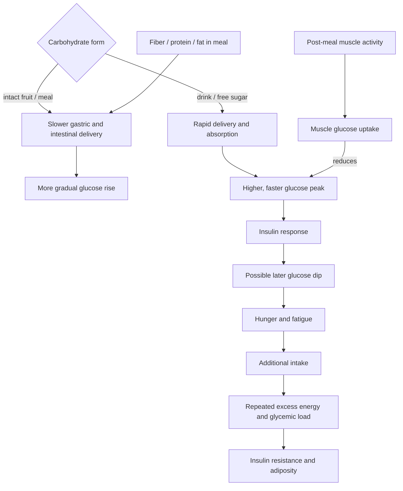

# Free sugars and glycemic response

Sugar is a chemical category, not a complete health classification. Free sugars include sugars added during manufacture or cooking and sugars released from cellular structure in juices; intrinsic sugars remain enclosed within intact food tissue, as in whole fruit. Dose, physical matrix, eating rate, accompanying fiber and protein, energy balance, and metabolic context determine the response. (@joinzoe (ZOE) — "The 5 foods you’re eating every day that are more HARMFUL than sugar", 2026-07-23, [link](https://www.youtube.com/watch?v=yHv2NLaS7kw))

## From food structure to appetite

```mermaid
flowchart TD
  FORM{Carbohydrate form} -->|intact fruit / meal| SLOW[Slower gastric and intestinal delivery]
  FORM -->|drink / free sugar| FAST[Rapid delivery and absorption]
  SLOW --> MODEST[More gradual glucose rise]
  FAST --> PEAK[Higher, faster glucose peak]
  PEAK --> INS[Insulin response]
  INS --> DIP[Possible later glucose dip]
  DIP --> HUNGER[Hunger and fatigue]
  HUNGER --> EXTRA[Additional intake]
  REPEAT[Repeated excess energy and glycemic load] --> IR[Insulin resistance and adiposity]
  EXTRA --> REPEAT
  WALK[Post-meal muscle activity] --> UPTAKE[Muscle glucose uptake]
  UPTAKE -->|reduces| PEAK
  PAIR[Fiber / protein / fat in meal] --> SLOW
```

Removing structure and fiber makes carbohydrate easier to consume and absorb. A whole apple, pulped fruit, juice, and an equivalent free-sugar dose therefore form a useful continuum, with intact structure generally producing the most gradual response; juice is not equivalent to soda because some micronutrients and polyphenols remain, but it behaves less like whole fruit. Dried fruit retains fiber and bioactives but concentrates energy and is easy to overconsume. (@joinzoe (ZOE) — "The 5 foods you’re eating every day that are more HARMFUL than sugar", 2026-07-23, [link](https://www.youtube.com/watch?v=yHv2NLaS7kw))

An acute glucose rise after carbohydrate is normal. Concern increases with repeated large loads, chronic hyperglycemia, excess total energy, and impaired insulin handling—not with every transient peak. A rapid insulin response can sometimes be followed by a dip associated with hunger and fatigue; the source describes ZOE experiments linking dips to later intake, but does not provide effect sizes or show that suppressing every dip prevents disease. Claims connecting sugar broadly to inflammation, cancer, dementia, or mental illness are therefore mechanistically plausible at the level of chronic excess and metabolic dysfunction but weak if interpreted as direct effects of an occasional sweet food. (@joinzoe (ZOE) — "The 5 foods you’re eating every day that are more HARMFUL than sugar", 2026-07-23, [link](https://www.youtube.com/watch?v=yHv2NLaS7kw)) [[nutrition-evidence-and-personalization]]

## Sweetness, labels, and substitutes

Repeated high sweetness can maintain preference for very sweet foods, and taste perception can adapt downward during gradual reduction. Non-sugar sweeteners reduce sugar and calories in the substituted item, but the speakers’ position that they generally provoke compensatory eating and fail to produce a calorie deficit is more sweeping than the evidence presented in the transcript; it should be treated as a contested interpretation, not a settled mechanism. Their practical preference is gradual reduction of both sugar and intense sweetness rather than abrupt abstinence. (@joinzoe (ZOE) — "The 5 foods you’re eating every day that are more HARMFUL than sugar", 2026-07-23, [link](https://www.youtube.com/watch?v=yHv2NLaS7kw))

The adaptation runs in both directions and appears to be fast. Nutrition researcher Ty Beal's account, drawing on the 2026 dietary-guidelines section on added sugars led by Michael Goran, is that habitual sweetness exposure desensitizes the sweet-taste response so that the same stimulus is needed to produce the same effect, and that cutting exposure allows the palate to recalibrate within days to about two weeks — after which less sweet foods become appreciable again and the non-sugar flavors that sugar had masked become perceptible (ordinary ketchup, on this account, tastes like a different food without the added sugar). The phenomenology of a recalibrated palate is consistent and striking: both participants describe finding sweetened drinks — including zero-calorie ones — physically aversive after long avoidance, needing dilution to be drinkable. The mechanism is described as taste-receptor desensitization by analogy to pharmacologic tolerance, which is a plausible but loosely specified account; the reversibility claim is the practically important part and is consistent with sensory-adaptation research, though effect sizes and durability are not established here. The corollary for portion control is that sweetness intensity governs stopping: Beal chooses 85–90% dark chocolate over the 70–75% he would prefer on taste alone, because the less palatable bar is the one he does not finish in a sitting. (@maxlugavere (Max Lugavere) — "Top Nutrition Scientist: Eat These Foods to FIGHT Weight Gain and Disease", 2026-06-03, [link](https://www.youtube.com/watch?v=fqsSqG5Ff7c)) [[satiety-oriented-diet-design]]

Palate recalibration is also the hardest argument against non-nutritive sweeteners as an endpoint rather than a bridge. Beal's position: the WHO's advice against using non-sugar sweeteners for weight control rests largely on observational evidence, so the health risk is not definitively known; substituting diet for sugar-sweetened soda is very likely an improvement for someone who will not stop drinking soda; but sweeteners keep the sweet-taste preference intact, and they travel with the surrounding food environment — the diet soda is ordered with the burger and fries. Water as the default is the stated optimum. This sits alongside the more permissive substitution readings recorded at [[food-label-literacy-and-health-halos]] and [[satiety-oriented-diet-design]]: the parties agree that diet beats sugared, and disagree on whether sweeteners are a neutral endpoint or a maintained dependency worth tapering. He is more comfortable with monk fruit than with aspartame or sucralose, on the basis that it was not implicated in the same risk reviews — an unverified distinction. Applied to children, his practical route is dilution rather than abrupt withdrawal: cut fruit juice half-and-half with water, then taper. (@maxlugavere (Max Lugavere) — "Top Nutrition Scientist: Eat These Foods to FIGHT Weight Gain and Disease", 2026-06-03, [link](https://www.youtube.com/watch?v=fqsSqG5Ff7c))

Palate formation begins earlier than the recalibration window suggests, which is why the food environment outside the home matters. Beal's observation from his own children — fed organ meats, plain whole yogurt, and eggs through the first two years and still eating raw vegetables mindlessly during screen time at ages where a comparison child would not touch a cucumber — is that early and repeated exposure builds durable preferences that later exposure to sweetened daycare and party foods adds to rather than displaces. The counterweight he concedes, on his wife's advice as a child-development specialist, is that well-being is not only nutritional: rigid restriction has costs in self-esteem and social experience that a nutrition-only frame does not price. The practical form is offering many acceptable options and letting the child self-select, since a child without a rare medical condition will not starve given adequate choices. Single-family observation and expert reasoning, not evidence. (@maxlugavere (Max Lugavere) — "Top Nutrition Scientist: Eat These Foods to FIGHT Weight Gain and Disease", 2026-06-03, [link](https://www.youtube.com/watch?v=fqsSqG5Ff7c))

US labels separate added sugars; some other jurisdictions show only total sugar, requiring inspection of the ingredient list. Multiple sweetening ingredients can distribute sugar across names, so both order and the total composition matter. Sweetened cereals, flavored yogurts, sauces, pickles, snack bars, juices, and branded energy drinks can be substantial sources even when their positioning implies health or performance. The transcript endorses keeping free sugar below 10% of energy and describes below 5% as an ideal; those thresholds are population guidance, not proof of a sharp individual safety boundary. (@joinzoe (ZOE) — "The 5 foods you’re eating every day that are more HARMFUL than sugar", 2026-07-23, [link](https://www.youtube.com/watch?v=yHv2NLaS7kw))

Health positioning can conceal the dose. The source documents examples of smoothies, vitamin waters, lemonade, energy drinks, iced tea, protein bars, granola, sweetened dried cranberries, dressings, and flavored yogurt with substantial added sugar. These products do not prove that smoothies, yogurt, tea, protein foods, or dried fruit are harmful categories; they show why added-sugar grams, portion, ingredient order, and frequency outrank front-of-package imagery. [[food-label-literacy-and-health-halos]] (@NutritionMadeSimple (Nutrition Made Simple!) — "15 'Healthy' Foods that are Quietly Clogging your Arteries (And What to Eat Instead)", 2026-04-20, [link](https://www.youtube.com/watch?v=oMOSvXcvnOw))

A stronger and more contested fructose account comes from neurologist David Perlmutter: rapid fructose delivery (juice, smoothies) overwhelms small-intestinal absorption, excess fructose is metabolized to uric acid, and uric acid suppresses mitochondrial function — which he reads as an ancestral winter-preparation program (ripe autumn fruit → fat storage and reduced energy expenditure) now running year-round. On this basis he treats standard juicing as among the worst common "healthy" habits (a 12-ounce glass of orange or apple juice carries roughly 32 g of sugar, comparable to a cola), accepts fiber-retaining whole-food blending and vegetable juicing, and notes that pureeing fruit into rapidly drinkable calories defeats both absorption pacing and satiety registration. The delivery-form and eating-rate components corroborate the structure continuum above; the uric-acid-as-central-villain mechanism (his book Drop Acid) is a minority framing — uric acid is an established gout and correlational cardiometabolic marker, but urate-lowering has not demonstrated the predicted metabolic benefits in trials — and he exempts honey from the fructose concern on the claim that it does not raise uric acid, which is likewise unverified here. (@maxlugavere (Max Lugavere) — "What to Eat to BEAT Alzheimer's - Dr. David Perlmutter", 2026-08-19, [link](https://www.youtube.com/watch?v=HiL3Phwl2d0)) [[gout-and-urate-lowering]] [[david-perlmutter]] [[satiety-oriented-diet-design]]

Ranking caloric sweeteners against each other by fructose content fails on basic composition arithmetic. Sucrose — the dominant sugar in maple syrup and a major component of many sweet foods — is a disaccharide of glucose and fructose that is cleaved in the gut, so its fructose must be counted; once it is, orange juice, honey, and maple syrup differ by only about one to two grams of fructose per 100 kcal and are effectively interchangeable on that axis. A viral claim that orange juice supports fat loss better than honey or maple syrup because of lower fructose therefore fails before the fructose question is even reached. On the fructose question itself, Layne Norton's reading of the isocaloric-substitution literature is that swapping other carbohydrate for fructose at matched calories changes neither body composition nor general health markers, and that the dramatic metabolic harms come from animal studies feeding around 60% of calories as fructose — a dose unreachable from food, since even pure high-fructose corn syrup is about 55% fructose. None of this makes juice, honey, or syrup good fat-loss foods: they are calorie-dense and poorly satiating, which is the operative objection. (@biolayne1 (Dr. Layne Norton) — "This Might Be the Dumbest Thing I've Ever Seen | What the Fitness | Biolayne", 2026-08-28, [link](https://www.youtube.com/watch?v=qLYqQPVnuUA)) This reading conflicts with Perlmutter's account above in two places: it treats isocaloric fructose as metabolically unremarkable where Perlmutter treats rapid fructose delivery as a central driver of mitochondrial suppression, and its equal-fructose arithmetic undercuts Perlmutter's exemption of honey from the fructose concern. It is, however, consistent with the controlled-feeding evidence in the following paragraph that caloric excess, not isocaloric fructose, dominates liver-fat outcomes — while that same evidence keeps a real fructose-specific effect on hepatic de novo lipogenesis on the board. [[layne-norton]] [[david-perlmutter]] [[satiety-oriented-diet-design]]

Fructose specifically has a demonstrated intermediate-endpoint effect on the liver that glucose lacks: in a randomized trial of 94 healthy men drinking fructose-, sucrose-, or glucose-sweetened beverages for seven weeks under enforced weight stability, fructose and sucrose roughly doubled hepatic de novo lipogenesis while glucose did not. On the harder endpoint of measured liver fat, however, controlled feeding studies show the dominant driver is caloric excess — isocaloric substitution of fructose for other carbohydrate barely moves steatosis — so fructose's real-world liver harm runs mainly through its delivery form, calorie-dense non-satiating drinks. The disease pathway this feeds is developed in [[metabolic-liver-disease]]. (@PeterAttiaMD (Peter Attia MD) — "Metabolic liver health: how to assess risk, catch dysfunction early, and more (AMA 88 sneak peek)", 2026-08-24, [link](https://www.youtube.com/watch?v=9FMwKc4DfSM))

At high habitual intake, refined carbohydrate can increase hepatic triglyceride synthesis and secretion of VLDL particles, adding a lipoprotein route to the energy-balance and glycemic routes. The transcript links higher added-sugar intake with cardiovascular mortality, but its reported observational relative-risk figure cannot by itself establish causality or the effect of a specific product. The defensible action is substitution: make unsweetened drinks the default and compare the whole replacement pattern, not merely sugar grams. [[lipoprotein-retention-and-atherogenesis]] (@NutritionMadeSimple (Nutrition Made Simple!) — "15 'Healthy' Foods that are Quietly Clogging your Arteries (And What to Eat Instead)", 2026-04-20, [link](https://www.youtube.com/watch?v=oMOSvXcvnOw))

## Modifying a high-carbohydrate meal

Protein, fat, fiber, and intact plant foods can slow delivery and reduce the glucose peak when consumed as part of or shortly before a carbohydrate-rich meal. Muscle contraction after eating increases glucose uptake; the source proposes a ten-minute walk begun within roughly 20–30 minutes. These tactics can modify an exposure but do not turn a frequent high-free-sugar pattern into a nutritionally complete one, and reducing an acute peak is not by itself proof of long-term benefit. (@joinzoe (ZOE) — "The 5 foods you’re eating every day that are more HARMFUL than sugar", 2026-07-23, [link](https://www.youtube.com/watch?v=yHv2NLaS7kw)) [[daily-movement-mobility-and-pain]]

## Practical implications

- **Daily: make water and unsweetened drinks the default and keep free sugars below 10% of energy, with lower intake a reasonable goal — moderate-to-strong public-health evidence as characterized by the source.** Reduce routine sweet drinks first because they deliver sugar rapidly with limited satiety. (@joinzoe (ZOE) — "The 5 foods you’re eating every day that are more HARMFUL than sugar", 2026-07-23, [link](https://www.youtube.com/watch?v=yHv2NLaS7kw))
- **At most eating occasions: prefer intact fruit to juice and combine carbohydrate with fiber-rich foods and adequate protein — moderate.** Do not eliminate whole fruit merely because it contains sugar. (@joinzoe (ZOE) — "The 5 foods you’re eating every day that are more HARMFUL than sugar", 2026-07-23, [link](https://www.youtube.com/watch?v=yHv2NLaS7kw))
- **After a high-carbohydrate meal: take an easy ten-minute walk within about 20–30 minutes when practical — moderate for lowering the acute glucose excursion; long-term outcome evidence is not supplied here.** (@joinzoe (ZOE) — "The 5 foods you’re eating every day that are more HARMFUL than sugar", 2026-07-23, [link](https://www.youtube.com/watch?v=yHv2NLaS7kw))
- **When cutting back: expect the palate to recalibrate over roughly one to two weeks, and use dilution rather than abrupt withdrawal for juices and sweet drinks (especially for children) — moderate for reversibility, weak for the exact time course.** Choosing a less palatable version of a treat (higher-cacao chocolate) works as portion control precisely because it is less rewarding. (@maxlugavere (Max Lugavere) — "Top Nutrition Scientist: Eat These Foods to FIGHT Weight Gain and Disease", 2026-06-03, [link](https://www.youtube.com/watch?v=fqsSqG5Ff7c))
- **Do not choose among caloric sweeteners (juice, honey, maple syrup, table sugar) on fructose-content grounds — moderate.** Their fructose loads are nearly identical per 100 kcal once sucrose composition is counted; judge them instead by total dose, delivery speed, and satiety, and treat all of them as poor choices during fat loss. (@biolayne1 (Dr. Layne Norton) — "This Might Be the Dumbest Thing I've Ever Seen | What the Fitness | Biolayne", 2026-08-28, [link](https://www.youtube.com/watch?v=qLYqQPVnuUA))
- **Weekly while changing habits: reduce sweetness gradually and review labels on repeated purchases — moderate behavioral rationale.** Treat occasional dessert within an otherwise sound pattern differently from a daily hidden-sugar exposure. (@joinzoe (ZOE) — "The 5 foods you’re eating every day that are more HARMFUL than sugar", 2026-07-23, [link](https://www.youtube.com/watch?v=yHv2NLaS7kw))

## Gaps & open questions

- Do post-meal glucose dips causally increase long-term energy intake and disease risk, or mainly mark meal composition and individual physiology?
- How much benefit from whole fruit derives from structure, fiber, polyphenols, displacement, or lower energy density?
- Which non-sugar sweeteners, doses, and user populations alter appetite, weight, microbiota, or clinical outcomes?
- Does routinely blunting acute peaks with meal order or walking improve outcomes beyond total diet quality and activity?
- How fast, how completely, and how durably does sweet-taste preference recalibrate after reduced exposure, and does recalibration change intake months later?
- Do non-nutritive sweeteners maintain sweet preference enough to offset their calorie displacement, or is the maintained-dependency argument overstated?
- How should free-sugar targets be individualized for diabetes, athletic fueling, children, and very high or low energy needs?
- How much cardiovascular risk from added sugar is mediated by excess energy and adiposity versus hepatic VLDL production at stable weight?
- Is there any habitual human fructose dose, short of the unattainable animal-study levels, at which isocaloric fructose substitution produces measurable harm — and does the doubled hepatic de novo lipogenesis at seven weeks matter clinically under weight stability?

## Related

[[dietary-fiber]] · [[nutrient-density-and-food-profiling]] · [[ty-beal]] · [[layne-norton]] · [[david-perlmutter]] · [[advanced-glycation-end-products]] · [[visceral-and-ectopic-fat]] · [[metabolic-liver-disease]] · [[nutrition-evidence-and-personalization]] · [[food-label-literacy-and-health-halos]] · [[lipoprotein-retention-and-atherogenesis]] · [[performance-nutrition-and-hydration]] · [[daily-movement-mobility-and-pain]] · [[evolutionary-mismatch-and-weight-regulation]] · [[practice-playbook]] · [[aging-model]]
